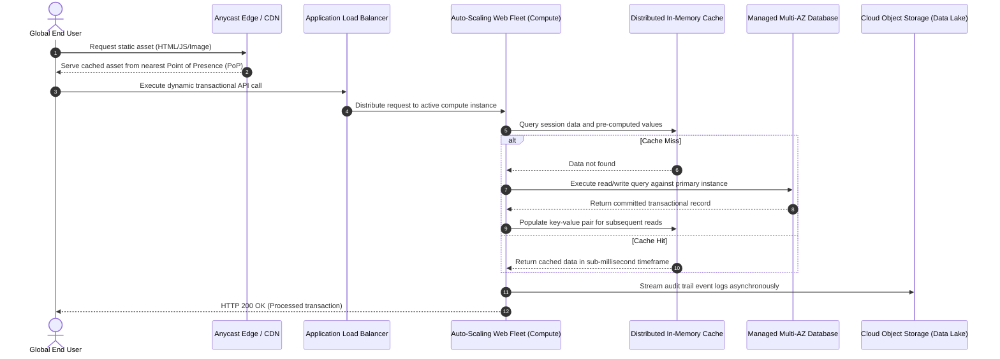
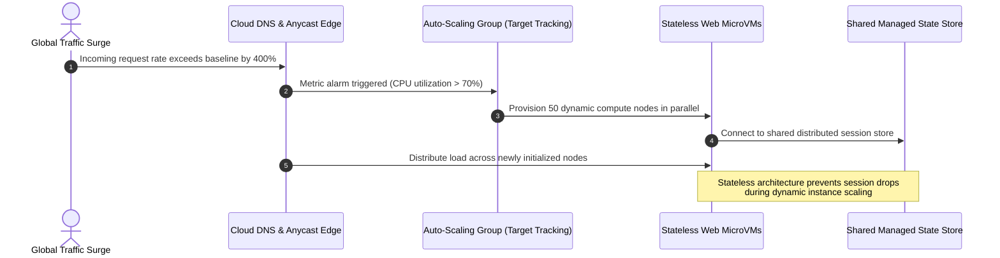
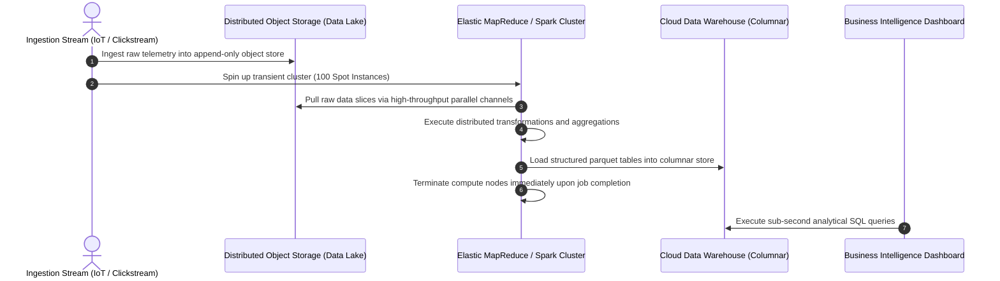

# Migration in progress
# **Lesson 4: Cloud Computing Use Cases**

Cloud computing enables organizations to transform theoretical operational advantages into production systems across diverse technological domains. Modern enterprises leverage elastic infrastructure to deploy globally distributed web applications, execute petabyte-scale data analytics, automate disaster recovery topologies, and train complex machine learning models. Analyzing these implementation patterns reveals how decoupling compute from persistent storage provides high availability, fault tolerance, and cost efficiency.



## **Cloud-Native Web Applications and Global Content Distribution**

Modern web platforms replace monolithic, single-server designs with distributed, decoupled microservice topologies engineered to survive physical infrastructure failures.



### Elastic Autoscaling and High Availability

- *Stateless compute tiers*: Web servers retain zero client session state locally on instance disks, storing authentication tokens and temporary sessions in centralized, high-throughput caching engines.
- **Horizontal Pod and Instance Scaling**: Metric monitoring systems track incoming request volumes, CPU consumption, or queue depths to add or terminate virtual compute instances automatically.
- Multi-Availability Zone (Multi-AZ) distribution positions duplicate application tiers across geographically distinct data centers, providing automatic failover if a localized facility experiences a power or network interruption.

### Edge Caching and Latency Optimization

- Content Delivery Networks (**CDNs**) position hundreds of Points of Presence (PoPs) at the perimeter of the global internet, caching static images, videos, and scripts physically close to end users.
- Anycast routing protocols direct client DNS queries to the nearest edge location, minimizing round-trip times (RTT) and absorbing distributed denial-of-service (DDoS) traffic surges before requests hit origin servers.
- Dynamic route optimization accelerates API calls back to origin data centers by steering traffic over dedicated provider-owned fiber backbones instead of congested public internet corridors.

> [!Tip]
> **State externalization accelerates scaling**: Extract all user session states into distributed in-memory clusters (such as Redis or Memcached) to allow web instances to scale up or down instantaneously without severing user sessions.

## **Big Data Processing and High-Performance Analytics**

Cloud platforms eliminate the capital burden of purchasing on-premises supercomputers, allowing organizations to assemble massive, temporary computing clusters to execute petabyte-scale analytics jobs.



### Storage and Compute Decoupling

- Traditional big data architectures (such as legacy Hadoop HDFS) coupled physical hard drives directly to local CPUs, requiring expensive overprovisioning of compute to gain disk capacity.
- Modern cloud data lakes store raw unstructured, semi-structured, and structured datasets in durable, highly scalable object storage systems (such as AWS S3, Google Cloud Storage, or Azure Blob Storage).
- Compute frameworks (such as Apache Spark, Trino, and Presto) spin up on-demand to process datasets directly from object storage, tearing down worker nodes immediately after completing the workload.

### Batch and Stream Processing Patterns

- *Batch architectures*: Systems collect transactions over fixed intervals, executing high-throughput analytical transformations across millions of records during scheduled processing windows.
- *Stream processing*: Real-time message streaming brokers (such as Apache Kafka, AWS Kinesis, or Google Pub/Sub) ingest continuous sensor, log, or telemetry events, computing rolling metrics with single-digit millisecond latencies.
- Columnar data warehouses structure data by column rather than row, running vectorized parallel queries that scan petabytes of records without scanning irrelevant fields.

> [!Important]
> **Ephemeral cluster cost optimization**: Deploy transient analytics worker nodes using spot or preemptible instances to run fault-tolerant data transformation pipelines at substantial discounts compared to on-demand pricing.

## **Disaster Recovery and Business Continuity Architectures**

Cloud-based disaster recovery (DR) uses hyperscale global infrastructure to deliver continuous operational continuity without requiring redundant physical data center facilities.

```mermaid
sequenceDiagram
    autonumber
    participant Prod as Primary Production Region
    participant Storage as Cross-Region Data Replication
    participant DR as Disaster Recovery Region (Standby)
    participant DNS as Global Traffic Routing / Failover

    Prod->>Storage: Asynchronously replicate transactional write logs
    Note over DR: Pilot Light: Database running at minimum size;<br/>Application compute fleet remains dormant
    Prod->>Prod: Primary region suffers catastrophic regional outage
    DNS->>DR: Health checks fail; DNS routes traffic to DR endpoints
    DR->>DR: Auto-Scaling group launches full web and compute fleet
    DR->>DR: Scale up database compute capacity to production sizing
    DR-->>DNS: Secondary region fully operational (RTO achieved)
```

### Business Continuity Metrics

- **Recovery Point Objective (RPO)**: The maximum acceptable data loss measured backwards in time from the moment an outage occurs, determining data synchronization frequency.
- **Recovery Time Objective (RTO)**: The maximum acceptable duration of infrastructure downtime before service restoration must be completed.

### Structural Disaster Recovery Tiers

- **Backup and Restore**: Systems regularly compress and encrypt system snapshots and database backups to remote cloud object storage. RPO and RTO span multiple hours or days, delivering the most economical recovery tier.
- **Pilot Light**: The critical core data tier (such as a database cluster) is maintained live and continuously replicated in a standby region. Application and web servers remain dormant as saved images, launching via automation only during an actual disaster event.
- **Warm Standby**: A functional, scaled-down duplicate of the entire infrastructure operates continuously in the secondary region. During failovers, auto-scaling groups rapidly increase instance counts to handle full production traffic.
- **Multi-Region Active-Active**: Fully redundant, production-scaled environments operate concurrently across distinct geographic regions, processing live user requests simultaneously via global Anycast or latency-based DNS routing. RPO and RTO approach near-zero timeframes.

> [!Tip]
> **Automating failover testing**: Implement chaos engineering experiments and periodic automated DNS failover drills to verify that secondary standby infrastructure provisions cleanly before an actual regional outage occurs.

## **Artificial Intelligence and Distributed Machine Learning**

Artificial intelligence and 