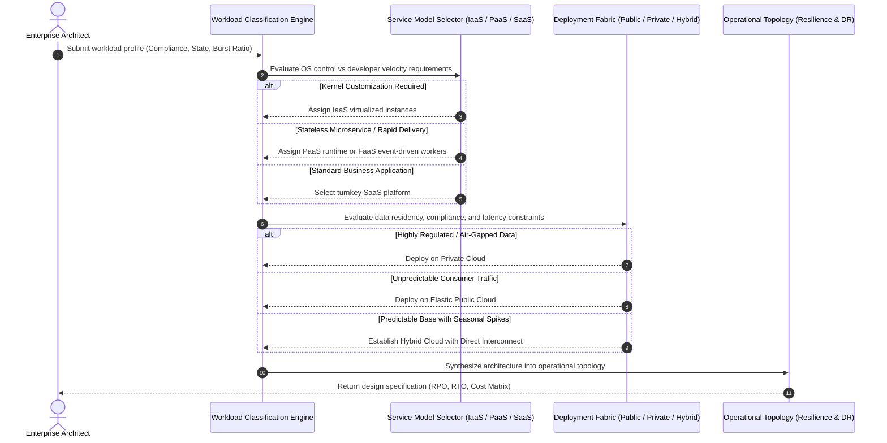
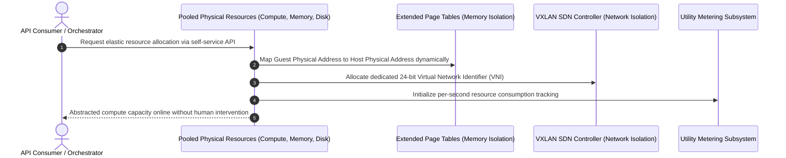

# **Lesson 5: Summary and Assessment**

Cloud computing synthesizes decades of advances in distributed hardware virtualization, multi-tenant resource pooling, and automated software-defined networking into an on-demand utility model. Mastering these foundational principles requires connecting low-level hypervisor mechanics and the shared responsibility model directly to deployment topologies, enterprise migration paths, and disaster recovery strategies. Evaluating production requirements demands systematic technical analysis of latency, data sovereignty, capital versus operational expenditures, and operational control boundaries.



## **Consolidated Framework of Cloud Computing Fundamentals**

The foundational architecture of cloud computing rests upon five essential characteristics defined by NIST SP 800-145, realized through hardware abstraction and multi-tenant resource pooling.



### The Five Essential NIST Characteristics

- **On-Demand Self-Service**: Consumers provision computing capabilities such as server time, network storage, and virtual firewalls automatically through standardized APIs, eliminating human administrative intervention.
- **Broad Network Access**: Capabilities deploy across standard network fabrics and operate through heterogeneous client platforms including thin clients, mobile devices, and automated microservices.
- **Resource Pooling**: Physical compute, storage, and networking hardware dynamically serve multiple consumers in a multi-tenant model, assigning physical and virtual resources dynamically based on demand.
- **Rapid Elasticity**: Resources scale outward or inward rapidly, often automatically, ensuring systems allocate compute commensurate with real-time operational demand.
- **Measured Service**: Resource usage is monitored, controlled, reported, and billed transparently through metering mechanisms calibrated to specific resource metrics like instance hours, storage bytes, and API invocations.

### Hardware Isolation Primitives

- **Compute Boundaries**: Non-Uniform Memory Access (**NUMA**) affinity pinning and vCPU thread scheduling eliminate noisy-neighbor starvation on shared bare-metal hypervisor nodes.
- **Memory Boundaries**: Hardware-assisted *Second-Level Address Translation* (SLAT, such as Intel EPT or AMD NPT) establishes cryptographic and architectural segmentation between guest virtual memory and host physical addresses.
- **Network Boundaries**: Software-defined overlays (VXLAN and GENEVE) encapsulate multi-tenant packets with unique virtual network identifiers, preventing packet sniffing across tenant boundaries.

> [!Important]
> **Foundational isolation dependency**: Multi-tenancy operates securely only because hardware-assisted CPU modes and nested memory page tables enforce rigid physical memory boundaries that prevent cross-VM instruction leakage.

## **Cross-Layer Architectural Synthesis**

Designing resilient cloud architectures requires mapping service abstraction boundaries directly to operational deployment fabrics.

```mermaid
sequenceDiagram
    autonumber
    participant App as Application Logic & Data
    participant Model as Cloud Service Model
    participant ModelStack as Runtime, OS, & Virtualization
    participant Fabric as Deployment Environment
    participant Physical as Physical Data Center & Silicon

    App->>Model: Execute business transactions
    alt IaaS Boundary
        Model->>ModelStack: Consumer manages OS, runtime, and patches
    else PaaS Boundary
        Model->>ModelStack: Provider manages OS and runtime; Consumer manages code
    else SaaS Boundary
        Model->>ModelStack: Provider manages entire technology stack
    end
    ModelStack->>Fabric: Route traffic through chosen environment
    alt Public Deployment
        Fabric->>Physical: Multi-tenant hyperscaler data centers
    else Private Deployment
        Fabric->>Physical: Single-tenant corporate or hosted facilities
    else Hybrid Deployment
        Fabric->>Physical: Dynamic transit across dedicated Layer 2/3 interconnects
    end
```

### Responsibility and Fault Domains

- The *Shared Responsibility Model* defines the demarcation of security and operational obligations: providers secure the physical facilities, host virtualization, and network backbones, while consumers secure identity, data encryption, and access policies.
- In **IaaS**, consumers manage everything from the guest operating system upward, including network firewall rules, runtime engines, and software dependencies.
- In **PaaS**, providers absorb operating system patching, runtime maintenance, and basic high availability, leaving consumers to manage application logic, data schemas, and API access tokens.
- In **SaaS**, providers manage the entire operational stack, leaving consumers solely responsible for credential hygiene, user access policies, and data classification.

### Architecture Optimization Workflows

- High-throughput web applications pair edge CDN networks with auto-scaling stateless web clusters and externalized in-memory caches to absorb unpredictable traffic surges.
- Big data processing decouples durable cloud object storage lakes from transient compute clusters, running large batch transformations on spot instances and terminating compute capacity post-job.
- Enterprise portfolio migration applies the 6 Rs framework to balance immediate migration speed against long-term operational optimization, transitioning from initial rehosting toward automated replatforming or refactoring.

> [!Tip]
> **Preventing cloud debt**: When executing rapid lift-and-shift migrations to meet physical data center exit deadlines, establish a binding schedule to refactor legacy architectures into managed PaaS or serverless topologies within 12 months.

## **Unified Taxonomy of Cloud Computing Dimensions**

| Dimension | On-Premises | IaaS | PaaS | FaaS (Serverless) | SaaS |
|---|---|---|---|---|---|
| **Underlying Physical Host** | Enterprise-owned physical racks | Hyperscaler multi-tenant bare metal | Provider-managed shared compute | Ephemeral, isolated microVM sandboxes | Fully opaque provider server farms |
| **Operating System Control** | Absolute internal control | Complete consumer root access | Zero consumer access (provider patched) | Zero consumer access (ephemeral execution) | Zero consumer access (fully abstracted) |
| **Runtime & Middleware** | Manually compiled, deployed, tuned | Installed and patched by consumer | Managed and updated by platform engine | Pre-configured execution runtimes | Integrated directly into application |
| **Scaling Mechanism** | Physical server acquisition cycles | Auto-scaling groups of virtual VMs | Automated container instance scaling | Millisecond event-driven scale-to-zero | Opaque internal provider scaling |
| **Pricing Structure** | Capital depreciation (CapEx) | Per-second/hourly compute instances | Per-hour or tier-based runtime slots | Per-millisecond execution duration | Per-seat or per-tenant monthly fee |
| **Disaster Recovery Strategy** | Secondary cold/warm data center | Multi-AZ / Multi-Region instance sync | Built-in platform auto-healing and failover | Stateless automatic cross-zone execution | Provider SLA-backed continuous uptime |
| **Primary Failure Vector** | Hardware failure, power loss, cooling | Guest OS crash, unpatched security flaws | Runtime engine limits, vendor API lock-in | Cold start latency, strict timeouts | Service-wide provider authentication outage |

## **Assessment Preparation**

### Scenario-Based Architectural Analysis

#### Scenario 1: The Regulated FinTech Burst Pipeline
- **Problem Context**: A financial institution must process volatile daily payment reconciliations. Regulatory statutes mandate that sensitive customer bank records remain on physically dedicated, locally auditable hardware. However, end-of-month reconciliation creates an 800% compute spike that overwhelms existing on-premises servers.
- **Architectural Solution**: Deploy a **Hybrid Cloud** model. Maintain the persistent transactional database containing sensitive records within an on-premises **Private Cloud**. Establish a dedicated Layer 2/3 private circuit (such as AWS Direct Connect or Azure ExpressRoute). During reconciliation spikes, implement *cloud bursting*: anonymize transactional batch identifiers and push processing jobs to an elastic **IaaS** or **batch PaaS** compute cluster in a **Public Cloud**, pulling encrypted data across the private link and discarding compute workers immediately upon task completion.

#### Scenario 2: High-Velocity E-Commerce Startup Launch
- **Problem Context**: A startup engineering team with three software developers needs to build, deploy, and launch an MVP e-commerce platform within six weeks. The platform expects unpredictable traffic from social media marketing, and the team lacks dedicated systems administrators or network operations personnel.
- **Architectural Solution**: Adopt a **PaaS** or **Serverless (FaaS)** architecture deployed within a **Public Cloud**. Leverage managed container platforms (such as AWS App Runner or Google Cloud Run) or serverless functions behind an API Gateway, backed by a fully managed NoSQL/relational database (such as Amazon Aurora Serverless or DynamoDB). This eliminates operating system maintenance, auto-scales automatically to absorb sudden traffic surges, scales to zero when traffic subsides to preserve capital, and allows engineers to focus entirely on application code.

#### Scenario 3: Legacy Mainframe and Monolith Modernization
- **Problem Context**: An enterprise operates an aging on-premises ERP application with tightly coupled monolithic dependencies, coupled with an obsolete commercial database running on unsupported operating system kernels. The corporate data center lease expires in four months.
- **Architectural Solution**: Execute a two-phase migration using the **6 Rs Framework**. In Phase 1, execute a **Rehost (Lift-and-Shift)** migration using physical-to-virtual replication tools to migrate the virtual machines directly to **IaaS** instances in a public cloud, satisfying the fixed four-month data center eviction deadline. In Phase 2, execute a **Replatform** or **Refactor**: replace the self-hosted database with a managed database service and decouple monolithic services into containerized microservices running on a managed Kubernetes service.

### Technical Practice Questions

#### Question 1
Which hypervisor architecture executes directly on host hardware without an intermediate general-purpose operating system, and why is it preferred for enterprise cloud platforms?
- A) Type-2 hypervisor; because it leverages the underlying host OS device drivers for broader hardware compatibility.
- B) Type-1 hypervisor; because it eliminates host operating system scheduling latency and runs with direct hardware-assisted CPU privilege.
- C) Type-1 hypervisor; because it prevents guest operating systems from utilizing Extended Page Tables (EPT).
- D) Type-2 hypervisor; because it isolates virtual machines inside user-space system calls.
- **Answer**: **B**
- **Technical Rationale**: Type-1 (bare-metal) hypervisors deploy directly on physical silicon. They eliminate the resource overhead, scheduling contention, and virtualization latency inherent to Type-2 hypervisors, which must pass instructions through an intermediate general-purpose host operating system kernel.

#### Question 2
Under the Shared Responsibility Model for an Infrastructure as a Service (IaaS) deployment, which of the following tasks remains the exclusive operational responsibility of the customer?
- A) Applying firmware security updates to physical Top-of-Rack network switches.
- B) Replacing defective ECC RAM modules on bare-metal server blades.
- C) Installing critical security patches on the guest operating system kernel.
- D) Managing physical environmental cooling and biometric perimeter controls.
- **Answer**: **C**
- **Technical Rationale**: In an IaaS model, the cloud provider manages the physical facilities, hardware maintenance, and hypervisor layer (security OF the cloud). The customer retains administrative root access to the guest operating system and is strictly responsible for patching the guest OS, configuring software firewalls, and managing application code (security IN the cloud).

#### Question 3
An organization requires an architectural setup where database updates in a secondary cloud region trail the primary production database by no more than 5 minutes, and business operations must fully resume within 30 minutes following a primary regional disaster. What are the operational metrics and the optimal disaster recovery pattern?
- A) RPO = 30 minutes, RTO = 5 minutes; Backup and Restore.
- B) RPO = 5 minutes, RTO = 30 minutes; Warm Standby.
- C) RPO = 0 seconds, RTO = 0 seconds; Multi-Region Active-Active.
- D) RPO = 5 minutes, RTO = 30 minutes; Rehost.
- **Answer**: **B**
- **Technical Rationale**: The Recovery Point Objective (RPO) is 5 minutes (maximum tolerable data loss), and the Recovery Time Objective (RTO) is 30 minutes (maximum tolerable downtime). A Warm Standby deployment maintains a scaled-down, functional duplicate of the environment running continuously in the secondary region with continuous asynchronous replication, allowing rapid scale-up within 10 to 30 minutes.

#### Question 4
What structural mechanism enables public cloud hypervisors to prevent a tenant virtual machine from reading or modifying physical memory pages assigned to an adjacent tenant virtual machine?
- A) Ephemeral storage token rotation.
- B) Software-defined Virtual Extensible LAN (VXLAN) headers.
- C) Second-Level Address Translation (SLAT) managed via Extended Page Tables (EPT).
- D) Weighted round-robin CPU interrupt balancing.
- **Answer**: **C**
- **Technical Rationale**: Second-Level Address Translation (SLAT), implemented as Extended Page Tables (EPT) by Intel or Nested Page Tables (NPT) by AMD, translates Guest Physical Addresses (GPA) into Host Physical Addresses (HPA) at the silicon level. The hypervisor controls these mappings, preventing a guest operating system from addressing memory pages outside its explicitly allocated physical domains.

> [!Tip]
> **Exam scenario decomposition**: When evaluating cloud migration questions, look first for constraints regarding deadlines, available staff expertise, and data compliance; fixed deadlines point toward Rehosting, whereas lack of operations staff points toward PaaS or Serverless.

## **Key Takeaways**

- **Cloud computing unifies distinct technological lineages**: Modern platforms synthesize mainframe-era time-sharing resource allocation, grid-scale distributed networking, and bare-metal hypervisor virtualization under an automated API control plane.
- **Service models dictate control boundaries**: IaaS provides total operating system control at the cost of administrative maintenance; PaaS accelerates software delivery by abstracting runtimes; FaaS enables millisecond-metered event execution; SaaS delivers turnkey software interfaces.
- **Deployment models govern tenancy and sovereignty**: Public clouds maximize horizontal elasticity and replace capital expenditure with operating costs; private clouds preserve absolute single-tenant isolation; hybrid clouds link environments to balance steady-state compute with cloud bursting.
- **The Shared Responsibility Model is legally and operationally binding**: Providers safeguard physical infrastructure and virtualization layers, but customers always retain legal accountability for data protection, encryption, and access management.
- **Hardware-assisted isolation underpins cloud trust**: Hypervisor-managed Extended Page Tables, vCPU scheduler pinning, and software-defined VXLAN network identifiers prevent noisy-neighbor starvation and cross-tenant data leakage.
- **Migration frameworks require workload-specific alignment**: The 6 Rs framework guides enterprise digital transformations, balancing rapid lift-and-shift data center evacuations against deep cloud-native architectural refactoring.

> [!Important]
> **Cloud architecture is an optimization of trade-offs**: Successful cloud engineering does not seek the highest tier of abstraction or the lowest initial pricing tier, but systematically matches workload statefulness, compliance boundaries, and traffic volatility to the appropriate service and deployment models.
