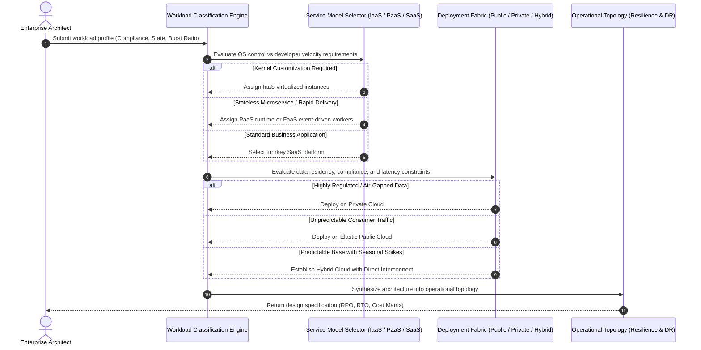
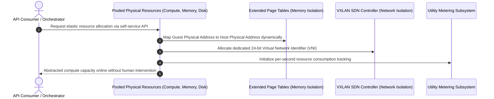

# Migration in progress
# **Lesson 5: Summary and Assessment**

Cloud computing synthesizes decades of advances in distributed hardware virtualization, multi-tenant resource pooling, and automated software-defined networking into an on-demand utility model. Mastering these foundational principles requires connecting low-level hypervisor mechanics and the shared responsibility model directly to deployment topologies, enterprise migration paths, and disaster recovery strategies. Evaluating production requirements demands systematic technical analysis of latency, data sovereignty, capital versus operational expenditures, and operational control boundaries.



## **Consolidated Framework of Cloud Computing Fundamentals**

The foundational architecture of cloud computing rests upon five essential characteristics defined by NIST SP 800-145, realized through hardware abstraction and multi-tenant resource pooling.



### The Five Essential NIST Characteristics

- **On-Demand Self-Service**: Consumers provision computing capabilities such as server time, network storage, and virtual firewalls automatically through standardized APIs, eliminating human administrative intervention.
- **Broad Network Access**: Capabilities deploy across standard network fabrics and operate through heterogeneous client platforms including thin clients, mobile devices, and automated microservices.
- **Resource Pooling**: Physical compute, storage, and networking hardware dynamically serve multiple consumers in a multi-tenant model, assigning physical and virtual resources dynamically based on demand.
- **Rapid Elasticity**: Resources scale outward or inward rapidly, often automatically, ensuring systems allocate compute commensurate with real-time operational demand.
- **Measured Service**: Resource usage is monitored, controlled, reported, and billed transparently through metering mechanisms calibrated to specific resource metrics like instance hours, storage bytes, and API invocations.

### Hardware Isolation Primitives

- **Compute Boundaries**: Non-Uniform Memory Access (**NUMA**) affinity pinning and vCPU thread scheduling eliminate noisy-neighbor starvation on shared bare-metal hypervisor nodes.
- **Memory Boundaries**: Hardware-assisted *Second-Level Address Translation* (SLAT, such as Intel EPT or AMD NPT) establishes cryptographic and architectural segmentation between guest virtual memory and host physical addresses.
- **Network Boundaries**: Software-defined overlays (VXLAN and GENEVE) encapsulate multi-tenant packets with unique virtual network identifiers, preventing packet sniffing across tenant boundaries.

> [!Important]
> **Foundational isolation dependency**: Multi-tenancy operates securely only because hardware-assisted CPU modes and nested memory page tables enforce rigid physical memory boundaries that prevent cross-VM instruction leakage.

## **Cross-Layer Architectural Synthesis**

Designing resilient cloud architectures requires mapping service abstraction boundaries directly to operational deployment fabrics.

```mermaid
sequenceDiagram
    autonumber
    participant App as Application Logic & Data
    participant Model as Cloud Service Model
    participant ModelStack as Runtime, OS, & Virtualization
    participant Fabric as Deployment Environment
    participant Physical as Physical Data Center & Silicon

    App->>Model: Execute business transactions
    alt IaaS Boundary
        Model->>ModelStack: Consumer manages OS, runtime, and patches
    else PaaS Boundary
        Model->>ModelStack: Provider manages OS and runtime; Consumer manages code
    else SaaS Boundary
        Model->>ModelStack: Provider manages entire technology stack
    end
    ModelStack->>Fabric: Route traffic through chosen environment
    alt Public Deployment
        Fabric->>Physical: Multi-tenant hyperscaler data centers
    else Private Deployment
        Fabric->>Physical: Single-tenant corporate or hosted facilities
    else Hybrid Deployment
        Fabric->>Physical: Dynamic transit across dedicated Layer 2/3 interconnects
    end
```

### Responsibility and Fault Domains

- The *Shared Responsibility Model* defines the demarcation of security and operational obligations: providers secure the physical facilities, host virtualization, and network backbones, while consumers secure identity, data encryption, and access policies.
- In **IaaS**, consumers manage everything from the guest operating system upward, including network firewall rules, runtime engines, and software dependencies.
- In **PaaS**, providers absorb operating system patching, runtime maintenance, and basic high availability, leaving consumers to manage application logic, data schemas, and API access tokens.
- In **SaaS**, providers manage the entire operational stack, leaving consumers solely responsible for credential hygiene, user access policies, and data classification.

### Architecture Optimization Workflows

- High-throughput web applications pair edge CDN networks with auto-scaling stateless web clusters and externalized in-memory caches to absorb unpredictable traffic surges.
- Big data processing decouples durable cloud object storage lakes from transient compute clusters, running large batch transformations on spot instances and terminating compute capacity post-job.
- Enterprise portfolio migration applies the 6 Rs framework to balance immediate migration speed against long-term operational optimization, transitioning from initial rehosting toward automated replatforming or refactoring.

> [!Tip]
> **Preventing cloud debt**: When executing rapid lift-and-shift migrations to meet physical data center exit deadlines, establish a binding schedule to refactor legacy architectures into managed PaaS or serverless topologies within 12 months.

## **Unified Taxonomy of Cloud Computing Dimensions**

| Dimension | On-Premises | IaaS | PaaS | FaaS (Serverless) | SaaS |
|---|---|---|---|---|---|
| **Underlying Physical Host** | Enterprise-owned physical racks | Hyperscaler multi-tenant bare metal | Provider-managed shared compute | Ephemeral, isolated microVM sandboxes | Fully opaque provider server farms |
| **Operating System Control** | Absolute internal control | Complete consumer root access | Zero consumer access (provider patched) | Zero consumer access (ephemeral execution) | Zero consumer access (fully abstracted) |
| **Runtime & Middleware** | Manually compiled, deployed, tuned | Installed and patched by consumer | Managed and updated by platform engine | Pre-configured execution runtimes | Integrated directly into application |
| **Scaling Mechanism** | Physical server acquisition cycles | Auto-scaling groups of virtual VMs | Automated container instance scaling | Millisecond event-driven scale-to-zero | Opaque internal provider scaling |
| **Pricing Structure** | Capital depreciation (CapEx) | Per-second/hourly compute instances | Per-hour or tier-based runtime slots | Per-millisecond execution duration | Per-seat or per-tenant monthly fee |
| **Disaster Recovery Strategy** | Secondary cold/warm data center | Multi-AZ / Multi-Region instance sync | Built-in platform auto-healing and failover | Stateless