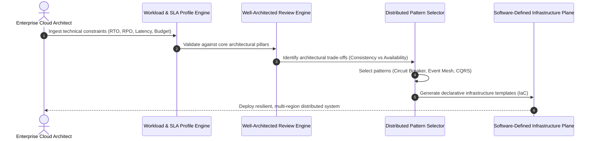
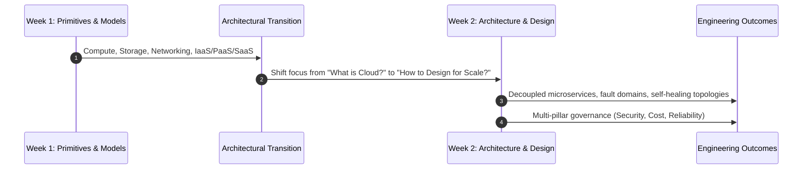
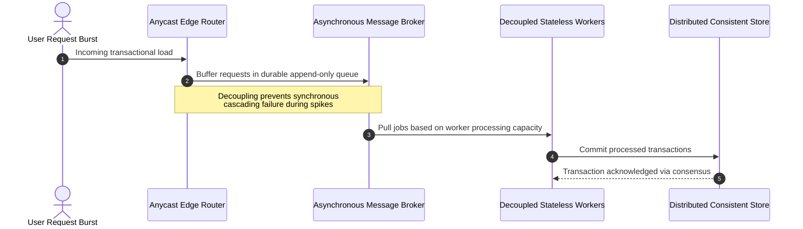

# Migration in progress
# **Lesson 0: Module Introduction - Cloud Architecture & Design**

Cloud architecture transitions system design from static, localized server provisioning into dynamic, distributed software-defined topologies. This module explores the engineering principles, architectural patterns, and governance frameworks required to construct scalable, fault-tolerant, and cost-optimized enterprise cloud systems. Mastering these methodologies enables engineers to treat infrastructure as declarative code, optimize operational availability, and make calculated trade-offs across distributed system boundaries.

## **Module Objectives and Pedagogical Scope**

Week 2 shifts the operational perspective from cloud consumption primitives to systemic distributed systems engineering, establishing the technical foundations required to architect enterprise-grade cloud environments.

### Core Learning Objectives

- **Distributed Systems Design**: Formulate decoupled system topologies that isolate failure domains and maintain operational availability during localized data center outages.
- **Framework-Driven Evaluation**: Apply formal evaluation frameworks (such as the AWS Well-Architected Framework and Azure Architecture Center guidelines) across system lifecycles.
- **Pattern Implementation**: Implement industry-standard cloud design patterns covering asynchronous messaging, database sharding, caching topologies, and distributed state management.
- **Quantitative Trade-Off Analysis**: Balance the competing demands of the CAP theorem, PACELC theorem, network latency limits, and egress pricing structures.

### Shift from Administration to System Architecture

- Systems administration historically prioritized server uptime and hardware configuration stability.
- Cloud architecture prioritizes dynamic resilience, treating compute instances as disposable execution units (*ephemeral cattle*) rather than specialized individual servers (*static pets*).
- Architectural success is measured by mean time to recovery (MTTR), service level objectives (SLOs), and cost per business transaction rather than single-server uptime percentages.

> [!Important]
> **Design for catastrophic failure**: Cloud architecture assumes that physical hardware, network switches, and whole availability zones will inevitably fail; production systems must automate containment and recovery without administrative intervention.

## **The Structural Foundations of Cloud Architecture**

Engineering distributed cloud systems requires abandoning single-chassis hardware assumptions and embracing software-defined coordination mechanics.

### Foundational Cloud Tenets

- **Decoupling via Asynchronous Interfaces**: Inter-service communication relies on non-blocking message queues and event brokers, preventing slow downstream dependencies from exhausting upstream thread pools.
- **Stateless Compute Execution**: Workloads offload state to externalized distributed caching and database layers, allowing virtual compute instances to scale horizontally or terminate cleanly.
- **Immutable Infrastructure**: Cloud environments deploy declarative machine images and container configurations; systems are replaced entirely rather than patched in-place during updates.
- **Elastic Self-Healing**: Health checks, circuit breakers, and automated orchestrators detect failing nodes and replace them dynamically within seconds.

### Distributed System Realities in the Cloud

- The *fallacies of distributed computing* prove that networks are never completely reliable, latency is never zero, and bandwidth is never infinite.
- System designs must navigate the **CAP Theorem**: during a network partition