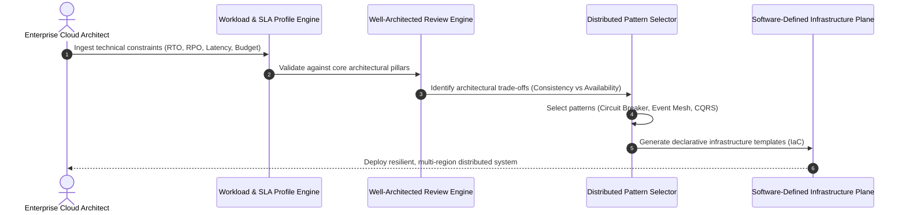
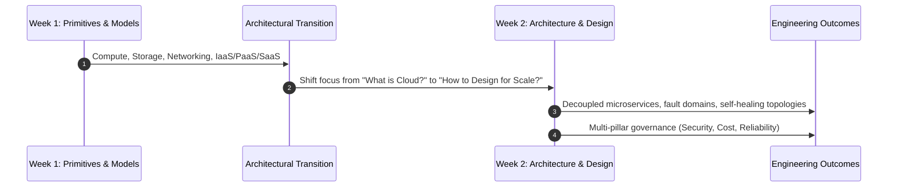
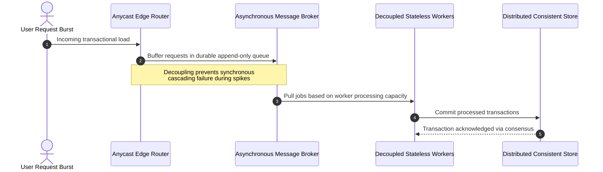

# **Lesson 0: Module Introduction - Cloud Architecture & Design**

Cloud architecture transitions system design from static, localized server provisioning into dynamic, distributed software-defined topologies. This module explores the engineering principles, architectural patterns, and governance frameworks required to construct scalable, fault-tolerant, and cost-optimized enterprise cloud systems. Mastering these methodologies enables engineers to treat infrastructure as declarative code, optimize operational availability, and make calculated trade-offs across distributed system boundaries.



## **Module Objectives and Pedagogical Scope**

Week 2 shifts the operational perspective from cloud consumption primitives to systemic distributed systems engineering, establishing the technical foundations required to architect enterprise-grade cloud environments.



### Core Learning Objectives

- **Distributed Systems Design**: Formulate decoupled system topologies that isolate failure domains and maintain operational availability during localized data center outages.
- **Framework-Driven Evaluation**: Apply formal evaluation frameworks (such as the AWS Well-Architected Framework and Azure Architecture Center guidelines) across system lifecycles.
- **Pattern Implementation**: Implement industry-standard cloud design patterns covering asynchronous messaging, database sharding, caching topologies, and distributed state management.
- **Quantitative Trade-Off Analysis**: Balance the competing demands of the CAP theorem, PACELC theorem, network latency limits, and egress pricing structures.

### Shift from Administration to System Architecture

- Systems administration historically prioritized server uptime and hardware configuration stability.
- Cloud architecture prioritizes dynamic resilience, treating compute instances as disposable execution units (*ephemeral cattle*) rather than specialized individual servers (*static pets*).
- Architectural success is measured by mean time to recovery (MTTR), service level objectives (SLOs), and cost per business transaction rather than single-server uptime percentages.

> [!Important]
> **Design for catastrophic failure**: Cloud architecture assumes that physical hardware, network switches, and whole availability zones will inevitably fail; production systems must automate containment and recovery without administrative intervention.

## **The Structural Foundations of Cloud Architecture**

Engineering distributed cloud systems requires abandoning single-chassis hardware assumptions and embracing software-defined coordination mechanics.



### Foundational Cloud Tenets

- **Decoupling via Asynchronous Interfaces**: Inter-service communication relies on non-blocking message queues and event brokers, preventing slow downstream dependencies from exhausting upstream thread pools.
- **Stateless Compute Execution**: Workloads offload state to externalized distributed caching and database layers, allowing virtual compute instances to scale horizontally or terminate cleanly.
- **Immutable Infrastructure**: Cloud environments deploy declarative machine images and container configurations; systems are replaced entirely rather than patched in-place during updates.
- **Elastic Self-Healing**: Health checks, circuit breakers, and automated orchestrators detect failing nodes and replace them dynamically within seconds.

### Distributed System Realities in the Cloud

- The *fallacies of distributed computing* prove that networks are never completely reliable, latency is never zero, and bandwidth is never infinite.
- System designs must navigate the **CAP Theorem**: during a network partition (P), distributed systems must balance data consistency (C) against availability (A).
- System designs must also address the **PACELC Theorem**: even when the system operates normally without partitions (E), engineers must balance latency (L) against consistency (C).

> [!Tip]
> **Embrace eventual consistency where feasible**: Sacrificing immediate cross-region consistency for eventual consistency drastically reduces write latency and improves availability across globally distributed deployments.

## **Week 2 Curriculum Roadmap and Lesson Progression**

Week 2 guides engineers through the complete lifecycle of cloud architecture, starting from abstract principles and progressing through resilience patterns, security frameworks, and technical assessments.

```mermaid
sequenceDiagram
    autonumber
    participant L1 as Lesson 1: Architectural Principles & Frameworks
    participant L2 as Lesson 2: High Availability & Scalability
    participant L3 as Lesson 3: Distributed Design Patterns
    participant L4 as Lesson 4: Security, Cost, & Operational Governance
    participant L5 as Lesson 5: Design Review & Assessment

    L1->>L2: Establish pillars; design fault domains & scaling loops
    L2->>L3: Apply scaling models to microservices & messaging patterns
    L3->>L4: Secure distributed topologies and optimize lifecycle costs
    L4->>L5: Validate complete enterprise architectures via scenario review
```

### Module Progression Breakdown

- **Lesson 1: Cloud Architecture Principles & Well-Architected Frameworks**: Investigates the core pillars of cloud engineering (Operational Excellence, Security, Reliability, Performance Efficiency, Cost Optimization, Sustainability) and explores architectural trade-offs.
- **Lesson 2: Designing for High Availability and Scalability**: Explores fault domains, multi-Availability Zone configurations, multi-region failover mechanics, horizontal versus vertical scaling, and load-balancing topologies (Layer 4 versus Layer 7).
- **Lesson 3: Cloud Design Patterns**: Analyzes structural patterns including Circuit Breaker, Retry with Exponential Backoff, Command Query Responsibility Segregation (CQRS), Event Sourcing, Strangler Fig, and Cache-Aside.
- **Lesson 4: Security, Governance, and Cost Optimization**: Details identity federation, zero-trust architectures, infrastructure as code (IaC), FinOps frameworks, resource tagging standards, and reserved capacity planning.
- **Lesson 5: Architecture Review, Case Studies, and Assessment**: Synthesizes design principles through enterprise case scenarios, architectural troubleshooting problems, and practice assessments.

> [!Important]
> **Pillar alignment is non-negotiable**: High availability designs that ignore cost optimization create unsustainable operational expenses; architectural excellence requires balancing all design pillars simultaneously.

## **Comparative Matrix of Enterprise Architectural Paradigms**

| Dimension | Monolithic On-Premises | Lift-and-Shift Cloud (IaaS) | Modern Cloud-Native Architecture |
|---|---|---|---|
| **Component Coupling** | Tight compile-time bindings, shared local memory | Shared virtual networks, direct database couplings | Loosely coupled microservices, asynchronous events |
| **Failure Handling** | High-availability hardware, manual engineer failover | Hypervisor reboot, single-AZ virtual machine restarts | Automated multi-AZ self-healing, active-active failover |
| **Scalability Vector** | Vertical hardware scaling (larger physical chassis) | Vertical instance resizing, coarse auto-scaling groups | Granular horizontal microservice and serverless scaling |
| **State Management** | Local session memory, sticky load-balancer sessions | Local filesystem attachments, sticky server sessions | Externalized distributed caches, stateless compute |
| **Deployment Cadence** | Monolithic releases (quarterly or monthly cycles) | Coarse application releases (bi-weekly cycles) | Continuous delivery (daily automated micro-releases) |
| **Operational Governance** | Manual ticketing systems, physical audit logs | Scripted virtual machine updates, cloud console audits | Declarative Infrastructure as Code (IaC), GitOps pipelines |
| **Cost Profile** | Heavy upfront CapEx, fixed multi-year depreciation | Predictable but unoptimized OpEx (idle virtual machines) | Dynamically metered OpEx (scale-to-zero, spot instances) |

## **Key Takeaways**

- **Architecture supersedes infrastructure provisioning**: Building successful cloud platforms requires deliberate distributed system engineering rather than merely renting virtual machines in someone else's data center.
- **Failure containment dictates topology**: Designing for failure requires establishing strict fault isolation boundaries across compute instances, availability zones, and geographical regions.
- **Decoupling unlocks agility and resilience**: Asynchronous messaging layers and stateless compute tiers isolate operational bottlenecks and prevent localized errors from triggering cascading system failures.
- **Frameworks standardize architectural reviews**: Well-Architected Frameworks provide formal structures to evaluate security postures, operational performance, and resource costs before deploying to production.
- **The cloud demands continuous optimization**: Cloud system design is an iterative engineering process governed by measurable telemetry, continuous delivery pipelines, and FinOps practices.

> [!Important]
> **Cloud-native systems require mindset shifts**: Migrating to the cloud without embracing stateless architectures, asynchronous decoupling, and automated scaling merely shifts legacy technical debt into an operational expense model.
