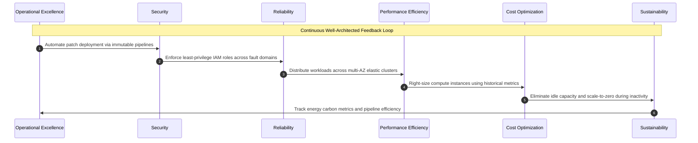

# Migration in progress
# **Lesson 1: Core Cloud Architecture Principles**

Cloud architecture replaces rigid, centralized hardware designs with distributed, software-defined systems engineered around elasticity, fault isolation, and automation. Core architectural principles guide engineering teams in establishing resilient boundaries, decoupling stateful and stateless application layers, and eliminating single points of failure. Evaluating these principles through industry-standard Well-Architected Frameworks ensures systems balance operational reliability, cryptographic security, and computational performance against total lifecycle costs.

```mermaid
sequenceDiagram
    autonumber
    actor Dev as Engineering Team
    participant Review as Well-Architected Review Engine
    participant Reliability as Reliability & Performance Pillar
    participant Security as Security & Identity Pillar
    participant FinOps as Cost Optimization Pillar
    participant Deploy as Automated IaC Deployment Fabric

    Dev->>Review: Submit distributed system architecture specification
    Review->>Reliability: Evaluate fault domains, RTO/RPO, and auto-scaling rules
    Reliability-->>Review: Recommend multi-AZ data replication and queue decoupling
    Review->>Security: Enforce least privilege, zero trust, and KMS key rotation
    Security-->>Review: Cryptographic identity verified; egress firewalls set
    Review->>FinOps: Audit resource allocations, spot instance targets, and idle waste
    FinOps-->>Review: Right-sizing parameters and autoscaling triggers verified
    Review->>Deploy: Emit verified declarative Terraform / CloudFormation blueprint
    Deploy-->>Dev: Production infrastructure deployed across isolated zones
```

## **Foundational Principles of Cloud System Design**

Designing enterprise systems for cloud infrastructure requires abandoning the assumption of physical hardware permanence and architecting for continuous, transparent failure.

```mermaid
sequenceDiagram
    autonumber
    actor User as Client Traffic
    participant Gateway as API Gateway / Ingress Router
    participant Queue as Non-Blocking Message Buffer
    participant WorkerPool as Stateless Compute Worker Fleet
    participant DB as Decoupled Data Tier

    User->>Gateway: Submit transactional workload
    Gateway->>Queue: Enqueue message payload asynchronously
    Note over Gateway,Queue: Asynchronous decoupling prevents<br/>downstream saturation
    Queue->>WorkerPool: Dispatch job to available worker node
    alt Worker Hardware Crash
        Note over WorkerPool: Node fails mid-processing
        Queue->>Queue: Visibility timeout expires; re-queue job
        Queue->>WorkerPool: Dispatch job to healthy worker replacement
    end
    WorkerPool->>DB: Persist state transaction
    DB-->>WorkerPool: Commit acknowledged
    WorkerPool-->>User: Async completion notification via webhook
```

### Designing for Failure and Blast Radius Containment

- *Blast radius containment* limits the scope of impact when an individual software module, network switch, or compute host fails.
- Fault domains isolate physical resources into distinct power grids, network switches, and physical data centers known as Availability Zones.
- Workloads deploy **bulkhead patterns** to segregate critical system components, preventing an unhandled exception or memory leak in a secondary service from crashing core transactional services.

### Loose Coupling and Component Decoupling

- Tight synchronous couplings between microservices create fragile call chains where the slowest downstream dependency throttles all upstream callers.
- Systems implement non-blocking asynchronous message queues, publish-subscribe brokers, and event buses to decouple producers from consumers.
- Communication relies on explicit, versioned API contracts rather than shared database schemas or direct inter-process memory references.

### Statelessness and Horizontal Elasticity

- Compute instances treat execution memory as ephemeral, offloading user sessions, temporary files, and application state to centralized distributed caches and databases.
- Stateless execution nodes scale horizontally (*scale out* and *scale in*) via auto-scaling groups based on real-time telemetry metrics.
- Removing server affinity (*sticky sessions*) allows any compute node within a cluster to fulfill any inbound request, enabling rapid instance cycling and seamless zero-downtime updates.

### Defense in Depth and Zero Trust

- Perimeter-based network defense is replaced with *zero trust* architectures that authenticate and authorize every interaction across internal and external boundaries.
- Security controls deploy in synchronized layers: identity and access management (IAM), transport layer security (TLS 1.3), network access control lists (NACLs), security groups, and runtime container sandboxing.
- Cryptographic isolation safeguards data at rest using customer-managed encryption keys, while software secrets rotate automatically via centralized secrets management engines.

> [!Important]
> **Assumption of inevitable failure**: Resilient cloud design does not attempt to engineer indestructible hardware; it accepts that hardware, software runtimes, and network connections will fail, automating isolation and recovery routines.

## **The Well-Architected Framework Pillars**

Major cloud service providers formalize cloud design through the Well-Architected Framework, which organizes architectural evaluations across six foundational engineering pillars.



### 1. Operational Excellence Pillar

- Focuses on executing and monitoring systems to deliver business value and continuously improving supporting processes and procedures.
- Manages infrastructure strictly through declarative **Infrastructure as Code (IaC)**, ensuring operational environments deploy deterministically and undergo version control reviews.
- Executes automated test runs, canary deployments, and game days to simulate production outages and validate incident response runbooks before actual disruptions occur.

### 2. Security Pillar

- Prioritizes protecting information, assets, and systems while delivering business value through structured risk assessments and mitigation strategies.
- Mandates fine-grained, least-privilege access policies, enforcing multi-factor authentication (MFA) and temporary role assumption rather than static long-lived credentials.
- Automates detective controls by streaming audit logs (such as AWS CloudTrail or GCP Cloud Audit Logs) into real-time threat intelligence engines to detect configuration anomalies.

### 3. Reliability Pillar

- Ensures a workload performs its intended function correctly and consistently when expected to do so across its operational lifecycle.
- Incorporates automated self-healing mechanisms where orchestrators monitor application health checks, terminating unhealthy instances and spinning up healthy replacements.
- Establishes tested disaster recovery topologies aligned with strict Recovery Point Objectives (RPO) and Recovery Time Objectives (RTO).

### 4. Performance Efficiency Pillar

- Focuses on using computing resources efficiently to meet system requirements and maintaining that efficiency as demand changes and technologies evolve.
- Selects workload-specific hardware primitives, matching memory-intensive tasks with high