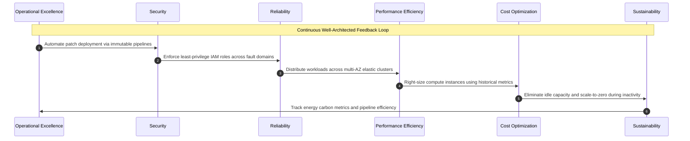

# **Lesson 1: Core Cloud Architecture Principles**

Cloud architecture replaces rigid, centralized hardware designs with distributed, software-defined systems engineered around elasticity, fault isolation, and automation. Core architectural principles guide engineering teams in establishing resilient boundaries, decoupling stateful and stateless application layers, and eliminating single points of failure. Evaluating these principles through industry-standard Well-Architected Frameworks ensures systems balance operational reliability, cryptographic security, and computational performance against total lifecycle costs.

```mermaid
sequenceDiagram
    autonumber
    actor Dev as Engineering Team
    participant Review as Well-Architected Review Engine
    participant Reliability as Reliability & Performance Pillar
    participant Security as Security & Identity Pillar
    participant FinOps as Cost Optimization Pillar
    participant Deploy as Automated IaC Deployment Fabric

    Dev->>Review: Submit distributed system architecture specification
    Review->>Reliability: Evaluate fault domains, RTO/RPO, and auto-scaling rules
    Reliability-->>Review: Recommend multi-AZ data replication and queue decoupling
    Review->>Security: Enforce least privilege, zero trust, and KMS key rotation
    Security-->>Review: Cryptographic identity verified; egress firewalls set
    Review->>FinOps: Audit resource allocations, spot instance targets, and idle waste
    FinOps-->>Review: Right-sizing parameters and autoscaling triggers verified
    Review->>Deploy: Emit verified declarative Terraform / CloudFormation blueprint
    Deploy-->>Dev: Production infrastructure deployed across isolated zones
```

## **Foundational Principles of Cloud System Design**

Designing enterprise systems for cloud infrastructure requires abandoning the assumption of physical hardware permanence and architecting for continuous, transparent failure.

```mermaid
sequenceDiagram
    autonumber
    actor User as Client Traffic
    participant Gateway as API Gateway / Ingress Router
    participant Queue as Non-Blocking Message Buffer
    participant WorkerPool as Stateless Compute Worker Fleet
    participant DB as Decoupled Data Tier

    User->>Gateway: Submit transactional workload
    Gateway->>Queue: Enqueue message payload asynchronously
    Note over Gateway,Queue: Asynchronous decoupling prevents<br/>downstream saturation
    Queue->>WorkerPool: Dispatch job to available worker node
    alt Worker Hardware Crash
        Note over WorkerPool: Node fails mid-processing
        Queue->>Queue: Visibility timeout expires; re-queue job
        Queue->>WorkerPool: Dispatch job to healthy worker replacement
    end
    WorkerPool->>DB: Persist state transaction
    DB-->>WorkerPool: Commit acknowledged
    WorkerPool-->>User: Async completion notification via webhook
```

### Designing for Failure and Blast Radius Containment

- *Blast radius containment* limits the scope of impact when an individual software module, network switch, or compute host fails.
- Fault domains isolate physical resources into distinct power grids, network switches, and physical data centers known as Availability Zones.
- Workloads deploy **bulkhead patterns** to segregate critical system components, preventing an unhandled exception or memory leak in a secondary service from crashing core transactional services.

### Loose Coupling and Component Decoupling

- Tight synchronous couplings between microservices create fragile call chains where the slowest downstream dependency throttles all upstream callers.
- Systems implement non-blocking asynchronous message queues, publish-subscribe brokers, and event buses to decouple producers from consumers.
- Communication relies on explicit, versioned API contracts rather than shared database schemas or direct inter-process memory references.

### Statelessness and Horizontal Elasticity

- Compute instances treat execution memory as ephemeral, offloading user sessions, temporary files, and application state to centralized distributed caches and databases.
- Stateless execution nodes scale horizontally (*scale out* and *scale in*) via auto-scaling groups based on real-time telemetry metrics.
- Removing server affinity (*sticky sessions*) allows any compute node within a cluster to fulfill any inbound request, enabling rapid instance cycling and seamless zero-downtime updates.

### Defense in Depth and Zero Trust

- Perimeter-based network defense is replaced with *zero trust* architectures that authenticate and authorize every interaction across internal and external boundaries.
- Security controls deploy in synchronized layers: identity and access management (IAM), transport layer security (TLS 1.3), network access control lists (NACLs), security groups, and runtime container sandboxing.
- Cryptographic isolation safeguards data at rest using customer-managed encryption keys, while software secrets rotate automatically via centralized secrets management engines.

> [!Important]
> **Assumption of inevitable failure**: Resilient cloud design does not attempt to engineer indestructible hardware; it accepts that hardware, software runtimes, and network connections will fail, automating isolation and recovery routines.

## **The Well-Architected Framework Pillars**

Major cloud service providers formalize cloud design through the Well-Architected Framework, which organizes architectural evaluations across six foundational engineering pillars.



### 1. Operational Excellence Pillar

- Focuses on executing and monitoring systems to deliver business value and continuously improving supporting processes and procedures.
- Manages infrastructure strictly through declarative **Infrastructure as Code (IaC)**, ensuring operational environments deploy deterministically and undergo version control reviews.
- Executes automated test runs, canary deployments, and game days to simulate production outages and validate incident response runbooks before actual disruptions occur.

### 2. Security Pillar

- Prioritizes protecting information, assets, and systems while delivering business value through structured risk assessments and mitigation strategies.
- Mandates fine-grained, least-privilege access policies, enforcing multi-factor authentication (MFA) and temporary role assumption rather than static long-lived credentials.
- Automates detective controls by streaming audit logs (such as AWS CloudTrail or GCP Cloud Audit Logs) into real-time threat intelligence engines to detect configuration anomalies.

### 3. Reliability Pillar

- Ensures a workload performs its intended function correctly and consistently when expected to do so across its operational lifecycle.
- Incorporates automated self-healing mechanisms where orchestrators monitor application health checks, terminating unhealthy instances and spinning up healthy replacements.
- Establishes tested disaster recovery topologies aligned with strict Recovery Point Objectives (RPO) and Recovery Time Objectives (RTO).

### 4. Performance Efficiency Pillar

- Focuses on using computing resources efficiently to meet system requirements and maintaining that efficiency as demand changes and technologies evolve.
- Selects workload-specific hardware primitives, matching memory-intensive tasks with high-RAM instances and deep learning tasks with specialized GPU or TPU silicon.
- Uses distributed caching tiers, serverless architectures, and read-replicas to reduce primary database bottlenecks and minimize latency for global end users.

### 5. Cost Optimization Pillar

- Focuses on avoiding unnecessary spending and allocating infrastructure investments to yield maximum business value.
- Replaces static overprovisioned capacity with dynamic autoscaling policies, spot/preemptible instances for fault-tolerant batch processing, and reserved capacity commitments for baseline compute.
- Applies FinOps practices by tagging infrastructure with billing metadata, establishing cost attribution down to specific engineering teams, environments, and business services.

### 6. Sustainability Pillar

- Addresses the environmental impacts of running cloud workloads, focusing on energy consumption and material efficiency.
- Optimizes hardware utilization by consolidating underutilized instances, deprecating unused storage volumes, and adopting serverless models that scale to zero when idle.
- Selects cloud data center regions powered by high percentages of renewable energy, reducing the carbon footprint of compute cycles.

> [!Tip]
> **Automating architectural reviews**: Integrate policy-as-code linting tools (such as Open Policy Agent or AWS Config) directly into CI/CD pipelines to automatically fail infrastructure deployments that breach Well-Architected rules.

## **Architectural Trade-Offs and Engineering Tensions**

Architecting cloud platforms requires navigating technical trade-offs; optimizing heavily for a single pillar inevitably introduces constraints and compromises across others.

```mermaid
sequenceDiagram
    autonumber
    actor Arch as System Architect
    participant HighAvail as Reliability Strategy (Active-Active Multi-Region)
    participant Budget as Cost Optimization Threshold
    participant Sync as Latency & Strong Consistency Engine

    Arch->>HighAvail: Deploy active-active compute across three global regions
    HighAvail->>Budget: Triples compute costs and introduces high cross-region data transfer fees
    Budget-->>Arch: Budget constraint breached; redesign required
    Arch->>Sync: Mandate synchronous multi-region database transactions
    Sync-->>Arch: Speed of light network latency adds 120ms to every write operation
    Note over Arch,Sync: Trade-off resolved: Shift to asynchronous replication<br/>with eventual consistency to maintain latency SLAs
```

### Cost versus Reliability

- Deploying multi-region active-active architectures guarantees near-zero downtime and disaster recovery capabilities, but dramatically increases operational expenses through duplicated infrastructure and cross-region network data egress fees.
- Single-region multi-AZ architectures provide sufficient fault tolerance for standard enterprise workloads at a fraction of the operational cost.

### Consistency versus Latency

- The *PACELC theorem* dictates that when a distributed system is running normally (without network partitions), the system must choose between latency and data consistency.
- Enforcing strong, synchronous multi-master database updates across geographic regions guarantees immediate data correctness, but incurs severe latency penalties due to physical speed-of-light network limitations.
- Adopting eventual consistency enables sub-millisecond local read and write operations, but requires application logic capable of tolerating temporary data divergence.

### Portability versus Velocity

- Designing workloads to remain strictly vendor-agnostic (using lowest-common-denominator IaaS primitives or generic abstractions) prevents lock-in to a single hyperscaler.
- Using proprietary managed services (such as AWS DynamoDB, GCP BigQuery, or Azure Cosmos DB) dramatically accelerates engineering velocity, reduces operational maintenance, and provides superior native elasticity at the cost of cloud portability.

> [!Important]
> **Deliberate trade-off selection**: Cloud architecture is the art of intentional compromise; attempting to build a system that achieves maximum reliability, absolute consistency, zero latency, and minimal cost creates an unmaintainable system.

## **Comparative Matrix of the Well-Architected Pillars**

| Pillar | Primary Engineering Focus | Foundational Design Principles | Critical KPIs & Metrics | Major Architectural Anti-Patterns |
|---|---|---|---|---|
| **Operational Excellence** | Process automation, monitoring, continuous release | Manage infrastructure as code, make small reversible changes, anticipate failure | Mean Time to Recovery (MTTR), deployment frequency, change failure rate | Manual server configuration, undocumented console changes, lack of runbooks |
| **Security** | Confidentiality, data integrity, access authorization | Apply defense in depth, automate security controls, enforce least privilege | Time to detect (TTD), patch latency, identity access review frequency | Hardcoded API secrets, root-account usage, wide-open security group CIDR blocks (`0.0.0.0/0`) |
| **Reliability** | System resilience, fault recovery, scaling limits | Automatically recover from failure, test recovery procedures, stop guessing capacity | System uptime percentage (e.g., 99.99%), failover duration, RPO, RTO | Single points of failure, lack of automated backups, unconstrained cascading dependencies |
| **Performance Efficiency** | Computational throughput, resource optimization | Democratize advanced technologies, go global in minutes, use serverless architectures | Request latency (p95, p99), CPU/RAM utilization curves, IOPS throughput | Overprovisioned static instances, ignoring caching opportunities, monolithic shared databases |
| **Cost Optimization** | Financial governance, expenditure attribution | Adopt a consumption model, measure overall efficiency, stop spending money on heavy lifting | Unit cost per transaction, unattached resource volume count, reserved instance coverage | Idle compute resources, untagged cloud assets, ignoring regional data egress costs |
| **Sustainability** | Environmental impact, energy reduction | Understand system impact, maximize resource utilization, adopt modern silicon | Kilowatt-hour per operation, average CPU utilization percentage, idle capacity ratio | Continuous overprovisioning, archiving obsolete uncompressed data, running workloads in fossil-heavy regions |

## **Key Takeaways**

- **Cloud architectures assume inevitable hardware failure**: Resilient systems deploy fault domains, isolated availability zones, and decoupled bulkheads to prevent localized component failures from bringing down entire systems.
- **Loose coupling prevents cascading outages**: Asynchronous messaging layers and stateless compute tiers isolate operational bottlenecks, allowing individual microservices to scale and fail independently.
- **Stateless design enables true elasticity**: Offloading persistent state to distributed caches and managed databases allows compute instances to scale horizontally and terminate on demand without dropping user sessions.
- **Defense in depth supersedes perimeter defense**: Modern cloud security mandates zero-trust architectures, end-to-end encryption for data in transit and at rest, and automated least-privilege identity access management.
- **The Well-Architected Framework provides a structured baseline**: Evaluating systems across Operational Excellence, Security, Reliability, Performance Efficiency, Cost Optimization, and Sustainability guarantees comprehensive architectural rigor.
- **Architectural engineering is an exercise in intentional compromise**: System designers must consciously balance operational trade-offs, such as sacrificing immediate global consistency to deliver low-latency user interactions.

> [!Important]
> **Infrastructure as Code is foundational to operational excellence**: Systems configured manually via administrative cloud web consoles are unrepeatable, unversioned, and prone to configuration drift; production cloud architectures require automated, declarative code.
