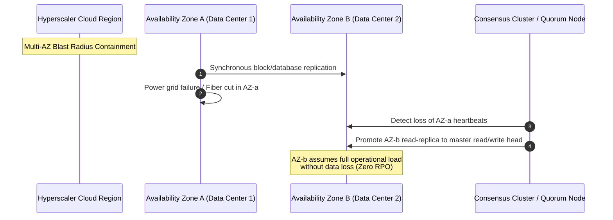
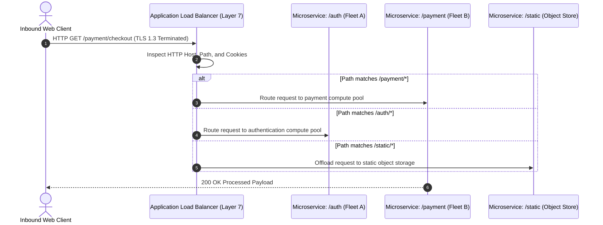
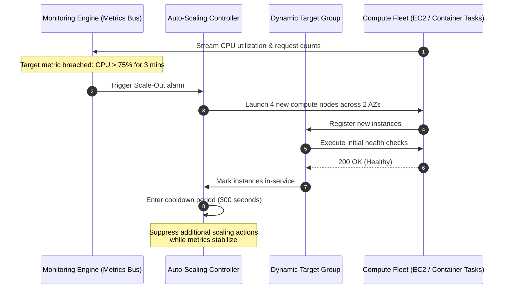

# Migration in progress
# **Lesson 2: Designing for Reliability and Performance**

Reliability and performance represent interrelated engineering goals in cloud system design, requiring systems to maintain high throughput and low latency under peak traffic while automatically recovering from localized hardware and network outages. Achieving these characteristics demands deliberate architectural choices across fault domain segregation, dynamic load distribution, auto-scaling mechanics, and distributed caching hierarchies. Balancing these operational requirements requires precise mathematical tracking of availability metrics, elimination of systemic single points of failure, and proactive mitigation of distributed systems bottlenecks.

```mermaid
sequenceDiagram
    autonumber
    actor User as Global Inbound Request
    participant DNS as Route 53 / Latency DNS
    participant Edge as Edge CDN / Anycast PoP
    participant L7 as Layer 7 Application Load Balancer
    participant AZ1 as AZ-a: Compute Cluster (Primary)
    participant AZ2 as AZ-b: Compute Cluster (Standby/Burst)
    participant Cache as Distributed Redis Cache
    participant DB as Multi-AZ Aurora DB (Sync Replica)

    User->>DNS: Resolve application endpoint
    DNS-->>User: Anycast IP of nearest Edge PoP
    User->>Edge: HTTPS GET /catalog/items
    alt Edge Cache Hit
        Edge-->>User: Return cached asset (Sub-10ms response)
    else Edge Cache Miss
        Edge->>L7: Forward request over cloud private backbone
        L7->>L7: Execute Layer 7 path-based routing check
        L7->>AZ1: Health check: Node 1 fails synthetic test
        Note over L7,AZ1: Node marked UNHEALTHY; traffic shifted instantly to AZ-b
        L7->>AZ2: Dispatch request to healthy compute worker
        AZ2->>Cache: Query item details
        Cache-->>AZ2: Return in-memory item document
        AZ2-->>L7: 200 OK JSON payload
        L7-->>Edge: Deliver response and cache at edge
        Edge-->>User: 200 OK delivery completed
    end
```

## **High Availability, Fault Tolerance, and Resiliency Metrics**

Resilient systems design relies on quantitative metrics to calculate system availability, isolate failures into distinct physical zones, and engineer automated recovery paths.



### Quantifying Availability: The Mathematics of Uptime

- *High Availability (HA)* measures the percentage of time a system remains operational and accessible over a designated operational period.
- Calculated mathematically as:
  $$\text{Availability} = \frac{\text{MTBF}}{\text{MTBF} + \text{MTTR}} \times 100\%$$
  where **MTBF** is *Mean Time Between Failures* and **MTTR** is *Mean Time to Recovery*.
- **The "Nines" of Availability**:
  - $99.9\%$ (Three Nines): Allows up to $8.77$ hours of unplanned downtime per year.
  - $99.99\%$ (Four Nines): Allows up to $52.60$ minutes of unplanned downtime per year.
  - $99.999\%$ (Five Nines): Allows up to $5.26$ minutes of unplanned downtime per year.
- **Composite Availability Calculation**: In serial dependencies, overall availability is the product of component availabilities ($A_{\text{total}} = A_1 \times A_2$), meaning serial systems are less available than their individual parts. In redundant parallel configurations, overall failure probability decreases ($A_{\text{total}} = 1 - (1 - A_1) \times (1 - A_2)$), improving total availability.

### Fault Domains and Blast Radius Containment

- **Racks and Chassis**: Physical servers share common top-of-rack (ToR) switches and power distribution units (PDUs), forming the smallest fault domain.
- **Availability Zones (AZs)**: Distinct physical data center complexes engineered with isolated power feeds, cooling generators, and flood planes, separated by enough physical distance to survive natural disasters while maintaining sub-two-millisecond inter-zone network round trips.
- **Cloud Regions**: Geographically isolated territories containing multiple AZs connected via low-latency provider fiber backbones; failures inside one region cannot propagate across regional boundaries.

### Redundancy Topologies: Active-Active versus Active-Passive

- **Active-Passive (Failover)**: Primary nodes process all incoming production traffic while secondary standby nodes remain idle or receive asynchronous updates, activating only when primary health checks fail.
- **Active-Active (Continuous Load Sharing)**: Every deployed node concurrently processes incoming transactional requests, maximizing hardware utilization and eliminating failover delay during an outage.

> [!Important]
> **Serial dependencies reduce total availability**: Chaining three separate services that each boast 99.9% availability in a serial call path drops the composite system availability to $0.999 \times 0.999 \times 0.999 = 99.7\%$, permitting over 26 hours of cumulative annual downtime.

## **Load Balancing Mechanics and Traffic Distribution**

Load balancers distribute incoming traffic across pools of compute resources, preventing individual host saturation and isolating defective nodes through active health monitoring.



### Layer 4 (Transport) versus Layer 7 (Application) Routing

- **Layer 4 Load Balancing (Network Load Balancers)**: Operates at the transport layer, routing raw TCP and UDP streams using flow hash algorithms (source IP, source port, destination IP, destination port, protocol). Yields extreme throughput, handles tens of millions of requests per second with microsecond latency, and passes packets without inspecting application payloads.
- **Layer 7 Load Balancing (Application Load Balancers)**: Operates at the application layer, terminating TLS connections and inspecting HTTP/HTTPS headers, cookies, query parameters, and URL paths. Enables content-based routing, directs specific microservices based on URI routes, and injects custom tracking headers.

### Health Check Engineering: Deep versus Synthetic Checks

- *Shallow health checks*: Simple TCP ping tests or basic HTTP `GET /` calls that confirm a web server process is accepting connections, failing to detect downstream database lockups or corrupted backend threads.
- *Deep health checks*: Comprehensive diagnostic endpoints (such as `GET /health/deep`) that verify the application can successfully query the local database, access the caching tier, and resolve internal service dependencies.
- **Flap Damping**: Configurable consecutive failure thresholds (e.g., three failed attempts before marking unhealthy) and recovery thresholds prevent a struggling instance from flapping rapidly between active and inactive states.

### Session State Handling

- **Sticky Sessions (Session Affinity)**: Uses load-balancer-generated cookies to pin a specific user's requests to a single backend server instance, causing uneven load distribution and user session loss when an instance fails.
- **Stateless Distribution**: Removes affinity entirely by storing session state in external distributed caches, allowing any instance behind the load balancer to handle incoming requests from any client.

> [!Tip]
> **Avoid cascading deep health check failures**: Configure deep health checks to return warnings rather than hard failures when downstream dependencies degrade; otherwise, a minor database slowdown can trigger simultaneous load balancer terminations across an entire compute fleet.

## **Elastic Scalability Engineering**

Scalability measures a system's capability to manage increasing workload demands by expanding resource capacity without degrading processing latency or system responsiveness.



### Horizontal Scale-Out versus Vertical Scale-Up

- **Vertical Scaling (Scale-Up)**: Adds more vCPU, RAM, or st