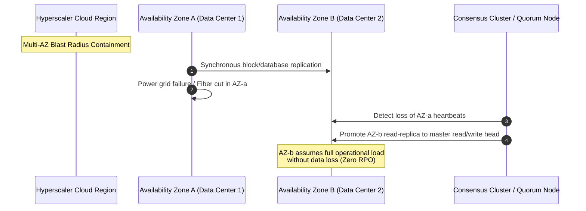
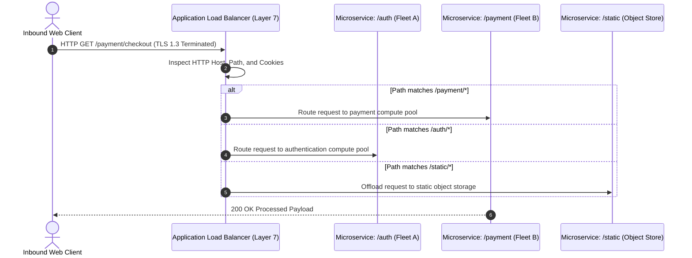
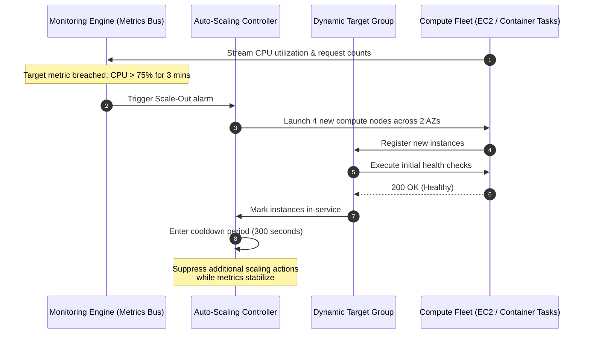
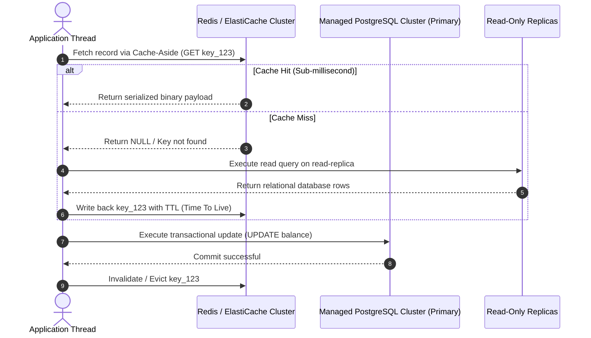

# **Lesson 2: Designing for Reliability and Performance**

Reliability and performance represent interrelated engineering goals in cloud system design, requiring systems to maintain high throughput and low latency under peak traffic while automatically recovering from localized hardware and network outages. Achieving these characteristics demands deliberate architectural choices across fault domain segregation, dynamic load distribution, auto-scaling mechanics, and distributed caching hierarchies. Balancing these operational requirements requires precise mathematical tracking of availability metrics, elimination of systemic single points of failure, and proactive mitigation of distributed systems bottlenecks.

```mermaid
sequenceDiagram
    autonumber
    actor User as Global Inbound Request
    participant DNS as Route 53 / Latency DNS
    participant Edge as Edge CDN / Anycast PoP
    participant L7 as Layer 7 Application Load Balancer
    participant AZ1 as AZ-a: Compute Cluster (Primary)
    participant AZ2 as AZ-b: Compute Cluster (Standby/Burst)
    participant Cache as Distributed Redis Cache
    participant DB as Multi-AZ Aurora DB (Sync Replica)

    User->>DNS: Resolve application endpoint
    DNS-->>User: Anycast IP of nearest Edge PoP
    User->>Edge: HTTPS GET /catalog/items
    alt Edge Cache Hit
        Edge-->>User: Return cached asset (Sub-10ms response)
    else Edge Cache Miss
        Edge->>L7: Forward request over cloud private backbone
        L7->>L7: Execute Layer 7 path-based routing check
        L7->>AZ1: Health check: Node 1 fails synthetic test
        Note over L7,AZ1: Node marked UNHEALTHY; traffic shifted instantly to AZ-b
        L7->>AZ2: Dispatch request to healthy compute worker
        AZ2->>Cache: Query item details
        Cache-->>AZ2: Return in-memory item document
        AZ2-->>L7: 200 OK JSON payload
        L7-->>Edge: Deliver response and cache at edge
        Edge-->>User: 200 OK delivery completed
    end
```

## **High Availability, Fault Tolerance, and Resiliency Metrics**

Resilient systems design relies on quantitative metrics to calculate system availability, isolate failures into distinct physical zones, and engineer automated recovery paths.



### Quantifying Availability: The Mathematics of Uptime

- *High Availability (HA)* measures the percentage of time a system remains operational and accessible over a designated operational period.
- Calculated mathematically as:
  $$\text{Availability} = \frac{\text{MTBF}}{\text{MTBF} + \text{MTTR}} \times 100\%$$
  where **MTBF** is *Mean Time Between Failures* and **MTTR** is *Mean Time to Recovery*.
- **The "Nines" of Availability**:
  - $99.9\%$ (Three Nines): Allows up to $8.77$ hours of unplanned downtime per year.
  - $99.99\%$ (Four Nines): Allows up to $52.60$ minutes of unplanned downtime per year.
  - $99.999\%$ (Five Nines): Allows up to $5.26$ minutes of unplanned downtime per year.
- **Composite Availability Calculation**: In serial dependencies, overall availability is the product of component availabilities ($A_{\text{total}} = A_1 \times A_2$), meaning serial systems are less available than their individual parts. In redundant parallel configurations, overall failure probability decreases ($A_{\text{total}} = 1 - (1 - A_1) \times (1 - A_2)$), improving total availability.

### Fault Domains and Blast Radius Containment

- **Racks and Chassis**: Physical servers share common top-of-rack (ToR) switches and power distribution units (PDUs), forming the smallest fault domain.
- **Availability Zones (AZs)**: Distinct physical data center complexes engineered with isolated power feeds, cooling generators, and flood planes, separated by enough physical distance to survive natural disasters while maintaining sub-two-millisecond inter-zone network round trips.
- **Cloud Regions**: Geographically isolated territories containing multiple AZs connected via low-latency provider fiber backbones; failures inside one region cannot propagate across regional boundaries.

### Redundancy Topologies: Active-Active versus Active-Passive

- **Active-Passive (Failover)**: Primary nodes process all incoming production traffic while secondary standby nodes remain idle or receive asynchronous updates, activating only when primary health checks fail.
- **Active-Active (Continuous Load Sharing)**: Every deployed node concurrently processes incoming transactional requests, maximizing hardware utilization and eliminating failover delay during an outage.

> [!Important]
> **Serial dependencies reduce total availability**: Chaining three separate services that each boast 99.9% availability in a serial call path drops the composite system availability to $0.999 \times 0.999 \times 0.999 = 99.7\%$, permitting over 26 hours of cumulative annual downtime.

## **Load Balancing Mechanics and Traffic Distribution**

Load balancers distribute incoming traffic across pools of compute resources, preventing individual host saturation and isolating defective nodes through active health monitoring.



### Layer 4 (Transport) versus Layer 7 (Application) Routing

- **Layer 4 Load Balancing (Network Load Balancers)**: Operates at the transport layer, routing raw TCP and UDP streams using flow hash algorithms (source IP, source port, destination IP, destination port, protocol). Yields extreme throughput, handles tens of millions of requests per second with microsecond latency, and passes packets without inspecting application payloads.
- **Layer 7 Load Balancing (Application Load Balancers)**: Operates at the application layer, terminating TLS connections and inspecting HTTP/HTTPS headers, cookies, query parameters, and URL paths. Enables content-based routing, directs specific microservices based on URI routes, and injects custom tracking headers.

### Health Check Engineering: Deep versus Synthetic Checks

- *Shallow health checks*: Simple TCP ping tests or basic HTTP `GET /` calls that confirm a web server process is accepting connections, failing to detect downstream database lockups or corrupted backend threads.
- *Deep health checks*: Comprehensive diagnostic endpoints (such as `GET /health/deep`) that verify the application can successfully query the local database, access the caching tier, and resolve internal service dependencies.
- **Flap Damping**: Configurable consecutive failure thresholds (e.g., three failed attempts before marking unhealthy) and recovery thresholds prevent a struggling instance from flapping rapidly between active and inactive states.

### Session State Handling

- **Sticky Sessions (Session Affinity)**: Uses load-balancer-generated cookies to pin a specific user's requests to a single backend server instance, causing uneven load distribution and user session loss when an instance fails.
- **Stateless Distribution**: Removes affinity entirely by storing session state in external distributed caches, allowing any instance behind the load balancer to handle incoming requests from any client.

> [!Tip]
> **Avoid cascading deep health check failures**: Configure deep health checks to return warnings rather than hard failures when downstream dependencies degrade; otherwise, a minor database slowdown can trigger simultaneous load balancer terminations across an entire compute fleet.

## **Elastic Scalability Engineering**

Scalability measures a system's capability to manage increasing workload demands by expanding resource capacity without degrading processing latency or system responsiveness.



### Horizontal Scale-Out versus Vertical Scale-Up

- **Vertical Scaling (Scale-Up)**: Adds more vCPU, RAM, or storage to a single server instance. Imposes physical silicon boundaries, requires downtime to resize virtual instances, and preserves the single server as a single point of failure.
- **Horizontal Scaling (Scale-Out)**: Provisions additional identical server instances or container tasks behind a load balancer. Provides virtually limitless scaling headroom, enables dynamic elasticity, and improves overall system fault tolerance.

### Dynamic Auto-Scaling Policies

- **Target Tracking Scaling**: Functions like a home thermostat; engineers select a target metric (such as maintaining average CPU utilization at 65% or ALB request counts per target at 1,500), and the controller automatically adds or removes instances to keep metrics stable.
- **Step Scaling**: Applies graduated scaling responses based on the severity of the metric breach (for example, adding two instances if CPU is between 70% and 80%, but adding six instances if CPU crosses 85%).
- **Scheduled and Predictive Scaling**: Anticipates traffic surges using historical machine learning patterns or pre-set calendar schedules, launching compute capacity prior to known events like flash sales or opening market hours.

### Preventing Flapping via Cooldowns and Hysteresis

- *Cooldown periods*: Timers that suppress additional auto-scaling events for a designated duration (such as 300 seconds) after a scaling event occurs, giving newly launched nodes sufficient time to bootstrap and absorb real-world traffic.
- *Hysteresis thresholds*: Setting a significant mathematical gap between scale-out thresholds (e.g., scale out when CPU > 75%) and scale-in thresholds (e.g., scale in only when CPU < 35%), preventing erratic instance churning around a single metric boundary.

> [!Important]
> **Asymmetric scaling preserves stability**: Configure scale-out rules to trigger aggressively on brief metric spikes, while configuring scale-in rules to evaluate sustained idle conditions over prolonged observation windows to prevent prematurely terminating capacity during temporary traffic dips.

## **Performance Optimization and Low-Latency Data Delivery**

High-performance cloud architectures accelerate data delivery by minimizing physical transmission distances, bypassing disk I/O, and eliminating downstream query bottlenecks.



### Distributed In-Memory Caching Strategies

- **Cache-Aside (Lazy Loading)**: The application directly queries the cache first. Upon a cache miss, the application reads the record from the database, writes the result into the cache with an expiration Time To Live (TTL), and returns the payload to the caller. Prevents filling cache memory with unused data.
- **Write-Through**: The application writes data simultaneously to both the cache and the primary database. Guarantees that data stored in the cache is always fresh, but increases write latency because every write requires two operations.
- **Write-Behind (Write-Back)**: The application writes data directly to the cache, which acknowledges the write instantly and asynchronously flushes dirty data down to the persistent database. Delivers high write throughput, but risks data loss if the cache node crashes before flushing updates to durable storage.

### Cache Stampede and Invalidation Mitigations

- *Cache stampede (thundering herd)*: Occurs when a heavily queried cache key expires, prompting thousands of concurrent application requests to hit the primary database simultaneously to read the missing data.
- **Mitigation Mechanisms**: Implement mutual-exclusion locks (mutexes) where only the first thread executes the database query while adjacent threads wait, or use probabilistic early expiration algorithms (XFetch) to compute and re-populate cache keys before hard expiration occurs.

### Read Replicas and Connection Pooling

- **Read-Replica Offloading**: Distributes read-heavy workloads (such as analytical dashboards and reporting queries) across horizontally scaled read-only database replicas updated via asynchronous replication, reserving the primary database instance exclusively for write transactions.
- **Connection Pooling**: Reuses existing persistent database connections (via connection proxies like AWS RDS Proxy or PgBouncer) rather than establishing new TCP handshakes and authentication handoffs for every application thread, preventing CPU exhaustion on database heads.

### Edge Acceleration and Anycast CDN Routing

- Static media assets, CSS bundles, client-side JavaScript packages, and cached API responses deploy to distributed Point of Presence (PoP) edge caches.
- Dynamic requests take advantage of TCP connection termination at the edge, using persistent, pre-warmed TCP and TLS tunnels over the cloud provider's dedicated fiber backbone to eliminate public internet routing latency back to origin servers.

> [!Tip]
> **Always enforce cache TTLs**: Never deploy a cache entry without an explicit Time-To-Live (TTL) expiration; hardcoded keys without TTLs inevitably cause stale-data incidents and eventual out-of-memory crashes on caching nodes.

## **Comparative Matrix of Load Balancing Topologies**

| Dimension | Layer 4 Load Balancer (NLB) | Layer 7 Load Balancer (ALB) | Global Anycast Router (Route 53 / CloudFront) |
|---|---|---|---|
| **OSI Layer** | Layer 4 (Transport: TCP / UDP / TLS) | Layer 7 (Application: HTTP / HTTPS / gRPC) | Layer 3 / Layer 7 (Network & Edge Application) |
| **Routing Granularity** | IP address, port, and protocol hash | URL Path, Host header, HTTP methods, Query Strings | Geographic location, client latency, DNS weight |
| **Throughput & Latency** | Millions of RPS; ultra-low sub-millisecond latency | High RPS; single-digit millisecond latency overhead | Edge caching; absorbs hundreds of Gbps DDoS traffic |
| **TLS Termination** | High-performance hardware TLS offloading | Full TLS termination with SNI certificate support | Edge TLS termination with zero round-trip time (0-RTT) |
| **Health Checking** | Rapid TCP handshake and basic ICMP polling | Deep HTTP status code checks (`200 OK` on `/health`) | Global DNS health probing of perimeter endpoints |
| **Primary Use Cases** | Financial exchanges, gaming UDP streams, raw socket apps | Microservices, REST APIs, container routing, web apps | Global traffic management, multi-region routing, CDN |

## **Comparative Matrix of Availability Architectures**

| Architecture | SLA Availability | Max Unplanned Downtime/Year | Architectural Complexity | Relative Cost Multiplier | Failover Mechanism | Blast Radius Isolation |
|---|---|---|---|---|---|---|
| **Single-AZ Non-Redundant** | $99.0\%$ | $87.6$ Hours | Negligible (Single server) | $1.0\times$ (Baseline) | Manual rebuild or reboot | Host and data center failure |
| **Multi-AZ Redundant** | $99.99\%$ | $52.6$ Minutes | Moderate (Auto-scaling, ALB) | $2.2\times$ to $2.5\times$ | Automated load-balancer failover | Complete data center outage |
| **Multi-Region Active-Passive** | $99.995\%$ | $26.3$ Minutes | High (Data replication, DNS routing) | $3.5\times$ to $4.0\times$ | Automated DNS failover (Route 53) | Entire geographic territory / region |
| **Multi-Region Active-Active** | $99.999\%$ | $5.26$ Minutes | Extremely High (CRDTs, multi-master) | $6.0\times$ to $8.0\times$ | Immediate continuous traffic shunting | Complete regional failure without downtime |

## **Key Takeaways**

- **Composite availability degrades across serial components**: High availability requires parallel, redundant component architectures; linking services in a serial call chain multiplies individual unavailabilities.
- **Blast radius containment dictates topology**: Partitioning systems into distinct Availability Zones ensures that physical power failures, local hardware defects, and network switch crashes remain isolated to a single zone.
- **Layer 4 versus Layer 7 load balancing targets distinct bottlenecks**: Deploy Layer 4 network load balancers when workloads demand ultra-low latency and extreme packet throughput; deploy Layer 7 application load balancers when workloads require microservice path routing, TLS termination, or HTTP header evaluation.
- **Elastic scaling requires asymmetric configuration**: Fast, aggressive scale-out rules absorb abrupt traffic surges, while conservative scale-in thresholds combined with cooldown periods prevent destructive scaling thrashing.
- **Stateless compute tiers unlock infinite horizontal scale**: Storing user state in distributed in-memory caches allows compute instances to scale horizontally, crash safely, and reboot without severing client user sessions.
- **Multi-layer caching relieves primary database bottlenecks**: Combining edge CDNs, application-level Cache-Aside memory clusters, and database read-replicas optimizes system performance and reduces transactional load on write heads.

> [!Important]
> **Redundancy without testing is an illusion**: High availability architectures must undergo continuous automated failure injection (chaos engineering) to prove that load balancers, health checks, and database promotion scripts fail over correctly before an actual production disaster occurs.
