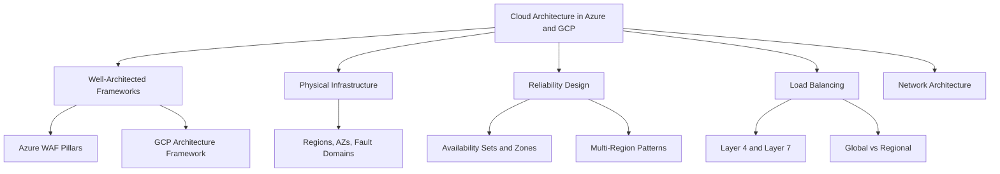
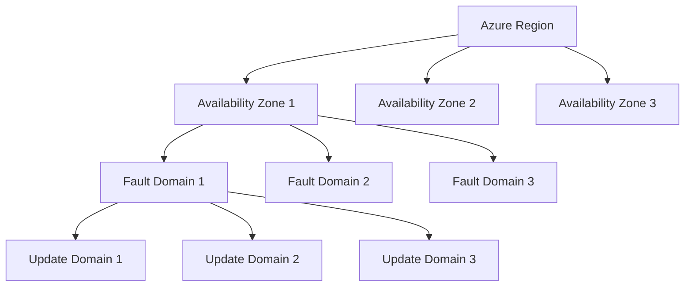
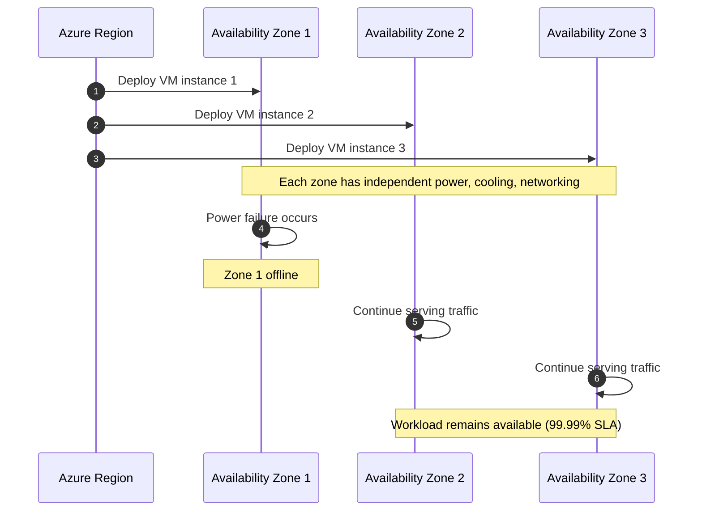
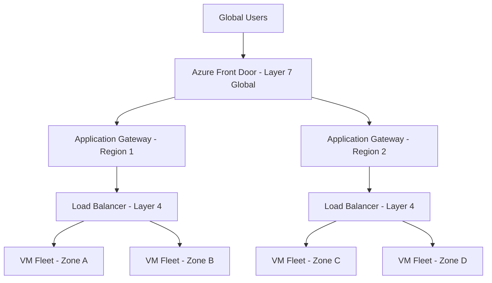
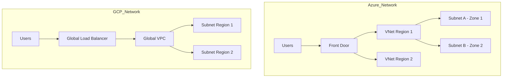

# Lesson 4: Cloud Architecture in Azure & GCP

This lesson compares Azure and Google Cloud Platform architecture design. It covers the Well-Architected Frameworks of each provider, physical infrastructure organization, reliability mechanisms, load balancing services, and network design. Azure and GCP share common architectural goals but implement them with different service names, availability guarantees, and design patterns.

## Azure Well-Architected Framework

*Definition*: The Azure Well-Architected Framework promotes architectural excellence at the foundational level of a workload. It provides a structured way to evaluate and improve cloud workloads across five core pillars, with sustainability as an emerging sixth.

### The Five Pillars

| Pillar | Workload Concern | Design Focus |
|---|---|---|
| Reliability | Resilience, availability, recovery | Design for business requirements, resilience, recovery, and operations while keeping it simple |
| Security | Data protection, threat detection, risk mitigation | Protect confidentiality, integrity, and availability |
| Cost Optimization | Cost modeling, budgets, waste reduction | Optimize usage and utilization while maintaining cost efficiency |
| Operational Excellence | Holistic observability, DevOps practices | Optimize operations with standards, comprehensive monitoring, and safe deployment |
| Performance Efficiency | Scalability, load testing | Scale horizontally, test early and often, and monitor solution health |

- Effective architecture relies on making deliberate, documented trade-offs between pillars.
- A common trade-off is balancing the added cost of redundancy against business uptime requirements.
- The Azure Architecture Center provides reference architectures designed according to these design principles.

> [!Important]
> **Trade-offs are deliberate**: Every architectural decision involves balancing pillars. Document the trade-offs so future teams understand why specific choices were made.

## GCP Cloud Architecture Framework

*Definition*: The Google Cloud Well-Architected Framework provides guidance on designing, building, and operating reliable, secure, efficient, and cost-optimized workloads in Google Cloud. Familiarity with the framework is a key requirement for the Professional Cloud Architect role.

### The Framework Pillars

- Operational Excellence: Deploy, operate, monitor, and manage cloud workloads efficiently.
- Security, Privacy, and Compliance: Protect information, systems, and assets while meeting regulatory needs.
- Reliability: Ensure availability and fault tolerance under expected and unexpected conditions.
- Performance Optimization: Use computing resources efficiently to meet system requirements.
- Cost Optimization: Achieve resource efficiency and financial governance.
- Sustainability: Minimize environmental impact of cloud workloads.

The framework's pillars are implicitly and explicitly woven throughout the Professional Cloud Architect exam objectives and should guide architectural decisions.

> [!Tip]
> **Use the framework as a guiding principle**: The GCP framework pillars are not separate checklists. Apply them together when making design decisions for any workload.

## Physical Infrastructure Comparison

### Azure Regions, Availability Zones, and Fault Domains

- A Region is made up of one or more Availability Zones.
- Availability Zones are physically separate locations within each Azure region.
- Each Azure region is paired with another region within the same geography at least 300 miles away. This allows replication across a geography to reduce the likelihood of interruptions from natural disasters, civil unrest, power outages, or physical network outages.
- Fault domains (FD) are groups of racks that share a common power source and network switch. A failure within a fault domain affects the entire domain.
- Update domains (UD) are logical sections of a datacenter. Maintenance updates are sequenced through update domains to avoid taking the whole datacenter offline at once.

### GCP Regions and Zones

- A region refers to a specific geographical area where multiple zones exist.
- Zones are individual data centers within a region interconnected with low-latency links.
- A region typically comprises three or more zones, each playing a vital role in ensuring high availability and resilience.
- GCP offers six deployment archetypes: zonal, regional, multi-regional, global, hybrid, and multicloud.

| Archetype | Scope | Target Availability | Typical Use Case |
|---|---|---|---|
| Zonal | Single zone | Standard | Development and testing environments |
| Regional | Multiple zones in one region | 99.99% | Workloads needing resilience against zone outages |
| Multi-Regional | Two or more regions | 99.999% | Business-critical workloads and high availability applications |
| Global | Worldwide presence | Varies | Applications serving users across countries with low latency |

> [!Important]
> **Choose the right archetype**: The deployment archetype determines availability, cost, and operational complexity. A multi-regional architecture provides the highest availability but costs significantly more than a regional deployment.

## Reliability Design Comparison

### Azure Availability Options

| Option | Scope of Protection | SLA | Latency | Use Case |
|---|---|---|---|---|
| Availability Set | Rack-level within a datacenter | 99.95% | Very low | Regions without availability zones |
| Availability Zones | Datacenter-level within a region | 99.99% | Low | Mission-critical apps requiring high SLA |
| Region Pairs | Geographic territory | Varies | Mid to high | Disaster recovery across geographies |

- Availability sets distribute VMs across multiple fault domains to reduce correlated failures.
- Availability sets can have up to 3 fault domains and 20 update domains.
- Availability zones protect against datacenter-wide failures including power, networking, and cooling outages.
- Availability sets provide lower VM-to-VM latency than availability zones because VMs are placed in closer physical proximity.

### GCP Reliability Design

- Multi-zone deployment within a region provides resilience against zone outages.
- Multi-region deployment is ideal for business-critical workloads where high availability is essential.
- GCP provides infrastructure reliability building blocks at zone, region, and global scopes.
- Availability is measured as a percentage of uptime. For example, 99.99% availability allows no more than 8.64 seconds of downtime in a 24-hour period.
- Design services to avoid single points of failure, correlated failures, and cascading failures.

> [!Tip]
> **Design for failure at every level**: Avoid single points of failure, correlated failures, and cascading failures by distributing workloads across multiple zones or regions.

## Load Balancing Comparison

### Azure Load Balancing Services

| Service | Layer | Scope | Key Features |
|---|---|---|---|
| Azure Load Balancer | Layer 4 | Regional or global | High availability, low latency, zone-redundant endpoints |
| Application Gateway | Layer 7 | Regional | WAF, path-based routing, TLS termination, URL-based routing |
| Traffic Manager | DNS-based | Global | Geographic routing, priority routing, weighted routing |
| Azure Front Door | Layer 7 | Global | CDN, global routing, TLS offload, WAF, edge caching |

- Azure Front Door handles global HTTP load balancing and application acceleration with instant global failover.
- Application Gateway is optimized for backend application server farms and enhances security via WAF.
- Front Door provides built-in cross-region support, while Application Gateway is limited to specific regions.

### GCP Load Balancing Services

| Service | Scope | Backend Support | Key Features |
|---|---|---|---|
| Global External Application Load Balancer | Global | Multi-region | Uses GFEs distributed globally, Envoy proxy for advanced traffic management |
| Regional External Application Load Balancer | Regional | Single region | Standard tier, regional backends |
| External Proxy Network Load Balancer | Global or regional | Multi-region or single region | TCP or SSL traffic, single IP for global users |
| Internal TCP/UDP Load Balancer | Regional | Single region | Internal traffic balancing |

- A global load balancer supports backends in multiple regions, while a regional load balancer supports backends in a single region.
- Global load balancers use Google Front Ends (GFEs) distributed across more than 80 distinct locations worldwide.
- External proxy Network Load Balancers terminate TCP or SSL traffic at the load balancer and forward to the closest available backend.

> [!Important]
> **Global versus regional matters**: Global load balancers provide lower latency for worldwide users by routing to the nearest point of presence. Regional load balancers are simpler and more cost-effective for single-region workloads.

## Network Architecture Comparison

### Azure Network Design

- Azure regions are paired within the same geography to enable replication and disaster recovery.
- Virtual networks (VNets) provide isolation and segmentation.
- Azure Front Door serves as the global entry point for internet-facing applications.

### GCP Network Design

- GCP's global network uses a premium tier that routes traffic over Google's private fiber backbone.
- VPC networks are global resources, spanning multiple regions.
- Cloud Load Balancing integrates with the global network to route traffic to the closest healthy backend.

| Dimension | Azure | GCP |
|---|---|---|
| Regional pairing | Automatic region pairs within geography | No automatic pairing; choose regions manually |
| Global network | Front Door for global HTTP delivery | Global VPC and global load balancing by default |
| Zone count per region | Typically 3 availability zones | Typically 3 or more zones |
| Network isolation | VNets, NSGs, Azure Firewall | VPCs, firewall rules, Cloud Armor |

## Key Takeaways

- Azure and GCP both organize their architecture guidance around well-architected frameworks with overlapping pillars: reliability, security, cost optimization, operational excellence, and performance.
- Azure groups infrastructure into regions, availability zones, fault domains, and update domains. GCP uses regions, zones, and deployment archetypes.
- Azure availability sets provide 99.95% SLA within a datacenter. Availability zones provide 99.99% SLA across datacenters. GCP multi-zone targets 99.99% and multi-region targets 99.999%.
- Azure load balancing spans Load Balancer (Layer 4), Application Gateway (Layer 7 regional), Traffic Manager (DNS), and Front Door (Layer 7 global).
- GCP load balancing distinguishes between global and regional services, with global load balancers using GFEs distributed across more than 80 locations.
- Azure pairs regions automatically for disaster recovery. GCP requires manual region selection but provides a global VPC by default.
- Both providers emphasize avoiding single points of failure, correlated failures, and cascading failures.
- Design decisions require documented trade-offs between availability, cost, and operational complexity.

> [!Important]
> **Match architecture to requirements**: Select the deployment archetype and availability option that meets business needs without over-engineering. A regional multi-zone architecture handles most workloads, while multi-region active-active designs are reserved for the most critical systems.
