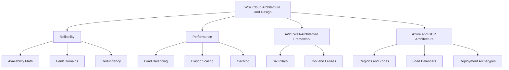

# Migration in progress
# Lesson 5: Summary and Assessment

*The README content is not attached. This summary and assessment synthesizes the W02 lessons covered in this thread.*

W02 Cloud Architecture & Design covers reliability, performance, AWS Well-Architected Framework, and Azure and GCP architecture. It emphasizes availability math, fault domains, load balancing, elasticity, caching, and framework-driven trade-offs. The lesson prepares you to evaluate cloud designs against business requirements.

## Reliability Summary

- Availability is calculated as MTBF divided by MTBF plus MTTR.
- The nines define allowed downtime: 99.9% allows 8.77 hours per year, 99.99% allows 52.6 minutes, and 99.999% allows 5.26 minutes.
- Serial dependencies reduce composite availability. Parallel redundancy improves it.
- Fault domains include racks, Availability Zones, and Regions.
- Redundancy topologies include active-passive and active-active.

| Availability Level | Annual Downtime | Typical Scope |
|---|---|---|
| 99.0% | 87.6 hours | Single-AZ non-redundant |
| 99.9% | 8.77 hours | Basic multi-instance |
| 99.99% | 52.6 minutes | Multi-AZ redundant |
| 99.999% | 5.26 minutes | Multi-region active-active |

> [!Important]
> **Serial dependencies reduce total availability**: Chaining three services at 99.9% each drops composite availability to 99.7%, allowing over 26 hours of annual downtime.

## Performance Summary

- Layer 4 load balancers route TCP and UDP with ultra-low latency.
- Layer 7 load balancers inspect HTTP and route by path, host, or header.
- Health checks confirm instance health. Deep checks verify downstream dependencies.
- Stateless compute tiers store session state in distributed caches.
- Horizontal scaling adds instances. Vertical scaling adds resources to one instance.
- Auto-scaling policies include target tracking, step scaling, scheduled scaling, and predictive scaling.
- Caching strategies include cache-aside, write-through, and write-behind.
- Read replicas, connection pooling, and edge CDNs reduce latency and database load.

| Dimension | Layer 4 | Layer 7 |
|---|---|---|
| OSI Layer | Transport | Application |
| Routing | IP, port, protocol | URL, host, header |
| Latency | Ultra-low | Low |
| Use Case | Gaming, finance, raw sockets | Microservices, APIs, web apps |

> [!Tip]
> **Avoid cascading deep health check failures**: Configure deep health checks to return warnings instead of hard failures when downstream dependencies degrade, or a minor database slowdown can trigger fleet-wide terminations.

## Framework Summary

| Provider | Framework | Pillars |
|---|---|---|
| AWS | Well-Architected Framework | Operational Excellence, Security, Reliability, Performance Efficiency, Cost Optimization, Sustainability |
| Azure | Azure Well-Architected Framework | Reliability, Security, Cost Optimization, Operational Excellence, Performance Efficiency |
| GCP | Google Cloud Well-Architected Framework | Operational Excellence, Security Privacy and Compliance, Reliability, Performance Optimization, Cost Optimization, Sustainability |

- AWS organizes reviews through the Well-Architected Tool.
- Azure provides the Azure Architecture Center with reference architectures.
- GCP integrates framework pillars into the Professional Cloud Architect exam objectives.
- All three frameworks emphasize documented trade-offs between availability, cost, security, and operational complexity.

> [!Important]
> **Security and operational excellence are usually not traded off**: These pillars protect the business and should not be weakened for short-term cost or speed gains.

## Deployment Archetypes

| Archetype | Scope | Target Availability |