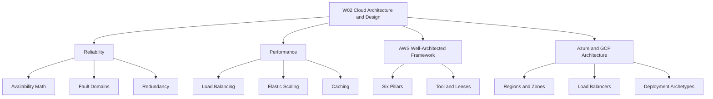
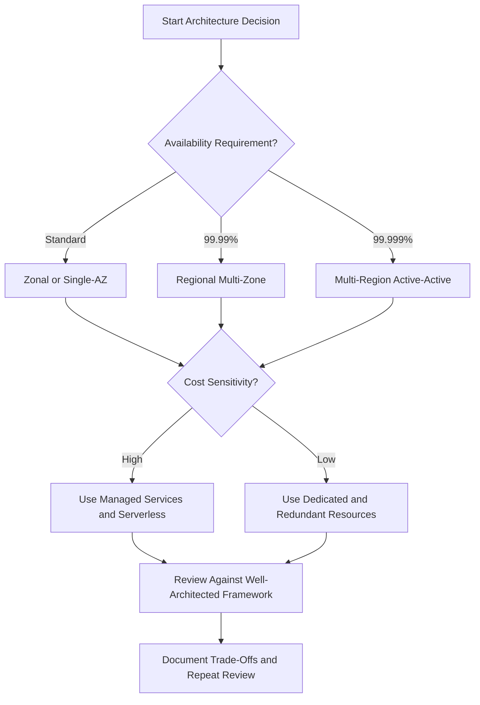

# Lesson 5: Summary and Assessment

*The README content is not attached. This summary and assessment synthesizes the W02 lessons covered in this thread.*

W02 Cloud Architecture & Design covers reliability, performance, AWS Well-Architected Framework, and Azure and GCP architecture. It emphasizes availability math, fault domains, load balancing, elasticity, caching, and framework-driven trade-offs. The lesson prepares you to evaluate cloud designs against business requirements.

## Reliability Summary

- Availability is calculated as MTBF divided by MTBF plus MTTR.
- The nines define allowed downtime: 99.9% allows 8.77 hours per year, 99.99% allows 52.6 minutes, and 99.999% allows 5.26 minutes.
- Serial dependencies reduce composite availability. Parallel redundancy improves it.
- Fault domains include racks, Availability Zones, and Regions.
- Redundancy topologies include active-passive and active-active.

| Availability Level | Annual Downtime | Typical Scope |
|---|---|---|
| 99.0% | 87.6 hours | Single-AZ non-redundant |
| 99.9% | 8.77 hours | Basic multi-instance |
| 99.99% | 52.6 minutes | Multi-AZ redundant |
| 99.999% | 5.26 minutes | Multi-region active-active |

> [!Important]
> **Serial dependencies reduce total availability**: Chaining three services at 99.9% each drops composite availability to 99.7%, allowing over 26 hours of annual downtime.

## Performance Summary

- Layer 4 load balancers route TCP and UDP with ultra-low latency.
- Layer 7 load balancers inspect HTTP and route by path, host, or header.
- Health checks confirm instance health. Deep checks verify downstream dependencies.
- Stateless compute tiers store session state in distributed caches.
- Horizontal scaling adds instances. Vertical scaling adds resources to one instance.
- Auto-scaling policies include target tracking, step scaling, scheduled scaling, and predictive scaling.
- Caching strategies include cache-aside, write-through, and write-behind.
- Read replicas, connection pooling, and edge CDNs reduce latency and database load.

| Dimension | Layer 4 | Layer 7 |
|---|---|---|
| OSI Layer | Transport | Application |
| Routing | IP, port, protocol | URL, host, header |
| Latency | Ultra-low | Low |
| Use Case | Gaming, finance, raw sockets | Microservices, APIs, web apps |

> [!Tip]
> **Avoid cascading deep health check failures**: Configure deep health checks to return warnings instead of hard failures when downstream dependencies degrade, or a minor database slowdown can trigger fleet-wide terminations.

## Framework Summary

| Provider | Framework | Pillars |
|---|---|---|
| AWS | Well-Architected Framework | Operational Excellence, Security, Reliability, Performance Efficiency, Cost Optimization, Sustainability |
| Azure | Azure Well-Architected Framework | Reliability, Security, Cost Optimization, Operational Excellence, Performance Efficiency |
| GCP | Google Cloud Well-Architected Framework | Operational Excellence, Security Privacy and Compliance, Reliability, Performance Optimization, Cost Optimization, Sustainability |

- AWS organizes reviews through the Well-Architected Tool.
- Azure provides the Azure Architecture Center with reference architectures.
- GCP integrates framework pillars into the Professional Cloud Architect exam objectives.
- All three frameworks emphasize documented trade-offs between availability, cost, security, and operational complexity.

> [!Important]
> **Security and operational excellence are usually not traded off**: These pillars protect the business and should not be weakened for short-term cost or speed gains.

## Deployment Archetypes

| Archetype | Scope | Target Availability | Typical Use Case |
|---|---|---|---|
| Zonal | Single zone | Standard | Development and testing |
| Regional | Multiple zones in one region | 99.99% | Business workloads needing zone resilience |
| Multi-Regional | Two or more regions | 99.999% | Business-critical and high availability workloads |
| Global | Worldwide presence | Varies | Low-latency global user access |

- Azure pairs regions automatically within the same geography.
- GCP requires manual region selection but provides a global VPC by default.
- Azure availability sets provide 99.95% SLA within a datacenter.
- Azure availability zones provide 99.99% SLA across datacenters.
- GCP multi-zone targets 99.99% and multi-region targets 99.999%.

> [!Tip]
> **Match architecture to requirements**: Select the deployment archetype that meets business needs without over-engineering. A regional multi-zone design handles most workloads.

## Assessment Preparation

### Practice Questions

1. Explain how serial dependencies affect composite availability.
2. Compare Layer 4 and Layer 7 load balancing.
3. Describe when to use Azure availability sets versus availability zones.
4. Explain the difference between GCP global and regional load balancers.
5. List the six pillars of the AWS Well-Architected Framework.
6. Describe how cache-aside differs from write-through caching.
7. Explain why sticky sessions harm horizontal scalability.
8. Compare active-passive and active-active redundancy topologies.

### Scenario Questions

**Scenario 1: Flash Sale**
An e-commerce platform expects a sudden traffic spike during a flash sale. Design a scaling and caching strategy.

- Use target tracking or step scaling to add compute instances quickly.
- Deploy a CDN for static assets and product images.
- Use cache-aside with TTLs for product catalog data.
- Use read replicas for read-heavy queries.
- Configure asymmetric scaling: aggressive scale-out and conservative scale-in.

**Scenario 2: Multi-Region Choice**
A financial services application requires 99.999% availability. Choose a deployment archetype.

- Use multi-region active-active.
- Replicate data across regions with conflict resolution.
- Use global load balancing to route users to the nearest healthy region.
- Accept higher cost and operational complexity.

**Scenario 3: Security and Cost Trade-Off**
A startup wants to minimize cost while protecting customer data. Balance security and cost.

- Use managed services for encryption and identity.
- Apply least privilege and centralized identity management.
- Use serverless or managed compute to avoid undifferentiated heavy lifting.
- Document the trade-off between cost and security controls.

## Key Takeaways

- Cloud architecture balances reliability, performance, security, cost, and sustainability.
- Availability is measured with MTBF and MTTR. The nines define allowed downtime.
- Serial dependencies reduce availability. Parallel redundancy improves it.
- Fault domains include racks, Availability Zones, and Regions.
- Load balancing, health checks, stateless design, and auto-scaling improve performance and resilience.
- Caching, read replicas, connection pooling, and edge delivery reduce latency and database load.
- AWS, Azure, and GCP organize architecture guidance around similar pillars.
- Deployment archetypes range from zonal to multi-regional to global.
- Reviews are blameless and aim at continuous improvement.
- Security and operational excellence are foundational and should not be traded away.

> [!Important]
> **Architecture is iterative**: Use the Well-Architected Framework regularly, test failure with game days, and let metrics drive improvements across every pillar.
