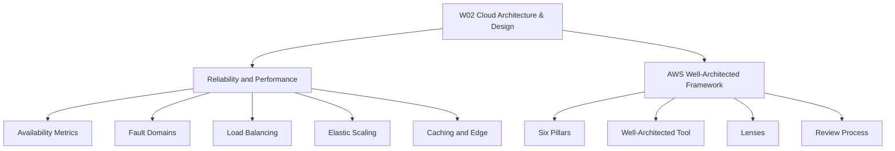
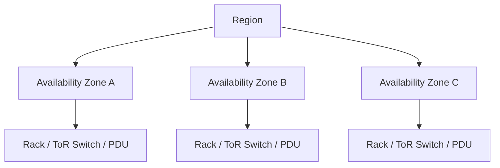
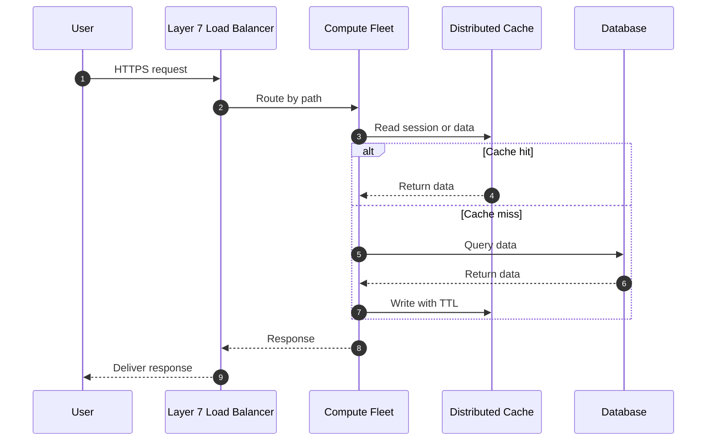

# Migration in progress
# W02: Cloud Architecture & Design

This week connects reliability and performance engineering with the AWS Well-Architected Framework. It covers availability math, fault domains, load balancing, elasticity, caching, the six pillars, lenses, and the review process. The goal is to design cloud workloads that stay correct, fast, secure, cost-aware, and sustainable.

## Designing for Reliability

*Definition*: Reliability is the ability of a workload to perform its intended function correctly and consistently when expected.

- Availability = MTBF / (MTBF + MTTR) * 100%.
- The nines: 99.9% allows 8.77 hours downtime per year; 99.99% allows 52.6 minutes; 99.999% allows 5.26 minutes.
- Serial dependencies reduce composite availability.
- Parallel redundancy improves availability.
- Fault domains: racks, Availability Zones, Regions.
- Redundancy topologies: active-passive and active-active.

> [!Important]
> **Serial dependencies reduce total availability**: Chaining three services at 99.9% each drops composite availability to 99.7%, allowing over 26 hours of annual downtime.

### Fault Domains and Blast Radius

- Racks and chassis share power and top-of-rack switches.
- Availability Zones have isolated power, cooling, and flood planes.
- Regions are geographically isolated and connected by low-latency fiber.

> [!Tip]
> **Contain blast radius**: Partition workloads across multiple Availability Zones so a single power or network failure cannot take down the whole system.

## Designing for Performance

*Definition*: Performance efficiency is the ability to use computing resources efficiently to meet system requirements as demand changes.

- Load balancing distributes traffic and isolates unhealthy nodes.
- Layer 4 load balancers route TCP and UDP with ultra-low latency.
- Layer 7 load balancers inspect HTTP and route by path, host, or header.
- Health checks: shallow checks confirm a process is alive; deep checks verify downstream dependencies.
- Avoid sticky sessions. Store session state in distributed caches.
- Horizontal scaling adds instances; vertical scaling adds resources to one instance.
- Auto-scaling policies: target tracking, step scaling, scheduled and predictive scaling.
- Cooldowns and hysteresis prevent flapping.

> [!Important]
> **Asymmetric scaling preserves stability**: Scale out aggressively on spikes, but scale in slowly after sustained idle periods to avoid terminating capacity during temporary dips.

### Caching and Low-Latency Delivery

- Cache-aside: read from cache first, on miss read from database and write to cache with TTL.
- Write-through: write to cache and database together.
- Write-behind: write to cache, asynchronously flush to database.
- Cache stampede: many requests hit the database when a hot key expires.
- Mitigations: mutex locks, probabilistic early expiration, jittered TTLs.
- Read replicas offload read-heavy queries.
- Connection pooling reuses database connections.
- Edge CDNs and anycast route users to nearby points of presence.

> [!Tip]
> **Always enforce cache TTLs**: Never deploy cache entries without explicit expiration, or stale data and memory exhaustion will follow.

## AWS Well-Architected Framework

*Definition*: A set of b