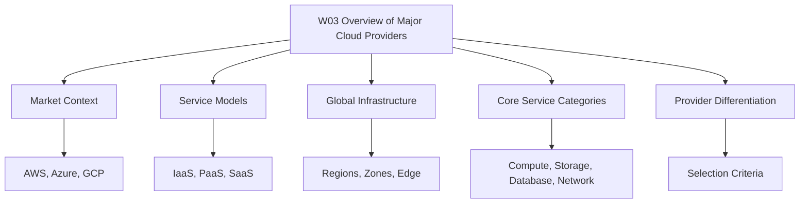

# Migration in progress
## W03: Overview of Major Cloud Providers - Lesson 0: Module Introduction

The module introduces the three major cloud providers: AWS, Azure, and GCP. It builds a provider-neutral mental model for comparing market position, service models, global infrastructure, and core service categories. The goal is to make informed architectural choices based on workload requirements, team skills, and business constraints.

**Module Purpose**

- Establish a common vocabulary for cloud providers.
- Compare AWS, Azure, and GCP across market share, growth, and strengths.
- Explain the three cloud service models: IaaS, PaaS, and SaaS.
- Describe how each provider organizes global infrastructure.
- Map core service categories across providers.
- Prepare for scenario-based assessment questions.

**Learning Objectives**

- Describe the market position and primary strengths of AWS, Azure, and GCP.
- Differentiate IaaS, PaaS, and SaaS with provider examples.
- Compare global infrastructure models across the three providers.
- Map equivalent compute, storage, database, and networking services.
- Evaluate provider fit for common enterprise and startup scenarios.
- Explain how provider selection depends on context, not feature checklists alone.

> [!Tip]
> **Start with concepts**: Learn provider-neutral concepts first, then map service names. This approach makes knowledge portable across AWS, Azure, and GCP.

**Module Structure**

- Lesson 0 introduces the module scope and objectives.
- Later lessons cover each provider in detail.
- Comparative lessons map services and architectural patterns.
- Assessment lessons test scenario-based decision making.
- The module builds on W02 architecture and design principles.

**Core Concepts Preview**

| Provider | Market Position | Primary Strength |
|---|---|---|
| AWS | Market leader | Service breadth and ecosystem maturity |
| Azure | Strong second | Enterprise integration and hybrid cloud |
| GCP | Fastest growing | Data, analytics, Kubernetes, and AI |

| Service Model | Provider Manages | Customer Manages |
|---|---|---|
| IaaS | Hardware, virtualization, networking | OS, runtime, apps, data |
| PaaS | Hardware, OS, runtime, middleware | Apps and data |
| SaaS | Entire stack | User configuration only |

> [!Important]
> **Provider selection is contextual**: 