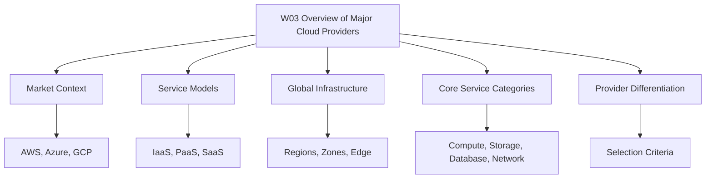

## W03: Overview of Major Cloud Providers - Lesson 0: Module Introduction

The module introduces the three major cloud providers: AWS, Azure, and GCP. It builds a provider-neutral mental model for comparing market position, service models, global infrastructure, and core service categories. The goal is to make informed architectural choices based on workload requirements, team skills, and business constraints.

**Module Purpose**

- Establish a common vocabulary for cloud providers.
- Compare AWS, Azure, and GCP across market share, growth, and strengths.
- Explain the three cloud service models: IaaS, PaaS, and SaaS.
- Describe how each provider organizes global infrastructure.
- Map core service categories across providers.
- Prepare for scenario-based assessment questions.

**Learning Objectives**

- Describe the market position and primary strengths of AWS, Azure, and GCP.
- Differentiate IaaS, PaaS, and SaaS with provider examples.
- Compare global infrastructure models across the three providers.
- Map equivalent compute, storage, database, and networking services.
- Evaluate provider fit for common enterprise and startup scenarios.
- Explain how provider selection depends on context, not feature checklists alone.

> [!Tip]
> **Start with concepts**: Learn provider-neutral concepts first, then map service names. This approach makes knowledge portable across AWS, Azure, and GCP.

**Module Structure**

- Lesson 0 introduces the module scope and objectives.
- Later lessons cover each provider in detail.
- Comparative lessons map services and architectural patterns.
- Assessment lessons test scenario-based decision making.
- The module builds on W02 architecture and design principles.

**Core Concepts Preview**

| Provider | Market Position | Primary Strength |
|---|---|---|
| AWS | Market leader | Service breadth and ecosystem maturity |
| Azure | Strong second | Enterprise integration and hybrid cloud |
| GCP | Fastest growing | Data, analytics, Kubernetes, and AI |

| Service Model | Provider Manages | Customer Manages |
|---|---|---|
| IaaS | Hardware, virtualization, networking | OS, runtime, apps, data |
| PaaS | Hardware, OS, runtime, middleware | Apps and data |
| SaaS | Entire stack | User configuration only |

> [!Important]
> **Provider selection is contextual**: No single provider wins every category. Choose based on team skills, compliance needs, existing contracts, and workload requirements.

**How This Module Connects to W02**

- W02 covers reliability, performance, and well-architected frameworks.
- W03 adds provider-specific context for AWS, Azure, and GCP.
- W02 principles apply across all providers.
- W03 service knowledge makes those principles actionable.
- Together they support architecture decisions and assessment scenarios.

**Assessment Preparation**

Practice Questions

1. Explain the difference between IaaS, PaaS, and SaaS with examples.
2. Compare AWS, Azure, and GCP global infrastructure.
3. Map equivalent compute and storage services across providers.
4. Describe when to choose each provider for a given workload.
5. Explain why provider selection is not based on features alone.

Scenario Questions

**Scenario 1: Enterprise Microsoft Environment**
A company uses Windows Server, Active Directory, and Microsoft 365. Which provider reduces friction?

- Azure integrates natively with Entra ID, Windows Server, and Microsoft 365.
- Hybrid licensing benefits reduce cost for existing Microsoft workloads.
- Azure Policy and management groups provide centralized governance.

**Scenario 2: Data and AI Startup**
A startup needs managed Kubernetes, serverless analytics, and ML training. Which provider aligns best?

- GCP offers GKE, BigQuery, and Vertex AI.
- GCP's private network backbone reduces latency for global data access.
- Cost-effective pricing supports data-heavy workloads.

**Scenario 3: Multi-Cloud Strategy**
An organization wants to avoid vendor lock-in. How should they approach this?

- Standardize on Kubernetes and Terraform for portability.
- Use provider-neutral services where possible.
- Accept that deep integration features vary and plan abstraction layers.

**Key Takeaways**

- AWS, Azure, and GCP dominate global cloud infrastructure spending.
- AWS leads in market share, Azure in enterprise integration, and GCP in growth rate and data/AI.
- Cloud services follow three models: IaaS, PaaS, and SaaS.
- Global infrastructure is organized into regions, zones, and edge locations.
- Core service categories map across providers with different names.
- Provider selection depends on team skills, compliance, contracts, and workload needs.
- W03 builds on W02 by adding provider-specific context to architecture principles.
- Assessment focuses on comparison and scenario-based decision making.

> [!Important]
> **Learn the concepts, not just the service names**: Core cloud concepts stay consistent across providers. Mastering them lets you transfer knowledge and make sound architectural decisions independent of vendor marketing.
