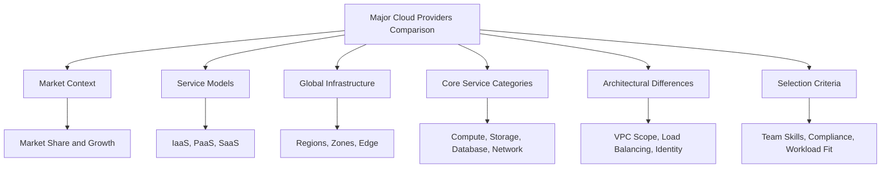
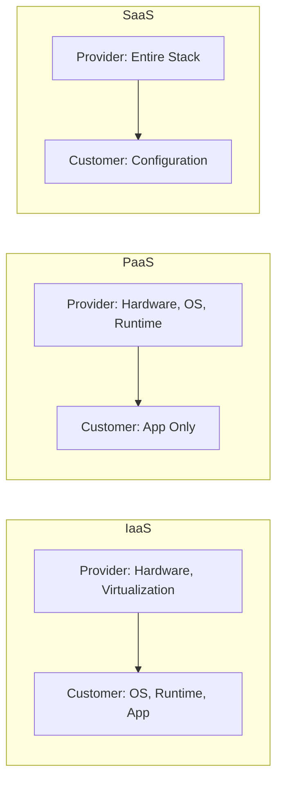
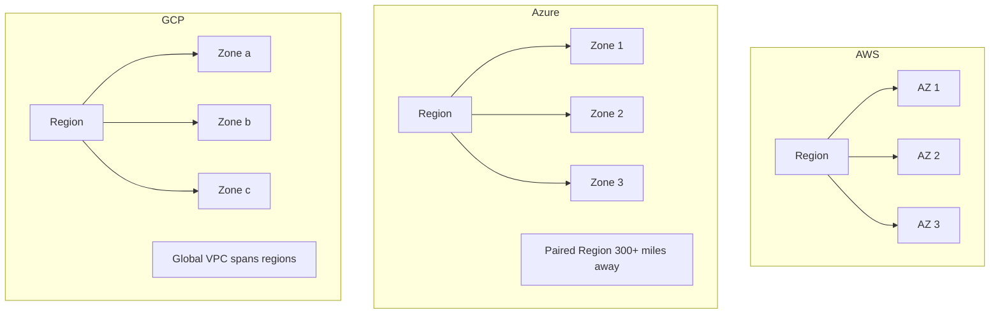

# Migration in progress
# Lesson 1: Comparison

This lesson compares AWS, Azure, and GCP across market position, service models, global infrastructure, core service categories, and architectural differences. The functional gap between providers has largely closed; the difference now lies in philosophy and operational fit. AWS favors autonomy and breadth, Azure reinforces enterprise governance and integration, and GCP optimizes for data, machine learning, and efficiency.



## Market Context

Global cloud infrastructure spending reached $110.9 billion in Q4 2025, a 29% year-on-year increase. The three hyperscalers collectively hold 66% of the market.

| Provider | Q4 2025 Market Share | Year-over-Year Growth | Total Backlog | Primary Strength |
|---|---|---|---|---|
| AWS | 32% | 24% | $244 billion | Service breadth and ecosystem maturity |
| Azure | 22% | 39% | Not disclosed | Enterprise integration and Microsoft ecosystem |
| GCP | 12% | 50% | $240 billion | Data, analytics, Kubernetes, and AI |

- AWS launched in 2006 and remains the market leader with the broadest service catalog.
- Azure launched in 2010, leveraging Microsoft's enterprise footprint.
- GCP launched in 2011, building on Google's strengths in search, data, and machine learning.
- GCP recorded the fastest growth at 50%, increasing its market share to 12%.
- AWS ended Q4 2025 with a backlog of $244 billion, underscoring sustained demand.

> [!Important]
> **Market share is not the only metric**: Growth rates tell a different story. GCP and Azure are growing faster than AWS in percentage terms, which matters for long-term platform viability and talent availability.

## Cloud Service Models

Cloud services follow three fundamental models based on how much of the stack the provider manages versus the customer.

| Model | Provider Manages | Customer Manages | AWS Example | Azure Example | GCP Example |
|---|---|---|---|---|---|
| IaaS | Hardware, virtualization, networking | OS, runtime, apps, data | EC2 | Virtual Machines | Compute Engine |
| PaaS | Hardware, OS, runtime, middleware | Apps and data | Elastic Beanstalk | App Service | App Engine |
| SaaS | Entire stack including application | User configuration only | WorkMail | Microsoft 365 | Google Workspace |

- IaaS gives the most control but requires the most operational responsibility.
- PaaS removes server management so teams focus on application code.
- SaaS delivers ready-to-use software with minimal operational overhead.
- All three providers offer services across all three models.



> [!Tip]
> **Choose the model that matches your team's capacity**: IaaS makes sense when you need full control. PaaS accelerates delivery when you want to avoid infrastructure work. SaaS eliminates operational burden entirely.

## Global Infrastructure

All three providers organize physical infrastructure into regions, availability zones, and edge locations.

| Dimension | AWS | Azure | GCP |
|---|---|---|---|
| Regions | 34 regions | 60+ regions | 40 regions |
| Availability Zones | 108 zones | 300+ zones | 121 zones |
| Edge Locations | 750+ CloudFront PoPs | 300+ datacenters | ~202 edge PoPs |
| Region Pairing | No automatic pairing | Automatic region pairs within geography | No automatic pairing |
| Total Services | 240+ | 200+ | 150+ |

- Azure provides the highest regional density of the hyperscalers, allowing businesses to place data centers closer to specific localized user bases.
- AWS operates the largest number of availability zones and edge locations.
- GCP's private fiber backbone routes traffic globally without traversing the public internet.



> [!Important]
> **Availability Zones are the unit of resilience**: Deploying across multiple zones within a region protects against datacenter-level failures including power, cooling, and networking outages.

## Core Service Categories

Cloud services map across four fundamental domains: compute, storage, databases, and networking.

### Compute Services

| Capability | AWS | Azure | GCP |
|---|---|---|---|
| Virtual Machines | EC2 (750+ types) | Virtual Machines (700+) | Compute Engine (400+) |
| Managed Kubernetes | EKS | AKS | GKE (market leader) |
| Serverless Functions | Lambda | Azure Functions | Cloud Functions / Cloud Run |
| App Platform (PaaS) | Elastic Beanstalk | App Service | App Engine |
| ARM-based Instances | Graviton4 | Ampere Altra / Cobalt 100 | Tau T2A |
| Spot/Preemptible Discount | Up to 90% | Up to 90% | Up to 91% |

- AWS offers the broadest range of compute options, from bare metal to serverless.
- GKE is widely regarded as the leading managed Kubernetes service.
- Azure integrates tightly with Windows Server and Active Directory for enterprise workloads.

### Storage Services

| Capability | AWS | Azure | GCP |
|---|---|---|---|
| Object Storage | S3 (industry standard) | Blob Storage | Cloud Storage |
| Block Storage | EBS | Managed Disks | Persistent Disk |
| File Storage | EFS / FSx | Azure Files / NetApp | Filestore |
| Archive Tier (per GB/month) | $0.0036 (Glacier Deep) | $0.002 (Archive) | $0.0012 (Archive) |
| Data Transfer Out (per GB) | $0.09 | $0.087 | $0.12 |

- GCP offers the lowest archive storage pricing at $0.0012 per GB per month.
- AWS S3 is the industry standard for object storage with the most mature ecosystem.
- Azure provides strong hybrid storage options through Azure Stack.

### Database Services

| Capability | AWS | Azure | GCP |
|---|---|---|---|
| Managed Relational | RDS / Aurora | Azure SQL / SQL MI | Cloud SQL / AlloyDB |
| NoSQL Document | DynamoDB | Cosmos DB | Firestore |
| NoSQL Wide-Column | DynamoDB | Cosmos DB | Bigtable |
| In-Memory Cache | ElastiCache | Azure Cache for Redis | Memorystore |
| Data Warehouse | Redshift | Synapse Analytics | BigQuery (best-in-class) |
| Cloud-Native SQL | Aurora (MySQL/PostgreSQL) | Cosmos DB (relational) | Spanner (global) |

- GCP's BigQuery is widely considered best-in-class for serverless analytics.
- Azure Cosmos DB supports multiple data models with global distribution.
- AWS Aurora provides MySQL and PostgreSQL compatibility with cloud-native performance.

### Networking Services

| Capability | AWS | Azure | GCP |
|---|---|---|---|
| Virtual Network | VPC (regional) | VNet (regional) | VPC (global) |
| Load Balancing (L4) | Network Load Balancer | Azure Load Balancer | Network Load Balancer |
| Load Balancing (L7) | Application Load Balancer | Application Gateway | HTTP(S) Load Balancer |
| CDN | CloudFront | Azure CDN / Front Door | Cloud CDN |
| DNS | Route 53 | Azure DNS | Cloud DNS |
| Hybrid Connectivity | Direct Connect | ExpressRoute | Cloud Interconnect |

- VPCs provide network isolation and segmentation for cloud resources.
- Load balancers distribute traffic across compute instances for availability and scale.
- CDNs cache content at edge locations to reduce latency for global users.

```merma