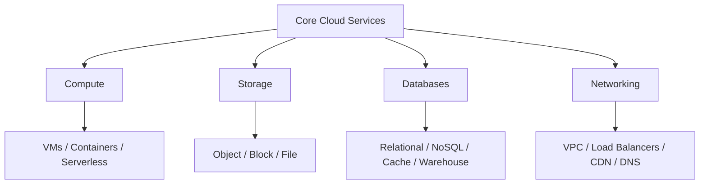
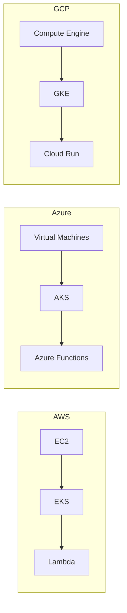
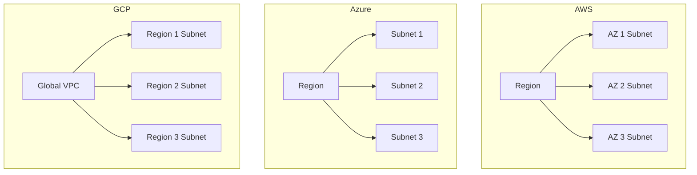
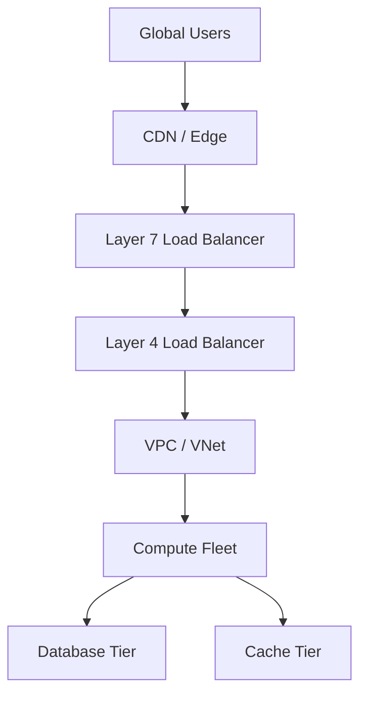

# Lesson 2: Core Services

Every cloud provider delivers the same fundamental building blocks: compute, storage, databases, and networking. AWS, Azure, and GCP map these domains to different service names and operational models. The functional gap between providers has largely closed, but architectural differences remain in areas like network scope, database design, and instance flexibility.

## Compute Services

Compute services run workloads across three primary models: virtual machines, managed containers, and serverless functions. AWS offers the widest instance variety. Azure integrates deeply with Windows and Active Directory. GCP provides live migration and custom machine types.

### Service Mapping

| Capability | AWS | Azure | GCP |
|---|---|---|---|
| Virtual Machines | EC2 | Virtual Machines | Compute Engine |
| Managed Kubernetes | EKS | AKS | GKE |
| Serverless Functions | Lambda | Azure Functions | Cloud Functions / Cloud Run |
| App Platform (PaaS) | Elastic Beanstalk | App Service | App Engine |
| ARM-based Instances | Graviton | Ampere Altra / Cobalt 100 | Tau T2A |

- EC2 offers the widest instance variety in the industry.
- Azure Virtual Machines provide deep Windows and Active Directory integration.
- Compute Engine supports live migration during host maintenance and custom machine types.
- GKE is widely regarded as the best-in-class managed Kubernetes service.
- Lambda is the most mature serverless platform with the largest ecosystem.
- Cloud Run is container-native serverless, distinct from function-only offerings.

> [!Tip]
> **Match compute model to workload**: Use VMs for lift-and-shift and custom OS needs. Use managed Kubernetes for microservices and portability. Use serverless for event-driven, intermittent workloads where you want zero infrastructure management.

## Storage Services

Storage services cover three patterns: object storage for files and media, block storage for VM disks, and file storage for shared network filesystems.

### Object Storage

| Feature | AWS S3 | Azure Blob Storage | GCP Cloud Storage |
|---|---|---|---|
| Hot Tier Price (per GB/month) | $0.023 | $0.018 | $0.020 |
| Archive Tier Price (per GB/month) | $0.004 (Glacier Deep) | $0.002 | $0.0012 |
| Max Object Size | 5 TB | 4.77 TB (block blob) | 5 TB |
| Durability | 99.999999999% (11 9s) | 99.999999999% | 99.999999999% |
| Unique Feature | S3 Intelligent-Tiering | Deep Microsoft integration | Single global namespace |

- S3 is the industry standard object store with the most mature ecosystem.
- Azure Blob Storage integrates seamlessly with Active Directory and the Microsoft ecosystem.
- GCP Cloud Storage offers the lowest archive pricing at $0.0012 per GB per month.
- All three providers offer 11 nines of durability for object storage.

### Block and File Storage

| Capability | AWS | Azure | GCP |
|---|---|---|---|
| Block Storage | EBS | Managed Disks | Persistent Disk |
| File Storage | EFS / FSx | Azure Files | Filestore |
| Shared Access | EFS supports NFS | Azure Files supports SMB/NFS | Filestore supports NFS |

- Block storage attaches to VMs for OS and application data.
- File storage provides managed network filesystems for shared access across instances.
- EFS scales automatically and supports NFS for Linux workloads.
- Azure Files supports both SMB and NFS protocols.

> [!Important]
> **Storage class selection drives cost**: Moving infrequently accessed data from hot to archive tiers can reduce storage costs by 80-95%. Design lifecycle policies from day one.

## Database Services

Database services split into relational (SQL), NoSQL, in-memory cache, and data warehouse categories. Each provider offers managed options across all four.

### Relational Databases

| Capability | AWS | Azure | GCP |
|---|---|---|---|
| Managed SQL | RDS | Azure SQL Database | Cloud SQL |
| Cloud-Native SQL | Aurora (MySQL/PostgreSQL compatible) | Azure SQL Managed Instance | AlloyDB / Spanner |
| Global Distribution | Aurora Global Database | Azure SQL geo-replication | Spanner (global) |

- RDS supports multiple engines including PostgreSQL, MySQL, and SQL Server.
- Aurora provides MySQL and PostgreSQL compatibility with cloud-native performance and up to 15 read replicas.
- Azure SQL Database offers Hyperscale scaling and elastic pools.
- Cloud SQL is best for OLTP workloads with many small transactions.

### NoSQL Databases

| Capability | AWS | Azure | GCP |
|---|---|---|---|
| Key-Value / Document | DynamoDB | Cosmos DB | Firestore |
| Wide-Column | DynamoDB | Cosmos DB | Bigtable |
| Multi-Model | DynamoDB | Cosmos DB (5 consistency levels) | Firestore / Bigtable |

- DynamoDB delivers sub-millisecond latency at any scale.
- Cosmos DB is a globally distributed, multi-model NoSQL database with five well-defined consistency levels.
- Firestore is a serverless document database for real-time mobile and web applications.
- Bigtable is a wide-column NoSQL database for time-series and telemetry at petabyte scale with sub-10ms latency.

### Data Warehouses

| Capability | AWS | Azure | GCP |
|---|---|---|---|
| Data Warehouse | Redshift | Synapse Analytics | BigQuery |
| Serverless Analytics | Athena | Synapse Serverless | BigQuery (serverless) |
| Key Differentiator | Integration with AWS data services | Unified analytics with Power BI | Separates storage from compute |

- BigQuery is widely considered best-in-class for serverless analytics and separates storage from compute.
- Redshift integrates tightly with S3, Glue, and the broader AWS data ecosystem.
- Synapse Analytics unifies data integration, warehousing, and big data analytics.

> [!Tip]
> **Choose database by access pattern**: Use relational databases for structured data with complex queries. Use key-value stores for high-throughput, low-latency lookups. Use wide-column stores for time-series and telemetry. Use data warehouses for analytical aggregation.

## Networking Services

Networking services provide isolation, traffic distribution, content delivery, and DNS resolution. The most significant architectural difference between providers is network scope.

### Virtual Network Comparison

| Dimension | AWS VPC | Azure VNet | GCP VPC |
|---|---|---|---|
| Scope | Regional | Regional | Global |
| Subnet Scope | One Availability Zone | Spans zones within region | Regional (spans zones) |
| Firewall Model | Security groups (stateful) + NACLs | NSGs (subnet or NIC) | VPC firewall rules by tag / service account |
| Cross-Region | VPC peering or Transit Gateway | VNet peering or Virtual WAN | No peering needed (global VPC) |

- AWS VPCs are regional with per-AZ subnets and per-resource security groups.
- Azure VNets are regional with subnet-level NSGs.
- GCP VPCs are global by default. One VPC spans every region with regional subnets and firewall rules.

> [!Important]
> **GCP global VPC is architecturally distinct**: Subnets in different regions sit in one VPC with private RFC1918 reachability and no peering. This simplifies multi-region design but creates a single blast radius for firewall and routing mistakes.

### Load Balancing, CDN, and DNS

| Capability | AWS | Azure | GCP |
|---|---|---|---|
| Load Balancing (L4) | Network Load Balancer | Azure Load Balancer | Network Load Balancer |
| Load Balancing (L7) | Application Load Balancer | Application Gateway | HTTP(S) Load Balancer |
| CDN | CloudFront | Azure Front Door | Cloud CDN |
| DNS | Route 53 | Azure DNS | Cloud DNS |
| Hybrid Connectivity | Direct Connect | ExpressRoute | Cloud Interconnect |

- Load balancers distribute traffic across compute instances for availability and scale.
- CDNs cache content at edge locations to reduce latency for global users.
- Route 53 is the industry standard for DNS with advanced routing policies.

> [!Tip]
> **Global versus regional matters**: Global load balancers provide lower latency for worldwide users by routing to the nearest point of presence. Regional load balancers are simpler and more cost-effective for single-region workloads.

## Assessment Preparation

### Practice Questions

1. Compare the compute service models across AWS, Azure, and GCP.
2. Explain the difference between object, block, and file storage with provider examples.
3. Describe how GCP's global VPC differs architecturally from AWS and Azure regional VPCs.
4. Compare DynamoDB, Cosmos DB, and Firestore as NoSQL options.
5. Explain when to use BigQuery versus Redshift versus Synapse Analytics.
6. Describe the pricing differences for object storage across the three providers.

### Scenario Questions

**Scenario 1: Global Web Application**
A company needs to serve users in North America, Europe, and Asia with low latency. Design the core services.

- Deploy compute in multiple regions across all three providers.
- Use a global CDN for static assets.
- Use a global load balancer to route users to the nearest region.
- Use a globally distributed database (Spanner or Cosmos DB) for user data.

**Scenario 2: Data Analytics Platform**
A startup needs to process terabytes of data with serverless analytics and ML training. Choose the provider.

- GCP offers BigQuery for serverless analytics and Vertex AI for ML.
- Cloud Storage provides a single global namespace for data.
- GKE supports containerized analytics workloads.

**Scenario 3: Enterprise Lift-and-Shift**
A company wants to migrate on-premises Windows Server workloads to the cloud with minimal changes. Choose the provider.

- Azure offers native Windows Server integration and Active Directory.
- Azure Virtual Machines support existing VM images and configurations.
- Azure SQL Database provides managed SQL Server compatibility.

## Key Takeaways

- Every cloud provider delivers compute, storage, database, and networking services, but with different names and operational models.
- AWS leads in compute instance variety and service breadth. Azure leads in enterprise integration. GCP leads in Kubernetes, data analytics, and global networking.
- Object storage is the foundation of cloud data management, with S3, Blob Storage, and Cloud Storage as the three options.
- Database selection should be driven by access patterns: relational for structured queries, key-value for high-throughput lookups, wide-column for time-series, and warehouses for analytics.
- GCP's global VPC spans all regions by default. AWS and Azure VPCs are regional and require peering for cross-region communication.
- All three providers offer robust load balancing, CDN, DNS, and hybrid connectivity options.
- BigQuery, GKE, and Cosmos DB are differentiated strengths that influence provider selection.
- Core service concepts transfer across providers. Learn the concepts, then map the service names.

> [!Important]
> **Core services are the foundation**: Mastering compute, storage, database, and networking services across providers lets you design architectures that meet requirements for performance, cost, and reliability regardless of the underlying platform.
