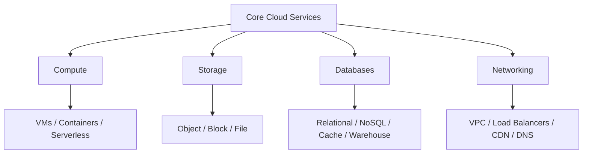
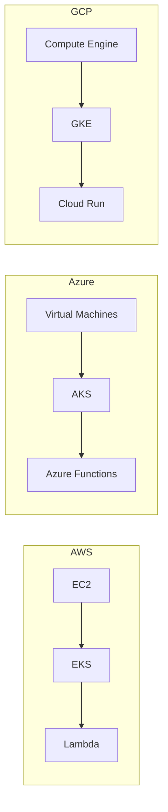

# Migration in progress
# Lesson 2: Core Services

Every cloud provider delivers the same fundamental building blocks: compute, storage, databases, and networking. AWS, Azure, and GCP map these domains to different service names and operational models. The functional gap between providers has largely closed, but architectural differences remain in areas like network scope, database design, and instance flexibility.

## Compute Services

Compute services run workloads across three primary models: virtual machines, managed containers, and serverless functions. AWS offers the widest instance variety. Azure integrates deeply with Windows and Active Directory. GCP provides live migration and custom machine types.

### Service Mapping

| Capability | AWS | Azure | GCP |
|---|---|---|---|
| Virtual Machines | EC2 | Virtual Machines | Compute Engine |
| Managed Kubernetes | EKS | AKS | GKE |
| Serverless Functions | Lambda | Azure Functions | Cloud Functions / Cloud Run |
| App Platform (PaaS) | Elastic Beanstalk | App Service | App Engine |
| ARM-based Instances | Graviton | Ampere Altra / Cobalt 100 | Tau T2A |

- EC2 offers the widest instance variety in the industry.
- Azure Virtual Machines provide deep Windows and Active Directory integration.
- Compute Engine supports live migration during host maintenance and custom machine types.
- GKE is widely regarded as the best-in-class managed Kubernetes service.
- Lambda is the most mature serverless platform with the largest ecosystem.
- Cloud Run is container-native serverless, distinct from function-only offerings.

> [!Tip]
> **Match compute model to workload**: Use VMs for lift-and-shift and custom OS needs. Use managed Kubernetes for microservices and portability. Use serverless for event-driven, intermittent workloads where you want zero infrastructure management.

## Storage Services

Storage services cover three patterns: object storage for files and media, block storage for VM disks, and file storage for shared network filesystems.

### Object Storage

| Feature | AWS S3 | Azure Blob Storage | GCP Cloud Storage |
|---|---|---|---|
| Hot Tier Price (per GB/month) | $0.023 | $0.018 | $0.020 |
| Archive Tier Price (per GB/month) | $0.004 (Glacier Deep) | $0.002 | $0.0012 |
| Max Object Size | 5 TB | 4.77 TB (block blob) | 5 TB |
| Durability | 99.999999999% (11 9s) | 99.999999999% | 99.999999999% |
| Unique Feature | S3 Intelligent-Tiering | Deep Microsoft integration | Single global namespace |

- S3 is the industry standard object store with the most mature ecosystem.
- Azure Blob Storage integrates seamlessly with Active Directory and the Microsoft ecosystem.
- GCP Cloud Storage offers the lowest archive pricing at $0.0012 per GB per month.
- All three providers offer 11 nines of durability for object storage.

### Block and File Storage

| Capability | AWS | Azure | GCP |
|---|---|---|---|
| Block Storage | EBS | Managed Disks | Persistent Disk |
| File Storage | EFS / FSx | Azure Files | Filestore |
| Shared Access | EFS supports NFS | Azure Files supports SMB/NFS | Filestore supports NFS |

- Block storage attaches to VMs for OS and application data.
- File storage provides managed network filesystems for shared access across instances.
- EFS scales automatically and supports NFS for Linux workloads.
- Azure Files supports both SMB and NFS protocols.

> [!Important]
> **Storage class selection drives cost**: Moving infrequently accessed data from hot to archive tiers can reduce storage costs by 80-95%. Design lifecycle policies from day one.

## Database Services

Database services split into relational (SQL), NoSQL, in-memory cache, and data warehouse categories. Each provider offers managed options across all four.

### Relational Databases

| Capability | AWS | Azure | GCP |
|---|---|---|---|
| Managed SQL | RDS | Azure SQL Database | Cloud SQL |
| Cloud-Native SQL | Aurora (MySQL/PostgreSQL compatible) | Azure SQL Managed Instance | AlloyDB / Spanner |
| Global Distribution | Aurora Global Database | Azure SQL geo-replication | Spanner (global) |

- RDS supports multiple engines including PostgreSQL, MySQL, and SQL Server.
- Aurora provides MySQL and PostgreSQL compatibility with cloud-native performance and up to 15 read replicas.
- Azure SQL Database offers Hyperscale scaling and elastic pools.
- Cloud SQL is best for OLTP workloads with many small transactions.

### NoSQL Databases

| Capability | AWS | Azure | GCP |
|---|---|---|---|
| Key-Value / Document | DynamoDB | Cosmos DB | Firestore |
| Wide-Column | DynamoDB | Cosmos DB | Bigtable |
| Multi-Model | DynamoDB | Cosmos DB (5 consistency levels) | Firestore / Bigtable |

- DynamoDB delivers sub-millisecond latency at any scale.
- Cosmos DB is a globally distributed, multi-model NoSQL database with five well-defined consistency levels.
- Firestore is a serverless document database for real-time mobile and web applications.
- Bigtable is a wide-column NoSQL database for time-series and telemetry at petabyte scale with sub-10ms latency.

### Data Warehouses

| Capability | AWS | Azure | GCP |
|---|---|---|---|
| Data Warehouse | Redshift | Synapse Analytics | BigQuery |
| Serverless Analytics | Athena | Synapse Serverless | BigQuery (serverless) |
| Key Differentiator | Integration with AWS data services | Unified analytics with Power BI | Separates storage from compute |

- BigQuery is widely considered best-in-class for serverless analytics and separates storage from compute.
- Redshift integrates tightly with S3, Glue, and the broader AWS data ecosyst