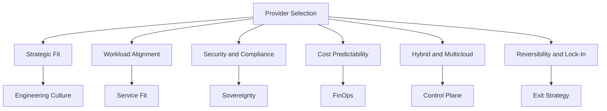
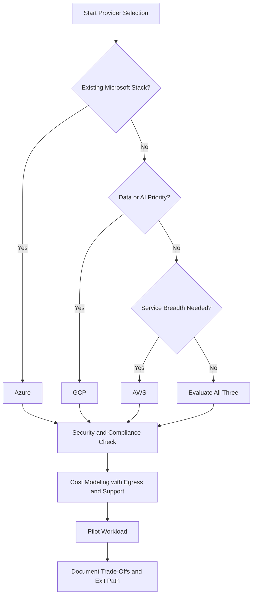

# Lesson 3: Selection Factors

Provider selection is a multi-dimensional decision that goes beyond feature checklists. The functional gap between AWS, Azure, and GCP has largely closed, so the real differentiators are operational fit, compliance posture, cost predictability, and reversibility. The right choice depends on your workload, team skills, pricing model, compliance needs, and long-term architecture.

## Strategic Fit and Reversibility

Cloud strategy today focuses on control, reversibility, and fit with your delivery model. The goal is to select a platform that proves compliance, supports forecastable spending, and adapts under shifting priorities. You want policies you can audit, budgets you can defend, and a path to change direction without rewriting your platform.

- AWS favors autonomy and breadth. Multi-account landing zones provide strong isolation for modular teams.
- Azure reinforces enterprise governance and integration. Entra ID, Azure Policy, and management groups provide central control.
- GCP optimizes for data, machine learning, and efficiency. Projects, labels, and reporting support platform engineering and FinOps.

> [!Important]
> **Fit matters more than features**: The functional capabilities of AWS, Azure, and GCP are largely equivalent for most workloads. Provider selection depends on engineering culture, team structure, and risk appetite, not feature checklists alone.

## Workload Alignment and Engineering Culture

Every provider runs enterprise workloads. What separates them is alignment with your engineering culture, team structure, and risk appetite. The right fit reduces friction, protects SLOs, and preserves reversibility.

| Dimension | AWS | Azure | GCP |
|---|---|---|---|
| Operating Model | Autonomy with multi-account isolation | Standardization with central governance | Data-led delivery with platform engineering |
| Compute Efficiency | Graviton ARM instances | Cobalt 100 ARM-based VMs | TPU v5e for AI/ML workloads |
| Best Fit | Modular teams and varied pipelines | Audit-heavy environments with Microsoft tooling | Tight feedback loops from model to production |

- Decide which operating model your team needs to ship safely and quickly, then evaluate platforms against that standard.
- GCP's TPU v5e supports TensorFlow, JAX, and PyTorch for AI-intensive workloads.
- Azure fits if you anchor delivery to Microsoft tooling and need transparent control surfaces for audit-heavy environments.

> [!Tip]
> **Assess your team's existing skills**: A team with five years of AWS experience will be more productive on AWS than on GCP, even if GCP is technically superior for the workload. Retraining costs are real.

## Security, Compliance, and Data Sovereignty

Security looks similar across the three cloud providers. Sovereignty is where things diverge. Audit readiness depends on how identity, logging, locations, and regional operations turn policy into evidence.

| Dimension | AWS | Azure | GCP |
|---|---|---|---|
| Identity Model | IAM with Organizations and SCPs | Entra ID with management groups and Azure Policy | Cloud IAM with resource hierarchy and Org Policies |
| Sovereign Offering | AWS European Sovereign Cloud (Germany, 2026) | EU Data Boundary | Sovereign Controls for EU |
| Best Fit | Decentralized ownership with centralized guardrails | Tenant-wide policy and audit consistency | Zero-trust perimeters and strict data boundaries |

- AWS European Sovereign Cloud operates with EU-based personnel and independent operations for strict residency assurances.
- Azure EU Data Boundary processes and stores customer data in the EU with documented coverage for regulated enterprises.
- GCP Sovereign Controls for EU use Organization Policies, IAM Conditions, and VPC Service Controls for data residency and least privilege.

> [!Important]
> **Verify compliance certifications against actual regulatory requirements**: All three providers hold broad compliance certifications, but specific certifications and regional coverage differ. Compliance mapping must be verified, not assumed.

## Global Reach and Operational Resilience

Cloud resilience outweighs region count. Compare providers by redundancy depth, failover orchestration, and interconnect design. Focus on how architectures absorb failures and keep promises under global pressure.

| Dimension | AWS | Azure | GCP |
|---|---|---|---|
| Regions | 39 regions, 123 AZs | 70+ regions | Smaller but strategically distributed |
| Failover Mechanism | Route 53 health checks, Application Recovery Controller | Paired regions, Azure Site Recovery | Global external Application Load Balancer with health-based failover |
| Network Backbone | Private fiber | ExpressRoute, Virtual WAN | Google's private global fiber backbone |

- AWS Application Recovery Controller adds controlled routing during events to cap blast radius and speed restoration.
- Azure Site Recovery and ExpressRoute stabilize connectivity across campuses and partners so failover respects policy and RTO/RPO targets.
- GCP's global load balancer uses Google's Premium-tier backbone to minimize detours during regional incidents.

> [!Tip]
> **Design for multi-AZ resilience within a region before expanding to multi-region**: Multiple independent AZs within a region allow high availability without incurring cross-region latency. This is especially relevant for mission-critical applications with strict uptime requirements.

## Cost Predictability and Financial Governance

Good governance works when commitments, allocation, and reporting translate into budgets you can defend. Compare how each provider structures agreements, tags spend to owners, and exposes the data your finance and audit partners expect.

| Dimension | AWS | Azure | GCP |
|---|---|---|---|
| Financial Model | Flexibility-first with Savings Plans and RIs | Governance-embedded with EA alignment | Transparency and unit economics view |
| Discount Mechanism | Savings Plans, Reserved Instances | Reservations, Savings Plans | Committed Use Discounts, automatic Sustained Use Discounts |
| Cost Tooling | Cost Categories, Budgets, Cost Explorer, Billing Conductor | Cost Management with amortization views | Cloud Billing with per-second billing and carbon reporting |

- AWS offers flexible commitment paths and granular allocation controls through Cost Categories and Organizations.
- Azure anchors identity, policy, and budgets in one tenant, rolling standards down to management groups and subscriptions.
- GCP provides per-second billing and automatic sustained use discounts for clear unit economics.

> [!Important]
> **Plan for AI silicon and ARM-based compute**: The availability of AWS Graviton, Azure Cobalt, and Google Cloud TPUs points to better price-performance for targeted workloads. Consider how these shifts alter your unit economics and budget accuracy.

## Hybrid, Multicloud, and Reversibility

Hybrid cloud gives your roadmap leverage. You want one control plane to project identity, policy, and networking across data centers, edge, and other clouds. The provider that delivers consistent governance everywhere gives you credible vendor options without rewrites or fractured operations.

| Dimension | AWS | Azure | GCP |
|---|---|---|---|
| Hybrid Extension | AWS Outposts, EKS Anywhere | Azure Arc, Azure Stack | Google Distributed Cloud |
| Control Model | Native AWS services on premises with consistent APIs | Tenant-wide control across on-prem and other clouds | Container-first approach with Kubernetes foundations |
| Best Fit | Extending native AWS services on premises | Structured enterprise escalation and account management | Portability with Distributed Cloud and Kubernetes |

- AWS Outposts runs AWS infrastructure and services on premises using the same APIs and tools for local latency and residency needs.
- Azure Arc extends Azure management and governance to on-premises infrastructure, other clouds, and edge environments.
- GCP's Google Distributed Cloud takes a container-first approach, running Kubernetes workloads consistently across GCP, on-premises, or other clouds.

> [!Tip]
> **Use multi-cloud management platforms to reduce complexity**: Anthos (Google) or Azure Arc cut operational overhead when managing across providers. They won't solve everything, but they simplify the control plane.

## Vendor Lock-In and Exit Strategy

The deeper you build with one provider, the harder it gets to move. Vendor lock-in risk is bigger than ever, not just because of costs, but also because of outages, compliance, and the ability to pick the right tool for the job.

### Signs You Are Already Locked In

- You rely heavily on managed services like DynamoDB, Cosmos DB, or BigQuery.
- Your migration estimate sounds like months of work.
- Finance agreements push decisions more than your architects do.
- All your tooling, CI/CD, monitoring, and automation, is wired for a single provider.

### Strategies for Staying Flexible

- Keep it layered. Use containers or Kubernetes over functions tied to one cloud. Write infra code with Terraform instead of CloudFormation. Collect metrics with Prometheus, Grafana, and OpenTelemetry.
- Favor open source. Databases like PostgreSQL or MongoDB. Data streaming with Kafka. CI/CD with Jenkins, GitHub Actions, or ArgoCD.
- Think about data first. Store it in S3-compatible systems like MinIO or Wasabi. Keep control of encryption keys outside the cloud vendor. Build ETL jobs that run in multiple places.
- Plan your exit early. Each time you build, ask: How painful would it be to move this to another cloud? If the answer is "we'd have to rebuild most of it," you're too tied in.

> [!Important]
> **Vendor lock-in is not always the enemy**: Choose multi-cloud only if there is a real business requirement, not fear-based. The benefits must exceed complexity costs, and your team must handle the 3x management overhead. For startups, staying focused on one provider often makes sense.

## Decision Framework and Matrix

A structured decision framework helps narrow the field from three providers to one. Start with constraints, then evaluate against weighted criteria.

### Weighted Decision Matrix

| Criterion | Weight | AWS Score | Azure Score | GCP Score |
|---|---|---|---|---|
| Workload Alignment | 20% | | | |
| Team Skills and Learning Curve | 15% | | | |
| Security and Compliance | 20% | | | |
| Cost Predictability | 15% | | | |
| Global Reach and Resilience | 10% | | | |
| Hybrid and Multicloud Fit | 10% | | | |
| Reversibility and Lock-In Risk | 10% | | | |

- Start with your constraints: existing tools, team skills, budget, and compliance requirements. Let those narrow the field.
- Model your real usage, including egress and support tiers, not just the headline compute price.
- Run each candidate through a short, honest checklist. Don't pick by brand. Pick by fit.

> [!Tip]
> **The worst cloud decision is spending six months evaluating instead of building**: For 80% of workloads, the differences between AWS, Azure, and GCP matter far less than the blog posts and vendor pitches suggest. Identify whether you're in the 80% where any provider works or the 20% where the choice genuinely matters.

## Assessment Preparation

### Practice Questions

1. Explain the six pillars of provider selection: alignment, resilience, compliance, cost stability, hybrid options, and long-term support.
2. Compare how AWS, Azure, and GCP handle data sovereignty in the European Union.
3. Describe the difference between Azure Arc, AWS Outposts, and Google Distributed Cloud for hybrid cloud.
4. Explain the signs of vendor lock-in and strategies to maintain reversibility.
5. Describe how each provider approaches cost predictability and financial governance.
6. Compare the global infrastructure and failover mechanisms of AWS, Azure, and GCP.
7. Explain why provider selection is a multi-dimensional decision rather than a feature comparison.

### Scenario Questions

**Scenario 1: European Regulated Enterprise**
A financial services firm handles EU citizen data with strict GDPR requirements. Which provider fits best?

- Azure EU Data Boundary processes and stores customer data in the EU with documented coverage.
- AWS European Sovereign Cloud operates with EU-based personnel and independent operations.
- GCP Sovereign Controls for EU use Organization Policies and VPC Service Controls.
- Evaluate all three against actual regulatory requirements, not just certifications.

**Scenario 2: AI-Intensive Startup**
A startup needs to train models weekly and serve millions of inference requests daily. Which provider fits best?

- Azure has the strongest GPU availability through its OpenAI partnership and NVIDIA H100 instances.
- GCP offers TPU v5e competitive on price-performance for large-scale LLM training.
- AWS Trainium and Inferentia chips promote cost savings but require code adaptation to the AWS Neuron SDK.
- Consider chip availability during demand spikes, cost per inference, and pipeline portability.

**Scenario 3: Hybrid Enterprise with Microsoft Stack**
A company runs Windows Server, Active Directory, and Microsoft 365 on premises. They want hybrid cloud with centralized governance. Which provider fits best?

- Azure Arc extends management and governance to on-premises infrastructure and other clouds.
- Entra ID and Azure Policy provide tenant-wide control and audit consistency.
- Azure Stack delivers Azure services on-premises for low-latency or air-gapped scenarios.
- Hybrid licensing benefits reduce cost for existing Microsoft workloads.

## Key Takeaways

- Provider selection is multi-dimensional: deployment complexity, operational overhead, cost efficiency, service maturity, and developer experience all matter.
- The functional gap between AWS, Azure, and GCP has largely closed. The difference lies in operational tax and fit with engineering culture.
- AWS favors autonomy and breadth, Azure reinforces enterprise governance and integration, and GCP optimizes for data, ML, and efficiency.
- Data sovereignty is a critical selection factor for regulated industries. AWS, Azure, and GCP each offer EU-specific controls with different assurance levels.
- Cloud resilience outweighs region count. Compare redundancy depth, failover orchestration, and interconnect design.
- Cost predictability depends on commitment structures, allocation tooling, and reporting transparency.
- Hybrid cloud gives roadmap leverage. Compare how natively each provider extends beyond its regions.
- Vendor lock-in risk is real. Use layered architectures, open source tooling, and data portability to maintain reversibility.
- Start with constraints, model real usage including egress and support, and pilot before committing.
- For 80% of workloads, any provider works. Identify whether you are in the 20% where the choice genuinely matters.

> [!Important]
> **Pick by fit, not by brand**: Run each candidate through a short, honest checklist covering workload match, team skills, total cost, and lock-in tolerance. Then test before you commit. The right provider is the one that aligns with your engineering culture, compliance posture, and long-term architecture, not the one with the best marketing.
