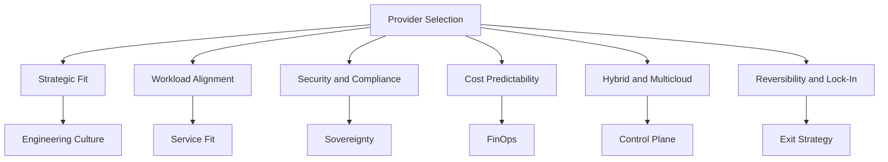

# Migration in progress
# Lesson 3: Selection Factors

Provider selection is a multi-dimensional decision that goes beyond feature checklists. The functional gap between AWS, Azure, and GCP has largely closed, so the real differentiators are operational fit, compliance posture, cost predictability, and reversibility. The right choice depends on your workload, team skills, pricing model, compliance needs, and long-term architecture.

## Strategic Fit and Reversibility

Cloud strategy today focuses on control, reversibility, and fit with your delivery model. The goal is to select a platform that proves compliance, supports forecastable spending, and adapts under shifting priorities. You want policies you can audit, budgets you can defend, and a path to change direction without rewriting your platform.

- AWS favors autonomy and breadth. Multi-account landing zones provide strong isolation for modular teams.
- Azure reinforces enterprise governance and integration. Entra ID, Azure Policy, and management groups provide central control.
- GCP optimizes for data, machine learning, and efficiency. Projects, labels, and reporting support platform engineering and FinOps.

> [!Important]
> **Fit matters more than features**: The functional capabilities of AWS, Azure, and GCP are largely equivalent for most workloads. Provider selection depends on engineering culture, team structure, and risk appetite, not feature checklists alone.

## Workload Alignment and Engineering Culture

Every provider runs enterprise workloads. What separates them is alignment with your engineering culture, team structure, and risk appetite. The right fit reduces friction, protects SLOs, and preserves reversibility.

| Dimension | AWS | Azure | GCP |
|---|---|---|---|
| Operating Model | Autonomy with multi-account isolation | Standardization with central governance | Data-led delivery with platform engineering |
| Compute Efficiency | Graviton ARM instances | Cobalt 100 ARM-based VMs | TPU v5e for AI/ML workloads |
| Best Fit | Modular teams and varied pipelines | Audit-heavy environments with Microsoft tooling | Tight feedback loops from model to production |

- Decide which operating model your team needs to ship safely and quickly, then evaluate platforms against that standard.
- GCP's TPU v5e supports TensorFlow, JAX, and PyTorch for AI-intensive workloads.
- Azure fits if you anchor delivery to Microsoft tooling and need transparent control surfaces for audit-heavy environments.

> [!Tip]
> **Assess your team's existing skills**: A team with five years of AWS experience will be more productive on AWS than on GCP, even if GCP is technically superior for the workload. Retraining costs are real.

## Security, Compliance, and Data Sovereignty

Security looks similar across the three cloud providers. Sovereignty is where things diverge. Audit readiness depends on how identity, logging, locations, and regional operations turn policy into evidence.

| Dimension | AWS | Azure | GCP |
|---|---|---|---|
| Identity Model | IAM with Organizations and SCPs | Entra ID with management groups and Azure Policy | Cloud IAM with resource hierarchy and Org Policies |
| Sovereign Offering | AWS European Sovereign Cloud (Germany, 2026) | EU Data Boundary | Sovereign Controls for EU |
| Best Fit | Decentralized ownership with centralized guardrails | Tenant-wide policy and audit consistency | Zero-trust perimeters and strict data boundaries |

- AWS European Sovereign Cloud operates with EU-based personnel and independent operations for strict residency assurances.
- Azure EU Data Boundary processes and stores customer data in the EU with documented coverage for regulated enterprises.
- GCP Sovereign Controls for EU use Organization Policies, IAM Conditions, and VPC Service Controls for data residency and least privilege.

> [!Important]
> **Verify compliance certifications against actual regulatory requirements**: All three providers hold broad compliance certifications, but specific certifications and regional coverage differ. Compliance mapping must be verified, not assumed.

## Global Reach and Operational Resilience

Cloud resilience outweighs region count. Compare providers by redundancy depth, failover orchestration, and interconnect design. Focus on how architectures absorb failures and keep promises under global pressure.

| Dimension | AWS | Azure | GCP |
|---|---|---|---|
| Regions | 39 regions, 123 AZs | 70+ regions | Smaller but strategically distributed |
| Failover Mechanism | Route 53 health checks, Application Recovery Controller | Paired regions, Azure Site Recovery | Global external Application Load Balancer with health-based failover |
| Network Backbone | Private fiber | ExpressRoute, Virtual WAN | Google's private global fiber backbone |

- AWS Application Recovery Controller adds controlled routing during events to cap blast radius and speed restoration.
- Azure Site Recovery and ExpressRoute stabilize connectivity across campuses and partners so failover respects policy and RTO/RPO targets.
- GCP's global load balancer uses Google's Premium-tier backbone to minimize detours during regional incidents.

> [!Tip]
> **Design for multi-AZ resilience within a region before expanding to multi-region**: Multiple independent AZs within a region allow high availability without incurring cross-region latency. This is especially relevant for mission-critical applications with strict uptime requirements.

## Cost Predictability and Financial Governance

Good governance works when commitments, allocation, and reporting translate into budgets you can defend. Compare how each provider structures agreements, tags spend to owners, and exposes the data your finance and audit partners expect.

| Dimension | AWS | Azure | GCP |
|---|---|---|---|
| Financial Model | Flexibility-first with Savings Plans and RIs | Governance-embedded with EA alignment | Transparency and unit economics view |
| Discount Mechanism | Savings Plans, Reserved Instances | Reservations, Savings Plans | Committed Use Discounts, automatic Sustained Use Discounts |
| Cost Tooling | Cost Categories, Budgets, Cost Explorer, Billing Conductor | Cost Management with amortization views | Cloud Billing with per-second billing and carbon reporting |

- AWS offers flexible commitment paths and granular allocation controls through Cost Categories and Organizations.
- Azure anchors identity, policy, and budgets in one tenant, rolling standards down to management groups and subscriptions.
- GCP provides per-second billing and automatic sustained use discounts for clear unit economics.

> [!Important]
> **Plan for AI silicon and ARM-based compute**: The availability of AWS Graviton, Azure Cobalt, and Google Cloud TPUs points to better price-performance for targeted workloads. Consider how these shifts alter your unit economics and budget accuracy.

## Hybrid, Multicloud, and Reversibility

Hybrid cloud gives your roadmap leverage. You want one control plane to project identity, policy, and networking across data centers, edge, and other clouds. The provider that delivers consistent governance everywhere gives you credible vendor options without rewrites or fractured operations.

| Dimension | AWS | Azure | GCP |
|---|---|---|---|
| Hybrid Extension | AWS Outposts, EKS Anywhere | Azure Arc, Azure Stack | Google Distributed Cloud |
| Control Model | Native AWS services on premises with consistent APIs | Tenant-wide control across on-prem and other clouds | Container-first approach with Kubernetes foundations |
| Best Fit | Extending native AWS services on premises | Structured enterprise escalation and account man