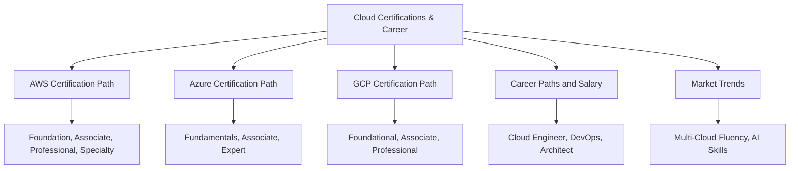
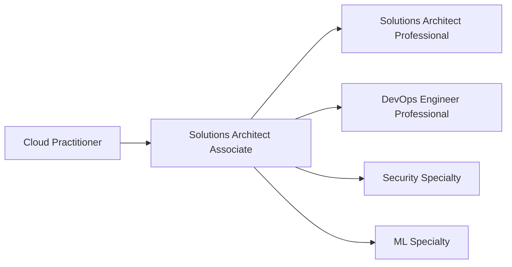
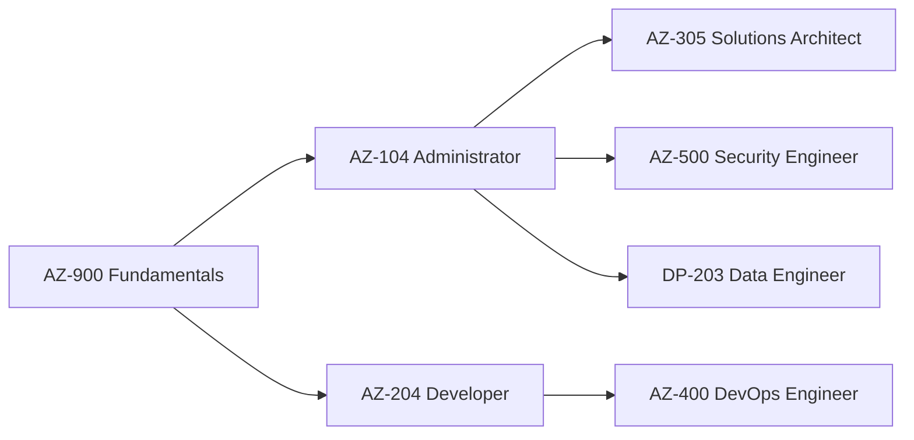
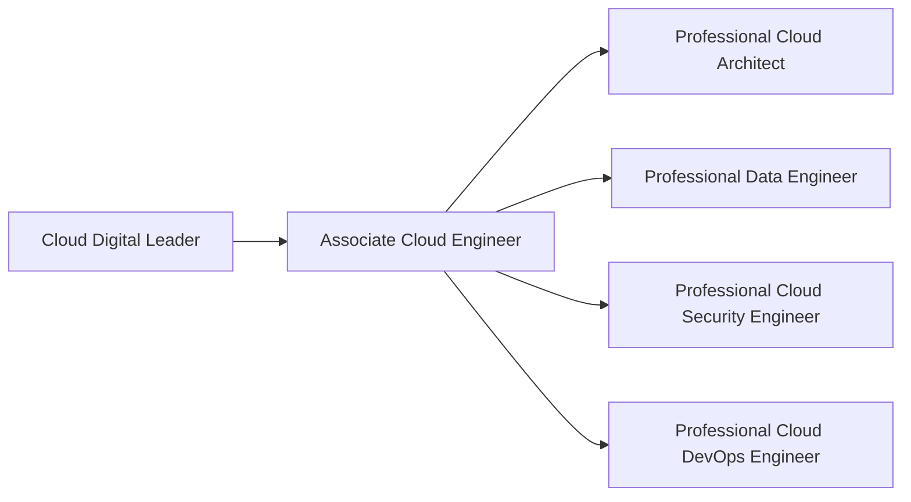

# Migration in progress
# Lesson 4: Cloud Certifications & Career

Cloud certifications validate provider-specific skills and serve as a signal to employers. They are not a substitute for hands-on experience, but they open doors, structure learning, and often correlate with higher compensation. This lesson maps the certification paths for AWS, Azure, and GCP, then connects them to job roles, salary data, and market trends.

## AWS Certification Path

AWS offers the broadest certification catalog of the three providers, spanning foundation, associate, professional, and specialty tiers.

| Level | Certification | Target Role | Exam Cost |
|---|---|---|---|
| Foundational | Cloud Practitioner (CLF-C02) | Beginners, managers, sales | $100 |
| Foundational | AI Practitioner (AIF-C01) | AI-aware professionals | $100 |
| Associate | Solutions Architect Associate (SAA-C03) | Cloud Engineers, Architects | $150 |
| Associate | Developer Associate (DVA-C02) | Application Developers | $150 |
| Associate | SysOps Administrator Associate | Operations Engineers | $150 |
| Associate | Data Engineer Associate (DEA-C01) | Data Engineers | $150 |
| Professional | Solutions Architect Professional (SAP-C02) | Senior Architects | $300 |
| Professional | DevOps Engineer Professional (DOP-C02) | DevOps Engineers, SREs | $300 |
| Specialty | Security Specialty (SCS-C03) | Security Engineers | $300 |
| Specialty | Machine Learning Specialty (MLS-C01) | ML Engineers | $300 |
| Specialty | Advanced Networking Specialty | Network Engineers | $300 |

- The AWS Solutions Architect Associate (SAA-C03) appears in 80% of cloud job postings and is the most recognized entry point into cloud hiring.
- AWS DevOps Engineer Professional is in high demand across scale-ups and tech companies.
- AWS Security Specialty is one of the hardest roles to fill in the current market.
- AWS-certified professionals earn 5 to 10 percent more on average globally.

> [!Tip]
> **Start with Solutions Architect Associate**: It is the most recognized entry point, appears in most job postings, and builds foundational knowledge that applies to every other AWS certification.

## Azure Certification Path

Azure certifications are organized into fundamentals, associate, and expert levels. Azure dominates in government, healthcare, financial services, and Microsoft-stack enterprises.

| Level | Certification | Target Role | Exam Cost |
|---|---|---|---|
| Fundamentals | AZ-900 Azure Fundamentals | Beginners, career changers | $99 |
| Fundamentals | AI-900 Azure AI Fundamentals | AI-aware professionals | $99 |
| Fundamentals | SC-900 Security Fundamentals | Security beginners | $99 |
| Associate | AZ-104 Azure Administrator | Cloud Administrators | $165 |
| Associate | AZ-204 Azure Developer | Application Developers | $165 |
| Associate | AZ-500 Azure Security Engineer | Security Engineers | $165 |
| Associate | DP-203 Azure Data Engineer | Data Engineers | $165 |
| Expert | AZ-305 Azure Solutions Architect | Senior Architects | $165 |
| Expert | AZ-400 DevOps Engineer | DevOps Engineers | $165 |

- AZ-900 is the recommended starting point. It covers cloud concepts, core Azure services, security, and pricing without requiring prior cloud experience.
- AZ-104 is the most common requirement in enterprise job briefs and serves as a prerequisite for AZ-305.
- AZ-305 is in strong demand in financial services and government.
- AZ-500 is a critical hire for every regulated industry.
- Azure certifications are most valuable in Microsoft-heavy enterprise environments.

> [!Important]
> **AZ-104 is the gateway**: Most Azure expert certifications require or strongly recommend AZ-104 as a prerequisite. It is the most valuable associate-level certification for enterprise roles.

## GCP Certification Path

GCP certifications are organized into foundational, associate, and professional levels. GCP certifications are less saturated than AWS or Azure, which works in your favor if you target the right roles.

| Level | Certification | Target Role | Exam Cost |
|---|---|---|---|
| Foundational | Cloud Digital Leader | Business professionals | $99 |
| Associate | Associate Cloud Engineer | Cloud Engineers | $125 |
| Professional | Professional Cloud Architect | Senior Architects | $200 |
| Professional | Professional Data Engineer | Data Engineers | $200 |
| Professional | Professional Cloud Security Engineer | Security Engineers | $200 |
| Professional | Professional Cloud DevOps Engineer | DevOps Engineers, SREs | $200 |
| Professional | Professional Cloud Network Engineer | Network Engineers | $200 |

- Associate Cloud Engineer validates skills to deploy, monitor, and maintain GCP projects.
- Professional Cloud Architect is the most popular architecture certification and validates design and planning skills.
- GCP certifications are climbing fast in data and ML-focused roles.
- GCP certification demand is strongest in data analytics, machine learning, and Kubernetes roles.

> [!Tip]
> **Target GCP for data and ML roles**: GCP certifications are less saturated than AWS or Azure. If your career target is data engineering, analytics, or machine learning, GCP credentials differentiate you in a less crowded market.

## Certification Comparison and Selection

| Dimension | AWS | Azure | GCP |
|---|---|---|---|
| Best for | General employability, broadest job market | Enterprise, government, Microsoft-stack | Data, AI/ML, Kubernetes, cloud-native |
| Entry Point | Solutions Architect Associate | AZ-104 Administrator | Associate Cloud Engineer |
| Top Architect Cert | Solutions Architect Professional | AZ-305 Solutions Architect Expert | Professional Cloud Architect |
| Security Cert | Security Specialty (SCS-C03) | AZ-500 Security Engineer | Professional Cloud Security Engineer |
| Job Posting Volume | Highest (40% more than Azure) | Strong in enterprise | Growing in data and ML |
| Salary Premium | 5-10% higher on average | Competitive in enterprise | Competitive in data roles |

- AWS holds the broadest hiring market overall, but Azure dominates in financial services, government, healthcare, and large enterprises.
- GCP has a strong foothold in data, AI, and engineering-driven companies.
- The fastest path to certification value is building on what you already know, not starting over on a new platform while simultaneously learning security concepts.

> [!Important]
> **Certifications are table stakes, not differentiators**: Hiring managers now look fo