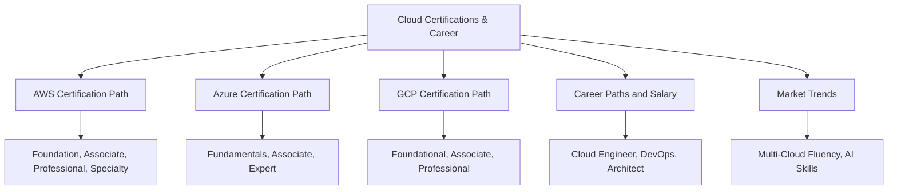
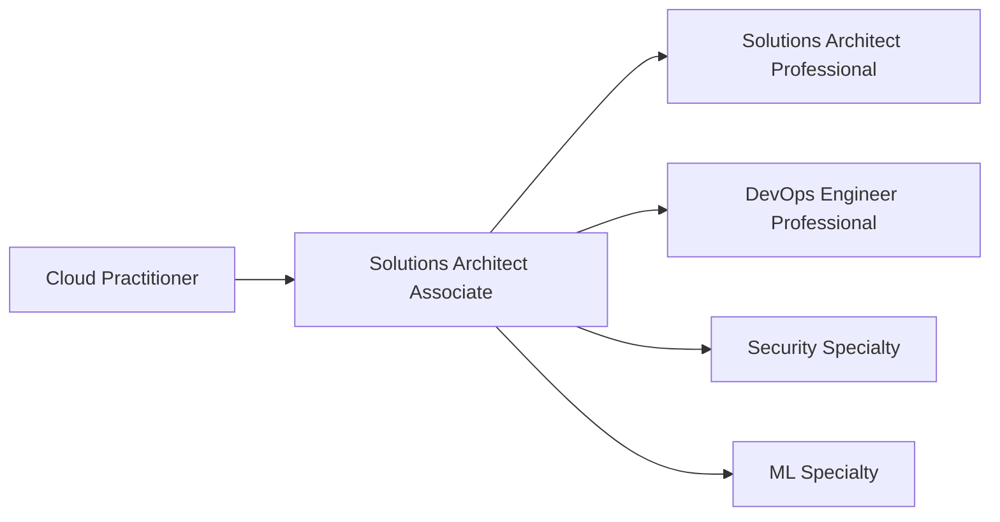
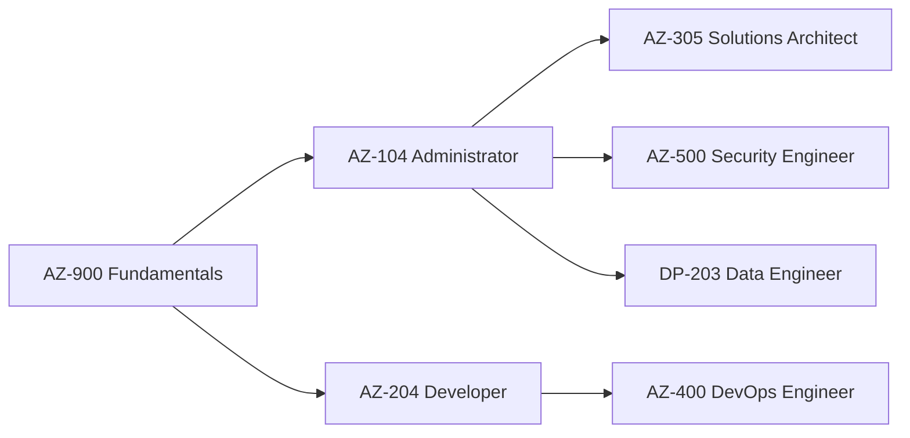
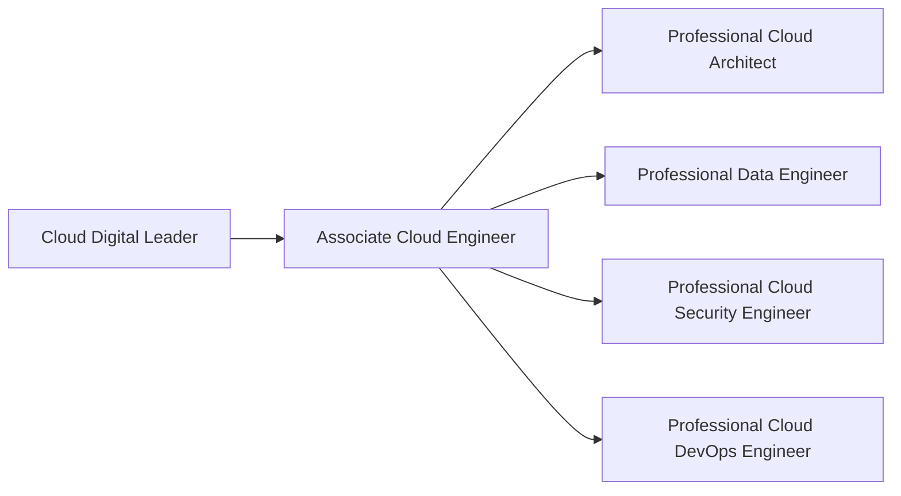
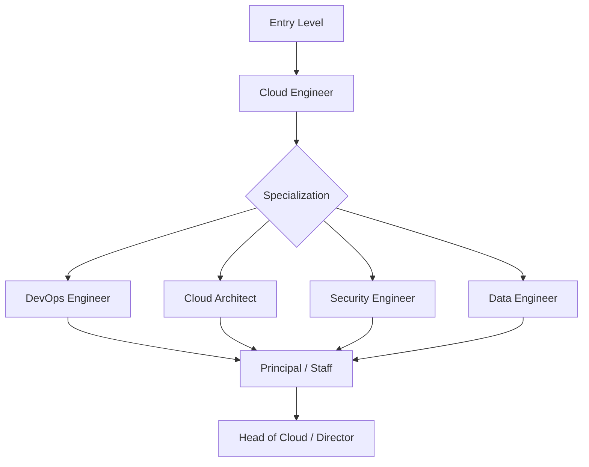
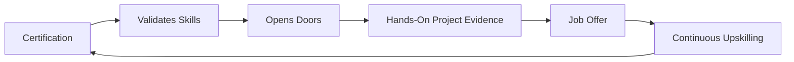

# Lesson 4: Cloud Certifications & Career

Cloud certifications validate provider-specific skills and serve as a signal to employers. They are not a substitute for hands-on experience, but they open doors, structure learning, and often correlate with higher compensation. This lesson maps the certification paths for AWS, Azure, and GCP, then connects them to job roles, salary data, and market trends.

## AWS Certification Path

AWS offers the broadest certification catalog of the three providers, spanning foundation, associate, professional, and specialty tiers.

| Level | Certification | Target Role | Exam Cost |
|---|---|---|---|
| Foundational | Cloud Practitioner (CLF-C02) | Beginners, managers, sales | $100 |
| Foundational | AI Practitioner (AIF-C01) | AI-aware professionals | $100 |
| Associate | Solutions Architect Associate (SAA-C03) | Cloud Engineers, Architects | $150 |
| Associate | Developer Associate (DVA-C02) | Application Developers | $150 |
| Associate | SysOps Administrator Associate | Operations Engineers | $150 |
| Associate | Data Engineer Associate (DEA-C01) | Data Engineers | $150 |
| Professional | Solutions Architect Professional (SAP-C02) | Senior Architects | $300 |
| Professional | DevOps Engineer Professional (DOP-C02) | DevOps Engineers, SREs | $300 |
| Specialty | Security Specialty (SCS-C03) | Security Engineers | $300 |
| Specialty | Machine Learning Specialty (MLS-C01) | ML Engineers | $300 |
| Specialty | Advanced Networking Specialty | Network Engineers | $300 |

- The AWS Solutions Architect Associate (SAA-C03) appears in 80% of cloud job postings and is the most recognized entry point into cloud hiring.
- AWS DevOps Engineer Professional is in high demand across scale-ups and tech companies.
- AWS Security Specialty is one of the hardest roles to fill in the current market.
- AWS-certified professionals earn 5 to 10 percent more on average globally.

> [!Tip]
> **Start with Solutions Architect Associate**: It is the most recognized entry point, appears in most job postings, and builds foundational knowledge that applies to every other AWS certification.

## Azure Certification Path

Azure certifications are organized into fundamentals, associate, and expert levels. Azure dominates in government, healthcare, financial services, and Microsoft-stack enterprises.

| Level | Certification | Target Role | Exam Cost |
|---|---|---|---|
| Fundamentals | AZ-900 Azure Fundamentals | Beginners, career changers | $99 |
| Fundamentals | AI-900 Azure AI Fundamentals | AI-aware professionals | $99 |
| Fundamentals | SC-900 Security Fundamentals | Security beginners | $99 |
| Associate | AZ-104 Azure Administrator | Cloud Administrators | $165 |
| Associate | AZ-204 Azure Developer | Application Developers | $165 |
| Associate | AZ-500 Azure Security Engineer | Security Engineers | $165 |
| Associate | DP-203 Azure Data Engineer | Data Engineers | $165 |
| Expert | AZ-305 Azure Solutions Architect | Senior Architects | $165 |
| Expert | AZ-400 DevOps Engineer | DevOps Engineers | $165 |

- AZ-900 is the recommended starting point. It covers cloud concepts, core Azure services, security, and pricing without requiring prior cloud experience.
- AZ-104 is the most common requirement in enterprise job briefs and serves as a prerequisite for AZ-305.
- AZ-305 is in strong demand in financial services and government.
- AZ-500 is a critical hire for every regulated industry.
- Azure certifications are most valuable in Microsoft-heavy enterprise environments.

> [!Important]
> **AZ-104 is the gateway**: Most Azure expert certifications require or strongly recommend AZ-104 as a prerequisite. It is the most valuable associate-level certification for enterprise roles.

## GCP Certification Path

GCP certifications are organized into foundational, associate, and professional levels. GCP certifications are less saturated than AWS or Azure, which works in your favor if you target the right roles.

| Level | Certification | Target Role | Exam Cost |
|---|---|---|---|
| Foundational | Cloud Digital Leader | Business professionals | $99 |
| Associate | Associate Cloud Engineer | Cloud Engineers | $125 |
| Professional | Professional Cloud Architect | Senior Architects | $200 |
| Professional | Professional Data Engineer | Data Engineers | $200 |
| Professional | Professional Cloud Security Engineer | Security Engineers | $200 |
| Professional | Professional Cloud DevOps Engineer | DevOps Engineers, SREs | $200 |
| Professional | Professional Cloud Network Engineer | Network Engineers | $200 |

- Associate Cloud Engineer validates skills to deploy, monitor, and maintain GCP projects.
- Professional Cloud Architect is the most popular architecture certification and validates design and planning skills.
- GCP certifications are climbing fast in data and ML-focused roles.
- GCP certification demand is strongest in data analytics, machine learning, and Kubernetes roles.

> [!Tip]
> **Target GCP for data and ML roles**: GCP certifications are less saturated than AWS or Azure. If your career target is data engineering, analytics, or machine learning, GCP credentials differentiate you in a less crowded market.

## Certification Comparison and Selection

| Dimension | AWS | Azure | GCP |
|---|---|---|---|
| Best for | General employability, broadest job market | Enterprise, government, Microsoft-stack | Data, AI/ML, Kubernetes, cloud-native |
| Entry Point | Solutions Architect Associate | AZ-104 Administrator | Associate Cloud Engineer |
| Top Architect Cert | Solutions Architect Professional | AZ-305 Solutions Architect Expert | Professional Cloud Architect |
| Security Cert | Security Specialty (SCS-C03) | AZ-500 Security Engineer | Professional Cloud Security Engineer |
| Job Posting Volume | Highest (40% more than Azure) | Strong in enterprise | Growing in data and ML |
| Salary Premium | 5-10% higher on average | Competitive in enterprise | Competitive in data roles |

- AWS holds the broadest hiring market overall, but Azure dominates in financial services, government, healthcare, and large enterprises.
- GCP has a strong foothold in data, AI, and engineering-driven companies.
- The fastest path to certification value is building on what you already know, not starting over on a new platform while simultaneously learning security concepts.

> [!Important]
> **Certifications are table stakes, not differentiators**: Hiring managers now look for experience and project evidence, not just badges. A certification opens the door. What you built with it gets you the offer.

## Career Paths and Salary Data

Cloud roles split into two broad families: infrastructure and operations, and development and DevOps. The 2026 market requires a skill stack that looks more like a DevOps platform engineer than a traditional cloud engineer.

### Core Job Roles and UK Salary Ranges

| Role | Salary Range (UK) | Key Skills |
|---|---|---|
| Junior Cloud Engineer | £45,000 - £65,000 | Cloud fundamentals, Linux, networking |
| Cloud Engineer (mid-level) | £75,000 - £95,000 | Terraform, Kubernetes, CI/CD |
| DevOps Engineer | £60,000 - £80,000 | IaC, pipelines, observability |
| Cloud Architect | £90,000 - £120,000 | Multi-AZ design, cost optimization, security |
| Head of Cloud | £110,000 - £140,000 | Strategy, team leadership, governance |

- The salary range for a mid-level Cloud Engineer in London is currently £75,000 to £95,000.
- DevOps Engineers command £60,000 to £80,000, and Cloud Architects command £90,000 to £120,000.
- Median UK pay for AWS, Azure, and GCP roles generally sits between £70,000 and £105,000.
- GCP Data Engineers command £92,500, and GCP Platform Engineers command £85,000.

> [!Tip]
> **Terraform and Kubernetes are non-negotiable**: About 70% of senior cloud roles list Terraform as a primary requirement, and Kubernetes is no longer optional. "I know Docker" is no longer a substitute for cluster troubleshooting skills.

### Skills That Matter in 2026

- Infrastructure as Code: Terraform, state management, remote backends.
- Kubernetes: pod networking, Helm, cluster troubleshooting.
- FinOps: cost attribution, right-sizing, commitment management.
- Security: IAM policy design, guardrails, compliance automation.
- AI and ML integration: working with AI-powered systems and data platforms.
- Multi-cloud fluency: holding credentials across AWS and Azure, or adding GCP for data roles.

> [!Important]
> **Multi-cloud fluency stands above single-cloud credentials**: Engineers who hold both AWS and Azure credentials, can show real production experience, and continuously upskill are getting hired fastest. Single-cloud engineers are competing in a crowded pool.

## Market Trends and Certification Value

By 2026, cloud careers are shaped by two major trends: AI integration into cloud platforms and the growing emphasis on practical architecture thinking over badge collection.

- Platform fluency across AWS, Azure, and GCP must blend with cloud-native skills like Kubernetes, IaC, and security to stay relevant.
- Certifications are becoming a way to validate practical architecture thinking, not just theoretical knowledge.
- FinOps certifications and cloud financial management skills are emerging as independent, high-value specializations.
- AI certifications are rising in value alongside cloud certifications, with AWS Machine Learning Specialty and Azure AI Engineer Associate seeing growing demand.
- Certification catalogs continue to expand, with AWS, Azure, and GCP adding AI-specific and specialty certifications.

## Assessment Preparation

### Practice Questions

1. Compare the AWS, Azure, and GCP certification paths from foundational to professional level.
2. Explain why AWS Solutions Architect Associate is the most recognized entry point into cloud hiring.
3. Describe the Azure AZ-104 certification and its role as a prerequisite for expert-level certifications.
4. Explain why GCP certifications are less saturated than AWS or Azure and how that affects career strategy.
5. Describe the core skills required for a mid-level cloud engineer role in 2026.
6. Explain the relationship between certifications and salary in the cloud job market.
7. Describe why multi-cloud fluency is valued more than single-cloud credentials.
8. Explain the role of FinOps as a cloud career skill.

### Scenario Questions

**Scenario 1: Career Changer with No Cloud Experience**
A professional with a background in IT support wants to move into cloud. Which certification path should they follow?

- Start with AWS Cloud Practitioner or Azure AZ-900 to build foundational knowledge.
- Progress to Solutions Architect Associate or AZ-104 Administrator.
- Build hands-on projects alongside certification study.
- Target junior cloud engineer or cloud administrator roles.

**Scenario 2: Enterprise Microsoft Environment**
A company runs Windows Server, Active Directory, and Microsoft 365. Which certifications align best?

- AZ-900 for cloud fundamentals.
- AZ-104 for Azure administration.
- AZ-305 for solutions architecture.
- AZ-500 for security roles.
- Azure certifications are most valuable in Microsoft-heavy enterprises.

**Scenario 3: Data and AI Career Track**
A professional wants to specialize in data engineering and ML pipelines. Which provider and certifications align best?

- GCP Professional Data Engineer for BigQuery and data engineering workflows.
- AWS Data Engineer Associate and Machine Learning Specialty for broader market reach.
- GCP certifications are less saturated and growing fast in data and ML roles.
- Combine GCP data credentials with Kubernetes and Terraform skills.

**Scenario 4: Maximizing Salary Potential**
A mid-level cloud engineer wants to maximize compensation. What strategy should they follow?

- Hold certifications across two providers (AWS and Azure).
- Build production experience and project evidence.
- Develop FinOps and security skills.
- Target roles that combine automation and security for the highest salary ceiling.

## Key Takeaways

- AWS offers the broadest certification catalog with the highest job posting volume. Azure dominates enterprise and Microsoft-stack environments. GCP leads in data, AI/ML, and Kubernetes roles.
- AWS Solutions Architect Associate is the most recognized entry point into cloud hiring and appears in most job postings.
- Azure AZ-104 is the gateway to most Azure expert certifications and the most common enterprise requirement.
- GCP certifications are less saturated, making them a strategic advantage for data and ML career tracks.
- Certifications are table stakes. Hands-on project evidence and production experience get you the offer.
- Multi-cloud fluency across AWS and Azure is the certification combination that stands above single-cloud credentials.
- Terraform and Kubernetes are non-negotiable skills for senior cloud roles.
- FinOps is the new soft skill. Cost management knowledge accelerates hiring.
- Mid-level cloud engineers in the UK earn £75,000 to £95,000. Cloud architects earn £90,000 to £120,000.
- AWS-certified professionals earn 5 to 10 percent more on average globally.
- Continuous upskilling, not just certification renewal, is what keeps cloud professionals competitive.

> [!Important]
> **Certifications open doors, but experience gets the offer**: A certification validates that you can learn and pass an exam. A portfolio of production projects, proven troubleshooting skills, and the ability to design architectures under real constraints is what hiring managers actually buy. Use certifications to structure your learning, then build evidence that you can apply it.
