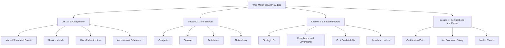
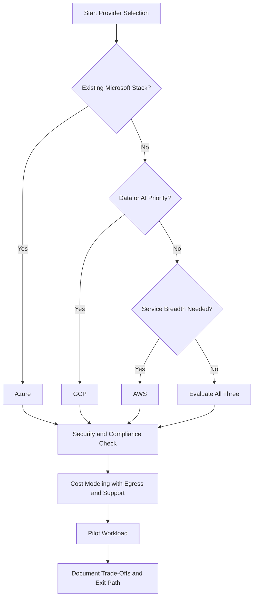
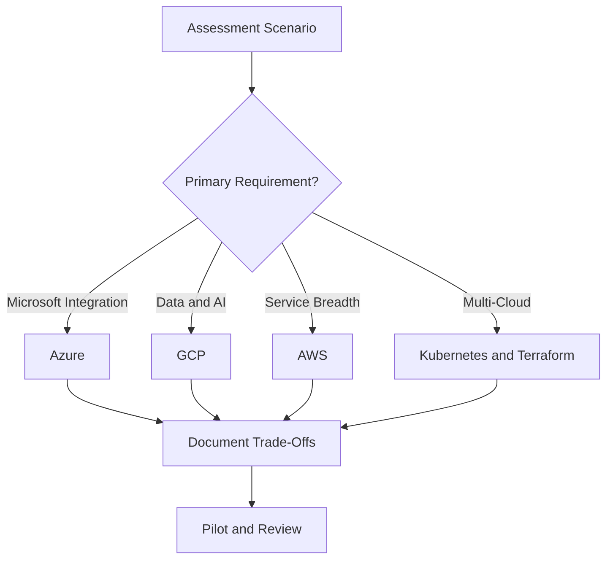

# W03: Overview of Major Cloud Providers - Summary and Assessment

This module surveys the three dominant cloud platforms: AWS, Azure, and GCP. It compares market position, service models, global infrastructure, core service categories, selection factors, and career paths. The goal is to build a provider-neutral mental model for making informed architectural and career decisions.

## Lesson 1: Comparison Summary

AWS, Azure, and GCP collectively hold 66% of global cloud infrastructure spending. AWS leads in market share and service breadth. Azure leads in enterprise integration and hybrid. GCP leads in growth rate, data, analytics, Kubernetes, and AI.

| Provider | Q4 2025 Market Share | Year-over-Year Growth | Primary Strength |
|---|---|---|---|
| AWS | 32% | 24% | Service breadth and ecosystem maturity |
| Azure | 22% | 39% | Enterprise integration and Microsoft ecosystem |
| GCP | 12% | 50% | Data, analytics, Kubernetes, and AI |

### Service Models

| Model | Provider Manages | Customer Manages | Example |
|---|---|---|---|
| IaaS | Hardware, virtualization, networking | OS, runtime, apps, data | EC2, Virtual Machines, Compute Engine |
| PaaS | Hardware, OS, runtime, middleware | Apps and data | Elastic Beanstalk, App Service, App Engine |
| SaaS | Entire stack | User configuration only | WorkMail, Microsoft 365, Google Workspace |

### Global Infrastructure

| Dimension | AWS | Azure | GCP |
|---|---|---|---|
| Regions | 34 regions | 60+ regions | 40 regions |
| Availability Zones | 108 zones | 300+ zones | 121 zones |
| Region Pairing | No automatic pairing | Automatic region pairs | No automatic pairing |
| VPC Scope | Regional | Regional | Global |

> [!Important]
> **Availability Zones are the unit of resilience**: Deploying across multiple zones within a region protects against datacenter-level failures including power, cooling, and networking outages.

## Lesson 2: Core Services Summary

Every cloud provider delivers compute, storage, database, and networking services. The functional gap between providers has largely closed, but architectural differences remain in network scope, database design, and instance flexibility.

### Compute Services

| Capability | AWS | Azure | GCP |
|---|---|---|---|
| Virtual Machines | EC2 | Virtual Machines | Compute Engine |
| Managed Kubernetes | EKS | AKS | GKE |
| Serverless Functions | Lambda | Azure Functions | Cloud Functions / Cloud Run |
| ARM Instances | Graviton | Cobalt 100 | Tau T2A |

### Storage Services

| Capability | AWS | Azure | GCP |
|---|---|---|---|
| Object Storage | S3 | Blob Storage | Cloud Storage |
| Block Storage | EBS | Managed Disks | Persistent Disk |
| File Storage | EFS / FSx | Azure Files | Filestore |
| Archive Price (per GB/month) | $0.0036 | $0.002 | $0.0012 |

### Database Services

| Capability | AWS | Azure | GCP |
|---|---|---|---|
| Managed Relational | RDS / Aurora | Azure SQL | Cloud SQL / AlloyDB |
| NoSQL Document | DynamoDB | Cosmos DB | Firestore |
| Wide-Column | DynamoDB | Cosmos DB | Bigtable |
| Data Warehouse | Redshift | Synapse Analytics | BigQuery |

### Networking Services

| Capability | AWS | Azure | GCP |
|---|---|---|---|
| Virtual Network | VPC (regional) | VNet (regional) | VPC (global) |
| Load Balancing (L4) | Network Load Balancer | Azure Load Balancer | Network Load Balancer |
| Load Balancing (L7) | Application Load Balancer | Application Gateway | HTTP(S) Load Balancer |
| CDN | CloudFront | Azure Front Door | Cloud CDN |
| DNS | Route 53 | Azure DNS | Cloud DNS |

> [!Tip]
> **Services map across providers**: Once you learn one provider's service model, you can translate concepts to the others. A VPC is a VPC, whether it is called VPC, VNet, or VPC.

## Lesson 3: Selection Factors Summary

Provider selection is a multi-dimensional decision. The functional gap between AWS, Azure, and GCP has largely closed. The real differentiators are operational fit, compliance posture, cost predictability, and reversibility.

### Decision Framework

### Key Selection Dimensions

| Dimension | AWS | Azure | GCP |
|---|---|---|---|
| Strategic Fit | Autonomy, multi-account isolation | Standardization, central governance | Data-led delivery, platform engineering |
| Sovereignty | European Sovereign Cloud | EU Data Boundary | Sovereign Controls for EU |
| Hybrid Extension | Outposts, EKS Anywhere | Azure Arc, Azure Stack | Google Distributed Cloud |
| Cost Model | Savings Plans, Reserved Instances | Reservations, EA alignment | Committed Use Discounts, Sustained Use |

> [!Important]
> **Fit matters more than features**: Provider selection depends on engineering culture, team structure, compliance needs, and risk appetite, not feature checklists alone. For 80% of workloads, any provider works.

## Lesson 4: Cloud Certifications & Career Summary

Certifications validate provider-specific skills and open doors. They are not a substitute for hands-on experience. The 2026 market requires a skill stack that looks more like a DevOps platform engineer than a traditional cloud engineer.

### Certification Paths

| Provider | Entry Point | Top Architect Cert | Security Cert |
|---|---|---|---|
| AWS | Solutions Architect Associate | Solutions Architect Professional | Security Specialty |
| Azure | AZ-104 Administrator | AZ-305 Solutions Architect Expert | AZ-500 Security Engineer |
| GCP | Associate Cloud Engineer | Professional Cloud Architect | Professional Cloud Security Engineer |

### Salary Ranges (UK)

| Role | Salary Range |
|---|---|
| Junior Cloud Engineer | £45,000 - £65,000 |
| Cloud Engineer (mid-level) | £75,000 - £95,000 |
| DevOps Engineer | £60,000 - £80,000 |
| Cloud Architect | £90,000 - £120,000 |
| Head of Cloud | £110,000 - £140,000 |

> [!Tip]
> **Terraform and Kubernetes are non-negotiable**: About 70% of senior cloud roles list Terraform as a primary requirement. Kubernetes is no longer optional. Multi-cloud fluency across AWS and Azure is the certification combination that stands above single-cloud credentials.

## Assessment Preparation

### Practice Questions

1. Compare the market position and growth rates of AWS, Azure, and GCP in Q4 2025.
2. Explain the difference between IaaS, PaaS, and SaaS with examples from each provider.
3. Describe how GCP's global VPC differs architecturally from AWS and Azure regional VPCs.
4. Map the equivalent compute, storage, and database services across all three providers.
5. Explain the six pillars of provider selection: alignment, resilience, compliance, cost stability, hybrid options, and long-term support.
6. Compare how AWS, Azure, and GCP handle data sovereignty in the European Union.
7. Describe the signs of vendor lock-in and strategies to maintain reversibility.
8. Compare the AWS, Azure, and GCP certification paths from foundational to professional level.
9. Explain why multi-cloud fluency is valued more than single-cloud credentials.
10. Describe the core skills required for a mid-level cloud engineer role in 2026.

### Scenario Questions

**Scenario 1: Enterprise Microsoft Environment**
A company uses Windows Server, Active Directory, and Microsoft 365. Which provider offers the least friction?

- Azure integrates natively with Entra ID, Windows Server, and Microsoft 365.
- Hybrid licensing benefits reduce cost for existing Microsoft workloads.
- Azure Policy and management groups provide centralized governance.

**Scenario 2: Data and AI Startup**
A startup needs managed Kubernetes, serverless analytics, and ML training at scale. Which provider aligns best?

- GCP offers GKE for Kubernetes, BigQuery for analytics, and Vertex AI for ML.
- GCP's private network backbone reduces latency for global data access.
- Cost-effective pricing for data-heavy workloads.

**Scenario 3: European Regulated Enterprise**
A financial services firm handles EU citizen data with strict GDPR requirements. Which provider fits best?

- Azure EU Data Boundary processes and stores customer data in the EU with documented coverage.
- AWS European Sovereign Cloud operates with EU-based personnel and independent operations.
- GCP Sovereign Controls for EU use Organization Policies and VPC Service Controls.
- Evaluate all three against actual regulatory requirements, not just certifications.

**Scenario 4: Career Changer with No Cloud Experience**
A professional with a background in IT support wants to move into cloud. Which certification path should they follow?

- Start with AWS Cloud Practitioner or Azure AZ-900 to build foundational knowledge.
- Progress to Solutions Architect Associate or AZ-104 Administrator.
- Build hands-on projects alongside certification study.
- Target junior cloud engineer or cloud administrator roles.

**Scenario 5: Multi-Cloud Strategy**
An organization wants to avoid vendor lock-in and use best-of-breed services from multiple providers. How should they approach this?

- Standardize on Kubernetes and Terraform for portability.
- Use provider-neutral services where possible: object storage, VMs, managed databases.
- Accept that deep integration features vary and plan abstraction layers.
- Use multi-cloud management platforms like Anthos or Azure Arc to reduce complexity.

## Key Takeaways

- AWS, Azure, and GCP collectively dominate global cloud infrastructure spending, holding 66% of the market in Q4 2025.
- AWS leads in market share and service breadth. Azure leads in enterprise integration and hybrid. GCP leads in growth rate, data, and AI.
- Cloud services follow three models: IaaS, PaaS, and SaaS.
- Global infrastructure is organized into regions, availability zones, and edge locations across all providers.
- GCP's global VPC spans all regions by default. AWS and Azure VPCs are regional.
- Core service categories map across providers: compute, storage, databases, and networking.
- Provider selection is multi-dimensional: strategic fit, compliance, cost, resilience, and reversibility all matter.
- For 80% of workloads, any provider works. Identify whether you are in the 20% where the choice genuinely matters.
- Certifications open doors, but hands-on experience and project evidence get the offer.
- Multi-cloud fluency across AWS and Azure is the certification combination that stands above single-cloud credentials.
- Terraform, Kubernetes, FinOps, and security skills are non-negotiable for senior cloud roles.
- Continuous upskilling, not just certification renewal, keeps cloud professionals competitive.

> [!Important]
> **Learn the concepts, not just the service names**: Core cloud concepts stay consistent across providers. Mastering them lets you transfer knowledge between platforms and make architectural decisions independent of vendor marketing. Certifications validate learning. Projects prove application.
