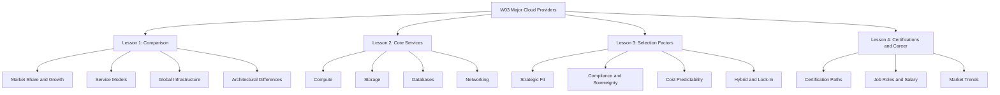
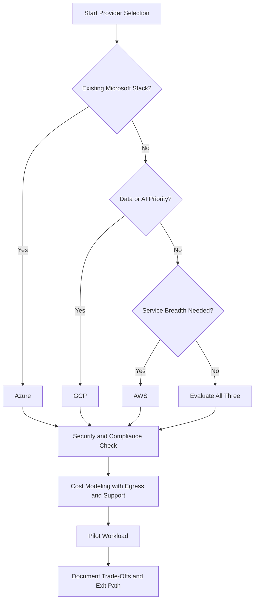

# Migration in progress
# W03: Overview of Major Cloud Providers - Summary and Assessment

This module surveys the three dominant cloud platforms: AWS, Azure, and GCP. It compares market position, service models, global infrastructure, core service categories, selection factors, and career paths. The goal is to build a provider-neutral mental model for making informed architectural and career decisions.

## Lesson 1: Comparison Summary

AWS, Azure, and GCP collectively hold 66% of global cloud infrastructure spending. AWS leads in market share and service breadth. Azure leads in enterprise integration and hybrid. GCP leads in growth rate, data, analytics, Kubernetes, and AI.

| Provider | Q4 2025 Market Share | Year-over-Year Growth | Primary Strength |
|---|---|---|---|
| AWS | 32% | 24% | Service breadth and ecosystem maturity |
| Azure | 22% | 39% | Enterprise integration and Microsoft ecosystem |
| GCP | 12% | 50% | Data, analytics, Kubernetes, and AI |

### Service Models

| Model | Provider Manages | Customer Manages | Example |
|---|---|---|---|
| IaaS | Hardware, virtualization, networking | OS, runtime, apps, data | EC2, Virtual Machines, Compute Engine |
| PaaS | Hardware, OS, runtime, middleware | Apps and data | Elastic Beanstalk, App Service, App Engine |
| SaaS | Entire stack | User configuration only | WorkMail, Microsoft 365, Google Workspace |

### Global Infrastructure

| Dimension | AWS | Azure | GCP |
|---|---|---|---|
| Regions | 34 regions | 60+ regions | 40 regions |
| Availability Zones | 108 zones | 300+ zones | 121 zones |
| Region Pairing | No automatic pairing | Automatic region pairs | No automatic pairing |
| VPC Scope | Regional | Regional | Global |

> [!Important]
> **Availability Zones are the unit of resilience**: Deploying across multiple zones within a region protects against datacenter-level failures including power, cooling, and networking outages.

## Lesson 2: Core Services Summary

Every cloud provider delivers compute, storage, database, and networking services. The functional gap between providers has largely closed, but architectural differences remain in network scope, database design, and instance flexibility.

### Compute Services

| Capability | AWS | Azure | GCP |
|---|---|---|---|
| Virtual Machines | EC2 | Virtual Machines | Compute Engine |
| Managed Kubernetes | EKS | AKS | GKE |
| Serverless Functions | Lambda | Azure Functions | Cloud Functions / Cloud Run |
| ARM Instances | Graviton | Cobalt 100 | Tau T2A |

### Storage Services

| Capability | AWS | Azure | GCP |
|---|---|---|---|
| Object Storage | S3 | Blob Storage | Cloud Storage |
| Block Storage | EBS | Managed Disks | Persistent Disk |
| File Storage | EFS / FSx | Azure Files | Filestore |
| Archive Price (per GB/month) | $0.0036 | $0.002 | $0.0012 |

### Database Services

| Capability | AWS | Azure | GCP |
|---|---|---|---|
| Managed Relational | RDS / Aurora | Azure SQL | Cloud SQL / AlloyDB |
| NoSQL Document | DynamoDB | Cosmos DB | Firestore |
| Wide-Column | DynamoDB | Cosmos DB | Bigtable |
| Data Warehouse | Redshift | Synapse Analytics | BigQuery |

### Networking Services

| Capability | AWS | Azure | GCP |
|---|---|---|---|
| Virtual Network | VPC (regional) | VNet (regional) | VPC (global) |
| Load Balancing (L4) | Network Load Balancer | Azure Load Balancer | Network Load Balancer |
| Load Balancing (L7) | Application Load Balancer | Application Gateway | HTTP(S) Load Balancer |
| CDN | CloudFront | Azure Front Door | Cloud CDN |
| DNS | Route 53 | Azure DNS | Cloud DNS |

> [!Tip]
> **Services map across providers**: Once you learn one provider's service model, you can translate concepts to the others. A VPC is a VPC, whether it is called VPC, VNet, or VPC.

## Lesson 3: Selection Factors Summary

Provider selection is a multi-dimensional decision. The functional gap between AWS, Azure, and GCP has largely closed. The real differentiators are operational fit, compliance posture, cost predictability, and reversibility.

### Decision Framework

### Key Selection Dimensions

| Dimension | AWS | Azure | GCP |
|---|---|---|---|
| Strategic Fit | Autonomy, multi-account isolation | Standardization, central governance | Data-led delivery, platform engineering |
| Sovereignty | European Sovereign Cloud | EU Data Boundary | Sovereign Controls for EU |
| Hybrid Extension | Outposts, EKS Anywhere | Azure Arc, Azure Stack | Google Distributed Cloud |
| Cost Model | Savings Plans, Reserved Instances | Reservations, EA alignment | Committed Use Discounts, Sustained Use |

> [!Important]
> **Fit matters more than features**: Provider selection depends on engineering culture, team structure, compliance needs, and risk appetite, not feature checklists alone. For 80% of workloads, any provider works.

## Lesson 4: Cloud Certifications & Career Summary

Certifications validate provider-specific skills and open doors. They are not a substitute for hands-on experience. The 202