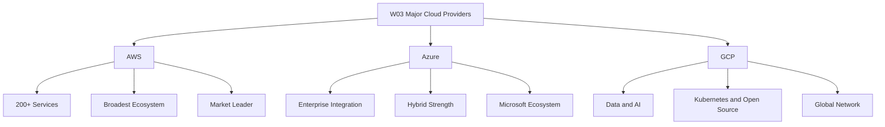
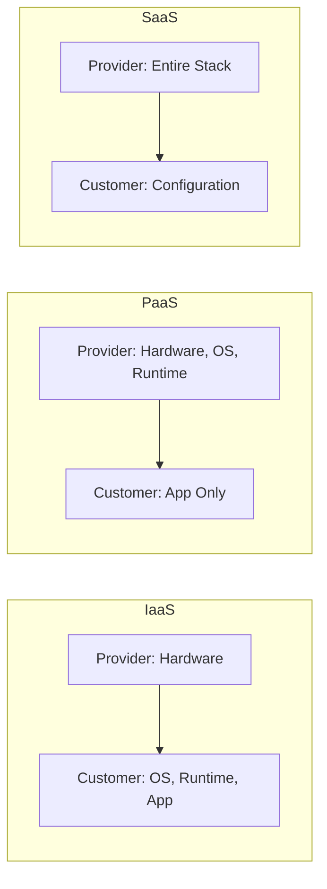
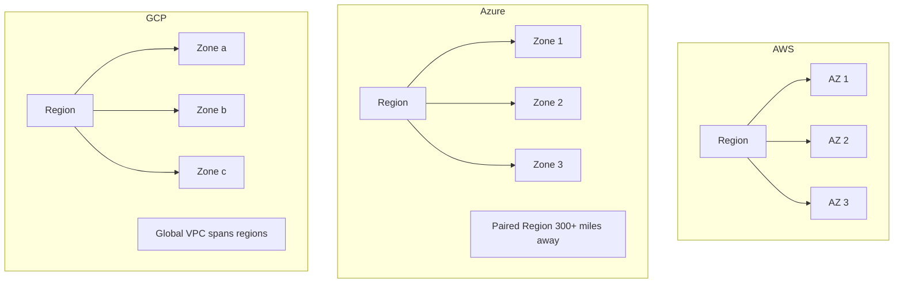
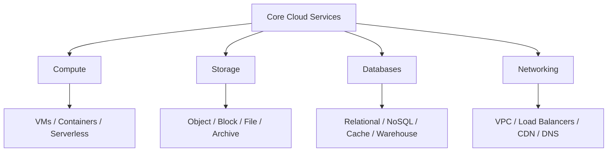

# W03: Overview of Major Cloud Providers

This lesson surveys the three dominant cloud platforms: Amazon Web Services (AWS), Microsoft Azure, and Google Cloud Platform (GCP). It covers market positioning, global infrastructure, service models, and the core service categories that map across all three providers. The goal is to build a provider-neutral mental model so you can compare offerings and make informed architectural choices.

## Market Context

The three hyperscalers collectively account for roughly two-thirds of global cloud infrastructure spending. AWS remains the market leader, followed by Azure, with GCP in third place but growing at the fastest rate among the three.

| Provider | Q4 2025 Market Share | Year-over-Year Growth | Primary Strength |
|---|---|---|---|
| AWS | 32% | 24% | Service breadth and ecosystem maturity |
| Azure | 22% | 39% | Enterprise governance and Microsoft integration |
| GCP | 12% | 50% | Data, analytics, Kubernetes, and AI |

- AWS launched in 2006 with S3 object storage and EC2 compute, making it the first major cloud platform.
- Azure leverages Microsoft's enterprise footprint, integrating with Active Directory, Microsoft 365, and Windows Server.
- GCP runs on the same infrastructure that powers Google Search, Gmail, and YouTube.
- GCP's market share grew from 11% to 12% in Q4 2025, with revenue growing 50% year over year.
- Azure reported 39% year-over-year growth in the same quarter, with a total backlog of US$240 billion for GCP and US$244 billion for AWS.

> [!Important]
> **Market share is not the only metric**: Growth rates tell a different story. GCP and Azure are growing faster than AWS in percentage terms, which matters for long-term platform viability and talent availability.

## Cloud Service Models

Cloud services are organized into three fundamental models based on how much of the stack the provider manages versus the customer.

| Model | Provider Manages | Customer Manages | Example Use Case |
|---|---|---|---|
| IaaS | Hardware, virtualization, networking | OS, runtime, apps, data | Lift-and-shift VMs, custom OS configurations |
| PaaS | Hardware, OS, runtime, middleware | Apps and data | Web apps, APIs, microservices |
| SaaS | Entire stack including application | User configuration only | Email, CRM, collaboration tools |

- IaaS gives the most control but requires the most operational responsibility.
- PaaS removes server management so teams focus on application code.
- SaaS delivers ready-to-use software with minimal operational overhead.
- AWS, Azure, and GCP all offer IaaS, PaaS, and SaaS across their portfolios.

> [!Tip]
> **Choose the model that matches your team's capacity**: IaaS makes sense when you need full control. PaaS accelerates delivery when you want to avoid infrastructure work. SaaS eliminates operational burden entirely.

## Global Infrastructure

All three providers organize their physical infrastructure into regions, availability zones, and edge locations. The naming and structure differ, but the design intent is the same: isolate failures and reduce latency.

| Dimension | AWS | Azure | GCP |
|---|---|---|---|
| Regions | 39 geographic regions | 60+ regions | 42 regions |
| Availability Zones | 123 zones | 3+ zones per region where supported | 127 zones |
| Edge Locations | 750+ CloudFront PoPs | 300+ datacenters worldwide | ~202 edge PoPs |
| Region Pairing | No automatic pairing | Automatic region pairs within geography | No automatic pairing |

### AWS Infrastructure

- AWS Regions contain at least three Availability Zones each.
- Availability Zones are isolated data centers with independent power, cooling, and networking.
- AWS operates a fiber optic network spanning nearly 20 million kilometers.
- Additional infrastructure includes Local Zones, Wavelength Zones, and Outposts for edge and hybrid use cases.

### Azure Infrastructure

- Azure regions are clusters of data centers interconnected via a dedicated low-latency network.
- Availability Zones are physically separate locations within a region, each with independent power, cooling, and networking.
- Azure Regional Pairs provide disaster recovery by designating a partner region at least 300 miles away.
- Services like geo-redundant storage replicate data automatically across paired regions.

### GCP Infrastructure

- GCP regions contain three or more zones interconnected with low-latency links.
- Edge Points of Presence (PoPs) are locations where users enter the Google network for faster access to resources.
- GCP's private fiber backbone routes traffic globally without traversing the public internet.
- GCP's global VPC spans regions by default, unlike AWS and Azure where VPCs are regional.

> [!Important]
> **Availability Zones are the unit of resilience**: Regardless of provider, deploying across multiple zones within a region protects against datacenter-level failures including power, cooling, and networking outages.

## Core Service Categories

Cloud services map across four fundamental domains: compute, storage, databases, and networking. Each provider offers comparable services with different names and feature sets.

### Compute Services

| Service Type | AWS | Azure | GCP |
|---|---|---|---|
| Virtual Machines | EC2 | Virtual Machines | Compute Engine |
| Containers | ECS, EKS | AKS | GKE |
| Serverless Functions | Lambda | Azure Functions | Cloud Functions |
| App Hosting | Elastic Beanstalk | App Service | App Engine |

- AWS offers the broadest range of compute options, from bare metal to serverless.
- Azure integrates tightly with Windows Server and Active Directory for enterprise workloads.
- GCP's GKE is widely regarded as the leading managed Kubernetes service.

### Storage Services

| Storage Type | AWS | Azure | GCP |
|---|---|---|---|
| Object Storage | S3 | Blob Storage | Cloud Storage |
| Block Storage | EBS | Managed Disks | Persistent Disk |
| File Storage | EFS, FSx | Azure Files | Filestore |
| Archive | Glacier | Archive Storage | Archive Storage |

- Object storage is the foundation of cloud storage, used for data lakes, backups, and static assets.
- Block storage attaches to virtual machines for OS and application data.
- Archive tiers provide low-cost long-term retention with retrieval delays.

### Database Services

| Database Type | AWS | Azure | GCP |
|---|---|---|---|
| Relational (managed) | RDS, Aurora | Azure SQL Database | Cloud SQL, AlloyDB |
| NoSQL (key-value) | DynamoDB | Cosmos DB | Firestore, Bigtable |
| In-Memory Cache | ElastiCache | Azure Cache for Redis | Memorystore |
| Data Warehouse | Redshift | Synapse Analytics | BigQuery |

- GCP's BigQuery is widely considered best-in-class for serverless analytics.
- Azure Cosmos DB supports multiple data models with global distribution.
- AWS Aurora provides MySQL and PostgreSQL compatibility with cloud-native performance.

### Networking Services

| Networking Function | AWS | Azure | GCP |
|---|---|---|---|
| Virtual Network | VPC | Virtual Network (VNet) | VPC |
| Load Balancing (L4) | Network Load Balancer | Azure Load Balancer | Network Load Balancer |
| Load Balancing (L7) | Application Load Balancer | Application Gateway | HTTP(S) Load Balancer |
| CDN | CloudFront | Azure CDN / Front Door | Cloud CDN |
| DNS | Route 53 | Azure DNS | Cloud DNS |

- VPCs provide network isolation and segmentation for cloud resources.
- Load balancers distribute traffic across compute instances for availability and scale.
- CDNs cache content at edge locations to reduce latency for global users.

> [!Tip]
> **Services map across providers**: Once you learn one provider's service model, you can translate concepts to the others. A VPC is a VPC, whether it is called VPC, VNet, or VPC.

## Provider Differentiation

While the functional gap between providers has narrowed, each platform retains distinct strengths that influence selection.

| Criterion | AWS | Azure | GCP |
|---|---|---|---|
| Best for | Broad enterprise workloads | Microsoft-integrated enterprises | Data, analytics, AI-native apps |
| Core strength | Service breadth and ecosystem | Hybrid and enterprise IT integration | Kubernetes, ML, and global network |
| AI/ML Tools | SageMaker, Bedrock | Azure OpenAI, Copilot | Vertex AI, Gemini |
| Data & Analytics | Redshift, Athena | Synapse, Fabric | BigQuery |

- AWS favors autonomy and breadth, with strong multi-account isolation and modular team structures.
- Azure emphasizes standardization, with central governance through Entra ID and Azure Policy.
- GCP optimizes for data, machine learning, and efficiency, leveraging Google's private fiber backbone.

> [!Important]
> **Fit matters more than features**: The functional capabilities of AWS, Azure, and GCP are largely equivalent for most workloads. The decision often comes down to existing team skills, enterprise agreements, and hybrid cloud requirements.

## Assessment Preparation

### Practice Questions

1. Explain the difference between IaaS, PaaS, and SaaS using examples from each provider.
2. Compare AWS, Azure, and GCP global infrastructure organization.
3. Describe how Azure Regional Pairs differ from AWS and GCP multi-region approaches.
4. Map the equivalent compute, storage, and database services across all three providers.
5. Explain why GCP's global VPC differs architecturally from AWS and Azure regional VPCs.
6. Identify which provider leads in Kubernetes, data analytics, and enterprise integration, and explain why.

### Scenario Questions

**Scenario 1: Enterprise Microsoft Shop**
A company runs Windows Server, Active Directory, and Microsoft 365. Which provider offers the least friction?

- Azure integrates natively with Entra ID, Windows Server, and Microsoft 365.
- Hybrid licensing benefits reduce cost for existing Microsoft workloads.
- Azure Policy and management groups provide centralized governance.

**Scenario 2: Data and AI Startup**
A startup needs managed Kubernetes, serverless analytics, and ML training at scale. Which provider aligns best?

- GCP offers GKE for Kubernetes, BigQuery for analytics, and Vertex AI for ML.
- GCP's private network backbone reduces latency for global data access.
- Cost-effective pricing for data-heavy workloads.

**Scenario 3: Multi-Cloud Strategy**
An organization wants to avoid vendor lock-in and use best-of-breed services from multiple providers. How should they approach this?

- Standardize on Kubernetes and Terraform for portability.
- Use provider-neutral services where possible: object storage, VMs, managed databases.
- Accept that deep integration features will vary and plan abstraction layers accordingly.

## Key Takeaways

- AWS, Azure, and GCP collectively dominate global cloud infrastructure spending, with AWS leading in share, Azure in enterprise integration, and GCP in growth rate and data/AI capabilities.
- Cloud services follow three models: IaaS (most control), PaaS (balanced), and SaaS (most managed).
- Global infrastructure is organized into regions, availability zones, and edge locations across all providers.
- Azure pairs regions automatically; AWS and GCP require manual multi-region configuration.
- Core service categories map across providers: compute (EC2, VMs, Compute Engine), storage (S3, Blob, Cloud Storage), databases (RDS, SQL Database, Cloud SQL), and networking (VPC, VNet, VPC).
- GCP's global VPC and BigQuery are architecturally distinct advantages.
- Azure's regional pairs and Microsoft ecosystem integration reduce friction for enterprise workloads.
- AWS offers the broadest service catalog and largest partner ecosystem.
- Provider selection should be based on team skills, enterprise agreements, and workload requirements, not feature checklists alone.

> [!Important]
> **Learn the concepts, not just the service names**: The core cloud concepts of compute, storage, databases, networking, availability zones, and regions are consistent across all providers. Mastering the concepts lets you transfer knowledge between platforms and make architectural decisions independent of vendor marketing.
