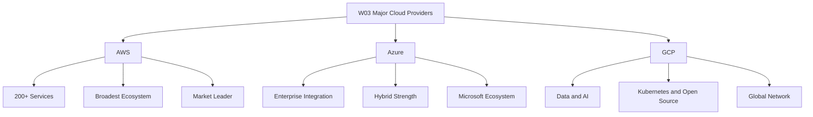
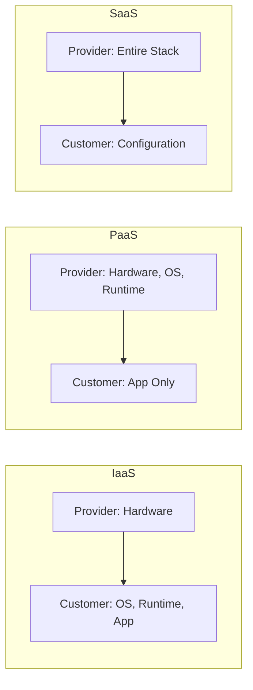
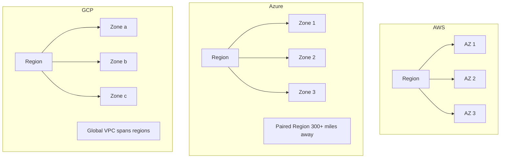

# Migration in progress
# W03: Overview of Major Cloud Providers

This lesson surveys the three dominant cloud platforms: Amazon Web Services (AWS), Microsoft Azure, and Google Cloud Platform (GCP). It covers market positioning, global infrastructure, service models, and the core service categories that map across all three providers. The goal is to build a provider-neutral mental model so you can compare offerings and make informed architectural choices.

## Market Context

The three hyperscalers collectively account for roughly two-thirds of global cloud infrastructure spending. AWS remains the market leader, followed by Azure, with GCP in third place but growing at the fastest rate among the three.

| Provider | Q4 2025 Market Share | Year-over-Year Growth | Primary Strength |
|---|---|---|---|
| AWS | 32% | 24% | Service breadth and ecosystem maturity |
| Azure | 22% | 39% | Enterprise governance and Microsoft integration |
| GCP | 12% | 50% | Data, analytics, Kubernetes, and AI |

- AWS launched in 2006 with S3 object storage and EC2 compute, making it the first major cloud platform.
- Azure leverages Microsoft's enterprise footprint, integrating with Active Directory, Microsoft 365, and Windows Server.
- GCP runs on the same infrastructure that powers Google Search, Gmail, and YouTube.
- GCP's market share grew from 11% to 12% in Q4 2025, with revenue growing 50% year over year.
- Azure reported 39% year-over-year growth in the same quarter, with a total backlog of US$240 billion for GCP and US$244 billion for AWS.

> [!Important]
> **Market share is not the only metric**: Growth rates tell a different story. GCP and Azure are growing faster than AWS in percentage terms, which matters for long-term platform viability and talent availability.

## Cloud Service Models

Cloud services are organized into three fundamental models based on how much of the stack the provider manages versus the customer.

| Model | Provider Manages | Customer Manages | Example Use Case |
|---|---|---|---|
| IaaS | Hardware, virtualization, networking | OS, runtime, apps, data | Lift-and-shift VMs, custom OS configurations |
| PaaS | Hardware, OS, runtime, middleware | Apps and data | Web apps, APIs, microservices |
| SaaS | Entire stack including application | User configuration only | Email, CRM, collaboration tools |

- IaaS gives the most control but requires the most operational responsibility.
- PaaS removes server management so teams focus on application code.
- SaaS delivers ready-to-use software with minimal operational overhead.
- AWS, Azure, and GCP all offer IaaS, PaaS, and SaaS across their portfolios.

> [!Tip]
> **Choose the model that matches your team's capacity**: IaaS makes sense when you need full control. PaaS accelerates delivery when you want to avoid infrastructure work. SaaS eliminates operational burden entirely.

## Global Infrastructure

All three providers organize their physical infrastructure into regions, availability zones, and edge locations. The naming and structure differ, but the design intent is the same: isolate failures and reduce latency.

| Dimension | AWS | Azure | GCP |
|---|---|---|---|
| Regions | 39 geographic regions | 60+ regions | 42 regions |
| Availability Zones | 123 zones | 3+ zones per region where supported | 127 zones |
| Edge Locations | 750+ CloudFront PoPs | 300+ datacenters worldwide | ~202 edge PoPs |
| Region Pairing | No automatic pairing | Automatic region pairs within geography | No automatic pairing |

### AWS Infrastructure

- AWS Regions contain at least three Availability Zones each.
- Availability Zones are isolated data centers with independent power, cooling, and networking.
- AWS operates a fiber optic network spanning nearly 20 million kilometers.
- Additional infrastructure includes Local Zones, Wavelength Zones, and Outposts for edge and hybrid use cases.

### Azure Infrastructure

- Azure regions are clusters of data centers interconnected via a dedicated low-latency network.
- Availability Zones are physically separate locations within a region, each with independent power, cooling, and networking.
- Azure Regional Pairs provide disaster recovery by designating a partner region at least 300 miles away.
- Services like geo-redundant storage replicate data automatically across paired regions.

### GCP Infrastructure

- GCP regions contain three or more zones interconnected with low-latency links.
- Edge Points of Presence (PoPs) are locations where users enter the Google network for faster access to resources.
- GCP's private fiber backbone routes traffic globally without traversing the public internet.
- GCP's global VPC spans regions by default, unlike AWS and Azure where VPCs are regional.

> [!Important]
> **Availability Zones are the unit of resilience**: Regardless of provider, deploying across multiple zones within a region protects against datacenter-level failures including power, cooling, and networking outages.

## Core Service Categories

Cloud services map across four fundamental domains: compute, storage, databases, and networking. Each provider offers comparable services with different names and feature sets.

### Compute Services

| Service Type | AWS | Azure | GCP |
|---|---|---|---|
| Virtual Machines | EC2 | Virtual Machines | Compute Engine |
| Containers | ECS, EKS | AKS | GKE |
| Serverless Functions | Lambda | Azure Functions | Cloud Functions |
| App Hosting | Elastic Beanstalk | App Service | App Engine |

- AWS offers the broadest range of compute options, from bare metal to serverless.
- Azure integrates tightly with Windows Server and Active Dir