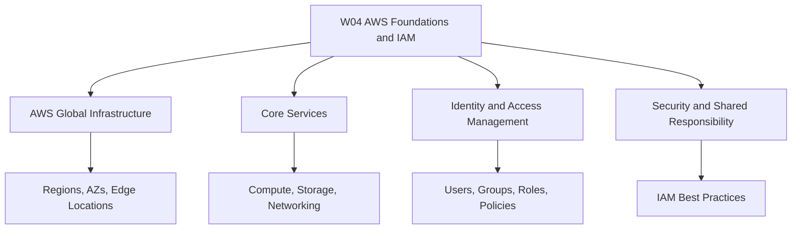

# Migration in progress
# W04: AWS Foundations and IAM - Lesson 0: Module Introduction

This module introduces the foundational services and identity model of Amazon Web Services. It covers global infrastructure, core compute, storage, and networking services, and the Identity and Access Management (IAM) system that controls access to every AWS resource. The goal is to build a working understanding of how AWS is organized and how security is enforced at every layer.

## Module Purpose

- Introduce the physical and logical structure of AWS.
- Explain the building blocks of AWS compute, storage, and networking.
- Describe how IAM controls authentication and authorization.
- Explain the shared responsibility model between AWS and the customer.
- Prepare for hands-on labs and assessment scenarios.

## Learning Objectives

- Describe AWS global infrastructure: Regions, Availability Zones, and Edge Locations.
- Identify core AWS services for compute, storage, and networking.
- Explain the components of IAM: users, groups, roles, and policies.
- Apply the principle of least privilege when designing access controls.
- Understand the shared responsibility model and its implications for security.
- Use the AWS Management Console, CLI, and SDK to interact with AWS.

> [!Tip]
> **Start with the global infrastructure**: Understanding Regions and Availability Zones is the foundation for every architectural decision in AWS. It explains why services are designed the way they are.

## Module Structure

- Lesson 0 introduces the module scope and objectives.
- Later lessons cover AWS global infrastructure and core services.
- IAM lessons cover users, groups, roles, policies, and best practices.
- Security lessons cover the shared responsibility model and compliance.
- Hands-on labs provide practical experience with the console, CLI, and SDK.
- Assessment lessons test scenario-based decision making.

| Lesson | Topic | Focus |
|---|---|---|
| Lesson 0 | Module Introduction | Scope and objectives |
| Lesson 1 | AWS Global Infrastructure | Regions, AZs, Edge Locations |
| Lesson 2 | Core AWS Services | Compute, storage, networking |
| Lesson 3 | IAM Fundamentals | Users, groups, roles, policies |
| Lesson 4 | IAM Best Practices | Least privilege, MFA, key rotation |
| Lesson 5 | Summary and Assessment | Review and scenarios |

## Core Concepts Preview

### AWS Global Infrastructure

- A Region is a physical location around the world where AWS clusters data centers.
- Availability Zones are isolated locations within a Region, each with independent power, cooling, and networking.
- Edge Locations are endpoints for AWS services like CloudFront and Route 53, used to deliver content with low latency.
- AWS operates many Regions worldwide, with multiple Availability Zones per Region.

| Component | Scope | Purpose |
|---|---|---|
| Region | Geographic area | Isolate failures and meet data residency needs |
| Availability Zone | Isolated data center | Provide high availability within a Region |
| Edge Location | Global point of presence | Deliver content and DNS with low latency |

### Core AWS Services

- Compute: EC2 for virtual machines, Lambda for serverless functions, ECS and EKS for containers.
- Storage: S3 for object storage, EBS for block storage, EFS for file storage.
- Networking: VPC for isolated networks, Route 53 for DNS, CloudFront for CDN.

### Identity and Access Management

- IAM controls who can access what in AWS.
- Users represent individual identities.
- Groups are collections of users with shared permissions.
- Roles are temporary identities assumed by services or use