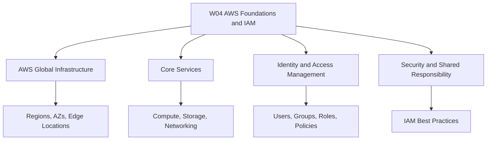
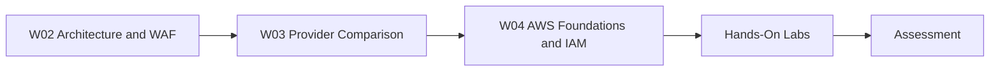
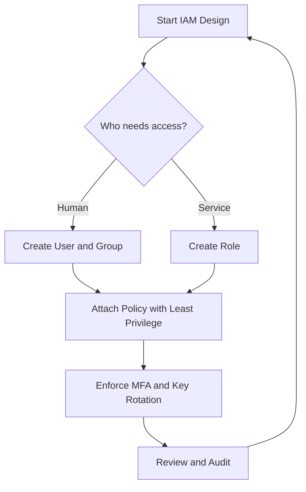

# W04: AWS Foundations and IAM - Lesson 0: Module Introduction

This module introduces the foundational services and identity model of Amazon Web Services. It covers global infrastructure, core compute, storage, and networking services, and the Identity and Access Management (IAM) system that controls access to every AWS resource. The goal is to build a working understanding of how AWS is organized and how security is enforced at every layer.

## Module Purpose

- Introduce the physical and logical structure of AWS.
- Explain the building blocks of AWS compute, storage, and networking.
- Describe how IAM controls authentication and authorization.
- Explain the shared responsibility model between AWS and the customer.
- Prepare for hands-on labs and assessment scenarios.

## Learning Objectives

- Describe AWS global infrastructure: Regions, Availability Zones, and Edge Locations.
- Identify core AWS services for compute, storage, and networking.
- Explain the components of IAM: users, groups, roles, and policies.
- Apply the principle of least privilege when designing access controls.
- Understand the shared responsibility model and its implications for security.
- Use the AWS Management Console, CLI, and SDK to interact with AWS.

> [!Tip]
> **Start with the global infrastructure**: Understanding Regions and Availability Zones is the foundation for every architectural decision in AWS. It explains why services are designed the way they are.

## Module Structure

- Lesson 0 introduces the module scope and objectives.
- Later lessons cover AWS global infrastructure and core services.
- IAM lessons cover users, groups, roles, policies, and best practices.
- Security lessons cover the shared responsibility model and compliance.
- Hands-on labs provide practical experience with the console, CLI, and SDK.
- Assessment lessons test scenario-based decision making.

| Lesson | Topic | Focus |
|---|---|---|
| Lesson 0 | Module Introduction | Scope and objectives |
| Lesson 1 | AWS Global Infrastructure | Regions, AZs, Edge Locations |
| Lesson 2 | Core AWS Services | Compute, storage, networking |
| Lesson 3 | IAM Fundamentals | Users, groups, roles, policies |
| Lesson 4 | IAM Best Practices | Least privilege, MFA, key rotation |
| Lesson 5 | Summary and Assessment | Review and scenarios |

## Core Concepts Preview

### AWS Global Infrastructure

- A Region is a physical location around the world where AWS clusters data centers.
- Availability Zones are isolated locations within a Region, each with independent power, cooling, and networking.
- Edge Locations are endpoints for AWS services like CloudFront and Route 53, used to deliver content with low latency.
- AWS operates many Regions worldwide, with multiple Availability Zones per Region.

| Component | Scope | Purpose |
|---|---|---|
| Region | Geographic area | Isolate failures and meet data residency needs |
| Availability Zone | Isolated data center | Provide high availability within a Region |
| Edge Location | Global point of presence | Deliver content and DNS with low latency |

### Core AWS Services

- Compute: EC2 for virtual machines, Lambda for serverless functions, ECS and EKS for containers.
- Storage: S3 for object storage, EBS for block storage, EFS for file storage.
- Networking: VPC for isolated networks, Route 53 for DNS, CloudFront for CDN.

### Identity and Access Management

- IAM controls who can access what in AWS.
- Users represent individual identities.
- Groups are collections of users with shared permissions.
- Roles are temporary identities assumed by services or users.
- Policies are JSON documents that define permissions.

| Component | Description | Example |
|---|---|---|
| User | Permanent identity | A developer with console access |
| Group | Collection of users | Administrators, Developers |
| Role | Temporary identity | EC2 instance accessing S3 |
| Policy | Permission document | Allow s3:GetObject on a bucket |

> [!Important]
> **Least privilege is the core IAM principle**: Grant only the permissions required to perform a task. Start with no permissions and add only what is needed.

## How This Module Connects to W02 and W03

- W02 covered reliability, performance, and the AWS Well-Architected Framework.
- W03 compared AWS, Azure, and GCP across services, selection factors, and careers.
- W04 goes deep into AWS foundations and IAM as a practical implementation of those concepts.
- The security pillar from W02 is directly applied through IAM design.
- The service comparisons from W03 become concrete AWS configurations.

## Assessment Preparation

### Practice Questions

1. Describe the relationship between Regions, Availability Zones, and Edge Locations.
2. Explain the difference between an IAM user, group, role, and policy.
3. Describe the shared responsibility model for AWS.
4. Explain the principle of least privilege with an example.
5. Identify which AWS services provide compute, storage, and networking.
6. Explain why IAM roles are preferred over long-term access keys for EC2 instances.

### Scenario Questions

**Scenario 1: Granting Access to a Developer**
A new developer needs read-only access to S3 and the ability to launch EC2 instances in a development account. How should you grant access?

- Create an IAM group with a policy that allows s3:GetObject and ec2:RunInstances.
- Add the developer as an IAM user in the group.
- Enforce MFA for console access.
- Avoid granting administrator permissions.

**Scenario 2: EC2 Instance Accessing S3**
An EC2 instance needs to read objects from an S3 bucket. How should you grant access?

- Create an IAM role with a policy that allows s3:GetObject on the bucket.
- Attach the role to the EC2 instance profile.
- Do not create long-term access keys on the instance.
- The instance assumes the role automatically.

**Scenario 3: Multi-Region Deployment**
A company wants to deploy a web application in three Regions for global users. How does AWS global infrastructure support this?

- Deploy compute and databases in multiple Regions.
- Use Route 53 for latency-based routing.
- Use CloudFront and Edge Locations for content delivery.
- Replicate data across Regions for disaster recovery.

## Key Takeaways

- AWS global infrastructure is organized into Regions, Availability Zones, and Edge Locations.
- Regions contain multiple Availability Zones for high availability.
- Core AWS services include compute, storage, networking, and databases.
- IAM controls access to AWS resources through users, groups, roles, and policies.
- The principle of least privilege is the foundation of IAM security.
- IAM roles are preferred over long-term access keys for services.
- The shared responsibility model defines what AWS manages and what customers manage.
- This module builds on W02 architecture and W03 provider comparison.
- Assessment focuses on practical IAM scenarios and core service knowledge.

> [!Important]
> **Security is job zero**: IAM is the first line of defense in AWS. Every design decision should start with identity and access, not add it as an afterthought.
