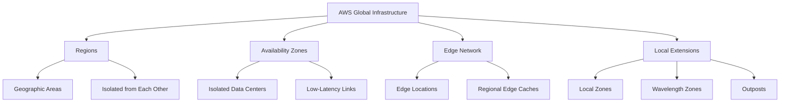
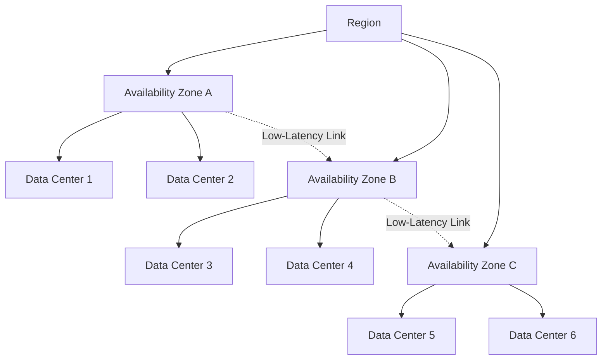

# Migration in progress
# Lesson 1: AWS Global Infrastructure

The AWS Global Infrastructure is the physical foundation of every AWS service. It is organized into Regions, Availability Zones, and a global edge network. Understanding this structure is essential for designing systems that are highly available, fault tolerant, and low latency. The design choices you make about where to place resources directly affect performance, compliance, cost, and resilience.



## AWS Regions

*Definition*: A Region is a separate geographic area where AWS clusters data centers. Each Region is designed to be completely isolated from every other Region.

- Regions are the primary unit of geographic deployment in AWS.
- An outage in one Region does not affect operations in another Region.
- AWS does not automatically replicate resources across Regions. You must do it explicitly.
- When you view resources in the console, you see only the resources tied to the Region you have selected.
- The default Region can be changed in the console or set using the `AWS_DEFAULT_REGION` environment variable.

### Factors for Region Selection

| Factor | Consideration |
|---|---|
| Service Availability | Not every AWS service is available in every Region. Verify support before committing. |
| Latency | Choose a Region close to your users to reduce response times. |
| Compliance | Regulatory requirements may dictate where data must reside (e.g., EU data in EU Regions). |
| Cost | Pricing varies between Regions. Compute and storage costs differ by geography. |
| Disaster Recovery | Pair Regions for cross-Region replication and failover. |

- GovCloud Regions are special AWS Regions designed for US government agencies and customers with sensitive workloads. They address specific regulatory and compliance requirements.

> [!Important]
> **Region isolation is the foundation of fault tolerance**: AWS Regions are designed to be isolated from each other. This design achieves the greatest possible fault tolerance and stability. When you deploy across Regions, you gain resilience against geographic-scale failures.

## Availability Zones

*Definition*: An Availability Zone (AZ) is one or more discrete data centers within a Region, each with redundant power, networking, and connectivity.

- Each Region contains at least three Availability Zones.
- AZs within a Region are connected through low-latency links.
- AZs are isolated from each other, so a failure in one AZ does not affect the others.
- Deploying applications across multiple AZs enhances redundancy and minimizes downtime.
- If you deploy only in one AZ and that AZ fails, your entire application is disrupted.



- An AZ is represented by a Region code followed by a letter identifier (e.g., `us-east-1a`).
- Each AZ has independent power, cooling, and physical security.
- AZs are the unit of resilience for high availability within a single Region.

> [!Tip]
> **Deploy across multiple AZs by default**: Spreading resources across multiple Availability Zones is the standard approach for achieving high availability. Even a simple multi-AZ deployment protects against data center-level failures including power, cooling, and networking outages.

## Edge Network and Points of Presence

*Definition*: The AWS edge network is a global system of Points of Presence (PoPs) that deliver content and services closer to end users.

- The edge network hosts Amazon CloudFront (CDN), Amazon Route 53 (DNS), and AWS Global Accelerator (network optimization).
- The global edge network consists of over 410 PoPs, including more than 400 edge locations and 13 regional mid-tier caches across 90+ cities in 48 countries.
- Edge locations are strategically located sites used primarily to cache and deliver content via CloudFront.
- Regional edge caches sit between edge locations and origin servers, providing a larger cache layer for less frequently accessed content.

| Component | Function | Primary Services |
|---|---|---|
| Edge Location | Cache and deliver content to end users | CloudFront, Route 53 |
| Regional Edge Cache | Larger cache layer between edge and origin | CloudFront |
| AWS Backbone | Private fiber network connecting everything | All AWS traffic |

- Each PoP is isolated from the others. A failure in one PoP or metro area does not impact the rest of the global network.
- Edge locations connect to the AWS backbone, a fully redundant 100 GbE fiber network that circles the globe.
- The AWS global network backbone spans nearly 20 million kilometers of terrestrial and submarine fiber optic cable.

> [!Important]
> **Edge locations reduce latency by reducing distance**: If your web server is deployed in one Region but serves users globally, edge locations allow requests to be served from a nearby location. This significantly enhances performance by reducing the physical distance between users and the served content.

## Local Zones, Wavelength Zones, and Outposts

AWS extends its infrastructure beyond Regions and AZs to meet specialized latency, data residency, and hybrid requirements.

| Extension | Purpose | Use Case |
|---|---|---|
| Local Zones | Extend a Region by placing compute and storage closer to end users in metropolitan areas | Real-time gaming, live streaming, interactive virtual workstations |
| Wavelength Zones | Deploy AWS compute and storage to the edge of telecom carriers' 5G networks | Ultra-low latency for 5G devices and mobile end users |
| AWS Outposts | Bring native AWS services and infrastructure to on-premises data centers or co-location spaces | Hybrid cloud, data residency, low-latency on-premises workloads |

- Local Zones offer a high-bandwidth, secure connection back to the parent Region.
- Local Zones provide a subset of AWS services, including EC2 and EBS.
- Wavelength Zones deploy standard AWS compute and storage services to the edge of 5G networks.
- Outposts bring native AWS services, infrastructure, and operating models to virtually any data center.

```merm