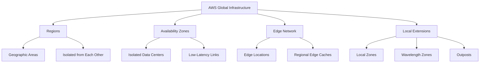
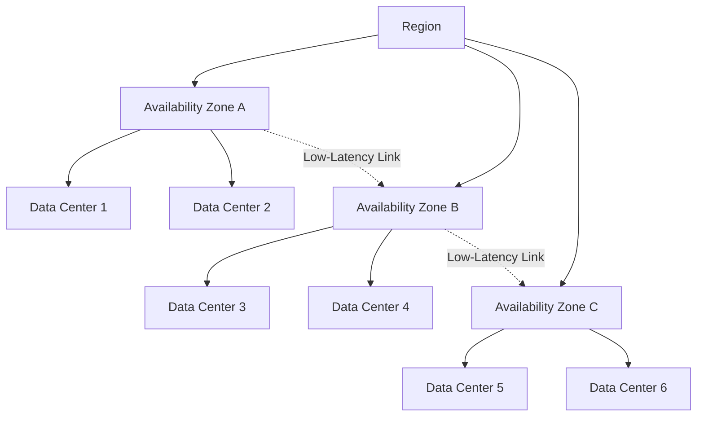
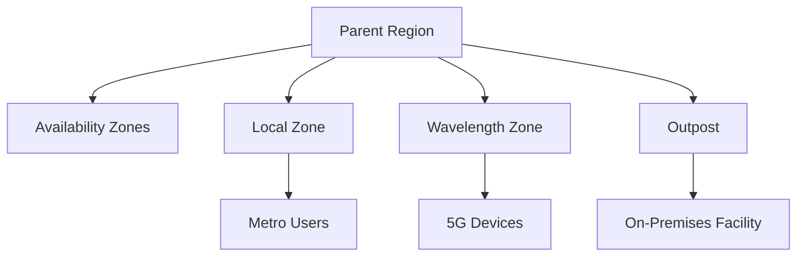
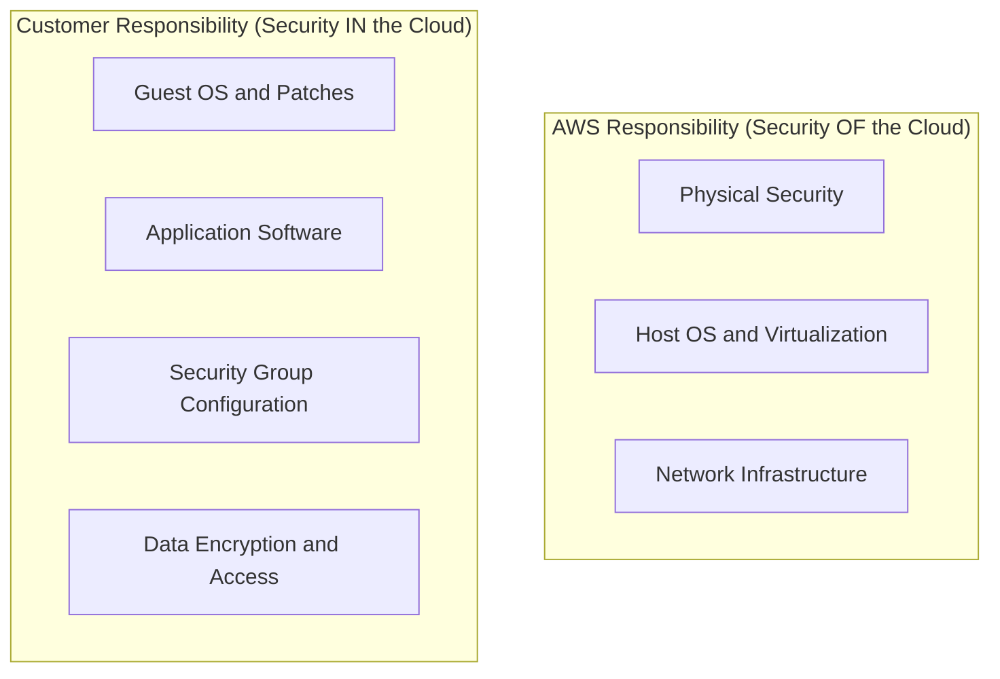
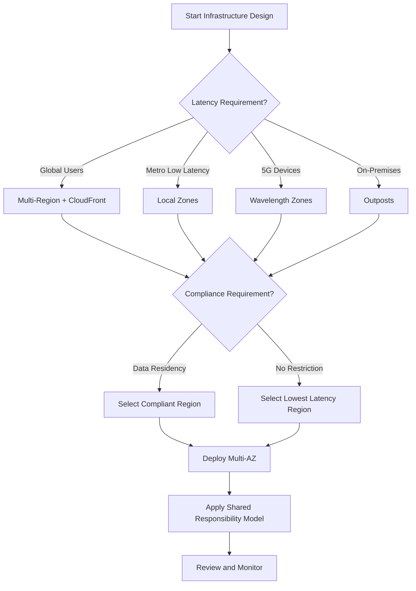

# Lesson 1: AWS Global Infrastructure

The AWS Global Infrastructure is the physical foundation of every AWS service. It is organized into Regions, Availability Zones, and a global edge network. Understanding this structure is essential for designing systems that are highly available, fault tolerant, and low latency. The design choices you make about where to place resources directly affect performance, compliance, cost, and resilience.

## AWS Regions

*Definition*: A Region is a separate geographic area where AWS clusters data centers. Each Region is designed to be completely isolated from every other Region.

- Regions are the primary unit of geographic deployment in AWS.
- An outage in one Region does not affect operations in another Region.
- AWS does not automatically replicate resources across Regions. You must do it explicitly.
- When you view resources in the console, you see only the resources tied to the Region you have selected.
- The default Region can be changed in the console or set using the `AWS_DEFAULT_REGION` environment variable.

### Factors for Region Selection

| Factor | Consideration |
|---|---|
| Service Availability | Not every AWS service is available in every Region. Verify support before committing. |
| Latency | Choose a Region close to your users to reduce response times. |
| Compliance | Regulatory requirements may dictate where data must reside (e.g., EU data in EU Regions). |
| Cost | Pricing varies between Regions. Compute and storage costs differ by geography. |
| Disaster Recovery | Pair Regions for cross-Region replication and failover. |

- GovCloud Regions are special AWS Regions designed for US government agencies and customers with sensitive workloads. They address specific regulatory and compliance requirements.

> [!Important]
> **Region isolation is the foundation of fault tolerance**: AWS Regions are designed to be isolated from each other. This design achieves the greatest possible fault tolerance and stability. When you deploy across Regions, you gain resilience against geographic-scale failures.

## Availability Zones

*Definition*: An Availability Zone (AZ) is one or more discrete data centers within a Region, each with redundant power, networking, and connectivity.

- Each Region contains at least three Availability Zones.
- AZs within a Region are connected through low-latency links.
- AZs are isolated from each other, so a failure in one AZ does not affect the others.
- Deploying applications across multiple AZs enhances redundancy and minimizes downtime.
- If you deploy only in one AZ and that AZ fails, your entire application is disrupted.

- An AZ is represented by a Region code followed by a letter identifier (e.g., `us-east-1a`).
- Each AZ has independent power, cooling, and physical security.
- AZs are the unit of resilience for high availability within a single Region.

> [!Tip]
> **Deploy across multiple AZs by default**: Spreading resources across multiple Availability Zones is the standard approach for achieving high availability. Even a simple multi-AZ deployment protects against data center-level failures including power, cooling, and networking outages.

## Edge Network and Points of Presence

*Definition*: The AWS edge network is a global system of Points of Presence (PoPs) that deliver content and services closer to end users.

- The edge network hosts Amazon CloudFront (CDN), Amazon Route 53 (DNS), and AWS Global Accelerator (network optimization).
- The global edge network consists of over 410 PoPs, including more than 400 edge locations and 13 regional mid-tier caches across 90+ cities in 48 countries.
- Edge locations are strategically located sites used primarily to cache and deliver content via CloudFront.
- Regional edge caches sit between edge locations and origin servers, providing a larger cache layer for less frequently accessed content.

| Component | Function | Primary Services |
|---|---|---|
| Edge Location | Cache and deliver content to end users | CloudFront, Route 53 |
| Regional Edge Cache | Larger cache layer between edge and origin | CloudFront |
| AWS Backbone | Private fiber network connecting everything | All AWS traffic |

- Each PoP is isolated from the others. A failure in one PoP or metro area does not impact the rest of the global network.
- Edge locations connect to the AWS backbone, a fully redundant 100 GbE fiber network that circles the globe.
- The AWS global network backbone spans nearly 20 million kilometers of terrestrial and submarine fiber optic cable.

> [!Important]
> **Edge locations reduce latency by reducing distance**: If your web server is deployed in one Region but serves users globally, edge locations allow requests to be served from a nearby location. This significantly enhances performance by reducing the physical distance between users and the served content.

## Local Zones, Wavelength Zones, and Outposts

AWS extends its infrastructure beyond Regions and AZs to meet specialized latency, data residency, and hybrid requirements.

| Extension | Purpose | Use Case |
|---|---|---|
| Local Zones | Extend a Region by placing compute and storage closer to end users in metropolitan areas | Real-time gaming, live streaming, interactive virtual workstations |
| Wavelength Zones | Deploy AWS compute and storage to the edge of telecom carriers' 5G networks | Ultra-low latency for 5G devices and mobile end users |
| AWS Outposts | Bring native AWS services and infrastructure to on-premises data centers or co-location spaces | Hybrid cloud, data residency, low-latency on-premises workloads |

- Local Zones offer a high-bandwidth, secure connection back to the parent Region.
- Local Zones provide a subset of AWS services, including EC2 and EBS.
- Wavelength Zones deploy standard AWS compute and storage services to the edge of 5G networks.
- Outposts bring native AWS services, infrastructure, and operating models to virtually any data center.

> [!Tip]
> **Local Zones versus Edge Locations**: Local Zones are extensions of a parent AWS Region and offer a subset of AWS services like EC2 and EBS. Edge locations are primarily for caching and content delivery. Local Zones run compute workloads. Edge locations cache content. They serve different purposes but both bring resources closer to users.

## Shared Responsibility Model

*Definition*: Security and compliance is a shared responsibility between AWS and the customer. This model is commonly described as Security "of" the Cloud versus Security "in" the Cloud.

| Responsibility | AWS | Customer |
|---|---|---|
| Physical Security | Data centers, hardware, networking | Not applicable |
| Host Operating System | Managed by AWS | Not applicable for managed services |
| Virtualization Layer | Managed by AWS | Not applicable |
| Guest Operating System | Not applicable | Updates and security patches |
| Application Software | Not applicable | Configuration and management |
| Security Group Firewall | Provides the tool | Configuration of rules |
| Data | Not applicable | Classification, encryption, access control |

- AWS operates, manages, and controls the components from the host operating system and virtualization layer down to the physical security of the facilities.
- The customer assumes responsibility for the guest operating system, application software, and the configuration of AWS-provided security group firewalls.
- Customer responsibilities vary depending on the services used. Managed services shift more responsibility to AWS.

> [!Important]
> **The shared responsibility model depends on the service model**: For IaaS services like EC2, the customer manages more. For managed services like S3 or DynamoDB, AWS manages more of the stack. Always check the specific service documentation to understand where the boundary lies.

## Assessment Preparation

### Practice Questions

1. Describe the relationship between Regions, Availability Zones, and Edge Locations.
2. Explain why each AWS Region contains at least three Availability Zones.
3. List five factors to consider when selecting an AWS Region.
4. Compare Local Zones, Wavelength Zones, and Outposts in terms of purpose and use case.
5. Explain the shared responsibility model using the concept of Security "of" the Cloud versus Security "in" the Cloud.
6. Describe how the AWS global edge network reduces latency for end users.
7. Explain why AWS does not automatically replicate resources across Regions.

### Scenario Questions

**Scenario 1: Global Web Application**
A company needs to serve users in North America, Europe, and Asia with low latency. How should they use AWS global infrastructure?

- Deploy the application in multiple Regions close to user bases.
- Use CloudFront and edge locations to cache static assets globally.
- Use Route 53 for latency-based routing to direct users to the nearest Region.
- Replicate data across Regions for disaster recovery.

**Scenario 2: Real-Time Gaming Application**
A gaming company needs sub-10ms latency for players in major metropolitan areas. Which AWS infrastructure components should they use?

- Use Local Zones to place compute and storage closer to end users in metro areas.
- Use Wavelength Zones for 5G mobile players.
- Use Global Accelerator to optimize network paths.
- Deploy across multiple AZs within the parent Region for resilience.

**Scenario 3: Regulated Financial Services**
A financial services firm must keep EU customer data within the EU and demonstrate strict control over the full stack. Which infrastructure choices apply?

- Select an EU Region that meets data residency requirements.
- Use multiple AZs within the Region for high availability.
- Consider AWS European Sovereign Cloud for strict residency assurances.
- Implement customer-side controls for the guest OS, application, and data encryption.
- Document the shared responsibility boundary for audit purposes.

## Key Takeaways

- AWS global infrastructure is organized into Regions, Availability Zones, and Edge Locations.
- A Region is a separate geographic area, isolated from other Regions for fault tolerance.
- Each Region contains at least three Availability Zones, each with independent power, cooling, and networking.
- Deploying across multiple AZs within a Region provides high availability. Deploying across Regions provides disaster recovery.
- The AWS edge network includes over 400 edge locations and 13 regional edge caches for low-latency content delivery.
- Local Zones, Wavelength Zones, and Outposts extend AWS infrastructure to metro areas, 5G networks, and on-premises facilities.
- The shared responsibility model defines the boundary: AWS is responsible for security of the cloud, and customers are responsible for security in the cloud.
- Customer responsibility varies by service model. Managed services shift more responsibility to AWS.
- Region selection depends on service availability, latency, compliance, cost, and disaster recovery requirements.
- Understanding the global infrastructure is the foundation for every architectural decision in AWS.

> [!Important]
> **Design with the infrastructure in mind from the start**: The choices you make about Regions, Availability Zones, and edge services determine the resilience, performance, and compliance posture of every workload. Do not treat infrastructure as an afterthought. Design for multi-AZ resilience within a Region first, then expand to multi-Region only when business requirements justify the cost and complexity.
