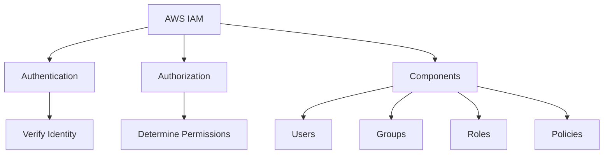
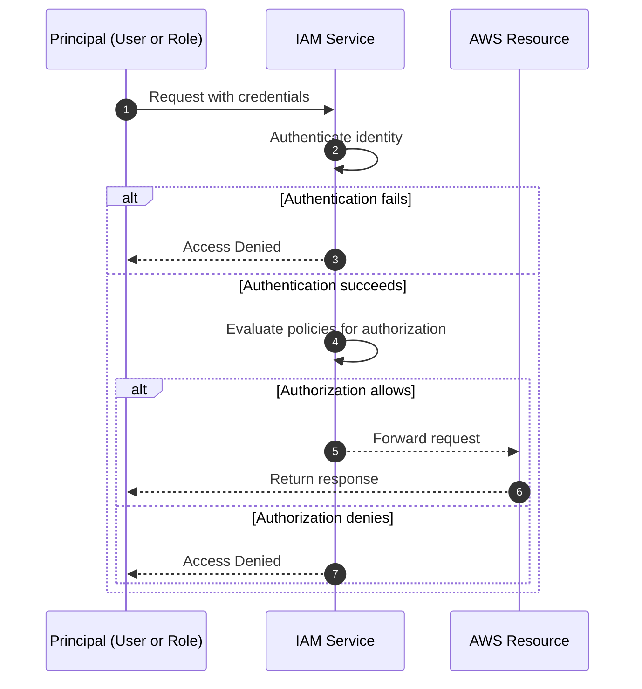
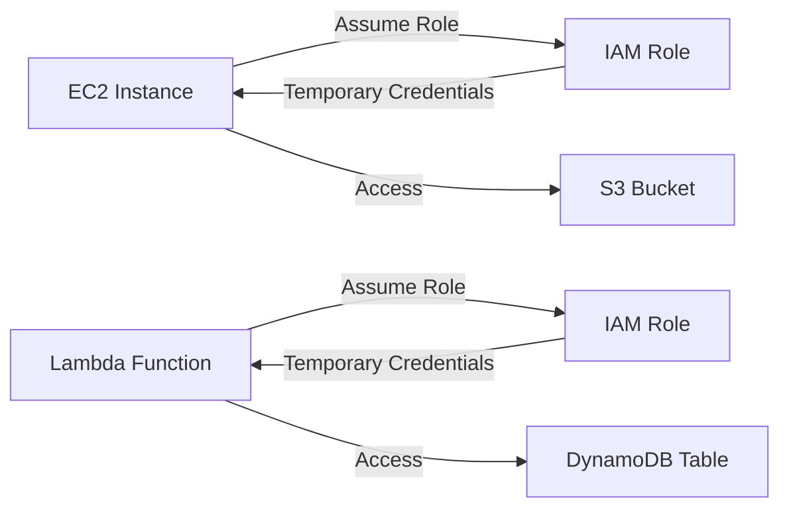
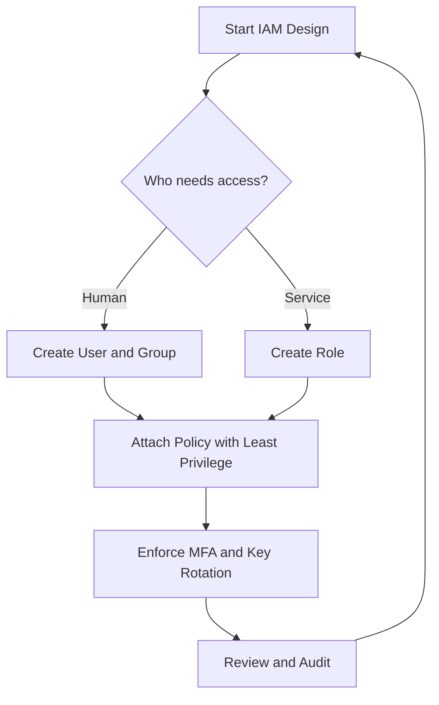

# Lesson 2: Introduction to AWS IAM

AWS Identity and Access Management (IAM) is the service that controls access to AWS resources. It provides authentication (who can sign in) and authorization (what they can do). IAM is global, free to use, and integrated with nearly every AWS service. Understanding IAM is essential for securing any AWS workload.



## What is AWS IAM

*Definition*: IAM is a web service that helps you securely control access to AWS resources. You use IAM to control who is authenticated (signed in) and authorized (has permissions) to use resources.

- IAM is global, not regional. Users, groups, roles, and policies are available across all Regions.
- IAM is offered at no additional cost.
- IAM integrates with most AWS services, allowing fine-grained access control.
- IAM supports identity federation, allowing users to sign in with external identities.

> [!Important]
> **IAM is the foundation of AWS security**: Every request to an AWS service is authenticated and authorized by IAM. If IAM is misconfigured, no other security control can compensate.

## Core IAM Components

| Component | Description | Example |
|---|---|---|
| User | A permanent identity for a person or application | A developer with console access |
| Group | A collection of users with shared permissions | Administrators, Developers |
| Role | A temporary identity assumed by a trusted entity | EC2 instance accessing S3 |
| Policy | A JSON document that defines permissions | Allow s3:GetObject on a bucket |

- **Users** represent individual identities. Each user has unique credentials (password for console, access keys for CLI/API).
- **Groups** simplify permission management. You attach policies to a group, and all users in the group inherit those permissions.
- **Roles** are temporary identities. They are assumed by services, applications, or federated users. Roles do not have long-term credentials.
- **Policies** are JSON documents. They specify what actions are allowed or denied on which resources.

> [!Tip]
> **Use groups to assign permissions**: Never attach policies directly to users. Attach policies to groups, then add users to the appropriate groups. This simplifies management and reduces errors.

## How IAM Works

Every AWS request goes through authentication and authorization.



- Authentication verifies the identity of the principal.
- Authorization determines whether the principal has permission to perform the requested action.
- IAM evaluates all applicable policies. An explicit deny always overrides any allow.
- If no policy explicitly allows an action, the default is deny.

> [!Important]
> **Explicit deny always wins**: If any policy denies an action, the request is denied, even if another policy allows it. Design policies carefully to avoid unintended denials.

## IAM Policies

*Definition*: An IAM policy is a JSON document that defines permissions. It specifies who can do what on which resources.

### Policy Structure

A policy contains one or more statements. Each statement includes:

- Effect: Allow or Deny.
- Action: The specific API actions (e.g., s3:GetObject).
- Resource: The AWS resources the action applies to (e.g., an S3 bucket ARN).
- Condition: Optional constraints (e.g., require MFA, restrict source IP).

Example policy snippet:

```json
{
  "Version": "2012-10-17",
  "Statement": [
    {
      "Effect": "Allow",
      "Action": "s3:GetObject",
      "Resource": "arn:aws:s3:::example-bucket/*"
    }
  ]
}
```

### Types of Policies

| Policy Type | Description | Attached To |
|---|---|---|
| Identity-based | Permissions for a user, group, or role | IAM identities |
| Resource-based | Permissions for a resource (e.g., S3 bucket) | AWS resources |
| Permissions boundary | Maximum permissions an identity can have | IAM users or roles |
| Service control policy (SCP) | Maximum permissions for an AWS account | AWS Organizations |
| Session policy | Permissions for a temporary session | Assumed role sessions |

- Identity-based policies are the most common. They define what an identity can do.
- Resource-based policies define who can access a resource. They are used for cross-account access.
- Permissions boundaries and SCPs set maximum permissions but do not grant permissions themselves.

> [!Tip]
> **Use resource-based policies for cross-account access**: When granting access to users in another AWS account, a resource-based policy on the resource is often simpler than assuming a role.

## IAM Roles and Temporary Credentials

*Definition*: An IAM role is an identity that you can assume to gain temporary access to AWS resources. Roles do not have long-term credentials.

- Roles are assumed by trusted entities: AWS services, applications, or federated users.
- When a role is assumed, the entity receives temporary security credentials.
- Temporary credentials expire after a configurable duration.
- Common use cases:
    - EC2 instances accessing S3 or DynamoDB.
    - Lambda functions accessing other AWS services.
    - Cross-account access.
    - Federated user access from corporate directories.



> [!Important]
> **Prefer roles over long-term access keys**: Long-term access keys are a security risk. Use IAM roles to grant temporary credentials to applications and services. This eliminates the need to manage and rotate static keys.

## IAM Best Practices

- **Follow least privilege**: Grant only the permissions required to perform a task. Start with no permissions and add only what is needed.
- **Enable MFA**: Require multi-factor authentication for all users, especially privileged accounts.
- **Rotate credentials regularly**: Change passwords and access keys periodically.
- **Use groups to assign permissions**: Manage permissions at the group level, not per user.
- **Use roles for applications**: Grant applications temporary credentials through roles.
- **Monitor activity**: Use AWS CloudTrail to log all IAM and API activity.
- **Use policy conditions**: Restrict access by IP address, time of day, or MFA requirement.
- **Review permissions regularly**: Audit IAM policies and remove unused permissions.

> [!Important]
> **Least privilege is a continuous process**: Permissions tend to grow over time. Regularly review and remove permissions that are no longer needed.

> [!Tip]
> **Use IAM Access Analyzer**: This tool helps identify resources shared with external entities and validates policies against best practices.

## Common IAM Use Cases

### Granting Console Access to a Developer

- Create an IAM group for developers.
- Attach a policy that allows read-only access to specific services.
- Create an IAM user and add them to the group.
- Enforce MFA for console access.

### Granting EC2 Access to S3

- Create an IAM role with a policy that allows s3:GetObject on the target bucket.
- Attach the role to the EC2 instance profile.
- The instance automatically assumes the role and receives temporary credentials.

### Cross-Account Access

- Create a role in Account B that trusts Account A.
- Grant users in Account A permission to assume the role.
- Users in Account A assume the role and access resources in Account B.

## Assessment Preparation

### Practice Questions

1. Explain the difference between an IAM user, group, role, and policy.
2. Describe how IAM authentication and authorization work.
3. Explain the policy evaluation logic, including explicit deny.
4. Compare identity-based and resource-based policies.
5. Describe when to use IAM roles instead of users.
6. List five IAM best practices.
7. Explain the principle of least privilege with an example.
8. Describe how EC2 instances can access S3 without long-term access keys.

### Scenario Questions

**Scenario 1: Developer Access**
A new developer needs read-only access to S3 and the ability to launch EC2 instances in a development account. How should you grant access?

- Create an IAM group with a policy that allows s3:GetObject and ec2:RunInstances.
- Add the developer as an IAM user in the group.
- Enforce MFA for console access.
- Avoid granting administrator permissions.

**Scenario 2: EC2 Instance Accessing S3**
An EC2 instance needs to read objects from an S3 bucket. How should you grant access?

- Create an IAM role with a policy that allows s3:GetObject on the bucket.
- Attach the role to the EC2 instance profile.
- Do not create long-term access keys on the instance.
- The instance assumes the role automatically.

**Scenario 3: Cross-Account Access**
A company wants to allow a partner to access a specific S3 bucket in their AWS account. How should they grant access?

- Create an IAM role in the company's account that trusts the partner's account.
- Grant the partner permission to assume the role.
- Alternatively, use a resource-based policy on the S3 bucket.
- Follow least privilege and audit access with CloudTrail.



## Key Takeaways

- IAM is the service that controls access to AWS resources.
- IAM is global, free, and integrated with most AWS services.
- Core components are users, groups, roles, and policies.
- Authentication verifies identity. Authorization determines permissions.
- Policies are JSON documents that define permissions.
- Explicit deny always overrides any allow. Default is deny.
- Roles provide temporary credentials and are preferred over long-term access keys.
- Least privilege, MFA, and regular review are essential best practices.
- IAM roles are used for EC2, Lambda, cross-account access, and federation.
- Use groups to manage permissions for users.
- Monitor IAM activity with CloudTrail.
- IAM is the foundation of AWS security.

> [!Important]
> **IAM is job zero**: Every AWS design decision starts with identity and access. A secure IAM configuration is the first line of defense. Always apply least privilege, use roles for services, enable MFA, and monitor activity.
