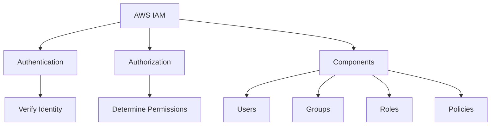
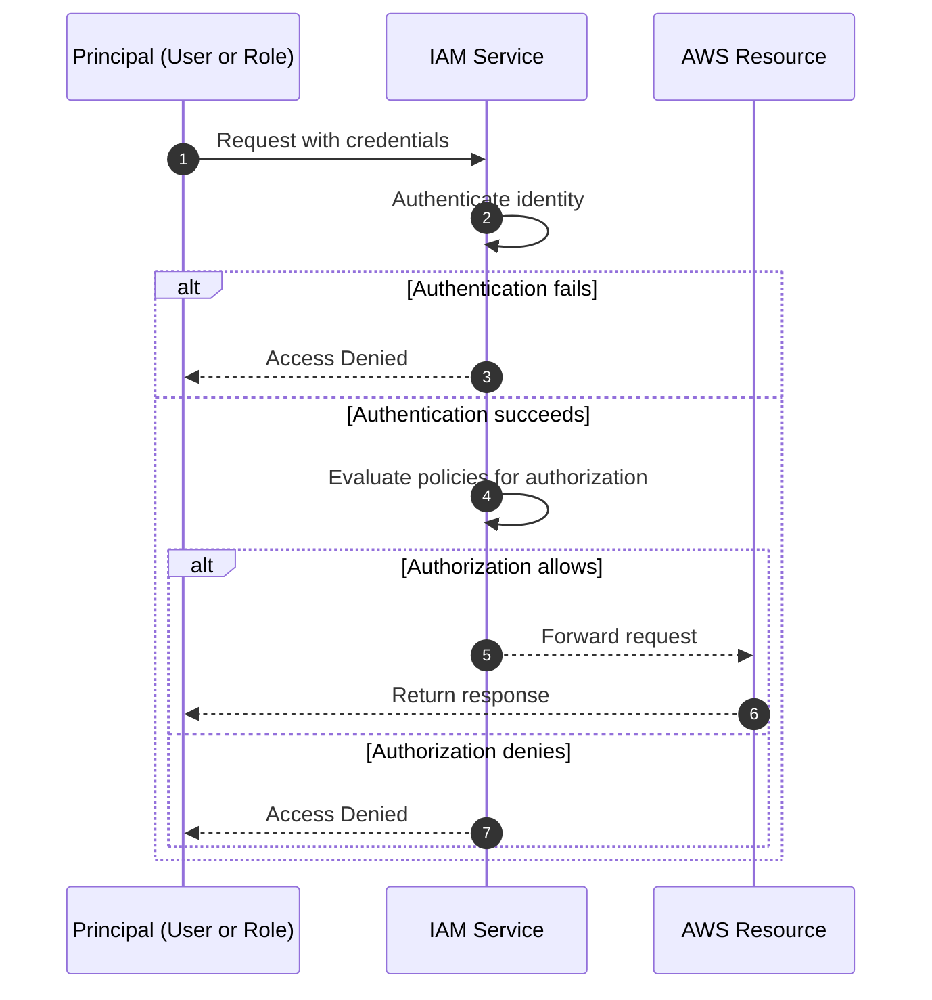

# Migration in progress
# Lesson 2: Introduction to AWS IAM

AWS Identity and Access Management (IAM) is the service that controls access to AWS resources. It provides authentication (who can sign in) and authorization (what they can do). IAM is global, free to use, and integrated with nearly every AWS service. Understanding IAM is essential for securing any AWS workload.



## What is AWS IAM

*Definition*: IAM is a web service that helps you securely control access to AWS resources. You use IAM to control who is authenticated (signed in) and authorized (has permissions) to use resources.

- IAM is global, not regional. Users, groups, roles, and policies are available across all Regions.
- IAM is offered at no additional cost.
- IAM integrates with most AWS services, allowing fine-grained access control.
- IAM supports identity federation, allowing users to sign in with external identities.

> [!Important]
> **IAM is the foundation of AWS security**: Every request to an AWS service is authenticated and authorized by IAM. If IAM is misconfigured, no other security control can compensate.

## Core IAM Components

| Component | Description | Example |
|---|---|---|
| User | A permanent identity for a person or application | A developer with console access |
| Group | A collection of users with shared permissions | Administrators, Developers |
| Role | A temporary identity assumed by a trusted entity | EC2 instance accessing S3 |
| Policy | A JSON document that defines permissions | Allow s3:GetObject on a bucket |

- **Users** represent individual identities. Each user has unique credentials (password for console, access keys for CLI/API).
- **Groups** simplify permission management. You attach policies to a group, and all users in the group inherit those permissions.
- **Roles** are temporary identities. They are assumed by services, applications, or federated users. Roles do not have long-term credentials.
- **Policies** are JSON documents. They specify what actions are allowed or denied on which resources.

> [!Tip]
> **Use groups to assign permissions**: Never attach policies directly to users. Attach policies to groups, then add users to the appropriate groups. This simplifies management and reduces errors.

## How IAM Works

Every AWS request goes through authentication and authorization.



- Authentication verifies the identity of the principal.
- Authorization determines whether the principal has permission to perform the requested action.
- IAM evaluates all applicable policies. An explicit deny always overrides any allow.
- If no policy explicitly allows an action, the default is deny.

> [!Important]
> **Explicit deny always wins**: If any policy denies an action, the request is denied, even if another policy allows it. Design policies carefully to avoid unintended denials.

## IAM Policies

*Definition*: An IAM policy is a JSON document that defines permissions. It specifies who can do what on which resources.

### Policy Structure

A policy contains one or more statements. Each statement includes:

- Effect: Allow or Deny.
- Action: The specific API actions (e.g., s3:GetObject).
- Resource: The AWS resources the action applies to (e.g., an S3 bucket ARN).
- Condition: Optional constraints (e.g., require MFA, restrict source IP).

Example policy snippet:

```json
{
  "Version": "2012-10-17",
  "Statement": [
    {
      "Effect": "Allow",
      "Action": "s3:GetObject",
      "Resource": "arn:aws:s3:::example-bucket/*"
    }
  ]
}
```

### Types of Policies

| Policy Type | Description | Attached To |
|---|---|---|
| Identity-based | Permissions for a user, group, or role | IAM identities |
| Resource-based | Permissions for a resource (e.g., S3 bucket) | AWS resources |
| Permissions boundary | Maximum permissions an identity can have | IAM users or roles |
| Service control policy (SCP) | Maximum permissions for an AWS account | AWS Organizations |
| Session policy | Permissions for a temporary session | Assumed role sessions |

- Identity-based policies are the most common. They define what an identity can do.
- Resource-based policies define who can access a resource. They are used for cross-account access.
- Permissions boundaries and SCPs set maximum permissions but do not grant permissions themselves.

> [!Tip]
> **Use resource-based policies for cross-account access**: When granting access to users in another AWS account, a resource-based policy on the resource is often simpler than assuming a role.

## IAM Roles and Temporary Credentials

*Definition*: An IAM role is an identity that you can assume to gain temporary access to AWS resources. Roles do not have long-term credentials.

- Roles are assumed by trusted entities: AWS services, applications, or federated use