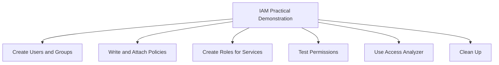
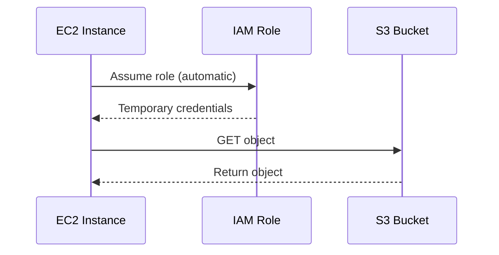
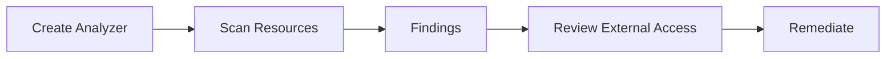
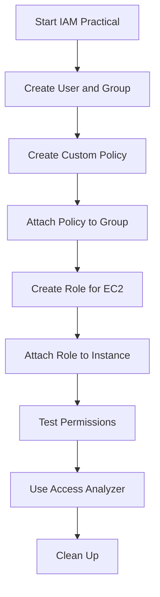

# Lesson 3: IAM Practical Demonstration

This lesson walks through common IAM tasks using the AWS Management Console, AWS CLI, and IAM policy simulator. It covers creating users, groups, policies, roles, testing permissions, and using IAM Access Analyzer. The goal is to translate IAM theory into hands-on practice.



## Prerequisites

- An AWS account with administrative access.
- AWS CLI installed and configured with credentials that have IAM permissions.
- Basic familiarity with JSON and the AWS Management Console.

> [!Tip]
> **Use a sandbox account**: Practice IAM tasks in a dedicated development or sandbox account to avoid accidental changes to production permissions.

## Step 1: Create an IAM User and Group

### Using the Console

1. Sign in to the AWS Management Console as an administrator.
2. Navigate to IAM.
3. In the navigation pane, choose **Users**, then **Add users**.
4. Enter a user name (e.g., `developer-anna`).
5. Select **Provide user access to the AWS Management Console** if console access is needed. Set a custom password or auto-generate.
6. Choose **Next**.
7. Select **Add user to group**, then **Create group**.
8. Name the group (e.g., `Developers`). Attach a policy such as `AmazonS3ReadOnlyAccess`.
9. Create the group and add the user to it.
10. Review and create the user.

### Using the CLI

```bash
# Create a group
aws iam create-group --group-name Developers

# Attach a managed policy to the group
aws iam attach-group-policy --group-name Developers --policy-arn arn:aws:iam::aws:policy/AmazonS3ReadOnlyAccess

# Create a user
aws iam create-user --user-name developer-anna

# Add user to group
aws iam add-user-to-group --group-name Developers --user-name developer-anna
```

| Resource | Name | Purpose |
|---|---|---|
| Group | Developers | Shared permissions for developers |
| User | developer-anna | Individual identity |
| Policy | AmazonS3ReadOnlyAccess | Read-only access to S3 |

> [!Important]
> **Always use groups for human users**: Attaching policies directly to users makes permission management difficult. Groups let you update permissions in one place.

## Step 2: Write and Attach a Custom Policy

Suppose you need to allow a user to read objects from a specific S3 bucket only. Create a custom policy.

### Policy JSON

```json
{
  "Version": "2012-10-17",
  "Statement": [
    {
      "Effect": "Allow",
      "Action": "s3:GetObject",
      "Resource": "arn:aws:s3:::example-bucket/*"
    }
  ]
}
```

### Create Policy via CLI

```bash
aws iam create-policy \
  --policy-name ReadExampleBucket \
  --policy-document file://read-example-bucket.json
```

### Attach Policy to Group

```bash
aws iam attach-group-policy \
  --group-name Developers \
  --policy-arn arn:aws:iam::123456789012:policy/ReadExampleBucket
```

- Custom policies follow least privilege.
- Replace `example-bucket` and the account ID with your own values.
- The policy allows only `s3:GetObject` on that specific bucket.

> [!Tip]
> **Test policies with the IAM Policy Simulator**: Before attaching a policy, use the simulator in the IAM console to validate that the actions you intend to allow or deny behave as expected.

## Step 3: Create a Role for an EC2 Instance

An EC2 instance needs to read from the same S3 bucket without long-term access keys.

### Using the Console

1. In IAM, choose **Roles**, then **Create role**.
2. Select **AWS service** as the trusted entity, then **EC2**.
3. Attach the custom policy `ReadExampleBucket`.
4. Name the role (e.g., `EC2-S3-Read-Role`).
5. Create the role.

### Using the CLI

```bash
# Create trust policy document
cat > ec2-trust-policy.json <<EOF
{
  "Version": "2012-10-17",
  "Statement": [
    {
      "Effect": "Allow",
      "Principal": { "Service": "ec2.amazonaws.com" },
      "Action": "sts:AssumeRole"
    }
  ]
}
EOF

# Create role
aws iam create-role \
  --role-name EC2-S3-Read-Role \
  --assume-role-policy-document file://ec2-trust-policy.json

# Attach policy to role
aws iam attach-role-policy \
  --role-name EC2-S3-Read-Role \
  --policy-arn arn:aws:iam::123456789012:policy/ReadExampleBucket
```

### Attach Role to EC2 Instance

- In the EC2 console, select the instance, choose **Actions**, **Security**, **Modify IAM role**.
- Select `EC2-S3-Read-Role` and save.



> [!Important]
> **Never store access keys on EC2**: Use IAM roles to provide temporary credentials. This eliminates key rotation and reduces the risk of credential leakage.

## Step 4: Test Permissions

### Test Console Access

- Sign in as `developer-anna` using the console URL.
- Verify that the user can list S3 buckets but cannot delete objects.

### Test CLI Access

```bash
# Configure a profile for the user
aws configure --profile anna

# List S3 buckets (should succeed)
aws s3 ls --profile anna

# Attempt to delete an object (should fail)
aws s3 rm s3://example-bucket/test.txt --profile anna
```

### Use IAM Policy Simulator

- In the IAM console, choose **Policy simulator**.
- Select the user or role, choose a service (S3), and select actions.
- Run simulation to see allowed or denied results.

| Action | Expected Result |
|---|---|
| s3:ListAllMyBuckets | Allowed (if policy includes it) |
| s3:GetObject on example-bucket | Allowed |
| s3:DeleteObject on example-bucket | Denied |
| ec2:RunInstances | Denied |

> [!Tip]
> **Simulate before you deploy**: The IAM Policy Simulator helps you validate permissions without making actual API calls, reducing the risk of accidental access.

## Step 5: Use IAM Access Analyzer

IAM Access Analyzer helps identify resources shared with external entities and validates policies against best practices.

- Navigate to IAM, then **Access Analyzer**.
- Create an analyzer for your account.
- Review findings for S3 buckets, IAM roles, KMS keys, and other resources shared outside your account.
- Use policy validation to check for syntax errors and best practice violations.



> [!Important]
> **Access Analyzer is not automatic**: You must create an analyzer and review findings regularly. It does not block access; it only reports.

## Step 6: Clean Up

To avoid unnecessary charges and maintain security:

- Delete the IAM user `developer-anna`.
- Delete the group `Developers`.
- Detach and delete the custom policy `ReadExampleBucket`.
- Delete the role `EC2-S3-Read-Role`.
- Remove the role from any EC2 instances.
- Delete the Access Analyzer.

```bash
aws iam remove-user-from-group --group-name Developers --user-name developer-anna
aws iam delete-user --user-name developer-anna
aws iam detach-group-policy --group-name Developers --policy-arn arn:aws:iam::123456789012:policy/ReadExampleBucket
aws iam delete-group --group-name Developers
aws iam detach-role-policy --role-name EC2-S3-Read-Role --policy-arn arn:aws:iam::123456789012:policy/ReadExampleBucket
aws iam delete-role --role-name EC2-S3-Read-Role
aws iam delete-policy --policy-arn arn:aws:iam::123456789012:policy/ReadExampleBucket
```

> [!Tip]
> **Clean up after labs**: Leaving unused IAM users, roles, and policies increases security risk and can lead to confusion. Always clean up sandbox resources.

## Assessment Preparation

### Practice Questions

1. Describe the steps to create an IAM user and add them to a group.
2. Write a JSON policy that allows read-only access to a specific S3 bucket.
3. Explain how to create an IAM role for an EC2 instance and attach it.
4. Describe how to test IAM permissions using the policy simulator.
5. Explain the purpose of IAM Access Analyzer and how to use it.
6. List the cleanup steps after an IAM practical exercise.

### Scenario Questions

**Scenario 1: Onboarding a New Developer**
A new developer joins the team. They need console access and read-only permissions to S3 and EC2. Outline the steps.

- Create a group `Developers` with policies `AmazonS3ReadOnlyAccess` and `AmazonEC2ReadOnlyAccess`.
- Create an IAM user for the developer.
- Add the user to the group.
- Enforce MFA and provide console sign-in URL.

**Scenario 2: EC2 Access to S3**
An application running on EC2 needs to write logs to an S3 bucket. How do you grant access?

- Create an IAM role with a policy allowing `s3:PutObject` on the log bucket.
- Attach the role to the EC2 instance profile.
- The application uses the instance metadata service to obtain temporary credentials.

**Scenario 3: Cross-Account Access**
A partner company needs to read from your S3 bucket. How do you grant access securely?

- Create a role in your account that trusts the partner's AWS account.
- Grant the partner permission to assume the role.
- Alternatively, add a bucket policy that allows the partner's account.
- Use least privilege and monitor with CloudTrail.



## Key Takeaways

- IAM practical tasks include creating users, groups, policies, and roles.
- Use groups to manage permissions for human users.
- Write custom policies in JSON to follow least privilege.
- Create roles for AWS services like EC2 to avoid long-term access keys.
- Test permissions using the console, CLI, and IAM Policy Simulator.
- Use IAM Access Analyzer to find external access and validate policies.
- Always clean up unused IAM resources after labs.
- The practical demonstration reinforces the theory from Lesson 2.
- Hands-on practice is essential for IAM proficiency.

> [!Important]
> **Practice in a sandbox**: IAM mistakes can lock you out or expose resources. Always practice in a non-production account, use least privilege, and clean up afterwards.
