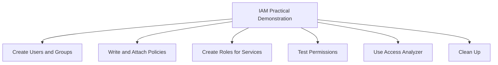
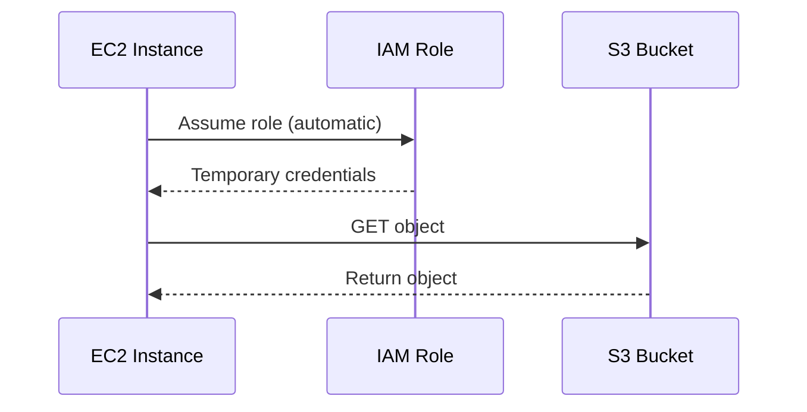

# Migration in progress
# Lesson 3: IAM Practical Demonstration

This lesson walks through common IAM tasks using the AWS Management Console, AWS CLI, and IAM policy simulator. It covers creating users, groups, policies, roles, testing permissions, and using IAM Access Analyzer. The goal is to translate IAM theory into hands-on practice.



## Prerequisites

- An AWS account with administrative access.
- AWS CLI installed and configured with credentials that have IAM permissions.
- Basic familiarity with JSON and the AWS Management Console.

> [!Tip]
> **Use a sandbox account**: Practice IAM tasks in a dedicated development or sandbox account to avoid accidental changes to production permissions.

## Step 1: Create an IAM User and Group

### Using the Console

1. Sign in to the AWS Management Console as an administrator.
2. Navigate to IAM.
3. In the navigation pane, choose **Users**, then **Add users**.
4. Enter a user name (e.g., `developer-anna`).
5. Select **Provide user access to the AWS Management Console** if console access is needed. Set a custom password or auto-generate.
6. Choose **Next**.
7. Select **Add user to group**, then **Create group**.
8. Name the group (e.g., `Developers`). Attach a policy such as `AmazonS3ReadOnlyAccess`.
9. Create the group and add the user to it.
10. Review and create the user.

### Using the CLI

```bash
# Create a group
aws iam create-group --group-name Developers

# Attach a managed policy to the group
aws iam attach-group-policy --group-name Developers --policy-arn arn:aws:iam::aws:policy/AmazonS3ReadOnlyAccess

# Create a user
aws iam create-user --user-name developer-anna

# Add user to group
aws iam add-user-to-group --group-name Developers --user-name developer-anna
```

| Resource | Name | Purpose |
|---|---|---|
| Group | Developers | Shared permissions for developers |
| User | developer-anna | Individual identity |
| Policy | AmazonS3ReadOnlyAccess | Read-only access to S3 |

> [!Important]
> **Always use groups for human users**: Attaching policies directly to users makes permission management difficult. Groups let you update permissions in one place.

## Step 2: Write and Attach a Custom Policy

Suppose you need to allow a user to read objects from a specific S3 bucket only. Create a custom policy.

### Policy JSON

```json
{
  "Version": "2012-10-17",
  "Statement": [
    {
      "Effect": "Allow",
      "Action": "s3:GetObject",
      "Resource": "arn:aws:s3:::example-bucket/*"
    }
  ]
}
```

### Create Policy via CLI

```bash
aws iam create-policy \
  --policy-name ReadExampleBucket \
  --policy-document file://read-example-bucket.json
```

### Attach Policy to Group

```bash
aws iam attach-group-policy \
  --group-name Developers \
  --policy-arn arn:aws:iam::123456789012:policy/ReadExampleBucket
```

- Custom policies follow least privilege.
- Replace `example-bucket` and the account ID with your own values.
- The policy allows only `s3:GetObject` on that specific bucket.

> [!Tip]
> **Test policies with the IAM Policy Simulator**: Before attaching a policy, use the simulator in the IAM console to validate that the actions you intend to allow or deny behave as expected.

## Step 3: Create a Role for an EC2 Instance

An EC2 instance needs to read from the same S3 bucket without long-term access keys.

### Using the Console

1. In IAM, choose **Roles**, then **Create role**.
2. Select **AWS service** as the trusted entity, then **EC2**.
3. Attach the custom policy `ReadExampleBucket`.
4. Name the role (e.g., `EC2-S3-Read-Role`).
5. Create the role.

### Using the CLI

```bash
# Create trust policy document
cat > ec2-trust-policy.json <<EOF
{
  "Version": "2012-10-17",
  "Statement": [
    {
      "Effect": "Allow",
      "Principal": { "Service": "ec2.amazonaws.com" },
      "Action": "sts:AssumeRole"
    }
  ]
}
EOF

# Create role
aws iam create-role \
  --role-name EC2-S3-Read-Role \
  --assume-role-policy-document file://ec2-trust-policy.json

# Attach policy to role
aws iam attach-role-policy \
  --role-name EC2-S3-Read-Role \
  --policy-arn arn:aws:iam::123456789012:policy/ReadExampleBucket
```

### Attach Role to EC2 Instance

- In the EC2 console, select the instance, choose **Actions**, **Security**, **Modify IAM role**.
- Select `EC2-S3-Read-Role` and save.



> [!Important]
> **Never store access keys on EC2**: Use IAM roles to provide temporary credentials. This eliminates key rotation and reduces the risk of credential leakage.

## Step 4: Test Permissions

### Test Console Access

- Sign in as `developer-anna` using the console URL.
- Verify that the user can list S3 buckets but cannot delete objects.

### Test CLI Access

```bash
# Configure a profile for the user
aws confi