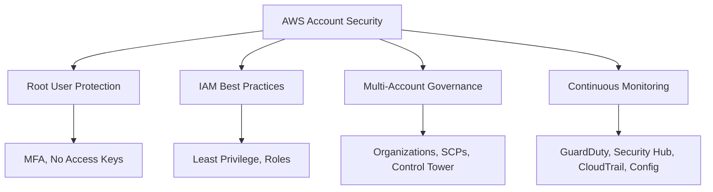
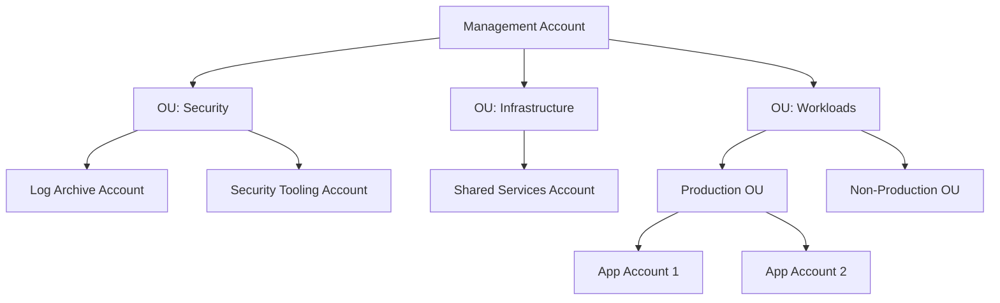
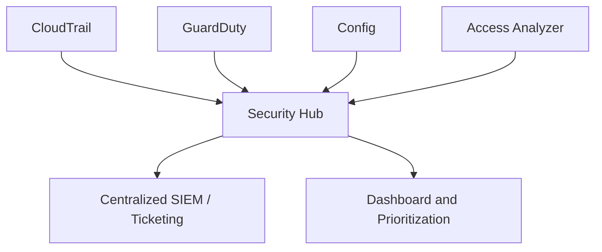
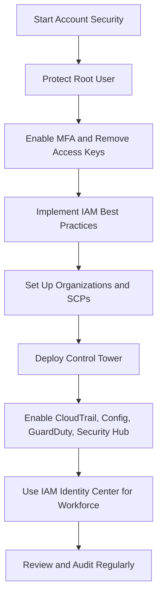

# Lesson 4: Securing AWS Accounts

Securing an AWS account is the foundation of every secure workload. The root user is the most privileged identity and must be locked down. IAM best practices, multi-account governance, and continuous monitoring complete the defense-in-depth strategy. This lesson covers the controls that protect the account itself before any workload is deployed.

## Root User Protection

*Definition*: The root user is the most privileged user in an AWS account. It has unrestricted access to every resource and service. Protecting the root user is the single most important account-level security control.

### Root User Best Practices

- Enable MFA for the root user. AWS recommends using a passkey or hardware security key for stronger phishing resistance.
- Do not create access keys for the root user. Delete any existing root access keys.
- Reserve root sign-in for a short, documented list of tasks that genuinely require it, such as closing the account or changing support plans.
- Monitor and configure notifications for root user activity using CloudTrail and CloudWatch alarms.
- Enable multiple MFA devices for the root user to avoid lockout.
- Review and update account settings and contact information so you have access to the email and phone on file.

> [!Important]
> **The root user is the keys to the kingdom**: Compromise of the root user means total account compromise. Lock it down, enable MFA, remove access keys, and use it only when absolutely necessary.

## IAM Best Practices

- Follow least privilege. Grant only the permissions required to perform a task. Start with no permissions and add only what is needed.
- Use groups to assign permissions. Never attach policies directly to users.
- Use IAM roles for applications and services. Avoid long-term access keys.
- Rotate IAM access keys regularly. Delete unused keys.
- Enforce a strong password policy.
- Require MFA for all users, especially privileged accounts.
- Use IAM Access Analyzer to identify resources shared externally.
- Use permission boundaries for delegated administration.
- Write policies with explicit actions and resources. Avoid wildcards.

> [!Tip]
> **Kill long-lived access keys**: Use IAM roles and temporary credentials wherever possible. Long-lived access keys are a leading cause of credential leakage.

## Multi-Account Governance

*Definition*: AWS Organizations is a service that lets you centrally manage and govern multiple AWS accounts. It provides consolidated billing, account creation, and policy-based controls.

### AWS Organizations and Service Control Policies

- Organizations groups accounts into organizational units (OUs) for hierarchical management.
- Service control policies (SCPs) set maximum permissions for accounts in an organization.
- SCPs do not grant permissions. They define guardrails that limit what IAM principals can do.
- SCPs apply to member accounts but not the management account.
- Multiple SCPs can be attached at different levels in the hierarchy.
- Common SCP use cases:
    - Deny access to unapproved AWS Regions.
    - Prevent CloudTrail configuration changes.
    - Restrict security group modifications.
    - Disable root access for member accounts.

> [!Important]
> **SCPs are guardrails, not grants**: An SCP that allows an action does not mean the action is permitted. The IAM policy must also allow it. SCPs only restrict.

### AWS Control Tower

- Control Tower automates the setup of a secure, multi-account AWS environment based on AWS best practices.
- It creates a landing zone, which is a well-architected, multi-account environment that is scalable and secure.
- The landing zone includes foundational services created before workloads are deployed.
- Control Tower provides preventive, detective, and proactive controls (guardrails).
- Guardrails are high-level rules that provide ongoing governance.
- Control Tower enables AWS Config on all enrolled accounts for compliance monitoring.
- Controls can be mandatory, strongly recommended, or elective.

| Control Type | Example |
|---|---|
| Preventive | Disallow public read access to S3 buckets |
| Detective | Detect whether MFA is enabled for the root user |
| Proactive | Check that EC2 instances use approved instance types |

> [!Tip]
> **Start with Control Tower**: It automates landing zone setup and applies AWS best practices from day one. You can customize the account structure and controls later.

## Continuous Monitoring and Threat Detection

### AWS CloudTrail

*Definition*: CloudTrail records API activity in your AWS account. It logs who did what, when, and from where.

- CloudTrail records management events by default. Data events are optional and cost extra.
- Logs are delivered to an S3 bucket for durable storage.
- CloudTrail can be configured as a multi-region trail to capture activity in all Regions.
- Log files are encrypted and stored in gzip format.
- CloudTrail integrates with CloudWatch Logs for real-time monitoring and alerting.
- CloudTrail Insights detects unusual API activity.

> [!Tip]
> **Enable CloudTrail in all accounts and all Regions**: CloudTrail is the audit trail for everything that happens in your account. Without it, you have no visibility into API activity.

### AWS Config

*Definition*: AWS Config records resource configuration changes and evaluates them against desired settings.

- Config maintains a resource inventory and configuration history.
- Config rules are compliance checks that evaluate whether resources meet your desired configuration.
- Rules can be AWS-managed or custom (Lambda-based).
- Evaluation results are COMPLIANT, NON_COMPLIANT, or NOT_APPLICABLE.
- Config continuously records changes and evaluates them automatically.
- Configuration snapshots are stored in S3.
- Notifications can be sent via SNS.

> [!Important]
> **Config answers "what changed?"**: When an incident occurs, Config tells you what the resource configuration looked like before and after the event. It is essential for root cause analysis and compliance auditing.

### Amazon GuardDuty

*Definition*: GuardDuty is a threat detection service that continuously monitors for malicious activity and unauthorized behavior.

- GuardDuty analyzes CloudTrail management events, VPC Flow Logs, and DNS logs.
- It uses threat intelligence feeds, machine learning, and anomaly detection.
- GuardDuty detects compromised EC2 instances, cryptocurrency mining, and command-and-control activity.
- Extended Threat Detection correlates individual signals into attack sequences.
- Custom Detection Rules provide prebuilt, opt-in rules mapped to MITRE ATT&CK tactics.
- GuardDuty AI Protection extends detection to AI services like Amazon SageMaker.
- Findings flow into AWS Security Hub for centralized response.

> [!Tip]
> **Enable GuardDuty in all accounts and Regions**: It is the primary threat detection service for AWS. Enable it centrally through Organizations for consistent coverage.

### AWS Security Hub

*Definition*: Security Hub is a unified cloud security solution that prioritizes critical security issues and helps you respond at scale.

- Security Hub aggregates findings from GuardDuty, Config, IAM Access Analyzer, Macie, and other services.
- It runs automated security best practice checks against industry standards.
- Central configuration lets you enable and manage Security Hub across accounts, OUs, and Regions from a delegated administrator account.
- Findings can be streamed to a centralized SIEM or ticketing system.
- Security Hub CSPM (Cloud Security Posture Management) provides compliance scoring.

> [!Important]
> **Security Hub is the single pane of glass**: It aggregates findings from multiple services so you do not have to check each service individually. Configure central aggregation from a delegated administrator account.

## Workforce Identity with IAM Identity Center

*Definition*: IAM Identity Center (successor to AWS SSO) is the recommended service for managing workforce access to multiple AWS accounts and applications.

- Provides single sign-on access to AWS accounts and cloud applications.
- Connects to existing identity providers (Microsoft Entra ID, Okta, Google Workspace) via SAML 2.0 and SCIM.
- Centralizes permission management across accounts.
- Supports permission sets that apply least-privilege access.
- Eliminates the need for individual IAM users in each account.
- Integrates with AWS Organizations.

> [!Tip]
> **Use IAM Identity Center for human access**: It simplifies access management, provides a single place to assign permissions, and integrates with your existing corporate directory.

## Additional Account Security Best Practices

- Set account-level contacts to valid email distribution lists so you receive important notifications.
- Configure AWS Budgets to monitor spending and alert on unexpected charges.
- Monitor for and resolve AWS Trusted Advisor high-risk items.
- Use short-lived credentials for access to AWS resources.
- Prevent public access to private S3 buckets using S3 Block Public Access.
- Delete unused VPCs, subnets, and security groups to reduce attack surface.
- Use VPC endpoints to access supported services privately.
- Require HTTPS for public web endpoints.
- Use edge-protection services (AWS WAF, Shield) for public endpoints.
- Define security controls in templates and deploy them using CI/CD practices.

> [!Important]
> **Security is layered**: No single control is sufficient. Root user protection, IAM best practices, multi-account governance, and continuous monitoring work together to create defense in depth.

## Assessment Preparation

### Practice Questions

1. Describe the root user protection best practices.
2. Explain why SCPs are guardrails, not grants.
3. Compare the roles of CloudTrail, Config, GuardDuty, and Security Hub.
4. Describe how AWS Control Tower automates landing zone setup.
5. Explain the purpose of IAM Identity Center and its benefit over per-account IAM users.
6. List five account-level security best practices beyond IAM.
7. Explain how GuardDuty detects threats using CloudTrail, VPC Flow Logs, and DNS logs.
8. Describe how Security Hub centralizes findings across services.

### Scenario Questions

**Scenario 1: New AWS Account Setup**
A company creates a new AWS account. What security controls should be applied first?

- Enable MFA for the root user and remove any root access keys.
- Create IAM users or connect IAM Identity Center for workforce access.
- Enable CloudTrail, Config, GuardDuty, and Security Hub.
- Configure S3 Block Public Access.
- Set account-level contacts and AWS Budgets.

**Scenario 2: Multi-Account Governance**
A company grows from one AWS account to twelve. How should they govern these accounts?

- Use AWS Organizations to group accounts into OUs.
- Apply SCPs to restrict unapproved Regions and prevent CloudTrail tampering.
- Deploy Control Tower to automate landing zone setup and guardrails.
- Use IAM Identity Center for central workforce access.
- Aggregate Security Hub findings in a delegated administrator account.

**Scenario 3: Threat Detection and Response**
A GuardDuty finding indicates a compromised EC2 instance mining cryptocurrency. What should happen next?

- Security Hub aggregates the finding from GuardDuty.
- Investigate the instance with CloudTrail logs and VPC Flow Logs.
- Isolate the instance and terminate it if necessary.
- Rotate credentials that may have been exposed.
- Review Config history for unauthorized configuration changes.
- Update SCPs or IAM policies to prevent recurrence.

## Key Takeaways

- The root user is the most privileged identity in AWS. Enable MFA, remove access keys, and use it only for tasks that absolutely require it.
- IAM best practices include least privilege, groups for permissions, roles for services, and regular key rotation.
- AWS Organizations groups accounts into OUs. SCPs set maximum permissions as guardrails.
- SCPs do not grant permissions. They only restrict what IAM policies can allow.
- AWS Control Tower automates landing zone setup and applies preventive, detective, and proactive controls.
- CloudTrail records API activity. Config records resource configuration changes. GuardDuty detects threats. Security Hub aggregates findings.
- GuardDuty analyzes CloudTrail, VPC Flow Logs, and DNS logs using threat intelligence and machine learning.
- IAM Identity Center is the recommended service for workforce access across multiple accounts.
- Additional best practices include S3 Block Public Access, VPC endpoints, HTTPS enforcement, AWS Budgets, and Trusted Advisor monitoring.
- Security is layered. No single control is sufficient.
- Account security must be established before any workload is deployed.

> [!Important]
> **Secure the account before you build**: A compromised account undermines every workload it contains. Protect the root user, apply IAM best practices, establish multi-account governance, and enable continuous monitoring before deploying production resources.
