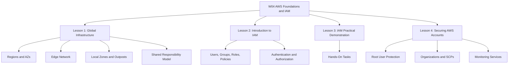
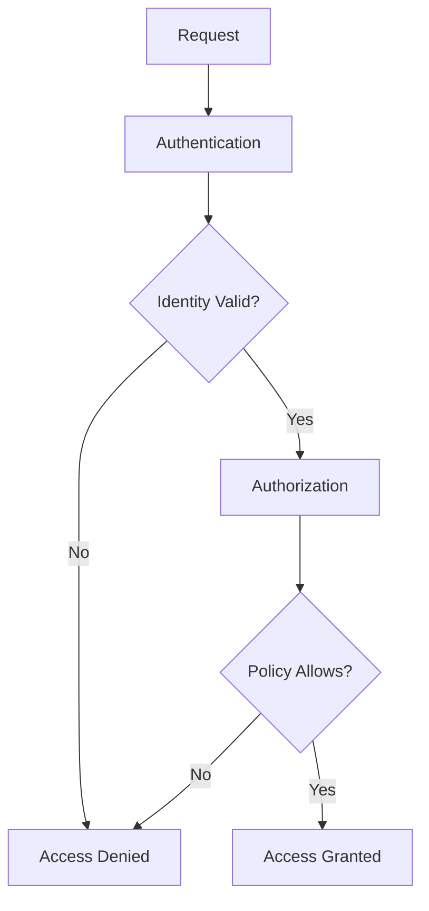
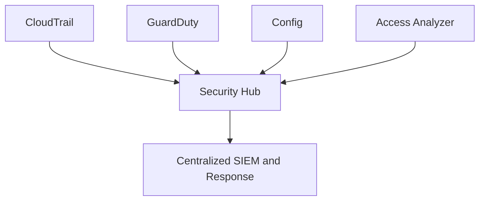
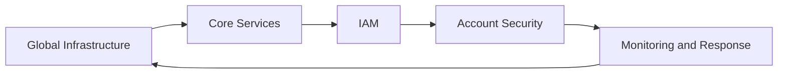
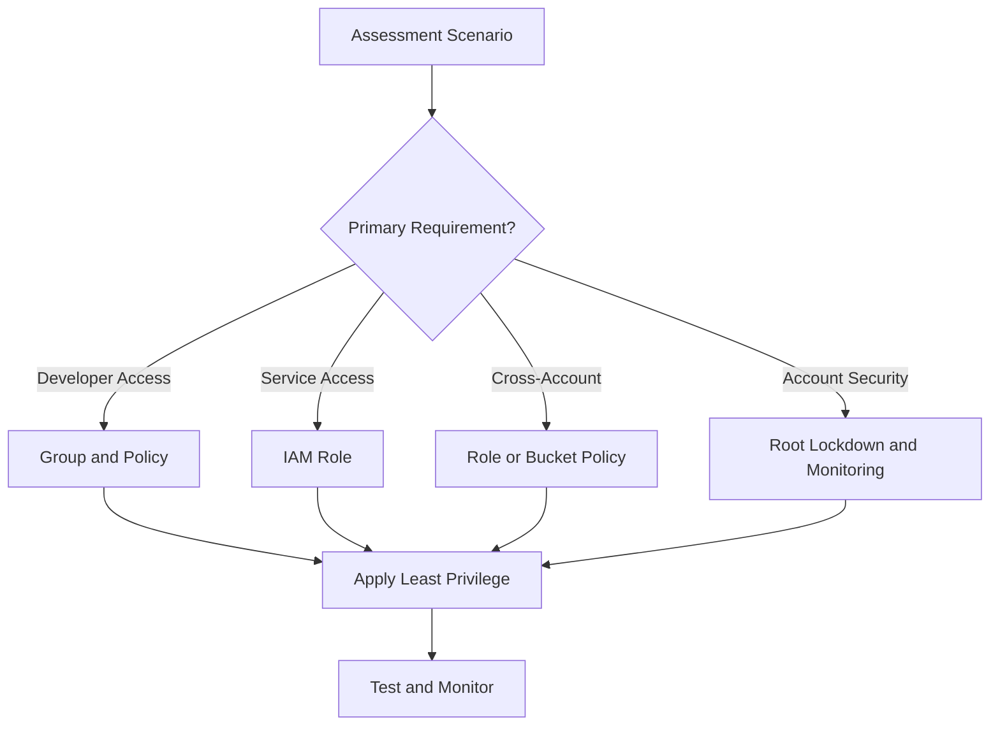

# W04: AWS Foundations and IAM - Summary and Assessment

This module covers the foundational elements of Amazon Web Services: global infrastructure, core services, Identity and Access Management, and account security. It builds from physical infrastructure to identity controls to practical hands-on tasks. The goal is to understand how AWS is organized and how security is enforced at every layer.

## Lesson 1: AWS Global Infrastructure Summary

AWS organizes its physical infrastructure into Regions, Availability Zones, and Edge Locations.

- Regions are separate geographic areas, isolated from each other for fault tolerance.
- Availability Zones are isolated data centers within a Region, each with independent power, cooling, and networking. A Region contains at least three AZs.
- Edge Locations and Regional Edge Caches deliver content and DNS with low latency.
- Local Zones extend a Region into metropolitan areas.
- Wavelength Zones deploy AWS services to the edge of 5G networks.
- Outposts bring native AWS services to on-premises data centers.
- The shared responsibility model defines the boundary: AWS secures the cloud, and customers secure what they put in the cloud.

| Component | Scope | Purpose |
|---|---|---|
| Region | Geographic area | Fault isolation and data residency |
| Availability Zone | Isolated data center | High availability within a Region |
| Edge Location | Point of presence | Low-latency content delivery |
| Local Zone | Metropolitan extension | Low-latency compute for metro users |
| Wavelength Zone | 5G network edge | Ultra-low latency for mobile devices |
| Outpost | On-premises | Hybrid cloud and data residency |

> [!Important]
> **Region isolation is the foundation of fault tolerance**: AWS Regions are designed to be isolated. When you deploy across Regions, you gain resilience against geographic-scale failures.

## Lesson 2: Introduction to AWS IAM Summary

IAM controls access to AWS resources through authentication and authorization.

- Core components: users, groups, roles, and policies.
- Users are permanent identities. Groups are collections of users with shared permissions.
- Roles are temporary identities assumed by services or federated users.
- Policies are JSON documents that define permissions.
- Explicit deny always overrides any allow. The default is deny.
- Least privilege is the core principle.
- Roles are preferred over long-term access keys for applications and services.

> [!Tip]
> **Use groups to assign permissions**: Never attach policies directly to users. Attach policies to groups, then add users to the appropriate groups.

## Lesson 3: IAM Practical Demonstration Summary

This lesson translates IAM theory into hands-on tasks.

- Create IAM users and groups.
- Write custom JSON policies that follow least privilege.
- Create roles for AWS services like EC2.
- Attach roles to instances instead of using access keys.
- Test permissions using the console, CLI, and IAM Policy Simulator.
- Use IAM Access Analyzer to find external access and validate policies.
- Clean up unused IAM resources after labs.

| Task | Tool | Outcome |
|---|---|---|
| Create user and group | Console or CLI | Identity and shared permissions |
| Write custom policy | JSON editor | Least-privilege access |
| Create role for EC2 | Console or CLI | Temporary credentials for services |
| Test permissions | Policy Simulator | Validate allowed and denied actions |
| Review access | Access Analyzer | Identify external sharing |
| Clean up | CLI or Console | Remove unused resources |

> [!Important]
> **Never store access keys on EC2**: Use IAM roles to provide temporary credentials. This eliminates key rotation and reduces the risk of credential leakage.

## Lesson 4: Securing AWS Accounts Summary

Account-level security protects the entire AWS environment before workloads are deployed.

- Protect the root user: enable MFA, remove access keys, use it only when necessary.
- Apply IAM best practices: least privilege, groups, roles, key rotation, strong password policy.
- Use AWS Organizations and Service Control Policies (SCPs) to set guardrails across accounts.
- SCPs do not grant permissions. They only restrict.
- AWS Control Tower automates landing zone setup with preventive, detective, and proactive controls.
- CloudTrail records API activity. Config records resource configuration changes.
- GuardDuty detects threats using CloudTrail, VPC Flow Logs, and DNS logs.
- Security Hub aggregates findings from multiple services into one view.
- IAM Identity Center provides single sign-on for workforce access across accounts.

> [!Tip]
> **Enable GuardDuty in all accounts and Regions**: It is the primary threat detection service for AWS. Enable it centrally through Organizations for consistent coverage.

## Integrated View

The module connects infrastructure, identity, and security into a single operating model.

- Global infrastructure determines where resources live and how they fail.
- IAM controls who can do what with those resources.
- Account security protects the environment itself.
- Hands-on practice builds fluency with the tools.
- The shared responsibility model frames every decision.

## Assessment Preparation

### Practice Questions

1. Describe the relationship between Regions, Availability Zones, and Edge Locations.
2. Explain why each AWS Region contains at least three Availability Zones.
3. List five factors to consider when selecting an AWS Region.
4. Compare Local Zones, Wavelength Zones, and Outposts.
5. Explain the shared responsibility model.
6. Describe the difference between an IAM user, group, role, and policy.
7. Explain the policy evaluation logic, including explicit deny.
8. Describe when to use IAM roles instead of users.
9. List five IAM best practices.
10. Explain how to create an IAM role for an EC2 instance and attach it.
11. Describe the purpose of IAM Access Analyzer and how to use it.
12. List the root user protection best practices.
13. Explain why SCPs are guardrails, not grants.
14. Compare the roles of CloudTrail, Config, GuardDuty, and Security Hub.
15. Describe how AWS Control Tower automates landing zone setup.

### Scenario Questions

**Scenario 1: Onboarding a New Developer**
A new developer joins the team. They need console access and read-only permissions to S3 and EC2. Outline the steps.

- Create a group `Developers` with policies `AmazonS3ReadOnlyAccess` and `AmazonEC2ReadOnlyAccess`.
- Create an IAM user for the developer.
- Add the user to the group.
- Enforce MFA and provide the console sign-in URL.

**Scenario 2: EC2 Access to S3**
An application running on EC2 needs to write logs to an S3 bucket. How do you grant access?

- Create an IAM role with a policy allowing `s3:PutObject` on the log bucket.
- Attach the role to the EC2 instance profile.
- The application uses the instance metadata service to obtain temporary credentials.

**Scenario 3: Cross-Account Access**
A partner company needs to read from your S3 bucket. How do you grant access securely?

- Create a role in your account that trusts the partner's AWS account.
- Grant the partner permission to assume the role.
- Alternatively, add a bucket policy that allows the partner's account.
- Use least privilege and monitor with CloudTrail.

**Scenario 4: New AWS Account Setup**
A company creates a new AWS account. What security controls should be applied first?

- Enable MFA for the root user and remove any root access keys.
- Create IAM users or connect IAM Identity Center for workforce access.
- Enable CloudTrail, Config, GuardDuty, and Security Hub.
- Configure S3 Block Public Access.
- Set account-level contacts and AWS Budgets.

**Scenario 5: Multi-Account Governance**
A company grows from one AWS account to twelve. How should they govern these accounts?

- Use AWS Organizations to group accounts into OUs.
- Apply SCPs to restrict unapproved Regions and prevent CloudTrail tampering.
- Deploy Control Tower to automate landing zone setup and guardrails.
- Use IAM Identity Center for central workforce access.
- Aggregate Security Hub findings in a delegated administrator account.

## Key Takeaways

- AWS global infrastructure is organized into Regions, Availability Zones, and Edge Locations.
- Regions are isolated from each other. Availability Zones provide high availability within a Region.
- The shared responsibility model defines the boundary between AWS and customer security.
- IAM controls access through users, groups, roles, and policies.
- Explicit deny always overrides any allow. The default is deny.
- Roles provide temporary credentials and are preferred over long-term access keys.
- Least privilege, MFA, and regular review are essential IAM best practices.
- Account security starts with root user protection: enable MFA, remove access keys, use it sparingly.
- AWS Organizations and SCPs set guardrails across accounts. SCPs do not grant permissions.
- Control Tower automates landing zone setup with preventive, detective, and proactive controls.
- CloudTrail records API activity. Config records resource changes. GuardDuty detects threats. Security Hub aggregates findings.
- IAM Identity Center simplifies workforce access across multiple accounts.
- Hands-on practice with IAM is essential for proficiency.
- Security is layered. No single control is sufficient.

> [!Important]
> **Secure the account before you build**: A compromised account undermines every workload it contains. Protect the root user, apply IAM best practices, establish multi-account governance, and enable continuous monitoring before deploying production resources.
