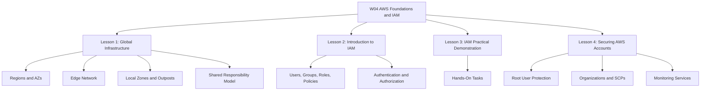
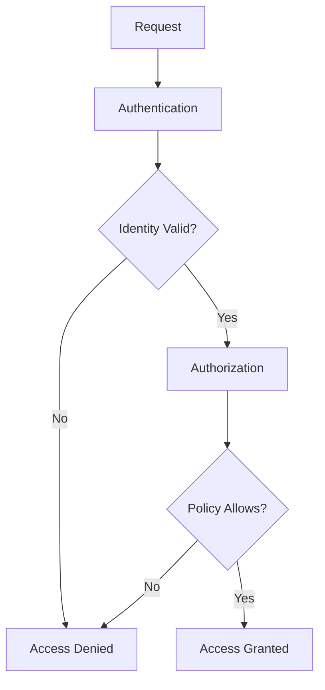

# Migration in progress
# W04: AWS Foundations and IAM - Summary and Assessment

This module covers the foundational elements of Amazon Web Services: global infrastructure, core services, Identity and Access Management, and account security. It builds from physical infrastructure to identity controls to practical hands-on tasks. The goal is to understand how AWS is organized and how security is enforced at every layer.



## Lesson 1: AWS Global Infrastructure Summary

AWS organizes its physical infrastructure into Regions, Availability Zones, and Edge Locations.

- Regions are separate geographic areas, isolated from each other for fault tolerance.
- Availability Zones are isolated data centers within a Region, each with independent power, cooling, and networking. A Region contains at least three AZs.
- Edge Locations and Regional Edge Caches deliver content and DNS with low latency.
- Local Zones extend a Region into metropolitan areas.
- Wavelength Zones deploy AWS services to the edge of 5G networks.
- Outposts bring native AWS services to on-premises data centers.
- The shared responsibility model defines the boundary: AWS secures the cloud, and customers secure what they put in the cloud.

| Component | Scope | Purpose |
|---|---|---|
| Region | Geographic area | Fault isolation and data residency |
| Availability Zone | Isolated data center | High availability within a Region |
| Edge Location | Point of presence | Low-latency content delivery |
| Local Zone | Metropolitan extension | Low-latency compute for metro users |
| Wavelength Zone | 5G network edge | Ultra-low latency for mobile devices |
| Outpost | On-premises | Hybrid cloud and data residency |

> [!Important]
> **Region isolation is the foundation of fault tolerance**: AWS Regions are designed to be isolated. When you deploy across Regions, you gain resilience against geographic-scale failures.

## Lesson 2: Introduction to AWS IAM Summary

IAM controls access to AWS resources through authentication and authorization.

- Core components: users, groups, roles, and policies.
- Users are permanent identities. Groups are collections of users with shared permissions.
- Roles are temporary identities assumed by services or federated users.
- Policies are JSON documents that define permissions.
- Explicit deny always overrides any allow. The default is deny.
- Least privilege is the core principle.
- Roles are preferred over long-term access keys for applications and services.



> [!Tip]
> **Use groups to assign permissions**: Never attach policies directly to users. Attach policies to groups, then add users to the appropriate groups.

## Lesson 3: IAM Practical Demonstration Summary

This lesson translates IAM theory into hands-on tasks.

- Create IAM users and groups.
- Write custom JSON policies that follow least privilege.
- Create roles for AWS services like EC2.
- Attach roles to instances instead of using access keys.
- Test permissions using the console, CLI, and IAM Policy Simulator.
- Use IAM Access Analyzer to find external access and validate policies.
- Clean up unused IAM resources after labs.

| Task | Tool | Outcome |
|---|---|---|
| Create user and group | Console or CLI | Identity and shared permissions |
| Write custom policy | JSON editor | Least-privilege access |
| Create role for EC2 | Console or CLI | Temporary credentials for services |
| Test permissions | Policy Simulator | Validate allowed and denied actions |
| Review access | Access Analyzer | Identify external sharing |
| Clean up | CLI or Console | Remove unused resources |

> [!Important]
> **Never store access keys on EC2**: Use IAM roles to provide temporary credentials. This eliminates key rotation and reduces the risk of credential leakage.

## Lesson 4: Securing AWS Accounts Summary

Account-level security protects the entire AWS environment before workloads are deployed.

- Protect the root user: enable MFA, remove access keys, use it only when necessary.
- Apply IAM best practices: least privilege, groups, roles, key rotation, strong password policy.
- Use AWS Organizations and Service Control Policies (SCPs) to set guardrails across accounts.
- SCPs do not grant permissions. They only restrict.
- AWS Control Tower automates landing zone setup with preventive, detective, and proactive controls.
- CloudTrail records API activity. Config records resource configuration changes.
- GuardDuty detects threats using CloudTrail, VPC Flow Logs, and DNS logs.
- Security Hub aggregates findings from multiple services into one view.
- IAM Identity Center provides single sign-on for workforce access across accounts.

```mermaid
flowchart TD
    A[CloudTrail] --> E[Security Hub]
    B[GuardDuty] --> E
    C[Config] --> E
    D[Access Analyzer] --> E