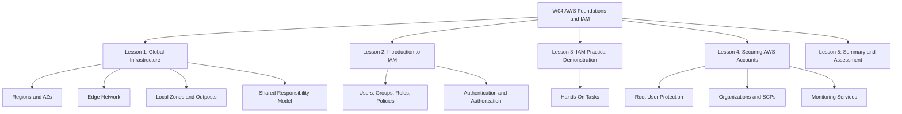
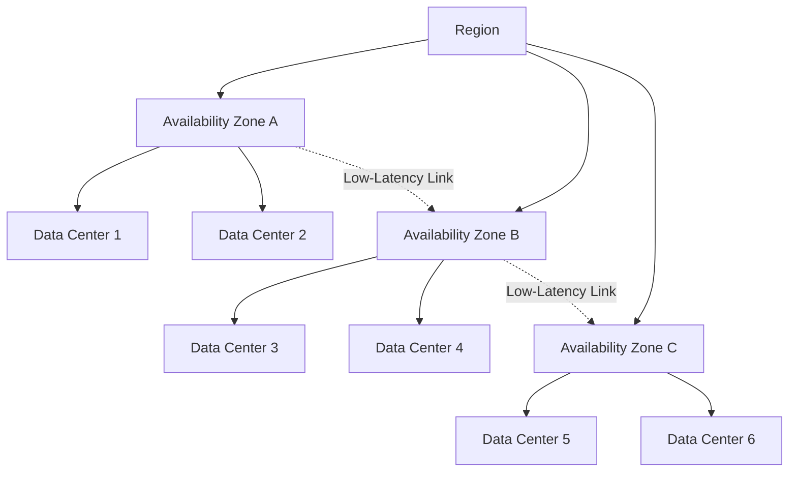
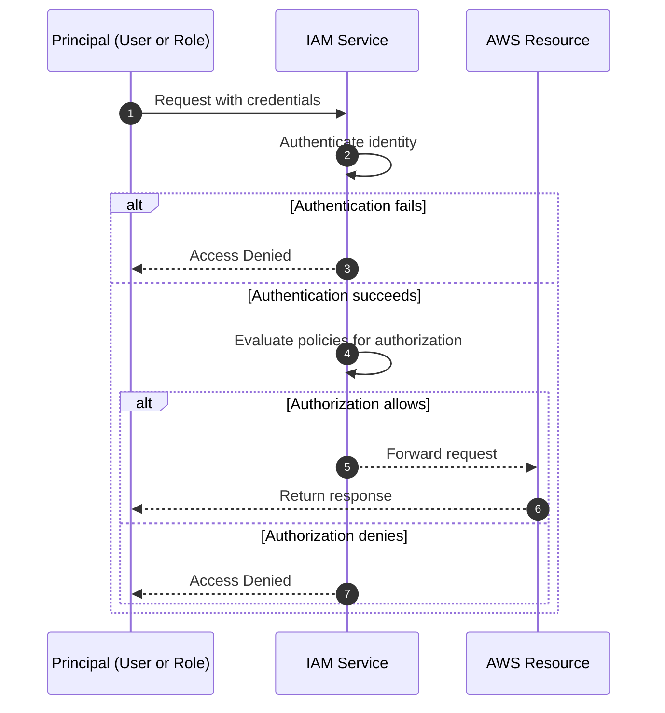

# Migration in progress
# W04: AWS Foundations and IAM

This module covers the foundational elements of Amazon Web Services: global infrastructure, core services, Identity and Access Management, and account security. It builds from physical infrastructure to identity controls to practical hands-on tasks. The goal is to understand how AWS is organized and how security is enforced at every layer.



## Lesson 1: AWS Global Infrastructure

The AWS Global Infrastructure is the physical foundation of every AWS service. It is organized into Regions, Availability Zones, and a global edge network. Understanding this structure is essential for designing systems that are highly available, fault tolerant, and low latency.

### AWS Regions

*Definition*: A Region is a separate geographic area where AWS clusters data centers. Each Region is designed to be completely isolated from every other Region.

- Regions are the primary unit of geographic deployment in AWS.
- An outage in one Region does not affect operations in another Region.
- AWS does not automatically replicate resources across Regions. You must do it explicitly.
- The default Region can be changed in the console or set using the `AWS_DEFAULT_REGION` environment variable.

| Factor | Consideration |
|---|---|
| Service Availability | Not every AWS service is available in every Region. |
| Latency | Choose a Region close to your users. |
| Compliance | Regulatory requirements may dictate where data must reside. |
| Cost | Pricing varies between Regions. |
| Disaster Recovery | Pair Regions for cross-Region replication and failover. |

> [!Important]
> **Region isolation is the foundation of fault tolerance**: AWS Regions are designed to be isolated from each other. When you deploy across Regions, you gain resilience against geographic-scale failures.

### Availability Zones

*Definition*: An Availability Zone (AZ) is one or more discrete data centers within a Region, each with redundant power, networking, and connectivity.

- Each Region contains at least three Availability Zones.
- AZs within a Region are connected through low-latency links.
- AZs are isolated from each other, so a failure in one AZ does not affect the others.
- Deploying applications across multiple AZs enhances redundancy and minimizes downtime.



> [!Tip]
> **Deploy across multiple AZs by default**: Spreading resources across multiple Availability Zones is the standard approach for achieving high availability.

### Edge Network and Points of Presence

*Definition*: The AWS edge network is a global system of Points of Presence (PoPs) that deliver content and services closer to end users.

- The edge network hosts Amazon CloudFront (CDN), Amazon Route 53 (DNS), and AWS Global Accelerator.
- The global edge network consists of over 410 PoPs, including more than 400 edge locations and 13 regional mid-tier caches across 90+ cities in 48 countries.
- Edge locations cache and deliver content. Regional edge caches sit between edge locations and origin servers.

| Component | Function | Primary Services |
|---|---|---|
| Edge Location | Cache and deliver content | CloudFront, Route 53 |
| Regional Edge Cache | Larger cache layer between edge and origin | CloudFront |
| AWS Backbone | Private fiber network connecting everything | All AWS traffic |

### Local Zones, Wavelength Zones, and Outposts

| Extension | Purpose | Use Case |
|---|---|---|
| Local Zones | Extend a Region by placing compute and storage closer to end users in metropolitan areas | Real-time gaming, live streaming |
| Wavelength Zones | Deploy AWS compute and storage to the edge of telecom carriers' 5G networks | Ultra-low latency for 5G devices |
| AWS Outposts | Bring native AWS services and infrastructure to on-premises data centers | Hybrid cloud, data residency |

> [!Tip]
> **Local Zones versus Edge Locations**: Local Zones run compute workloads. Edge locations cache content. They serve different purposes but both bring resources closer to users.

### Shared Responsibility Model

*Definition*: Security and compliance is a shared responsibility between AWS and the customer. This model is commonly described as Security "of" the Cloud versus Security "in" the Cloud.

| Responsibility | AWS | Customer |
|---|---|---|
| Physical Security | Data centers, hardware, networking | Not applicable |
| Host Operating System | Managed by AWS | Not applicable for managed services |
| Virtualization Layer | Managed by AWS | Not applicable |
| Guest Operating System | Not applicable | Updates and security patches |
| Application Software | Not applicable | Configuration and management |
| Security Group Firewall | Provides the tool | Configuration of rules |
| Data | Not applicable | Classification, encryption, access control |

> [!Important]
> **The shared responsibility model depends on the service model**: For IaaS services like EC2, the customer manages more. For managed services like S3 or DynamoDB, AWS manages more of the stack.

## Lesson 2: Introduction to AWS IAM

AWS Identity and Access Management (IAM) is the service that controls access to AWS resources. It provides authentication (who can sign in) and authorization (what they can do). IAM is global, free to use, and integrated with nearly every AWS service.

### Core IAM Components

| Component | Description | Example |
|---|---|---|
| User | A permanent identity for a person or application | A developer with console access |
| Group | A collection of users with shared permissions | Administrators, Developers |
| Role | A temporary identity assumed by a trusted entity | EC2 instance accessing S3 |
| Policy | A JSON document that defines permissions | Allow s3:GetObject on a bucket |

- **Users** represent individual identities. Each user has unique credentials.
- **Groups** simplify permission management. You attach policies to a group, and all users inherit those permissions.
- **Roles** are temporary identities. They are assumed by services, applications, or federated users.
- **Policies** are JSON documents. They specify what actions are allowed or denied on which resources.

> [!Tip]
> **Use groups to assign permissions**: Never attach policies directly to users. Attach policies to groups, then add users to the appropriate groups.

### How IAM Works



- Authentication verifies the identity of the principal.
- Authorization determines whether the principal has permission to perform the requested action.
- IAM evaluates all applicable policies. An explicit deny always overrides any allow.
- If no policy explicitly allows an action, the default is deny.

> [!Important]
> **Explicit deny always wins**: If any policy denies an action, the request is denied, even if another policy allows it.

### IAM Policies

*Definition*: An IAM policy is a JSON document that defines permissions. It specifies who can do what on which resources.

A policy contains one or more statements. Each statement includes:

- Effect: Allow or Deny.
- Action: The specific API actions (e.g., s3:GetObject).
- Resource: The AWS resources the action applies to.
- Condition: Optional constraints.

| Policy Type | Description | Attached To |
|---|---|---|
| Identity-based | Permissions for a user, group, or role | IAM identities |
| Resource-based | Permissions for a resource | AWS resources |
| Permissions boundary | Maximum permissions an identity can have | IAM users or roles |
| Service control policy (SCP) | Maximum permissions for an AWS account | AWS Organizations |
| Session policy | Permissions for a temporary session | Assumed role sessions |

> [!Tip]
> **Use resource-based policies for cross-account access**: When granting access to users in another AWS account, a resource-based policy on the resource is often simpler than assuming a role.

### IAM Roles and Temporary Credentials

*Definition*: An IAM role is an identity that you can assume to gain temporary access to AWS resources. Roles do not have long-term credentials.

- Roles are assumed by trusted entities: AWS services, applications, or federated users.
- When a role is assumed, the entity receives temporary security credentials.
- Common use cases:
    - EC2 instances accessing S3 or DynamoDB.
    - Lambda functions accessing other AWS services.
    - Cross-account access.
    - Federated user access from corporate directories.

> [!Important]
> **Prefer roles over long-term access keys**: Long-term access keys are a security risk. Use IAM roles to grant temporary credentials to applications and services.

### IAM Best Practices

- Follow least privilege.
- Enable MFA for all users.
- Rotate credentials regularly.
- Use groups to assign permissions.
- Use roles for applications.
- Monitor activity with CloudTrail.
- Use policy conditions.
- Review permissions regularly.

> [!Important]
> **Least privilege is a continuous process**: Permissions tend to grow over time. Regularly review and remove permissions that are no longer needed.

## Lesson 3: IAM Practical Demonstration

This lesson walks through common IAM tasks using the AWS Management Console, AWS CLI, and IAM policy simulator.

### Step 1: Create an IAM User and Group

```bash
# Create a group
aws iam create-group --group-name Developers

# Attach a managed policy to the group
aws iam attach-group-policy --group-name Developers --policy-arn arn:aws:iam::aws:policy/AmazonS3ReadOnlyAccess

# Create a user
aws iam create-user --user-name developer-anna

# Add user to group
aws iam add-user-to-group --group-name Developers --user-name developer-anna
```

| Resource | Name | Purpose |
|---|---|---|
| Group | Developers | Shared permissions for developers |
| User | developer-anna | Individual identity |
| Policy | AmazonS3ReadOnlyAccess | Read-only access to S3 |

> [!Important]
> **Always use groups for human users**: Attaching policies directly to users makes permission management difficult.

### Step 2: Write and Attach a Custom Policy

```json
{
  "Version": "2012-10-17",
  "Statement": [
    {
      "Effect": "Allow",
      "Action": "s3:GetObject",
      "Resource": "arn:aws:s3:::example-bucket/*"
    }
  ]
}
```

```bash
aws iam create-policy \
  --policy-name ReadExamp