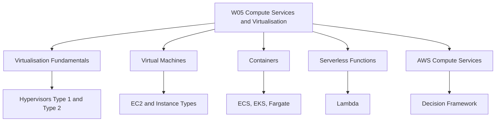
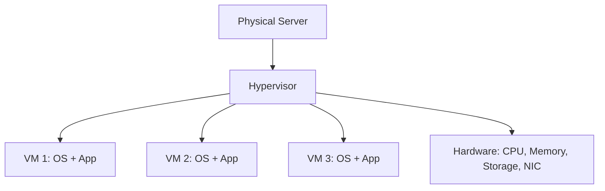
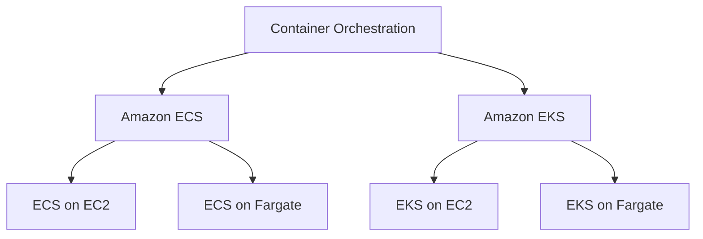

# Migration in progress
# W05: Compute Services + Virtualisation - Lesson 0: Module Introduction

This module introduces the foundational compute technologies behind cloud services: virtualisation, virtual machines, containers, and serverless functions. It then maps these concepts to AWS compute services, including EC2, Lambda, ECS, EKS, and Fargate. The goal is to understand how each compute model works, when to use it, and how to choose between them.



## Module Purpose

- Explain the role of virtualisation in cloud computing.
- Describe how hypervisors create and manage virtual machines.
- Compare virtual machines, containers, and serverless functions.
- Map compute concepts to AWS services: EC2, Lambda, ECS, EKS, and Fargate.
- Provide a decision framework for choosing the right compute model.
- Prepare for hands-on labs and scenario-based assessment.

## Learning Objectives

- Define virtualisation and explain how hypervisors work.
- Differentiate Type 1 and Type 2 hypervisors.
- Describe the virtual machine lifecycle.
- Identify EC2 instance families and pricing models.
- Explain how containers differ from virtual machines.
- Compare Amazon ECS, Amazon EKS, and AWS Fargate.
- Describe AWS Lambda limits, pricing, and use cases.
- Select the appropriate compute service for a given workload.

> [!Tip]
> **Start with virtualisation**: Understanding hypervisors and virtual machines is the foundation for every other compute model. Containers and serverless build on the same principles of abstraction and resource sharing.

## Module Structure

| Lesson | Topic | Focus |
|---|---|---|
| Lesson 0 | Module Introduction | Scope and objectives |
| Lesson 1 | Virtualisation Fundamentals | Hypervisors, VM lifecycle |
| Lesson 2 | Virtual Machines and EC2 | Instance families, pricing |
| Lesson 3 | Containers | ECS, EKS, Fargate |
| Lesson 4 | Serverless | Lambda |
| Lesson 5 | Summary and Assessment | Review and scenarios |

## Core Concepts Preview

### Virtualisation

*Definition*: Virtualisation creates a software-based representation of compute, storage, or network resources, allowing multiple operating systems to run on one physical machine.

- A hypervisor sits between hardware and virtual machines.
- Type 1 hypervisors run directly on hardware. Type 2 hypervisors run on a host OS.
- Cloud providers use Type 1 hypervisors for performance and isolation.



### Virtual Machines

*Definition*: A virtual machine is a software emulation of a physical computer that runs an operating system and applications.

- Amazon EC2 provides virtual servers in the cloud.
- Instance families include general purpose, compute optimized, memory optimized, storage optimized, and accelerated computing.
- Pricing models include On-Demand, Reserved Instances, Savings Plans, and Spot Instances.

> [!Important]
> **Pricing model affects cost significantly**: A steady-state production workload can save up to 72% with Reserved Instances compared to On-Demand.

### Containers

*Definition*: Containers virtualize the operating system, sharing the host OS kernel and packaging an application with its dependencies.

- Containers are lightweight, portable, and start in seconds.
- Amazon ECS is a fully managed container orchestration service.
- Amazon EKS is managed Kubernetes.
- AWS Fargate is a serverless compute engine for containers.



### Serverless Functions

*Definition*: AWS Lambda runs code in response to events and automatically manages compute resources.

- Lambda runs for up to 15 minutes per invocation.
- It scales automatically and charges per request and GB-second.
- It is ideal for event-driven, short-lived workloads.

> [!Tip]
> **Lambda is cost-effective for spiky workloads**: For event-driven or intermittent workloads, Lambda eliminates the cost of idle servers.

### AWS Compute Decision Framework

```mermaid
flowchart TD
    A[Start Compute Decision] --> B{Execut