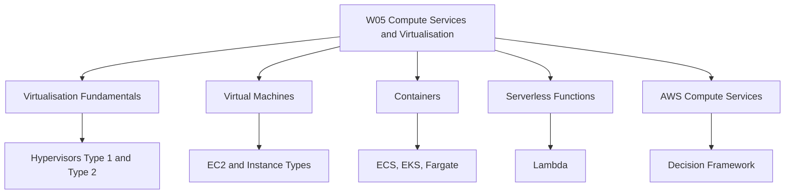
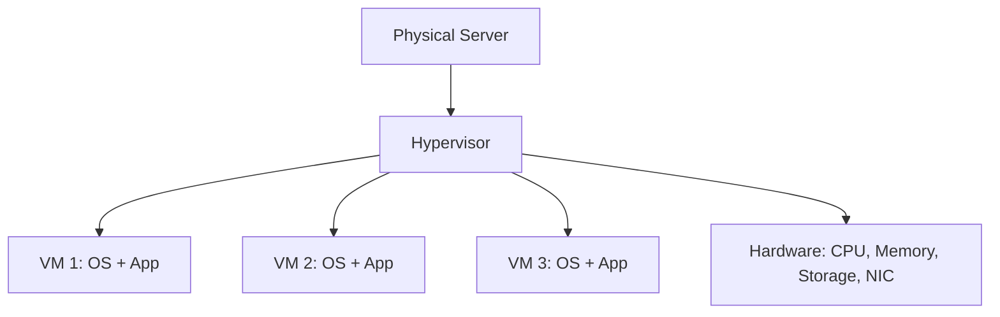
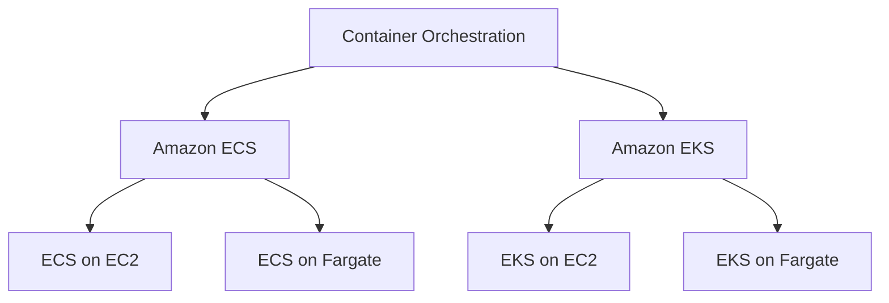
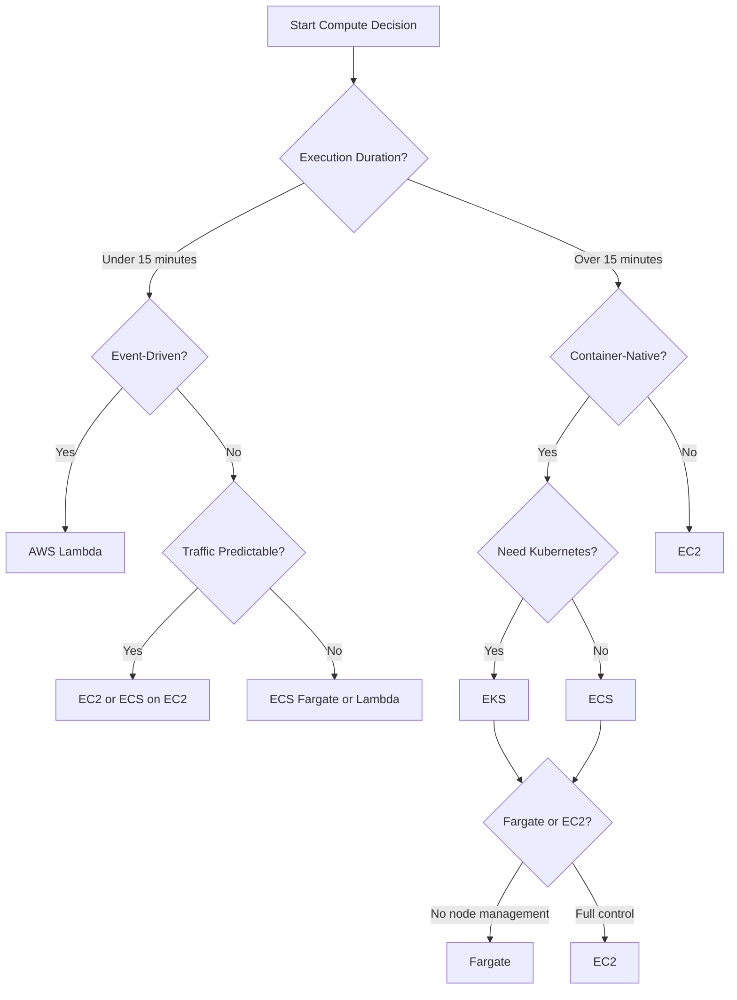
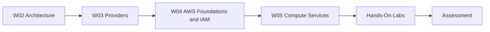

# W05: Compute Services + Virtualisation - Lesson 0: Module Introduction

This module introduces the foundational compute technologies behind cloud services: virtualisation, virtual machines, containers, and serverless functions. It then maps these concepts to AWS compute services, including EC2, Lambda, ECS, EKS, and Fargate. The goal is to understand how each compute model works, when to use it, and how to choose between them.

## Module Purpose

- Explain the role of virtualisation in cloud computing.
- Describe how hypervisors create and manage virtual machines.
- Compare virtual machines, containers, and serverless functions.
- Map compute concepts to AWS services: EC2, Lambda, ECS, EKS, and Fargate.
- Provide a decision framework for choosing the right compute model.
- Prepare for hands-on labs and scenario-based assessment.

## Learning Objectives

- Define virtualisation and explain how hypervisors work.
- Differentiate Type 1 and Type 2 hypervisors.
- Describe the virtual machine lifecycle.
- Identify EC2 instance families and pricing models.
- Explain how containers differ from virtual machines.
- Compare Amazon ECS, Amazon EKS, and AWS Fargate.
- Describe AWS Lambda limits, pricing, and use cases.
- Select the appropriate compute service for a given workload.

> [!Tip]
> **Start with virtualisation**: Understanding hypervisors and virtual machines is the foundation for every other compute model. Containers and serverless build on the same principles of abstraction and resource sharing.

## Module Structure

| Lesson | Topic | Focus |
|---|---|---|
| Lesson 0 | Module Introduction | Scope and objectives |
| Lesson 1 | Virtualisation Fundamentals | Hypervisors, VM lifecycle |
| Lesson 2 | Virtual Machines and EC2 | Instance families, pricing |
| Lesson 3 | Containers | ECS, EKS, Fargate |
| Lesson 4 | Serverless | Lambda |
| Lesson 5 | Summary and Assessment | Review and scenarios |

## Core Concepts Preview

### Virtualisation

*Definition*: Virtualisation creates a software-based representation of compute, storage, or network resources, allowing multiple operating systems to run on one physical machine.

- A hypervisor sits between hardware and virtual machines.
- Type 1 hypervisors run directly on hardware. Type 2 hypervisors run on a host OS.
- Cloud providers use Type 1 hypervisors for performance and isolation.

### Virtual Machines

*Definition*: A virtual machine is a software emulation of a physical computer that runs an operating system and applications.

- Amazon EC2 provides virtual servers in the cloud.
- Instance families include general purpose, compute optimized, memory optimized, storage optimized, and accelerated computing.
- Pricing models include On-Demand, Reserved Instances, Savings Plans, and Spot Instances.

> [!Important]
> **Pricing model affects cost significantly**: A steady-state production workload can save up to 72% with Reserved Instances compared to On-Demand.

### Containers

*Definition*: Containers virtualize the operating system, sharing the host OS kernel and packaging an application with its dependencies.

- Containers are lightweight, portable, and start in seconds.
- Amazon ECS is a fully managed container orchestration service.
- Amazon EKS is managed Kubernetes.
- AWS Fargate is a serverless compute engine for containers.

### Serverless Functions

*Definition*: AWS Lambda runs code in response to events and automatically manages compute resources.

- Lambda runs for up to 15 minutes per invocation.
- It scales automatically and charges per request and GB-second.
- It is ideal for event-driven, short-lived workloads.

> [!Tip]
> **Lambda is cost-effective for spiky workloads**: For event-driven or intermittent workloads, Lambda eliminates the cost of idle servers.

### AWS Compute Decision Framework

> [!Important]
> **There is no single best compute model**: Choose based on workload characteristics. Use VMs for control, containers for portability and efficiency, and serverless for event-driven, short-lived tasks.

## How This Module Connects to Previous Modules

- W02 covered reliability, performance, and the AWS Well-Architected Framework.
- W03 compared AWS, Azure, and GCP across services and selection factors.
- W04 covered AWS global infrastructure, IAM, and account security.
- W05 adds the compute layer: how workloads actually run on AWS.
- The compute choices you make affect reliability, cost, performance, and security.

## Assessment Preparation

### Practice Questions

1. Define virtualisation and explain the role of a hypervisor.
2. Compare Type 1 and Type 2 hypervisors.
3. Describe the virtual machine lifecycle.
4. List the five EC2 instance families and their use cases.
5. Explain the four EC2 pricing models.
6. Describe how containers differ from virtual machines.
7. Compare Amazon ECS, Amazon EKS, and AWS Fargate.
8. Explain the limits and pricing model of AWS Lambda.
9. Describe when to use VMs, containers, and serverless functions.

### Scenario Questions

**Scenario 1: Legacy Application Migration**
A company wants to migrate an on-premises legacy application that requires a custom OS configuration and runs continuously. Which compute service should they use?

- Use EC2 with a custom AMI and an instance type that matches the workload profile.
- Use Reserved Instances or Savings Plans for cost optimization.
- Deploy across multiple Availability Zones for high availability.

**Scenario 2: Microservices Platform**
A team is building a microservices platform and needs portability across cloud providers. Which container service should they use?

- Use Amazon EKS for Kubernetes compatibility and multi-cloud portability.
- Use Fargate to eliminate node management.
- Use ECR for container image storage.
- Consider ECS if portability is not a hard requirement.

**Scenario 3: Event-Driven Image Processing**
An application needs to process images uploaded to S3 and generate thumbnails. Which compute service should they use?

- Use AWS Lambda triggered by S3 upload events.
- Lambda automatically scales to handle spikes in upload volume.
- Pay only for the compute time used, with no cost for idle time.

**Scenario 4: High-Performance Computing**
A research team needs to run GPU-accelerated simulations for machine learning training. Which EC2 instance family should they use?

- Use accelerated computing instances such as P4 or Trn1.
- Use Spot Instances for fault-tolerant training jobs to reduce cost.
- Consider Savings Plans for predictable training workloads.

## Key Takeaways

- Virtualisation is the foundation of cloud computing. Hypervisors create and manage virtual machines.
- Type 1 hypervisors run directly on hardware and are used by cloud providers. Type 2 hypervisors run on a host OS.
- Amazon EC2 provides virtual servers with a wide range of instance families and pricing models.
- Containers virtualize the operating system and are lightweight, portable, and fast to start.
- Amazon ECS, Amazon EKS, and AWS Fargate provide container orchestration options.
- AWS Lambda is a serverless compute service for event-driven, short-lived tasks.
- Choose compute based on workload characteristics: VMs for control, containers for portability, serverless for event-driven tasks.
- There is no single best compute model. The right choice depends on duration, traffic patterns, team skills, and operational maturity.
- This module builds on W02 architecture, W03 provider comparison, and W04 AWS foundations.
- Assessment focuses on practical compute selection and scenario-based decision making.

> [!Important]
> **Match the compute model to the workload**: Start with execution duration and event-driven characteristics. Then consider control, portability, and operational overhead. The wrong compute choice leads to unnecessary cost, complexity, or performance limitations.
