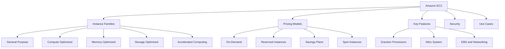
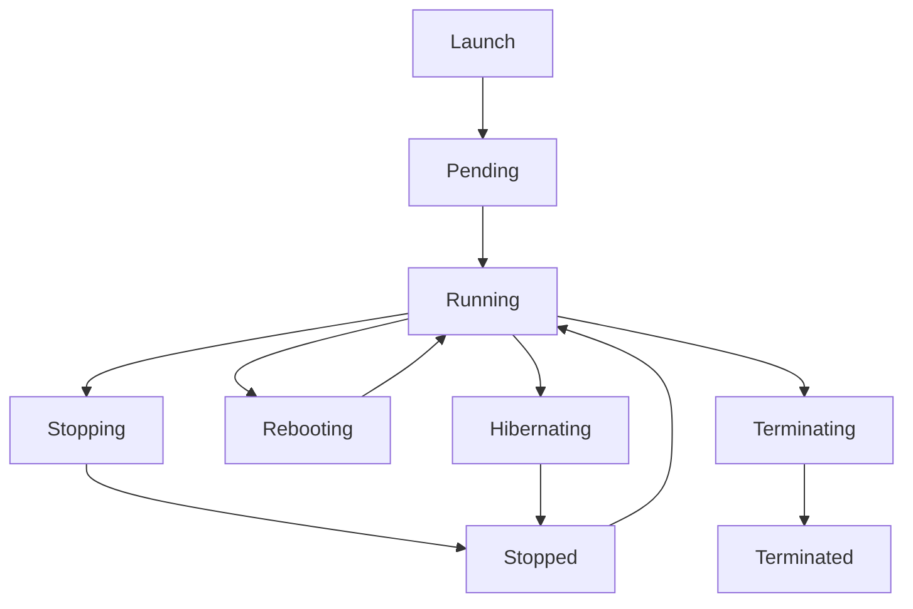
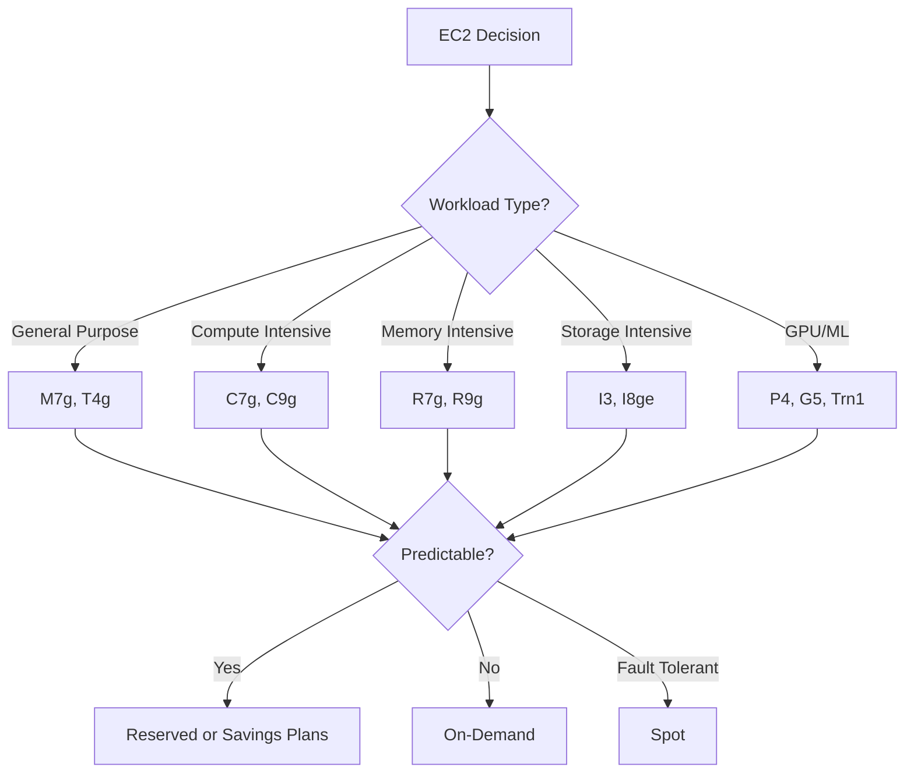

# Lesson 1: Introduction to EC2

Amazon Elastic Compute Cloud (EC2) is the foundational compute service in AWS. It provides secure, resizable virtual servers called instances, giving you full control over the operating system and the flexibility to run almost any workload. EC2 is the most mature and widely used AWS compute service, offering over 1,000 instance types across Intel, AMD, and Arm processors.

## What Is EC2

*Definition*: Amazon EC2 is a web service that provides secure, resizable compute capacity in the cloud as virtual servers. You can launch instances with a variety of operating systems, instance types, and configurations, paying only for the capacity you use.

- EC2 provides virtual servers with full OS-level control, from the kernel to the application.
- It offers over 1,000 instance types spanning Intel, AMD, and Arm processor architectures.
- It is backed by a 99.99% availability SLA for multi-AZ deployments.
- It supports a wide range of workloads including web applications, HPC, machine learning, and Windows workloads.
- The AWS Nitro System builds security into the foundation of every EC2 instance.

> [!Important]
> **EC2 is the foundation of AWS compute**: Understanding EC2 is essential because it underpins many other AWS services, including ECS, EKS, and even Lambda (which runs on EC2 infrastructure). The concepts of instance types, pricing models, and security groups apply across the AWS ecosystem.

## EC2 Instance Families

EC2 instances are grouped into families based on their compute, memory, storage, and networking characteristics. Choosing the right family is critical for cost and performance.

### Instance Family Comparison

| Family | Optimized For | Use Cases | Example Types |
|---|---|---|---|
| General Purpose | Balanced compute, memory, and networking | Web servers, application servers, small databases | M5, M6i, M7g, T3, T4g |
| Compute Optimized | High-performance processors | Batch processing, gaming, HPC, video encoding | C5, C6i, C7g, C9g |
| Memory Optimized | Large memory-to-vCPU ratio | In-memory databases, real-time big data analytics | R5, R6i, R7g, R9g, X1 |
| Storage Optimized | High sequential read/write and IOPS | Data warehousing, distributed file systems | D2, H1, I3, I8ge |
| Accelerated Computing | GPU or FPGA accelerators | Machine learning, graphics rendering, scientific simulation | P4, G5, G7, Inf2, Trn1 |

- General purpose instances like M7g offer the best price-performance for general workloads.
- Compute optimized instances like C9g are powered by AWS Graviton5 processors and offer the best price-performance for compute-intensive workloads.
- Memory optimized instances like R9g are powered by Graviton5 and deliver up to 25% better performance than the previous R8g generation.
- Accelerated computing instances like G7 feature NVIDIA RTX PRO 4500 GPUs and Intel Xeon Granite Rapids processors for demanding GPU workloads.

> [!Tip]
> **Choose instance family by workload profile**: Match the instance family to the dominant resource requirement. If the workload is CPU-bound, choose compute optimized. If it is memory-bound, choose memory optimized. If it needs GPUs, choose accelerated computing.

### AWS Graviton Processors

- Graviton is AWS's custom silicon family based on Arm architecture.
- Graviton5 is the latest generation, powering instances like C9g, M9g, and R9g.
- Graviton5 delivers up to 25% better performance than Graviton4 and up to 35% better web application performance.
- Graviton-based instances offer better price-performance than comparable Intel or AMD instances for many workloads.
- Graviton4 powers storage-optimized instances like I8ge, delivering up to 60% better compute performance than Graviton2-based equivalents.

> [!Important]
> **Graviton is not a niche option**: Graviton instances now power a significant share of AWS workloads. If your application runs on Linux and supports Arm, Graviton typically offers 20-40% better price-performance than x86 equivalents. Test your workload on Graviton before committing to x86 for new deployments.

## EC2 Pricing Models

EC2 offers four pricing models designed to match different workload patterns and commitment levels.

### Pricing Model Comparison

| Model | Description | Best For | Discount vs On-Demand |
|---|---|---|---|
| On-Demand | Pay per hour or second, no commitment | Unpredictable workloads, short-term needs | Baseline |
| Reserved Instances | Commit to 1 or 3 years | Steady-state, predictable workloads | Up to 72% |
| Savings Plans | Commit to a consistent amount of compute usage | Flexible workloads across instance families | Up to 72% |
| Spot Instances | Bid on unused EC2 capacity | Fault-tolerant, flexible workloads | Up to 90% |

- On-Demand pricing is per-second with a 60-second minimum, eliminating the cost of unused compute time.
- Reserved Instances offer the highest discount for steady-state workloads but require a commitment to a specific instance family in a region.
- Savings Plans offer similar discounts with more flexibility. Compute Savings Plans apply across EC2, Lambda, and Fargate in any region, while EC2 Instance Savings Plans apply to a specific instance family in one region.
- Spot Instances let you use spare EC2 capacity at up to 90% off On-Demand prices, but they can be interrupted with a two-minute warning when AWS needs the capacity back.

> [!Important]
> **Pricing model choice can cut costs by 72-90%**: A steady-state production workload can save up to 72% with Reserved Instances or Savings Plans. Fault-tolerant workloads can save up to 90% with Spot Instances. Choosing the right pricing model is the single largest cost lever in EC2.

### Reserved Instances vs Savings Plans

| Dimension | Reserved Instances | Savings Plans |
|---|---|---|
| Commitment | Instance family, region, OS, tenancy | EC2: instance family and region; Compute: any region |
| Flexibility | Low | High (Compute Savings Plans) |
| Discount | Up to 72% | Up to 72% (EC2); up to 66% (Compute) |
| Capacity Reservation | Yes (zonal RIs) | No |
| Resale | Yes (marketplace) | No |

- Reserved Instances provide capacity reservation options and can be resold on the AWS marketplace.
- Savings Plans are more flexible and apply automatically to eligible usage.
- Compute Savings Plans cover EC2, Lambda, and Fargate across any region and instance family.
- EC2 Instance Savings Plans offer the lowest prices with a commitment to a specific instance family in one region.

> [!Tip]
> **Start with Compute Savings Plans**: If you are unsure about long-term instance family choices, Compute Savings Plans offer the best balance of discount and flexibility. They cover EC2, Lambda, and Fargate across any region.

### Spot Instances

- Spot Instances use spare EC2 capacity and offer up to 90% discount compared to On-Demand.
- They can be interrupted with a two-minute warning when AWS needs the capacity back.
- They are ideal for fault-tolerant workloads: batch processing, CI/CD, big data analytics, and stateless web servers.
- Spot Fleet and EC2 Auto Scaling can manage Spot Instances automatically, replacing interrupted instances.
- Spot Instances should never be used for workloads that cannot tolerate interruption, such as databases or stateful applications.

> [!Important]
> **Spot Instances require interruption-tolerant design**: Use Spot Instances for stateless, fault-tolerant workloads that can be restarted. Use Auto Scaling groups with mixed instance policies to automatically replace interrupted Spot Instances with On-Demand or new Spot capacity.

## Key EC2 Features

### Instance Lifecycle

EC2 instances go through a lifecycle from launch to termination.

- **Pending**: The instance is preparing to enter the running state.
- **Running**: The instance is active and usable.
- **Stopping/Stopped**: The instance is shut down but can be restarted. EBS volumes persist.
- **Rebooting**: The instance restarts without losing its public IP or EBS volumes.
- **Terminating/Terminated**: The instance is permanently deleted. EBS root volumes are deleted by default unless the "Delete on Termination" flag is disabled.
- **Hibernating**: The instance saves its RAM contents to EBS and can resume later.

> [!Tip]
> **Stop vs Terminate**: Stopping an instance preserves the EBS root volume and allows you to restart later. Terminating deletes the instance and its root volume by default. Use stop for temporary shutdowns and terminate for permanent removal.

### Storage and Networking

- EC2 instances use Amazon EBS for persistent block storage. EBS volumes are network-attached and persist independently of the instance lifecycle.
- EBS supports gp3 (general purpose SSD), io2 (high IOPS SSD), and st1/sc1 (throughput-optimized HDD) volume types.
- EC2 instances can use instance store for temporary, high-speed local storage. Data on instance store is lost when the instance is stopped or terminated.
- EC2 networking supports up to 400 Gbps for the largest instances.
- Enhanced Networking (ENA) provides high-performance networking with lower latency and higher throughput.
- Elastic Fabric Adapter (EFA) provides low-latency networking for HPC and machine learning workloads.

### Nitro System

- The AWS Nitro System is the foundation of modern EC2 instances.
- It offloads virtualization functions to dedicated hardware, improving performance and security.
- Nitro eliminates the hypervisor from the data path for storage and networking, reducing overhead.
- Nitro Security Chips protect the hardware and firmware of the server.
- Nitro Enclaves provide isolated compute environments for processing highly sensitive data.

> [!Important]
> **Nitro is a security and performance enabler**: The Nitro System improves security by removing the hypervisor from the data path and providing hardware-level isolation. It also enables higher performance and more consistent networking and storage than traditional virtualization.

## EC2 Security Best Practices

Securing EC2 instances is a shared responsibility. AWS secures the infrastructure, and you secure the operating system, applications, and configuration.

### Security Checklist

| Area | Best Practice |
|---|---|
| IAM | Use least-privilege IAM roles for EC2 instances. Never store access keys on instances. |
| Security Groups | Restrict inbound traffic to specific ports and source IP ranges. Avoid 0.0.0.0/0 on SSH (22) and RDP (3389). |
| Key Pairs | Generate unique key pairs per region. Store private keys in encrypted, access-controlled storage. |
| IMDS | Enforce IMDSv2 to protect against SSRF attacks on the instance metadata service. |
| EBS Encryption | Encrypt EBS volumes at rest using AWS KMS. |
| Patching | Keep the guest OS and applications patched. Use AWS Systems Manager Patch Manager. |
| Monitoring | Use CloudTrail, CloudWatch, and GuardDuty to monitor EC2 activity. |
| Network | Use private subnets for backend instances. Use VPC endpoints to access AWS services privately. |

- Security groups are stateful firewalls that control inbound and outbound traffic at the instance level.
- IMDSv2 adds session-based authentication to the instance metadata service, mitigating SSRF risks.
- EBS encryption protects data at rest and can be enabled by default for all new volumes.
- AWS Systems Manager provides patching, compliance, and session management without opening SSH ports.

> [!Important]
> **Never expose SSH or RDP to the internet**: Restrict SSH and RDP access to known IP ranges or use AWS Systems Manager Session Manager for secure, auditable access without opening inbound ports.

## EC2 Use Cases

| Use Case | Recommended Instance Family | Pricing Model |
|---|---|---|
| Web servers | General purpose (M7g, T4g) | On-Demand or Savings Plans |
| Batch processing | Compute optimized (C7g, C9g) | Spot Instances |
| In-memory databases | Memory optimized (R7g, R9g) | Reserved Instances |
| Machine learning training | Accelerated computing (P4, Trn1) | Spot or Savings Plans |
| Data warehousing | Storage optimized (I3, I8ge) | Reserved Instances |
| CI/CD runners | General purpose (M7g, C7g) | Spot Instances |
| Development/test | General purpose (T4g) | On-Demand |

> [!Tip]
> **Match instance family to workload, pricing to pattern**: Choose the instance family based on the dominant resource requirement. Choose the pricing model based on how predictable the workload is.

## Assessment Preparation

### Practice Questions

1. Define Amazon EC2 and explain its role in AWS compute.
2. List the five EC2 instance families and their use cases.
3. Explain the four EC2 pricing models and when each is appropriate.
4. Compare Reserved Instances and Savings Plans.
5. Describe how Spot Instances work and what workloads they suit.
6. Explain the EC2 instance lifecycle from launch to termination.
7. Describe the AWS Nitro System and its benefits.
8. List five EC2 security best practices.

### Scenario Questions

**Scenario 1: Steady-State Web Application**
A company runs a web application with predictable traffic that runs 24/7. Which EC2 pricing model should they use?

- Use Reserved Instances or EC2 Instance Savings Plans for up to 72% discount.
- Choose general purpose instances like M7g for balanced performance.
- Deploy across multiple Availability Zones for high availability.

**Scenario 2: Batch Processing Job**
A research team needs to run large-scale batch processing jobs that can be interrupted and restarted. Which pricing model should they use?

- Use Spot Instances for up to 90% discount.
- Choose compute optimized instances like C7g or C9g.
- Use Auto Scaling groups with mixed instance policies to handle interruptions.

**Scenario 3: In-Memory Database**
A company needs to run an in-memory database with a large memory footprint. Which instance family should they use?

- Use memory optimized instances like R7g or R9g.
- Use Reserved Instances for steady-state workloads.
- Enable EBS encryption for data at rest.

**Scenario 4: Machine Learning Training**
A team needs to train deep learning models with GPU acceleration. Which instance family should they use?

- Use accelerated computing instances like P4 or Trn1.
- Use Spot Instances for fault-tolerant training jobs.
- Consider Savings Plans for predictable training workloads.

## Key Takeaways

- Amazon EC2 provides secure, resizable virtual servers in the cloud with full OS-level control.
- EC2 offers over 1,000 instance types across five families: general purpose, compute optimized, memory optimized, storage optimized, and accelerated computing.
- AWS Graviton processors offer better price-performance for many workloads. Graviton5 powers the latest C9g, M9g, and R9g instances.
- EC2 pricing models include On-Demand, Reserved Instances, Savings Plans, and Spot Instances. Savings can reach 72% (Reserved/Savings Plans) or 90% (Spot).
- Spot Instances are ideal for fault-tolerant workloads but can be interrupted with a two-minute warning.
- The EC2 instance lifecycle includes pending, running, stopping, stopping, rebooting, terminating, and hibernating states.
- The AWS Nitro System improves security and performance by offloading virtualization to dedicated hardware.
- EC2 security best practices include least-privilege IAM roles, restrictive security groups, IMDSv2 enforcement, EBS encryption, and regular patching.
- Match instance family to the dominant resource requirement and pricing model to the workload pattern.
- EC2 is the foundation of AWS compute. Understanding it is essential for working with ECS, EKS, and Lambda.

> [!Important]
> **Match the instance family to the workload, and the pricing model to the pattern**: The two biggest decisions in EC2 are which instance family to use and which pricing model to choose. Choosing the wrong family leads to poor performance or wasted cost. Choosing the wrong pricing model leaves money on the table. Right-size continuously and commit only when usage is predictable.
