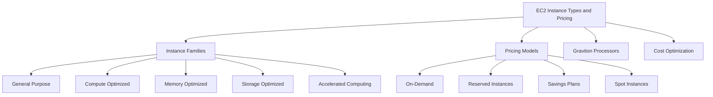

# Migration in progress
# Lesson 2: Instance Types and Pricing Models

This lesson goes deeper into EC2 instance types and pricing models. It explains how instance families are organized, what each family is optimized for, and how to match workloads to the right instance type. It then covers the four pricing models in detail, including commitment levels, discounts, and interruption risks. The goal is to build the judgment needed to right-size instances and choose the most cost-effective pricing model.

## EC2 Instance Families

EC2 instances are grouped into families based on their hardware characteristics and the workloads they are designed to run. AWS offers over 1,000 instance types across these families, each with different combinations of vCPU, memory, storage, and networking. Choosing the right family is the first step in right-sizing.

### General Purpose Instances

*Definition*: General purpose instances provide a balanced mix of compute, memory, and networking resources. They are the default choice for workloads that do not have a strong bias toward any single resource.

- Best for web servers, application servers, small and midsize databases, and development environments.
- Instance families include M (M5, M6i, M7g, M8g, M9g) and T (T2, T3, T4g) for burstable workloads.
- M-family instances are the most common general purpose choice for production workloads.
- T-family instances use CPU credits to provide a baseline level of performance with the ability to burst above baseline when needed.
- T4g instances are powered by AWS Graviton2 and are free-tier eligible.

> [!Tip]
> **Start with general purpose unless you have a specific need**: For most workloads, a general purpose instance from the M or T family is the right starting point. Move to a specialized family only when you can measure that the workload is consistently constrained by CPU, memory, storage, or GPU.

### Compute Optimized Instances

*Definition*: Compute optimized instances are designed for compute-intensive applications that benefit from high-performance processors.

- Best for batch processing, media transcoding, high-performance web servers, HPC, scientific modeling, dedicated gaming servers, and machine learning inference.
- Instance families include C5, C6i, C7g, C8i, and C9g.
- C7g and C9g are powered by AWS Graviton processors and offer the best price-performance for compute-intensive workloads.
- C8i and C8i-flex are powered by custom Intel Xeon 6 processors and are suited for workloads like web servers, caching, Apache Kafka, and distributed analytics.

> [!Important]
> **Compute optimized is not the same as memory optimized**: A compute optimized instance may have less memory than a general purpose instance at the same vCPU count. Verify the memory-to-vCPU ratio matches your workload before committing.

### Memory Optimized Instances

*Definition*: Memory optimized instances are designed for workloads that process large data sets in memory.

- Best for in-memory databases (Redis, Memcached), real-time big data analytics, and high-performance databases.
- Instance families include R (R5, R6i, R7g, R8g, R9g) and X (X1, X2) for extremely large memory footprints.
- R-family instances offer a higher memory-to-vCPU ratio than general purpose instances.
- R9g instances are powered by Graviton5 and deliver up to 25% better performance than the previous R8g generation.

> [!Tip]
> **Memory optimized instances are ideal for caching fleets**: If your workload runs an in-memory cache or database, a memory optimized instance from the R family gives you more memory per vCPU, reducing the number of instances you need.

### Storage Optimized Instances

*Definition*: Storage optimized instances are designed for workloads that require high, sequential read and write access to very large data sets on local storage.

- Best for data warehousing, distributed file systems, and high-frequency online transaction processing (OLTP) systems.
- Instance families include D (dense storage), H (HDD storage), and I (high IOPS SSD storage).
- I8ge instances are powered by Graviton4 and deliver up to 60% better compute performance than Graviton2-based equivalents.
- Storage optimized instances provide high IOPS and throughput to local instance store volumes.

### Accelerated Computing Instances

*Definition*: Accelerated computing instances use hardware accelerators, or co-processors, to perform functions such as floating-point number calculations, graphics processing, or data pattern matching more efficiently than is possible in software running on CPUs.

- Best for machine learning training and inference, graphics rendering, scientific simulation, and video encoding.
- Instance families include P (GPU training), G (GPU graphics), Inf (inference), and Trn (training).
- P4, P5, and P6 instances are designed for high-performance deep learning training.
- G5 and G7 instances are designed for graphics-intensive workloads and general-purpose GPU computing.
- Inf2 instances are designed for deep learning inference at scale.
- Trn1 and Trn2 instances are powered by AWS Trainium chips and offer up to 50% cost-to-train savings.

> [!Important]
> **Accelerated computing instances are the most expensive per hour**: A GPU instance can cost 10-20 times more per hour than a general purpose instance. Use them only for workloads that genuinely require GPU or FPGA acceleration, and consider Spot Instances for fault-tolerant training jobs.

## Graviton Processors

AWS Graviton is a family of custom silicon processors based on Arm architecture. They are designed to deliver the best price-performance for cloud workloads running on EC2.

- Graviton5 is the latest generation, powering instances like C9g, M9g, and R9g.
- Graviton5 delivers up to 25% better compute performance than Graviton4.
- Graviton-based instances offer up to 40% better price-performance than comparable x86 instances.
- Graviton4 powers storage-optimized instances like I8ge and offers up to 60% better compute performance than Graviton2-based equivalents.
- Graviton5 introduces the Nitro Isolation Engine, which uses formal verification to provide mathematical certainty that customer workloads are isolated from each other and from AWS operators.

### Real-World Benchmark

A Phoronix benchmark compared M8 instances powered by AMD EPYC Turin (M8a), Intel Xeon 6 Granite Rapids (M8i), and Graviton4 (M8g) at the same vCPU count (16 vCPUs, 64 GB RAM). The on-demand prices were:

| Instance | Processor | On-Demand Price (per hour) |
|---|---|---|
| m8g.4xlarge | AWS Graviton4 | $0.718 |
| m8i.4xlarge | Intel Xeon 6 Granite Rapids | $0.847 |
| m8a.4xlarge | AMD EPYC Turin | $0.974 |

> [!Tip]
> **Graviton is not a niche option**: If your application runs on Linux and supports Arm, Graviton typically offers 20-40% better price-performance than x86 equivalents. Test your workload on Graviton before committing to x86 for new deployments.

## EC2 Pricing Models

EC2 offers four pricing models designed to match different workload patterns and commitment levels. Choosing the right model is the single largest cost lever in EC2.

### Pricing Model Comparison

| Model | Commitment | Discount vs On-Demand | Interruption Risk | Best For |
|---|---|---|---|---|
| On-Demand | None | Baseline | None | Unpredictable workloads, short-term needs |
| Reserved Instances | 1 or 3 years | Up to 72% | None | Steady-state, predictable workloads |
| Savings Plans | 1 or 3 years | Up to 72% | None | Flexible workloads across instance families |
| Spot Instances | None | Up to 90% | Yes (2-minute warning) | Fault-tolerant, flexible workloads |

### On-Demand Pricing

- Pay per hour or second with no upfront cost and no long-term commitment.
- Per-second billing with a 60-second minimum eliminates the cost of unused compute time.
- Best for workloads with unpredictable traffic, short-term projects, and development or testing environments.
- No interruption risk. You pay for exactly what you use.

### Reserved Instances

- Commit to a specific instance family in a specific region for a 1-year or 3-year term.
- Offer a significant discount compared to On-Demand pricing, up to 72%.
- A 1-year Standard RI brings around 40% discount on On-Demand, and a 3-year Standard RI around 60%.
- Provide capacity reservation options for zonal RIs.
- Can be resold on the AWS marketplace if no longer needed.
- Best for steady-state, predictab