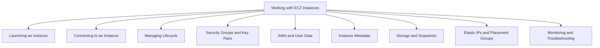
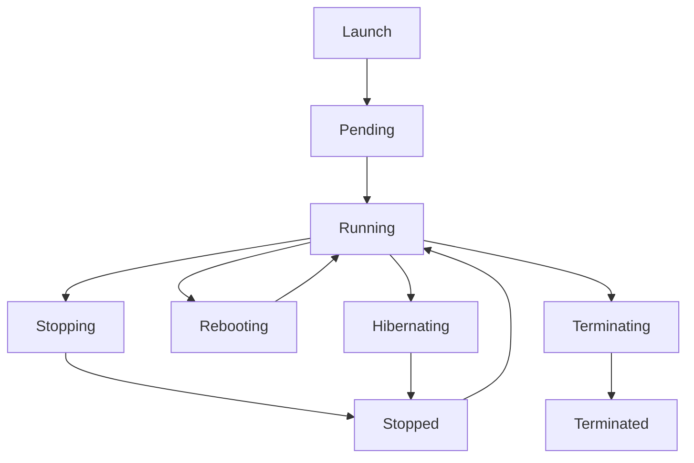

# Migration in progress
# Lesson 3: Working with EC2 Instances

Working with EC2 instances covers the day-to-day operations of launching, connecting to, managing, and securing virtual servers. It includes choosing an Amazon Machine Image, configuring security groups and key pairs, using user data for bootstrapping, retrieving instance metadata, and managing storage and networking. The goal is to build the practical skills needed to run EC2 instances safely and efficiently.

## Launching an EC2 Instance

Launching an instance is the first step. The AWS Management Console, CLI, and SDK all support instance creation. The launch process requires several choices.

- Choose an Amazon Machine Image (AMI). The AMI defines the operating system and pre-installed software.
- Choose an instance type. The instance type defines CPU, memory, storage, and networking capacity.
- Configure network settings. Select a VPC, subnet, and whether to assign a public IP.
- Add storage. Configure the root volume and any additional EBS volumes.
- Configure security groups. Define inbound and outbound traffic rules.
- Select or create a key pair. The key pair is used for SSH or RDP access.
- Review and launch. The instance enters the pending state and then the running state.

| Launch Option | Description | Common Choice |
|---|---|---|
| AMI | Operating system and software | Amazon Linux 2023, Ubuntu, Windows Server |
| Instance Type | Hardware profile | t4g.micro, m7g.large, c7g.xlarge |
| Key Pair | SSH/RDP credentials | Create new or use existing |
| Security Group | Firewall rules | Allow SSH from my IP only |
| Storage | Root and data volumes | gp3 for general purpose |
| User Data | Bootstrapping script | Install packages, configure app |

> [!Important]
> **Never open SSH to 0.0.0.0/0**: Restrict SSH access to your own IP address or use AWS Systems Manager Session Manager for secure, auditable access without opening inbound ports.

## Connecting to an EC2 Instance

Connection method depends on the operating system and whether the instance is in a public or private subnet.

### Linux Instances

- Use SSH with the private key from the key pair.
- Command: `ssh -i /path/to/key.pem ec2-user@public-ip`
- The default user varies by AMI: `ec2-user` for Amazon Linux, `ubuntu` for Ubuntu, `centos` for CentOS.
- Ensure the security group allows inbound SSH (port 22) from your IP.

### Windows Instances

- Use RDP with the administrator password.
- Retrieve the password by decrypting it with the private key.
- Ensure the security group allows inbound RDP (port 3389) from your IP.

### Session Manager (Recommended)

- AWS Systems Manager Session Manager provides browser-based or CLI shell access without opening inbound ports.
- No key pair or bastion host is required.
- All sessions are logged to CloudTrail, S3, or CloudWatch Logs.
- Works for instances in private subnets with the SSM agent installed.

| Method | OS | Port | Key Required | Auditable |
|---|---|---|---|---|
| SSH | Linux | 22 | Yes | No (unless configured) |
| RDP | Windows | 3389 | Yes | No |
| Session Manager | Linux and Windows | None | No | Yes |

> [!Tip]
> **Use Session Manager for production access**: It eliminates the need for bastion hosts, open inbound ports, and key pair distribution. All access is logged and controlled through IAM.

## Managing Instance Lifecycle

Instances move through states from launch to termination. Understanding each state helps avoid unexpected charges and data loss.

| State | Description | Billing | EBS Root Volume |
|---|---|---|---|
| Pending | Preparing to run | Not billed | Preparing |
| Running | Active and usable | Billed | Attached |
| Stopping | Shutting down | Not billed for compute | Preserved |
| Stopped | Shut down | Not billed for compute | Preserved |
| Rebooting | Restarting | Billed | Preserved |
| Terminating | Being deleted | Not billed | Deleted by default |
| Terminated | Permanently deleted | Not billed | Deleted (unless disabled) |
| Hibernating | RAM saved to EBS | Not billed for compute | Preserved |

- Stop preserves the instance and its EBS volumes. You can start it again later.
- Terminate permanently deletes the instance. The root EBS volume is deleted by default unless you disable the Delete on Termination flag.
- Hibernate saves the RAM contents to EBS so the instance can resume faster. Not all instance types support hibernation.
- Reboot restarts the instance without losing the public IP or EBS volumes.

> [!Important]
> **Stop vs Terminate**: Stopping an instance preserves the EBS root volume and allows you to restart later. Terminating deletes the instance and its root volume by default. Use stop for temporary shutdowns and terminate for permanent removal.

## Security Groups and Key Pairs

Security groups and key pairs control access to your instances.

### Security Groups

*Definition*: A security group acts as a virtual firewall for your instance to control inbound and outbound traffic.

- Security groups are stateful. If you allow inbound traffic, the response is automatically allowed outbound.
- Rules are allow-only. You cannot create deny rules.
- You can specify source and destination by IP address, CIDR block, or another security group.
- Multiple security groups can be attached to an instance. The rules are combined.
- Security groups apply at the instance level, not the subnet level.

| Rule Type | Example | Purpose |
|---|---|---|
| Inbound SSH | TCP 22 from 203.0.113.5/32 | Allow SSH from a specific IP |
| Inbound HTTP | TCP 80 from 0.0.0.0/0 | Allow public web traffic |
| Inbound HTTPS | TCP 443 from 0.0.0.0/0 | Allow public secure web traffic |
| Outbound All | All traffic to 0.0.0.0/0 | Default outbound rule |

### Key Pairs

- A key pair consists of a public key and a private key.
- AWS stores the public key. You store the private key.
- The private key is used to decrypt the login for SSH or RDP.
- Key pairs are region-specific. You must create or import a key pair in each region.
- You cannot download the private key again after creation. Store it securely.

> [!Tip]
> **Use unique key pairs per region and per environment**: Do not reuse the same key pair across production and development. Rotate keys periodically and remove old public keys from instances.

## AMIs and User Data

### Amazon Machine Images

*Definition*: An AMI is a template that contains the software configuration (operating system, application server, and applications) required to launch an instance.

- AMIs are region-specific. You can copy an AMI to another region.
- AMIs can be AWS-provided, marketplace-provided, or custom-built.
- Custom AMIs let you pre-install software and configurations to speed up instance launch.
- AMIs are immutable. To update an AMI, create a new version.
- You can create an AMI from a running or stopped instance.

### User Data

*Definition*: User data is a script or cloud-init directive that runs automatically when an instance launches.

- User data runs as root on Linux or as Administrator on Windows.
- User data is used to install packages, configure applications, and run bootstrapping tasks.
- By default, user data runs only on the first boot. You can configure it to run on every boot.
- User data is limited to 16 KB.
- User data is not secure for secrets. Do not embed passwords or access keys.

> [!Important]
> **User data is not secret**: Anyone with access to the instance metadata can read user data. Never put sensitive information in user data. Use IAM roles, Secrets Manager, or Parameter Store for secrets.

## Instance Metadata and IMDS

*Definition*: Instance metadata is data about your instance that you can use to configure or manage the running instance. It is accessible from within the instance at a special IP address.

- The metadata service is available at `http://169.254.169.254/`.
- IMDSv2 is the session-oriented version that adds protection against SSRF attacks.
- IMDSv1 is the legacy version that does not requ