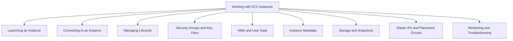
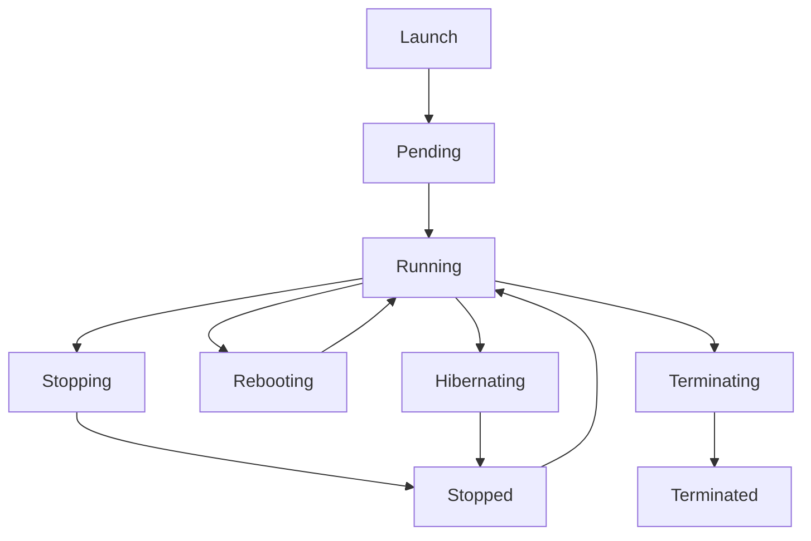
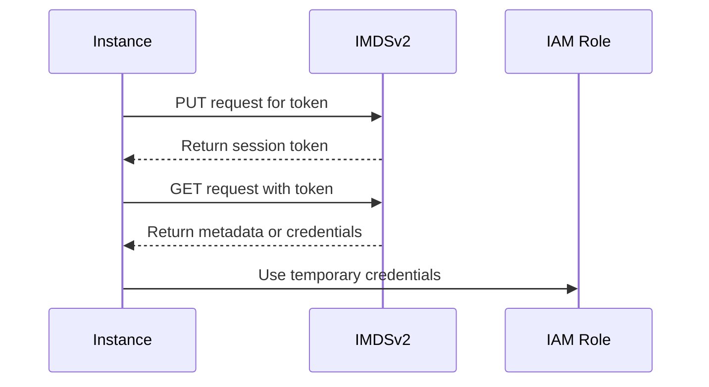
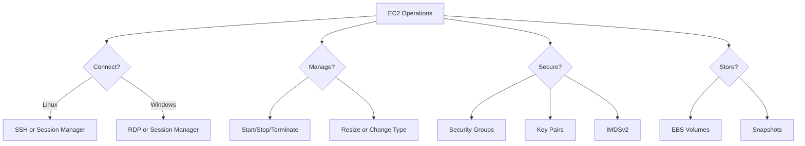

# Lesson 3: Working with EC2 Instances

Working with EC2 instances covers the day-to-day operations of launching, connecting to, managing, and securing virtual servers. It includes choosing an Amazon Machine Image, configuring security groups and key pairs, using user data for bootstrapping, retrieving instance metadata, and managing storage and networking. The goal is to build the practical skills needed to run EC2 instances safely and efficiently.

## Launching an EC2 Instance

Launching an instance is the first step. The AWS Management Console, CLI, and SDK all support instance creation. The launch process requires several choices.

- Choose an Amazon Machine Image (AMI). The AMI defines the operating system and pre-installed software.
- Choose an instance type. The instance type defines CPU, memory, storage, and networking capacity.
- Configure network settings. Select a VPC, subnet, and whether to assign a public IP.
- Add storage. Configure the root volume and any additional EBS volumes.
- Configure security groups. Define inbound and outbound traffic rules.
- Select or create a key pair. The key pair is used for SSH or RDP access.
- Review and launch. The instance enters the pending state and then the running state.

| Launch Option | Description | Common Choice |
|---|---|---|
| AMI | Operating system and software | Amazon Linux 2023, Ubuntu, Windows Server |
| Instance Type | Hardware profile | t4g.micro, m7g.large, c7g.xlarge |
| Key Pair | SSH/RDP credentials | Create new or use existing |
| Security Group | Firewall rules | Allow SSH from my IP only |
| Storage | Root and data volumes | gp3 for general purpose |
| User Data | Bootstrapping script | Install packages, configure app |

> [!Important]
> **Never open SSH to 0.0.0.0/0**: Restrict SSH access to your own IP address or use AWS Systems Manager Session Manager for secure, auditable access without opening inbound ports.

## Connecting to an EC2 Instance

Connection method depends on the operating system and whether the instance is in a public or private subnet.

### Linux Instances

- Use SSH with the private key from the key pair.
- Command: `ssh -i /path/to/key.pem ec2-user@public-ip`
- The default user varies by AMI: `ec2-user` for Amazon Linux, `ubuntu` for Ubuntu, `centos` for CentOS.
- Ensure the security group allows inbound SSH (port 22) from your IP.

### Windows Instances

- Use RDP with the administrator password.
- Retrieve the password by decrypting it with the private key.
- Ensure the security group allows inbound RDP (port 3389) from your IP.

### Session Manager (Recommended)

- AWS Systems Manager Session Manager provides browser-based or CLI shell access without opening inbound ports.
- No key pair or bastion host is required.
- All sessions are logged to CloudTrail, S3, or CloudWatch Logs.
- Works for instances in private subnets with the SSM agent installed.

| Method | OS | Port | Key Required | Auditable |
|---|---|---|---|---|
| SSH | Linux | 22 | Yes | No (unless configured) |
| RDP | Windows | 3389 | Yes | No |
| Session Manager | Linux and Windows | None | No | Yes |

> [!Tip]
> **Use Session Manager for production access**: It eliminates the need for bastion hosts, open inbound ports, and key pair distribution. All access is logged and controlled through IAM.

## Managing Instance Lifecycle

Instances move through states from launch to termination. Understanding each state helps avoid unexpected charges and data loss.

| State | Description | Billing | EBS Root Volume |
|---|---|---|---|
| Pending | Preparing to run | Not billed | Preparing |
| Running | Active and usable | Billed | Attached |
| Stopping | Shutting down | Not billed for compute | Preserved |
| Stopped | Shut down | Not billed for compute | Preserved |
| Rebooting | Restarting | Billed | Preserved |
| Terminating | Being deleted | Not billed | Deleted by default |
| Terminated | Permanently deleted | Not billed | Deleted (unless disabled) |
| Hibernating | RAM saved to EBS | Not billed for compute | Preserved |

- Stop preserves the instance and its EBS volumes. You can start it again later.
- Terminate permanently deletes the instance. The root EBS volume is deleted by default unless you disable the Delete on Termination flag.
- Hibernate saves the RAM contents to EBS so the instance can resume faster. Not all instance types support hibernation.
- Reboot restarts the instance without losing the public IP or EBS volumes.

> [!Important]
> **Stop vs Terminate**: Stopping an instance preserves the EBS root volume and allows you to restart later. Terminating deletes the instance and its root volume by default. Use stop for temporary shutdowns and terminate for permanent removal.

## Security Groups and Key Pairs

Security groups and key pairs control access to your instances.

### Security Groups

*Definition*: A security group acts as a virtual firewall for your instance to control inbound and outbound traffic.

- Security groups are stateful. If you allow inbound traffic, the response is automatically allowed outbound.
- Rules are allow-only. You cannot create deny rules.
- You can specify source and destination by IP address, CIDR block, or another security group.
- Multiple security groups can be attached to an instance. The rules are combined.
- Security groups apply at the instance level, not the subnet level.

| Rule Type | Example | Purpose |
|---|---|---|
| Inbound SSH | TCP 22 from 203.0.113.5/32 | Allow SSH from a specific IP |
| Inbound HTTP | TCP 80 from 0.0.0.0/0 | Allow public web traffic |
| Inbound HTTPS | TCP 443 from 0.0.0.0/0 | Allow public secure web traffic |
| Outbound All | All traffic to 0.0.0.0/0 | Default outbound rule |

### Key Pairs

- A key pair consists of a public key and a private key.
- AWS stores the public key. You store the private key.
- The private key is used to decrypt the login for SSH or RDP.
- Key pairs are region-specific. You must create or import a key pair in each region.
- You cannot download the private key again after creation. Store it securely.

> [!Tip]
> **Use unique key pairs per region and per environment**: Do not reuse the same key pair across production and development. Rotate keys periodically and remove old public keys from instances.

## AMIs and User Data

### Amazon Machine Images

*Definition*: An AMI is a template that contains the software configuration (operating system, application server, and applications) required to launch an instance.

- AMIs are region-specific. You can copy an AMI to another region.
- AMIs can be AWS-provided, marketplace-provided, or custom-built.
- Custom AMIs let you pre-install software and configurations to speed up instance launch.
- AMIs are immutable. To update an AMI, create a new version.
- You can create an AMI from a running or stopped instance.

### User Data

*Definition*: User data is a script or cloud-init directive that runs automatically when an instance launches.

- User data runs as root on Linux or as Administrator on Windows.
- User data is used to install packages, configure applications, and run bootstrapping tasks.
- By default, user data runs only on the first boot. You can configure it to run on every boot.
- User data is limited to 16 KB.
- User data is not secure for secrets. Do not embed passwords or access keys.

> [!Important]
> **User data is not secret**: Anyone with access to the instance metadata can read user data. Never put sensitive information in user data. Use IAM roles, Secrets Manager, or Parameter Store for secrets.

## Instance Metadata and IMDS

*Definition*: Instance metadata is data about your instance that you can use to configure or manage the running instance. It is accessible from within the instance at a special IP address.

- The metadata service is available at `http://169.254.169.254/`.
- IMDSv2 is the session-oriented version that adds protection against SSRF attacks.
- IMDSv1 is the legacy version that does not require a token. AWS recommends disabling IMDSv1.
- Metadata includes instance ID, AMI ID, instance type, IP addresses, and IAM role credentials.
- IAM role credentials are temporary and rotate automatically.

> [!Important]
> **Enforce IMDSv2**: IMDSv1 is vulnerable to SSRF attacks. Require IMDSv2 on all instances by setting the metadata options to require a token. This prevents attackers from stealing IAM role credentials through application vulnerabilities.

## Storage and Snapshots

EC2 instances use EBS volumes for persistent block storage.

- The root volume contains the operating system. It is an EBS volume.
- Additional EBS volumes can be attached for data.
- Instance store provides temporary, high-speed local storage. Data is lost on stop or terminate.
- EBS snapshots are point-in-time backups of EBS volumes. They are stored in S3.
- Snapshots are incremental. Only changed blocks are saved after the first snapshot.
- Snapshots can be used to create new EBS volumes in the same or different Availability Zone.
- Snapshots can be copied to other regions for disaster recovery.

| Volume Type | Use Case | Max IOPS | Max Throughput |
|---|---|---|---|
| gp3 | General purpose SSD | 16,000 | 1,000 MB/s |
| io2 | High IOPS SSD | 256,000 | 4,000 MB/s |
| st1 | Throughput HDD | 500 | 500 MB/s |
| sc1 | Cold HDD | 250 | 250 MB/s |

> [!Tip]
> **Use gp3 for most workloads**: gp3 provides a good balance of price and performance. You can provision IOPS and throughput independently of volume size. Use io2 only when you need sustained high IOPS.

## Elastic IPs and Placement Groups

### Elastic IP Addresses

*Definition*: An Elastic IP (EIP) is a static, public IPv4 address designed for dynamic cloud computing.

- EIPs are allocated to your account and remain until you release them.
- You can associate an EIP with an instance or network interface.
- EIPs allow you to mask the failure of an instance by remapping the address to another instance.
- AWS charges for EIPs that are not associated with a running instance.
- Use EIPs sparingly. Prefer DNS names or load balancers for most use cases.

### Placement Groups

*Definition*: A placement group is a logical grouping of instances within a single Availability Zone that influences how instances are placed on underlying hardware.

| Strategy | Description | Use Case | Risk |
|---|---|---|---|
| Cluster | Packs instances close together | Low latency, high throughput HPC | Single rack failure affects all |
| Spread | Places instances on distinct hardware | High availability, critical instances | Limited to 7 instances per AZ |
| Partition | Spreads instances across logical partitions | Large distributed systems (Hadoop, Cassandra) | Partitions can share hardware |

- Cluster placement groups provide the lowest latency and highest throughput.
- Spread placement groups reduce the risk of simultaneous failure.
- Partition placement groups allow you to spread instances across partitions that do not share racks.

> [!Important]
> **Placement groups affect availability and performance**: Cluster groups improve performance but reduce fault tolerance. Spread groups improve fault tolerance but limit scale. Choose based on whether performance or resilience is more important for the workload.

## Monitoring and Troubleshooting

### Monitoring

- Amazon CloudWatch collects metrics for EC2 instances: CPU utilization, disk reads/writes, network traffic.
- CloudWatch alarms trigger actions based on metric thresholds.
- CloudWatch Logs collects log data from the instance.
- AWS CloudTrail records API calls made to EC2.
- AWS Trusted Advisor provides recommendations for cost, security, and performance.

### Troubleshooting Common Issues

| Issue | Possible Cause | Resolution |
|---|---|---|
| Cannot connect via SSH | Security group, key pair, or network ACL | Verify rules and key permissions |
| Instance status check failed | OS-level issue or hardware failure | Reboot or stop/start the instance |
| High CPU | Workload demand or runaway process | Right-size or investigate process |
| Disk full | Logs or data accumulation | Clean up or attach larger volume |
| Instance unreachable | Network or route issue | Check VPC, subnet, and route tables |

> [!Tip]
> **Use EC2 Serial Console for boot issues**: When an instance fails to boot, the EC2 Serial Console provides a text-based connection to troubleshoot boot problems without needing network access.

## Assessment Preparation

### Practice Questions

1. Describe the steps to launch an EC2 instance.
2. Compare SSH, RDP, and Session Manager for connecting to instances.
3. Explain the EC2 instance lifecycle states and their billing implications.
4. Describe how security groups and key pairs control access.
5. Explain the purpose of AMIs and user data.
6. Describe instance metadata and IMDSv2.
7. Compare EBS volume types and their use cases.
8. Explain Elastic IP addresses and placement groups.
9. List common EC2 troubleshooting steps.

### Scenario Questions

**Scenario 1: Secure Access to a Private Instance**
An EC2 instance runs in a private subnet with no public IP. How do you connect securely?

- Use AWS Systems Manager Session Manager.
- Attach an IAM role with the required SSM permissions.
- Ensure the SSM agent is installed and the instance has outbound access.
- No inbound ports or bastion host are required.

**Scenario 2: Bootstrapping a Web Server**
A new instance needs to install Apache and start the service on launch. How do you automate this?

- Use user data with a shell script.
- Example: `#!/bin/bash` then `yum install -y httpd` then `systemctl start httpd`.
- User data runs on first boot as root.
- Do not embed secrets in user data.

**Scenario 3: High-Performance Computing**
A research team needs low-latency networking for tightly coupled HPC workloads. Which placement group should they use?

- Use a cluster placement group.
- Deploy instances in the same Availability Zone.
- Use enhanced networking or Elastic Fabric Adapter for lowest latency.
- Accept reduced fault tolerance for maximum performance.

**Scenario 4: Disaster Recovery for EBS Volumes**
A company needs to back up EBS volumes and restore them in another region. What should they do?

- Create EBS snapshots on a schedule.
- Copy snapshots to the target region.
- Create new EBS volumes from the copied snapshots.
- Use AWS Backup for centralized snapshot management.

## Key Takeaways

- Launching an EC2 instance requires choosing an AMI, instance type, network settings, storage, security groups, and key pairs.
- Connect to Linux instances with SSH and Windows instances with RDP. Use Session Manager for secure, auditable access without open ports.
- The EC2 instance lifecycle includes pending, running, stopping, stopped, rebooting, terminating, and hibernating states.
- Stop preserves the instance and EBS volumes. Terminate permanently deletes the instance and its root volume by default.
- Security groups are stateful firewalls. Key pairs provide SSH and RDP credentials.
- AMIs are templates for instance launch. User data bootstraps instances on first boot.
- Instance metadata is available at 169.254.169.254. Enforce IMDSv2 to prevent SSRF attacks.
- EBS provides persistent block storage. Snapshots are incremental backups stored in S3.
- Elastic IPs are static public addresses. Placement groups influence instance placement for performance or availability.
- Monitor with CloudWatch, CloudTrail, and Trusted Advisor. Troubleshoot common issues with security groups, status checks, and the serial console.

> [!Important]
> **Operate EC2 instances with security and cost in mind**: Every operational decision, from security group rules to instance state, affects security and cost. Restrict access, enforce IMDSv2, use Session Manager, stop idle instances, and monitor utilization continuously.
