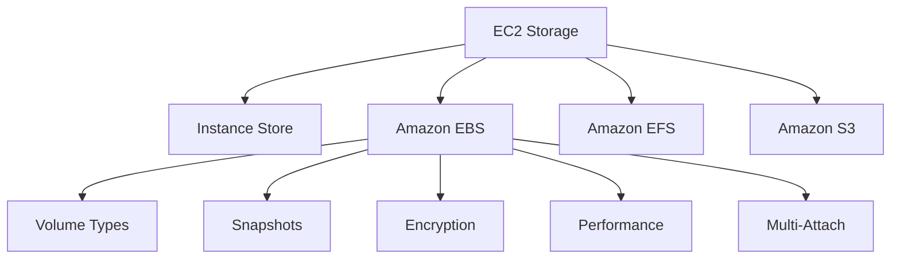
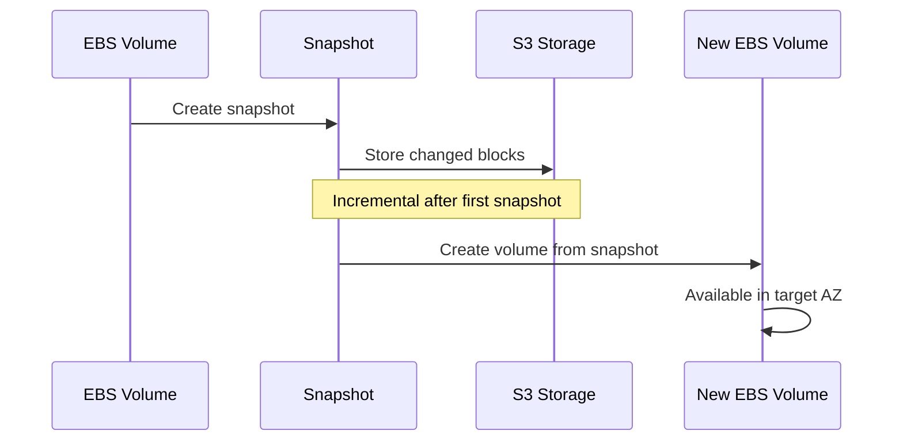

# Migration in progress
# Lesson 4: EC2 Storage: EBS and Snapshots

Amazon Elastic Block Store (EBS) provides persistent block-level storage volumes for EC2 instances. EBS volumes are network-attached, replicated within an Availability Zone, and independent of the instance lifecycle. Snapshots provide point-in-time backups stored in S3. This lesson covers volume types, performance characteristics, snapshot mechanics, encryption, and best practices.



## What Is Amazon EBS

*Definition*: Amazon EBS is a block-level storage service designed for use with EC2 instances. EBS volumes behave like raw, unformatted block devices that you can attach to a single instance.

- EBS volumes are network-attached, not physically attached to the host.
- Data is replicated within the Availability Zone automatically.
- EBS volumes persist independently of the instance lifecycle.
- You can detach a volume from one instance and attach it to another in the same AZ.
- EBS volumes are tied to a single Availability Zone and cannot be attached across AZs.
- EBS supports encryption at rest and in transit using AWS KMS.

> [!Important]
> **EBS volumes are AZ-bound**: A volume in `us-east-1a` cannot be attached to an instance in `us-east-1b`. To move data across AZs or Regions, create a snapshot and restore it in the target AZ or Region.

## EBS Volume Types

EBS offers two main categories: SSD-backed volumes for transactional workloads and HDD-backed volumes for throughput-intensive workloads.

### SSD-Backed Volumes

| Volume Type | Use Case | Max IOPS | Max Throughput | Max Size |
|---|---|---|---|---|
| gp3 | General purpose, boot volumes | 16,000 | 1,000 MB/s | 16 TiB |
| gp2 | Legacy general purpose | 16,000 | 250 MB/s | 16 TiB |
| io2 Block Express | Mission-critical, high IOPS | 256,000 | 4,000 MB/s | 64 TiB |
| io2 | High IOPS, databases | 64,000 | 1,000 MB/s | 16 TiB |
| io1 | Legacy high IOPS | 64,000 | 1,000 MB/s | 16 TiB |

- gp3 is the default general purpose SSD. It provides a baseline of 3,000 IOPS and 125 MB/s, with the ability to provision IOPS and throughput independently of volume size.
- gp2 performance scales with volume size. A 1 TB gp2 volume provides 3,000 IOPS. Smaller volumes provide fewer IOPS.
- io2 Block Express is designed for the most demanding I/O-intensive workloads, including mission-critical databases.
- io2 and io1 support Multi-Attach for shared access from multiple instances in the same AZ.

### HDD-Backed Volumes

| Volume Type | Use Case | Max IOPS | Max Throughput | Max Size |
|---|---|---|---|---|
| st1 | Throughput-intensive, big data | 500 | 500 MB/s | 16 TiB |
| sc1 | Cold data, infrequent access | 250 | 250 MB/s | 16 TiB |

- st1 is optimized for sequential throughput workloads such as big data, data warehouses, and log processing.
- sc1 is the lowest-cost EBS volume type, designed for cold data that is accessed infrequently.
- HDD volumes cannot be used as boot volumes.
- HDD volumes are ideal for workloads where throughput matters more than IOPS.

> [!Tip]
> **Use gp3 for most workloads**: gp3 provides a good balance of price and performance. You can provision IOPS and throughput independently of volume size. Upgrade to io2 Block Express only when you need sustained high IOPS for mission-critical databases.

### Volume Type Comparison

| Dimension | gp3 | io2 Block Express | st1 | sc1 |
|---|---|---|---|---|
| Storage Media | SSD | SSD | HDD | HDD |
| Boot Volume | Yes | Yes | No | No |
| Max IOPS | 16,000 | 256,000 | 500 | 250 |
| Max Throughput | 1,000 MB/s | 4,000 MB/s | 500 MB/s | 250 MB/s |
| Multi-Attach | No | Yes | No | No |
| Best For | General purpose | Mission-critical databases | Big data, log processing | Cold data, archives |

> [!Important]
> **Right-size your volumes based on IOPS and throughput, not just capacity**: A volume that is large enough for your data may still be too slow for your workload. Match the volume type to the IOPS and throughput requirements of the application.

## EBS Snapshots

*Definition*: An EBS snapshot is a point-in-time backup of an EBS volume stored in Amazon S3. Snapshots are incremental, meaning only the blocks that have changed since the last snapshot are saved.

- Snapshots are stored in S3 and are automatically replicated across multiple Availability Zones within a Region.
- Snapshots are incremental. The first snapshot copies all used blocks. Subsequent snapshots copy only changed blocks.
- Snapshots are region-specific. You can copy a snapshot to another Region for disaster recovery.
- You can create a new EBS volume from a snapshot in any Availability Zone within the same Region.
- You can share snapshots with other AWS accounts or make them public.
- Snapshots of encrypted volumes are encrypted automatically.
- You cannot convert an unencrypted snapshot to an encrypted one directly. You must create a new encrypted volume from the snapshot and then snapshot the encrypted volume.

### Snapshot Lifecycle



### Snapshot Best Practices

- Schedule snapshots using Amazon Data Lifecycle Manager or AWS Backup.
- Tag snapshots for cost allocation and lifecycle management.
- Use fast snapshot restore for latency-sensitive workloads that need immediate performance from restored volumes.
- Copy snapshots to other Regions for disaster recovery.
- Archive snapshots to the EBS Snapshot Archive tier for long-term retention at lower cost.
- Enforce encryption by default for all snapshots.

| Feature | Description | Use Case |
|---|---|---|
| Fast Snapshot Restore | Pre-warms snapshots for immediate full performance | Mission-critical volumes, disaster recovery |
| Snapshot Archive | Low-cost storage tier for long-term retention | Compliance, legal holds |
| Recycle Bin | Retain deleted snapshots for recovery | Accidental deletion protection |
| Cross-Region Copy | Copy snapshots to other Regions | Disaster recovery, migration |

> [!Tip]
> **Use Amazon Data Lifecycle Manager for automated snapshots**: DLM automates the creation, retention, and deletion of EBS snapshots. Define a policy that matches your recovery point objective (RPO) and retention requirements.

> [!Important]
> **Snapshots are incremental but restores are full**: Each snapshot only stores changed blocks, but when you restore a volume from a snapshot, AWS reconstructs the full volume from the snapshot chain. Deleting a snapshot in the middle of a chain breaks the chain.

## EBS Encryption

*Definition*: EBS encryption protects data at rest, data in transit between the instance and the volume, and snapshots created from encrypted volumes.

- EBS encryption uses AWS KMS customer master keys (CMKs).
- Encryption is transparent to the operating system and applications. No changes are required to the application.
- You can enable encryption by default for all new EBS volumes in a Region.
- Encrypted volumes can only be attached to instances that support encryption. All modern instance types support encryption.
- Snapshots of encrypted volumes are encrypted automatically.
- You can create encrypted volumes from unencrypted snapshots by specifying encryption during volume creation.

### Encryption Workflow

```mermaid
flowchart TD
    A[Create Volume] --> B{Encryption Enabled?}
    B -->|Yes| C[Encrypt with KMS Key]
    B -->|No| D[Unencrypted Volume]
    C --> E[Att