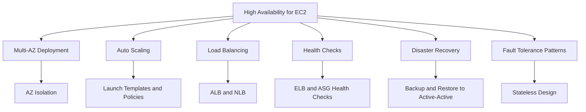
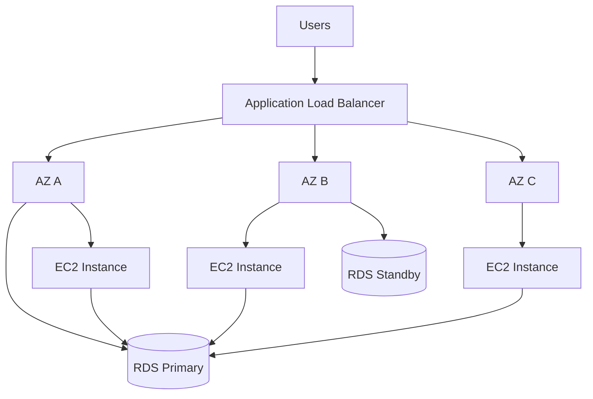

# Migration in progress
# Lesson 5: High Availability for EC2

High availability for EC2 means designing workloads to remain operational despite failures in instances, Availability Zones, or Regions. It combines multi-AZ deployment, Auto Scaling, load balancing, health checks, and disaster recovery patterns. The goal is to eliminate single points of failure and automate recovery so that failures are transparent to users.

## Availability Foundations for EC2

Availability is the percentage of time a workload is operational and accessible. For EC2, availability depends on how instances are distributed across fault domains and how quickly failures are detected and recovered.

- Availability = MTBF / (MTBF + MTTR) * 100%.
- MTBF is mean time between failures. MTTR is mean time to recovery.
- Reducing MTTR has the biggest impact on availability because MTBF is largely determined by hardware and software quality.
- Deploying a single EC2 instance in a single AZ gives roughly 99.0% availability, allowing 87.6 hours of downtime per year.
- Deploying across multiple AZs with load balancing and health checks reaches 99.99%, allowing 52.6 minutes per year.
- Deploying across multiple Regions with active-active routing reaches 99.999%, allowing 5.26 minutes per year.

| Architecture | SLA Availability | Annual Downtime | Key Mechanism |
|---|---|---|---|
| Single instance, single AZ | 99.0% | 87.6 hours | Manual recovery |
| Multi-instance, single AZ | 99.9% | 8.77 hours | Load balancer health checks |
| Multi-AZ with Auto Scaling | 99.99% | 52.6 minutes | Automated failover and scaling |
| Multi-Region active-active | 99.999% | 5.26 minutes | DNS routing and data replication |

> [!Important]
> **Reduce MTTR to improve availability**: You cannot easily change how often hardware fails, but you can change how fast you recover. Automation, health checks, and pre-built recovery runbooks are the fastest path to higher availability.

## Multi-AZ Deployment

*Definition*: Multi-AZ deployment distributes EC2 instances and other resources across multiple Availability Zones within a Region so that a failure in one AZ does not take down the workload.

- Each AZ has independent power, cooling, and networking.
- AZs within a Region are connected by low-latency links (single-digit millisecond round trips).
- Deploying at least two instances in separate AZs eliminates the single-instance single-AZ failure mode.
- Auto Scaling groups can span multiple AZs and rebalance capacity automatically.
- RDS, Aurora, and other managed services offer Multi-AZ options that complement EC2 multi-AZ design.

> [!Tip]
> **Two AZs is the minimum, three AZs is better**: Two AZs protect against a single AZ failure. Three AZs maintain full capacity even during a single AZ failure and provide headroom for rolling deployments.

## Auto Scaling

*Definition*: EC2 Auto Scaling automatically adjusts the number of EC2 instances in a group based on demand or a schedule. It also replaces unhealthy instances to maintain a desired capacity.

### Core Components

| Component | Description |
|---|---|
| Launch Template | Defines the AMI, instance type, security groups, key pair, and user data |
| Auto Scaling Group | Collection of instances managed as a single unit across AZs |
| Desired Capacity | The number of instances the group maintains |
| Minimum and Maximum Size | Boundaries for scaling actions |
| Scaling Policies | Rules that trigger scale-out or scale-in |
| Health Checks | EC2 status checks, ELB health checks, or custom health checks |

- Launch templates replace launch configurations. They support versioning and mixed instance policies.
- Auto Scaling groups span multiple AZs and rebalance instances when AZs become unhealthy.
- Desired capacity can be set manually or dynamically by scaling policies.
- Mixed instance policies allow a group to use multiple instance types and purchase options (On-Demand and Spot) for cost and resilience.

### Scaling Policies

| Policy Type | Description | Use Case |
|---|---|---|
| Target Tracking | Maintains a target metric such as average CPU at 50% | Most workloads, simple to configure |
| Step Scaling | Applies graduated responses based on metric breach severity | Workloads with sharp traffic spikes |
| Scheduled Scaling | Scales based on a known schedule | Predictable traffic patterns |
| Predictive Scaling | Uses machine learning to forecast traffic | Recurring patterns with historical data |

- Target tracking is the simplest and most common policy. It adjusts capacity to keep a metric at a target value.
- Step scaling adds or removes capacity in steps depending on how far the metric is from the threshold.
- Scheduled scaling launches capacity at a specific time, such as before a flash sale or the start of a business day.
- Predictive scaling forecasts future traffic and provisions capacity ahead of demand.

### Cooldowns and Hysteresis

- Cooldown periods suppress additional scaling actions for a set time after a scaling event, allowing new instances to boot and absorb traffic.
- Hysteresis sets a gap between scale-out and scale-in thresholds to prevent churn around a single metric value.
- Example: scale out when CPU is above 75%, scale in only when CPU is below 35%.
- Asymmetric scaling means scaling out aggressively on spikes and scaling in slowly after sustained idle periods.

> [!Important]
> **Asymmetric scaling preserves stability**: Aggressive scale-out handles sudden demand. Conservative scale-in avoids terminating capacity during brief traffic dips. This combination prevents flapping and reduces cost volatility.

### Auto Scaling Health Checks

- EC2 health checks verify that the instance is running and passes status checks.
- ELB health checks verify that the instance responds to the load balancer on a specific path.
- Custom health checks use CloudWatch metrics or application-level checks.
- When an instance fails a health check, Auto Scaling terminates it and launches a replacement.
- Grace periods give new instances time to boot before health checks begin evaluating them.

> [!Tip]
> **Use ELB health checks for web workloads**: ELB health checks catch application-level failures that EC2 status checks miss, such as a hung web server process. Configure the health check path to a meaningful endpoint like `/health`.

## Load Balancing for High Availability

Load balancers distribute traffic across multiple instances and remove unhealthy targets from rotation.

### Elastic Load Balancing Options

| Load Balancer | Layer | Scope | Use Case |
|---|---|---|---|
| Application Load Balancer | Layer 7 | Regional | HTTP and HTTPS microservices, path and host routing |
| Network Load Balancer | Layer 4 | Regional | TCP, UDP, and TLS traffic, ultra-low latency |
| Gateway Load Balancer | Layer 3/4 | Regional | Third-party virtual appliances, firewalls, IDS/IPS |
| Classic Load Balancer | Layer 4/7 | Regional | Legacy workloads only |

- Application Load Balancer supports path-based and host-based routing, WebSocket, HTTP/2, and gRPC.
- Network Load Balancer handles millions of requests per second with ultra-low latency and preserves the source IP address.
- Gateway Load Balancer distributes traffic to virtual appliances for inspection and filtering.
- All load balancers support cross-zone load balancing to distribute traffic evenly across AZs.
- Load balancers integrate with Auto Scaling groups to register new instances automatically.

### Health Checks

- Health checks determine whether a target is healthy and should receive traffic.
- Shallow health checks verify that a TCP connection can be established or that `GET /` returns 200 OK.
- Deep health checks verify that the application can reach downstream dependencies such as databases and caches.
- Flap damping uses consecutive health check thresholds to prevent rapid state changes.
- Unhealthy thresholds and healthy thresholds are configurable.

> [!Important]
> **Avoid cascading health check failures**: Deep health checks that hard-fail on downstream dependency issues can cause fleet-wide termination when a shared database slows down. Use warnings and degrade gracefully instead of hard-failing.

### Session State Handling

- Sticky sessions pin a user to a specific instance using a load balancer cookie.
- Sticky sessions reduce horizontal scalability and cause session loss when an instance fails.
- Stateless design stores session state in a distributed cache such as ElastiCache or DynamoDB.
- Stateless design lets any instance handle any request, enabling free horizontal scaling and safe instance replacement.

> [!Tip]
> **Design for stateless compute**: Store session state outside the instance so that instances can be replaced without losing user sessions. This is the single most important pattern for elastic, highly available EC2 architectures.

## Fault Tolerance and Redundancy Patterns

High availability is achieved through redundancy. The pattern you choose d