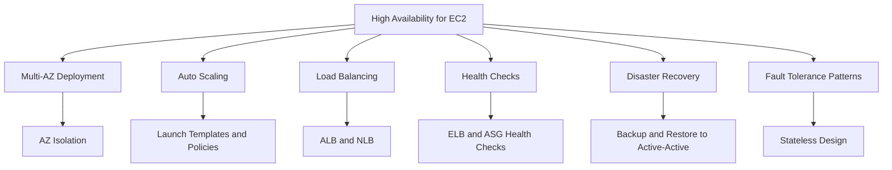
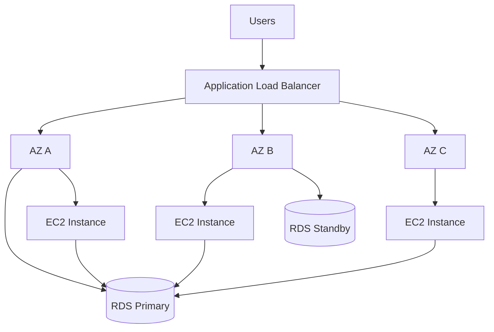
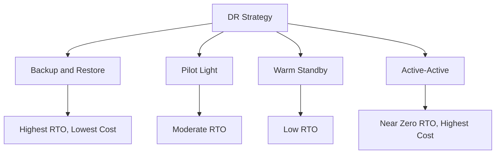
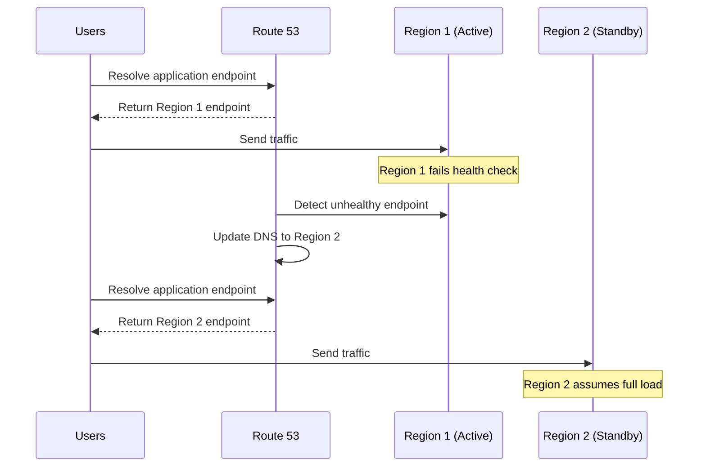
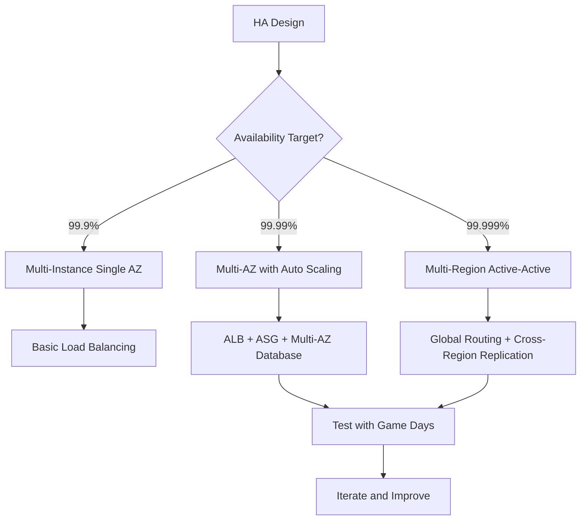

# Lesson 5: High Availability for EC2

High availability for EC2 means designing workloads to remain operational despite failures in instances, Availability Zones, or Regions. It combines multi-AZ deployment, Auto Scaling, load balancing, health checks, and disaster recovery patterns. The goal is to eliminate single points of failure and automate recovery so that failures are transparent to users.

## Availability Foundations for EC2

Availability is the percentage of time a workload is operational and accessible. For EC2, availability depends on how instances are distributed across fault domains and how quickly failures are detected and recovered.

- Availability = MTBF / (MTBF + MTTR) * 100%.
- MTBF is mean time between failures. MTTR is mean time to recovery.
- Reducing MTTR has the biggest impact on availability because MTBF is largely determined by hardware and software quality.
- Deploying a single EC2 instance in a single AZ gives roughly 99.0% availability, allowing 87.6 hours of downtime per year.
- Deploying across multiple AZs with load balancing and health checks reaches 99.99%, allowing 52.6 minutes per year.
- Deploying across multiple Regions with active-active routing reaches 99.999%, allowing 5.26 minutes per year.

| Architecture | SLA Availability | Annual Downtime | Key Mechanism |
|---|---|---|---|
| Single instance, single AZ | 99.0% | 87.6 hours | Manual recovery |
| Multi-instance, single AZ | 99.9% | 8.77 hours | Load balancer health checks |
| Multi-AZ with Auto Scaling | 99.99% | 52.6 minutes | Automated failover and scaling |
| Multi-Region active-active | 99.999% | 5.26 minutes | DNS routing and data replication |

> [!Important]
> **Reduce MTTR to improve availability**: You cannot easily change how often hardware fails, but you can change how fast you recover. Automation, health checks, and pre-built recovery runbooks are the fastest path to higher availability.

## Multi-AZ Deployment

*Definition*: Multi-AZ deployment distributes EC2 instances and other resources across multiple Availability Zones within a Region so that a failure in one AZ does not take down the workload.

- Each AZ has independent power, cooling, and networking.
- AZs within a Region are connected by low-latency links (single-digit millisecond round trips).
- Deploying at least two instances in separate AZs eliminates the single-instance single-AZ failure mode.
- Auto Scaling groups can span multiple AZs and rebalance capacity automatically.
- RDS, Aurora, and other managed services offer Multi-AZ options that complement EC2 multi-AZ design.

> [!Tip]
> **Two AZs is the minimum, three AZs is better**: Two AZs protect against a single AZ failure. Three AZs maintain full capacity even during a single AZ failure and provide headroom for rolling deployments.

## Auto Scaling

*Definition*: EC2 Auto Scaling automatically adjusts the number of EC2 instances in a group based on demand or a schedule. It also replaces unhealthy instances to maintain a desired capacity.

### Core Components

| Component | Description |
|---|---|
| Launch Template | Defines the AMI, instance type, security groups, key pair, and user data |
| Auto Scaling Group | Collection of instances managed as a single unit across AZs |
| Desired Capacity | The number of instances the group maintains |
| Minimum and Maximum Size | Boundaries for scaling actions |
| Scaling Policies | Rules that trigger scale-out or scale-in |
| Health Checks | EC2 status checks, ELB health checks, or custom health checks |

- Launch templates replace launch configurations. They support versioning and mixed instance policies.
- Auto Scaling groups span multiple AZs and rebalance instances when AZs become unhealthy.
- Desired capacity can be set manually or dynamically by scaling policies.
- Mixed instance policies allow a group to use multiple instance types and purchase options (On-Demand and Spot) for cost and resilience.

### Scaling Policies

| Policy Type | Description | Use Case |
|---|---|---|
| Target Tracking | Maintains a target metric such as average CPU at 50% | Most workloads, simple to configure |
| Step Scaling | Applies graduated responses based on metric breach severity | Workloads with sharp traffic spikes |
| Scheduled Scaling | Scales based on a known schedule | Predictable traffic patterns |
| Predictive Scaling | Uses machine learning to forecast traffic | Recurring patterns with historical data |

- Target tracking is the simplest and most common policy. It adjusts capacity to keep a metric at a target value.
- Step scaling adds or removes capacity in steps depending on how far the metric is from the threshold.
- Scheduled scaling launches capacity at a specific time, such as before a flash sale or the start of a business day.
- Predictive scaling forecasts future traffic and provisions capacity ahead of demand.

### Cooldowns and Hysteresis

- Cooldown periods suppress additional scaling actions for a set time after a scaling event, allowing new instances to boot and absorb traffic.
- Hysteresis sets a gap between scale-out and scale-in thresholds to prevent churn around a single metric value.
- Example: scale out when CPU is above 75%, scale in only when CPU is below 35%.
- Asymmetric scaling means scaling out aggressively on spikes and scaling in slowly after sustained idle periods.

> [!Important]
> **Asymmetric scaling preserves stability**: Aggressive scale-out handles sudden demand. Conservative scale-in avoids terminating capacity during brief traffic dips. This combination prevents flapping and reduces cost volatility.

### Auto Scaling Health Checks

- EC2 health checks verify that the instance is running and passes status checks.
- ELB health checks verify that the instance responds to the load balancer on a specific path.
- Custom health checks use CloudWatch metrics or application-level checks.
- When an instance fails a health check, Auto Scaling terminates it and launches a replacement.
- Grace periods give new instances time to boot before health checks begin evaluating them.

> [!Tip]
> **Use ELB health checks for web workloads**: ELB health checks catch application-level failures that EC2 status checks miss, such as a hung web server process. Configure the health check path to a meaningful endpoint like `/health`.

## Load Balancing for High Availability

Load balancers distribute traffic across multiple instances and remove unhealthy targets from rotation.

### Elastic Load Balancing Options

| Load Balancer | Layer | Scope | Use Case |
|---|---|---|---|
| Application Load Balancer | Layer 7 | Regional | HTTP and HTTPS microservices, path and host routing |
| Network Load Balancer | Layer 4 | Regional | TCP, UDP, and TLS traffic, ultra-low latency |
| Gateway Load Balancer | Layer 3/4 | Regional | Third-party virtual appliances, firewalls, IDS/IPS |
| Classic Load Balancer | Layer 4/7 | Regional | Legacy workloads only |

- Application Load Balancer supports path-based and host-based routing, WebSocket, HTTP/2, and gRPC.
- Network Load Balancer handles millions of requests per second with ultra-low latency and preserves the source IP address.
- Gateway Load Balancer distributes traffic to virtual appliances for inspection and filtering.
- All load balancers support cross-zone load balancing to distribute traffic evenly across AZs.
- Load balancers integrate with Auto Scaling groups to register new instances automatically.

### Health Checks

- Health checks determine whether a target is healthy and should receive traffic.
- Shallow health checks verify that a TCP connection can be established or that `GET /` returns 200 OK.
- Deep health checks verify that the application can reach downstream dependencies such as databases and caches.
- Flap damping uses consecutive health check thresholds to prevent rapid state changes.
- Unhealthy thresholds and healthy thresholds are configurable.

> [!Important]
> **Avoid cascading health check failures**: Deep health checks that hard-fail on downstream dependency issues can cause fleet-wide termination when a shared database slows down. Use warnings and degrade gracefully instead of hard-failing.

### Session State Handling

- Sticky sessions pin a user to a specific instance using a load balancer cookie.
- Sticky sessions reduce horizontal scalability and cause session loss when an instance fails.
- Stateless design stores session state in a distributed cache such as ElastiCache or DynamoDB.
- Stateless design lets any instance handle any request, enabling free horizontal scaling and safe instance replacement.

> [!Tip]
> **Design for stateless compute**: Store session state outside the instance so that instances can be replaced without losing user sessions. This is the single most important pattern for elastic, highly available EC2 architectures.

## Fault Tolerance and Redundancy Patterns

High availability is achieved through redundancy. The pattern you choose depends on cost tolerance and recovery time requirements.

| Pattern | Description | RTO | RPO | Cost |
|---|---|---|---|---|
| Backup and Restore | Backups stored in S3, restored on demand | Hours to days | Hours | Low |
| Pilot Light | Minimal core running, scaled up on failover | Tens of minutes | Minutes | Low to medium |
| Warm Standby | Scaled-down full stack running, scaled up on failover | Minutes | Seconds to minutes | Medium |
| Multi-Site Active-Active | Full capacity in multiple Regions serving traffic | Near zero | Near zero | High |

- Backup and Restore is the cheapest but slowest. Suitable for non-critical workloads.
- Pilot Light keeps data replicated and a minimal environment running, then scales up during a disaster.
- Warm Standby runs a full but reduced-capacity stack that can be scaled up quickly.
- Active-Active runs full capacity in multiple Regions, with traffic distributed globally. Highest cost, highest availability.

> [!Important]
> **RTO and RPO drive the pattern choice**: Recovery Time Objective (RTO) is how long you can tolerate downtime. Recovery Point Objective (RPO) is how much data you can afford to lose. Choose the cheapest pattern that meets both targets.

## Stateless Design and Immutable Infrastructure

### Stateless Compute

- Stateless instances do not store application state locally.
- Session data lives in ElastiCache, DynamoDB, or another shared store.
- Any instance can serve any request, so instances can be added, removed, or replaced freely.
- Stateless design is a prerequisite for effective horizontal scaling and Auto Scaling.

### Immutable Infrastructure

- Immutable infrastructure means instances are never modified after launch.
- Changes are made by building a new AMI and launching new instances.
- Old instances are terminated after the new ones pass health checks.
- Benefits include predictable deployments, easier rollbacks, and no configuration drift.
- Golden AMIs are pre-baked images with the operating system, patches, and application already installed.

> [!Tip]
> **Combine stateless compute with immutable infrastructure**: This combination enables rolling deployments, blue-green deployments, and rapid recovery. It also reduces configuration drift and simplifies troubleshooting.

## Multi-Region High Availability

Multi-Region deployment protects against Region-level failures and reduces latency for global users.

### Key Components

- Route 53 with latency-based, geolocation, or failover routing policies.
- Cross-Region data replication using Aurora Global Database, DynamoDB Global Tables, or S3 Cross-Region Replication.
- Global load balancing with AWS Global Accelerator or CloudFront.
- Independent Auto Scaling groups in each Region.
- Health checks that detect Region failure and shift traffic automatically.

### Failover Mechanics

> [!Important]
> **DNS failover is not instant**: Route 53 failover depends on TTL values and health check intervals. Use low TTLs for faster failover, and combine DNS failover with Global Accelerator for faster traffic shifting.

## Testing High Availability

High availability architectures must be tested. Untested failover is an assumption, not a guarantee.

### Chaos Engineering

- Chaos engineering is the practice of deliberately injecting failures to test resilience.
- AWS Fault Injection Service (FIS) runs controlled experiments on AWS resources.
- Common experiments include terminating instances, disrupting network connectivity, and stressing CPU or memory.
- Run experiments in a controlled environment first, then in production with proper safeguards.
- Use game days to simulate production events and validate runbooks.

### What to Test

- Instance termination and Auto Scaling replacement.
- AZ failure and load balancer failover.
- Region failure and DNS failover.
- Database failover and read replica promotion.
- Health check behavior under degraded conditions.

> [!Tip]
> **Schedule regular game days**: Game days validate both the architecture and the team. They reveal gaps in runbooks, monitoring, and communication that technical testing alone does not catch.

## Assessment Preparation

### Practice Questions

1. Explain how availability is calculated and why reducing MTTR improves availability.
2. Describe the components of an Auto Scaling group and how scaling policies work.
3. Compare target tracking, step scaling, scheduled scaling, and predictive scaling.
4. Explain cooldowns and hysteresis and why they prevent flapping.
5. Compare Application Load Balancer, Network Load Balancer, and Gateway Load Balancer.
6. Explain shallow versus deep health checks and the risks of cascading failures.
7. Describe why stateless design enables horizontal scaling.
8. Compare backup and restore, pilot light, warm standby, and active-active.
9. Explain how Route 53 failover works and its limitations.
10. Describe how chaos engineering validates high availability.

### Scenario Questions

**Scenario 1: Web Application with Variable Traffic**
A web application has unpredictable traffic that spikes during promotions. Design a highly available architecture.

- Use an Application Load Balancer across three AZs.
- Use an Auto Scaling group with a target tracking policy on CPU utilization.
- Store session state in ElastiCache for stateless compute.
- Configure ELB health checks on a `/health` endpoint.
- Use aggressive scale-out and conservative scale-in with a cooldown period.

**Scenario 2: Mission-Critical Database-Backed Application**
A financial application requires 99.99% availability with minimal data loss. Design the architecture.

- Deploy EC2 instances across three AZs behind an Application Load Balancer.
- Use Aurora Multi-AZ with automatic failover for the database.
- Use Auto Scaling groups with mixed instance policies.
- Configure Route 53 health checks for the application endpoint.
- Test failover with AWS Fault Injection Service.

**Scenario 3: Global Application with 99.999% Target**
A global SaaS platform requires near-zero downtime. Design the architecture.

- Deploy active-active in two or more Regions.
- Use Route 53 latency-based routing or Global Accelerator.
- Use DynamoDB Global Tables or Aurora Global Database for cross-Region data.
- Use stateless compute with Auto Scaling in each Region.
- Run regular game days to validate failover.

**Scenario 4: Cost-Constrained Startup**
A startup needs high availability but has limited budget. Design the architecture.

- Deploy two instances across two AZs behind an Application Load Balancer.
- Use a small Auto Scaling group with a target tracking policy.
- Use Spot Instances for non-critical capacity with On-Demand as a fallback.
- Use backup and restore for disaster recovery.
- Reserve capacity only for the steady-state baseline.

## Key Takeaways

- High availability for EC2 is achieved through multi-AZ deployment, Auto Scaling, load balancing, health checks, and automated recovery.
- Availability is MTBF divided by MTBF plus MTTR. Reducing MTTR has the biggest impact.
- Multi-AZ deployment across at least two AZs eliminates single-AZ failure modes.
- EC2 Auto Scaling maintains desired capacity, replaces unhealthy instances, and scales based on demand.
- Scaling policies include target tracking, step scaling, scheduled scaling, and predictive scaling.
- Cooldowns and hysteresis prevent scaling flapping. Asymmetric scaling is more stable.
- Elastic Load Balancing offers Application, Network, and Gateway load balancers for different traffic types.
- Health checks determine target health. Deep health checks must avoid cascading failures.
- Stateless design stores session state outside instances and enables free horizontal scaling.
- Immutable infrastructure builds new AMIs and replaces instances rather than modifying them.
- Disaster recovery patterns range from backup and restore to active-active, with different RTO, RPO, and cost trade-offs.
- Multi-Region high availability uses Route 53, Global Accelerator, and cross-Region data replication.
- Chaos engineering and game days validate that failover actually works.
- Untested high availability is an assumption, not a guarantee.

> [!Important]
> **High availability is a design property, not a checkbox**: It emerges from the combination of multi-AZ deployment, automated scaling, health-based recovery, stateless compute, and regular testing. Architect for failure, automate recovery, and prove it works before a real incident forces the question.
