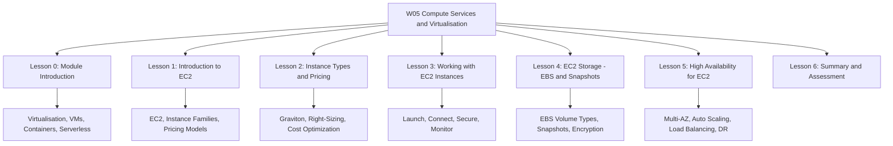

# Migration in progress
**W05: Compute Services + Virtualisation - Summary and Assessment**

This module covers the foundational compute technologies behind cloud services: virtualisation, virtual machines, containers, and serverless functions. It maps these concepts to AWS compute services, including EC2, Lambda, ECS, EKS, and Fargate. The goal is to understand how each compute model works, when to use it, and how to choose between them.

## Virtualisation Fundamentals

*Definition*: Virtualisation creates a software-based representation of compute, storage, or network resources, allowing multiple operating systems to run on one physical machine.

- A hypervisor sits between hardware and virtual machines. It allocates CPU, memory, storage, and network.
- Type 1 hypervisors run directly on hardware. Type 2 hypervisors run on a host OS.
- Cloud providers use Type 1 hypervisors for performance and isolation.
- The VM lifecycle includes creation, deployment, monitoring, maintenance, and retirement.

| Feature | Type 1 (Bare-Metal) | Type 2 (Hosted) |
|---|---|---|
| Runs on | Physical hardware | Host operating system |
| Performance | High | Medium to low |
| Use Case | Cloud providers, data centers | Development, testing |
| Examples | KVM, Xen, VMware ESXi | VirtualBox, VMware Workstation |

> [!Important]
> **Type 1 hypervisors are the foundation of cloud**: They run directly on hardware and provide better performance and isolation for multi-tenant cloud environments.

## EC2 Instance Types and Pricing Models

Amazon EC2 provides secure, resizable virtual servers called instances. It offers over 1,000 instance types across five families.

### Instance Families

| Family | Optimized For | Use Cases | Example Types |
|---|---|---|---|
| General Purpose | Balanced compute, memory, networking | Web servers, application servers | M7g, M9g, T4g |
| Compute Optimized | High-performance processors | Batch processing, gaming, HPC | C7g, C9g |
| Memory Optimized | Large memory-to-vCPU ratio | In-memory databases, big data analytics | R7g, R9g, X1 |
| Storage Optimized | High sequential read/write and IOPS | Data warehousing, distributed file systems | I3, I8ge |
| Accelerated Computing | GPU or FPGA accelerators | Machine learning, graphics rendering | P4, G7, Inf2, Trn1 |

- AWS Graviton processors offer up to 40% better price-performance than comparable x86 instances.
- Graviton5 powers the latest C9g, M9g, and R9g instances and delivers up to 25% better performance than Graviton4.

### Pricing Models

| Model | Commitment | Discount vs On-Demand | Interruption Risk | Best For |
|---|---|---|---|---|
| On-Demand | None | Baseline | None | Unpredictable workloads |
| Reserved Instances | 1 or 3 years | Up to 72% | None | Steady-state workloads |
| Savings Plans | 1 or 3 years | Up to 72% | None | Flexible workloads |
| Spot Instances | None | Up to 90% | Yes (2-minute warning) | Fault-tolerant workloads |

- Compute Savings Plans cover EC2, Lambda, and Fargate across any region.
- EC2 Instance Savings Plans offer the lowest prices with a commitment to a specific instance family in one region.
- Spot Instances are ideal for batch processing, CI/CD, and stateless web servers.

> [!Tip]
> **Start with Compute Savings Plans**: They offer the best balance of discount and flexibility, covering EC2, Lambda, and Fargate across any region.

## Working with EC2 Instances

Working with EC2 covers launch, connection, lifecycle management, security, storage, and monitoring.

### Launch and Connect

- Choose an AMI, instance type, network settings, storage, security groups, and key pair.
- Connect to Linux instances with SSH and Windows instances with RDP.
- Use AWS Systems Manager Session Manager for secure, auditable access without open inbound ports.

### Lifecycle States

| State | Description | Billing | EBS Root Volume |
|---|---|---|---|
| Pending | Preparing to run | Not billed | Preparing |
| Running | Active and usable | Billed | Attached |
| Stopping/Stopped | Shut down | Not billed for compute | Preserved |
| Terminating/Terminated | Permanently deleted | Not billed | Deleted by default |
| Hibernating | RAM saved to EBS | Not billed for compute | Preserved |

- Stop preserves the instance and EBS volumes. Terminate permanently deletes the instance.
- Hibernate saves RAM to EBS for faster resume. Not all instance types support hibernation.

### Security Groups and Key Pairs

- Security groups are stateful firewalls. Rules are allow-only.
- Key pairs provide SSH and RDP credentials. Store private keys securely.
- Never open SSH to 0.0.0.0/0. Restrict to known IP ranges or use Session Manager.

### AMIs and User Data

- AMIs are templates for instance launch. They are region-specific.
- User data bootstraps instances on first boot. Limited to 16 KB.
- Do not store secrets in user data. It is readable from instance metadata.

### Instance Metadata and IMDS

- Metadata is available at 169.254.169.254.
- IMDSv2 adds session-based authentication to prevent SSRF attacks.
- Enforce IMDSv2 on all instances.

### Storage and Networking

- EBS provides persistent block storage. Instance store provides temporary local storage.
- Elastic IPs are static public addresses. Use them sparingly.
- Placement groups influence instance placement: cluster for low latency, spread for high availability, partition for large distributed systems.

### Monitoring

- CloudWatch collects metrics and logs.
- CloudTrail records API calls.
- Trusted Advisor provides cost, security, and performance recommendations.

> [!Important]
> **Enforce IMDSv2**: IMDSv1 is vulnerable to SSRF attacks. Require a token for metadata access to prevent credential theft.

## EC2 Storage: EBS and Snapshots

Amazon EBS provides persistent block-level storage for EC2 instances. Volumes are network-attached and replicated within an Availability Zone.

### EBS Volume Types

| Volume Type | Storage Media | Max IOPS | Max Throughput | Use Case |
|---|---|---|---|---|
| gp3 | SSD | 16,000 | 1,000 MB/s | General purpose |
| io2 Block Express | SSD | 256,000 | 4,000 MB/s | Mission-critical databases |
| st1 | HDD | 500 | 500 MB/s | Big data, log processing |
| sc1 | HDD | 250 | 250 MB/s | Cold data, archives |

- gp3 is the default general purpose SSD and the right choice for most workloads.
- io2 Block Express is designed for the most demanding I/O-intensive workloads.
- HDD volumes cannot be used as boot volumes.

### Snapshots

- Snapshots are incremental, point-in-time backups stored in S3.
- They are region-specific and can be copied to other Regions.
- Snapshots of encrypted volumes are encrypted automatically.
- Use Data Lifecycle Manager or AWS Backup for automated snapshots.

### Encryption

- EBS encryption protects data at rest, in t