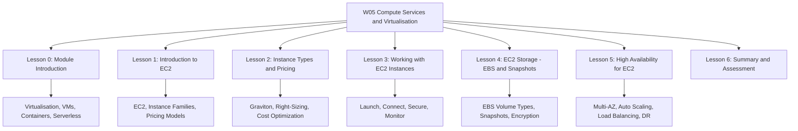
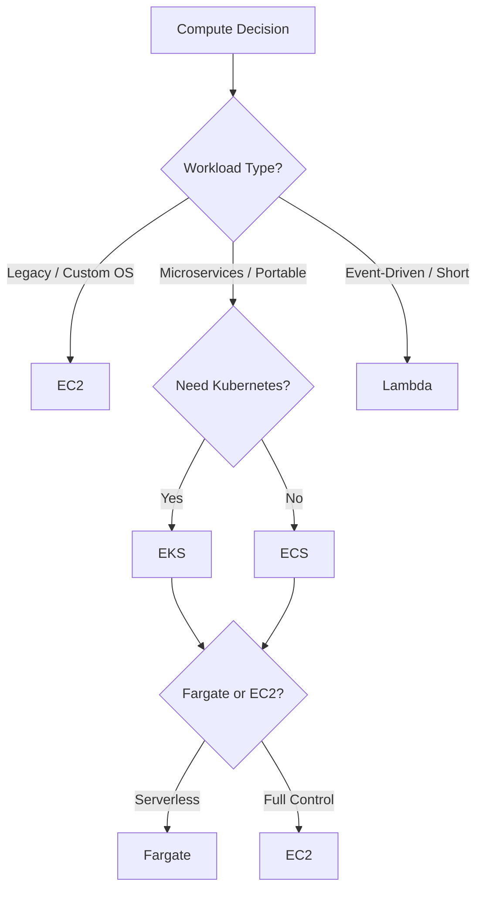

**W05: Compute Services + Virtualisation - Summary and Assessment**

This module covers the foundational compute technologies behind cloud services: virtualisation, virtual machines, containers, and serverless functions. It maps these concepts to AWS compute services, including EC2, Lambda, ECS, EKS, and Fargate. The goal is to understand how each compute model works, when to use it, and how to choose between them.

## Virtualisation Fundamentals

*Definition*: Virtualisation creates a software-based representation of compute, storage, or network resources, allowing multiple operating systems to run on one physical machine.

- A hypervisor sits between hardware and virtual machines. It allocates CPU, memory, storage, and network.
- Type 1 hypervisors run directly on hardware. Type 2 hypervisors run on a host OS.
- Cloud providers use Type 1 hypervisors for performance and isolation.
- The VM lifecycle includes creation, deployment, monitoring, maintenance, and retirement.

| Feature | Type 1 (Bare-Metal) | Type 2 (Hosted) |
|---|---|---|
| Runs on | Physical hardware | Host operating system |
| Performance | High | Medium to low |
| Use Case | Cloud providers, data centers | Development, testing |
| Examples | KVM, Xen, VMware ESXi | VirtualBox, VMware Workstation |

> [!Important]
> **Type 1 hypervisors are the foundation of cloud**: They run directly on hardware and provide better performance and isolation for multi-tenant cloud environments.

## EC2 Instance Types and Pricing Models

Amazon EC2 provides secure, resizable virtual servers called instances. It offers over 1,000 instance types across five families.

### Instance Families

| Family | Optimized For | Use Cases | Example Types |
|---|---|---|---|
| General Purpose | Balanced compute, memory, networking | Web servers, application servers | M7g, M9g, T4g |
| Compute Optimized | High-performance processors | Batch processing, gaming, HPC | C7g, C9g |
| Memory Optimized | Large memory-to-vCPU ratio | In-memory databases, big data analytics | R7g, R9g, X1 |
| Storage Optimized | High sequential read/write and IOPS | Data warehousing, distributed file systems | I3, I8ge |
| Accelerated Computing | GPU or FPGA accelerators | Machine learning, graphics rendering | P4, G7, Inf2, Trn1 |

- AWS Graviton processors offer up to 40% better price-performance than comparable x86 instances.
- Graviton5 powers the latest C9g, M9g, and R9g instances and delivers up to 25% better performance than Graviton4.

### Pricing Models

| Model | Commitment | Discount vs On-Demand | Interruption Risk | Best For |
|---|---|---|---|---|
| On-Demand | None | Baseline | None | Unpredictable workloads |
| Reserved Instances | 1 or 3 years | Up to 72% | None | Steady-state workloads |
| Savings Plans | 1 or 3 years | Up to 72% | None | Flexible workloads |
| Spot Instances | None | Up to 90% | Yes (2-minute warning) | Fault-tolerant workloads |

- Compute Savings Plans cover EC2, Lambda, and Fargate across any region.
- EC2 Instance Savings Plans offer the lowest prices with a commitment to a specific instance family in one region.
- Spot Instances are ideal for batch processing, CI/CD, and stateless web servers.

> [!Tip]
> **Start with Compute Savings Plans**: They offer the best balance of discount and flexibility, covering EC2, Lambda, and Fargate across any region.

## Working with EC2 Instances

Working with EC2 covers launch, connection, lifecycle management, security, storage, and monitoring.

### Launch and Connect

- Choose an AMI, instance type, network settings, storage, security groups, and key pair.
- Connect to Linux instances with SSH and Windows instances with RDP.
- Use AWS Systems Manager Session Manager for secure, auditable access without open inbound ports.

### Lifecycle States

| State | Description | Billing | EBS Root Volume |
|---|---|---|---|
| Pending | Preparing to run | Not billed | Preparing |
| Running | Active and usable | Billed | Attached |
| Stopping/Stopped | Shut down | Not billed for compute | Preserved |
| Terminating/Terminated | Permanently deleted | Not billed | Deleted by default |
| Hibernating | RAM saved to EBS | Not billed for compute | Preserved |

- Stop preserves the instance and EBS volumes. Terminate permanently deletes the instance.
- Hibernate saves RAM to EBS for faster resume. Not all instance types support hibernation.

### Security Groups and Key Pairs

- Security groups are stateful firewalls. Rules are allow-only.
- Key pairs provide SSH and RDP credentials. Store private keys securely.
- Never open SSH to 0.0.0.0/0. Restrict to known IP ranges or use Session Manager.

### AMIs and User Data

- AMIs are templates for instance launch. They are region-specific.
- User data bootstraps instances on first boot. Limited to 16 KB.
- Do not store secrets in user data. It is readable from instance metadata.

### Instance Metadata and IMDS

- Metadata is available at 169.254.169.254.
- IMDSv2 adds session-based authentication to prevent SSRF attacks.
- Enforce IMDSv2 on all instances.

### Storage and Networking

- EBS provides persistent block storage. Instance store provides temporary local storage.
- Elastic IPs are static public addresses. Use them sparingly.
- Placement groups influence instance placement: cluster for low latency, spread for high availability, partition for large distributed systems.

### Monitoring

- CloudWatch collects metrics and logs.
- CloudTrail records API calls.
- Trusted Advisor provides cost, security, and performance recommendations.

> [!Important]
> **Enforce IMDSv2**: IMDSv1 is vulnerable to SSRF attacks. Require a token for metadata access to prevent credential theft.

## EC2 Storage: EBS and Snapshots

Amazon EBS provides persistent block-level storage for EC2 instances. Volumes are network-attached and replicated within an Availability Zone.

### EBS Volume Types

| Volume Type | Storage Media | Max IOPS | Max Throughput | Use Case |
|---|---|---|---|---|
| gp3 | SSD | 16,000 | 1,000 MB/s | General purpose |
| io2 Block Express | SSD | 256,000 | 4,000 MB/s | Mission-critical databases |
| st1 | HDD | 500 | 500 MB/s | Big data, log processing |
| sc1 | HDD | 250 | 250 MB/s | Cold data, archives |

- gp3 is the default general purpose SSD and the right choice for most workloads.
- io2 Block Express is designed for the most demanding I/O-intensive workloads.
- HDD volumes cannot be used as boot volumes.

### Snapshots

- Snapshots are incremental, point-in-time backups stored in S3.
- They are region-specific and can be copied to other Regions.
- Snapshots of encrypted volumes are encrypted automatically.
- Use Data Lifecycle Manager or AWS Backup for automated snapshots.

### Encryption

- EBS encryption protects data at rest, in transit, and in snapshots using AWS KMS.
- Enable encryption by default for all new volumes.

### Multi-Attach and Instance Store

- Multi-Attach allows a single io1 or io2 volume to be attached to multiple instances in the same AZ. Requires a cluster-aware file system.
- Instance store provides temporary, high-speed local storage. Data is lost on stop or terminate.

> [!Important]
> **Enable encryption by default**: Configure account-level EBS encryption so every new volume is encrypted without manual intervention.

## High Availability for EC2

High availability means designing workloads to remain operational despite failures in instances, Availability Zones, or Regions.

### Availability Foundations

- Availability = MTBF / (MTBF + MTTR) * 100%.
- Reducing MTTR has the biggest impact on availability.
- Multi-AZ with Auto Scaling reaches 99.99% availability.
- Multi-Region active-active reaches 99.999% availability.

### Multi-AZ and Auto Scaling

- Deploy instances across at least two AZs behind a load balancer.
- Auto Scaling maintains desired capacity, replaces unhealthy instances, and scales based on demand.
- Scaling policies: target tracking, step scaling, scheduled scaling, predictive scaling.
- Cooldowns and hysteresis prevent flapping. Asymmetric scaling is more stable.

### Load Balancing

| Load Balancer | Layer | Use Case |
|---|---|---|
| Application Load Balancer | Layer 7 | HTTP/HTTPS microservices, path routing |
| Network Load Balancer | Layer 4 | TCP/UDP, ultra-low latency |
| Gateway Load Balancer | Layer 3/4 | Virtual appliances, firewalls |

- Health checks determine target health. Avoid cascading deep health check failures.
- Stateless design stores session state outside instances and enables free horizontal scaling.

### Disaster Recovery Patterns

| Pattern | RTO | RPO | Cost |
|---|---|---|---|
| Backup and Restore | Hours to days | Hours | Low |
| Pilot Light | Tens of minutes | Minutes | Low to medium |
| Warm Standby | Minutes | Seconds to minutes | Medium |
| Multi-Site Active-Active | Near zero | Near zero | High |

- Multi-Region high availability uses Route 53, Global Accelerator, and cross-Region data replication.
- Chaos engineering and game days validate that failover works.

> [!Important]
> **Test failover with game days**: Untested high availability is an assumption. Use AWS Fault Injection Service to validate that load balancers, health checks, and database promotion scripts work before a real incident.

## Assessment Preparation

### Practice Questions

1. Define virtualisation and explain the role of a hypervisor.
2. Compare Type 1 and Type 2 hypervisors.
3. List the five EC2 instance families and their use cases.
4. Explain the four EC2 pricing models and when each is appropriate.
5. Describe how containers differ from virtual machines.
6. Compare Amazon ECS, Amazon EKS, and AWS Fargate.
7. Explain the limits and pricing model of AWS Lambda.
8. Describe the EC2 instance lifecycle from launch to termination.
9. Explain the purpose of AMIs and user data.
10. Describe instance metadata and IMDSv2.
11. Compare EBS volume types and their use cases.
12. Explain how EBS snapshots work and why they are incremental.
13. Describe how EBS encryption protects data.
14. Explain the components of an Auto Scaling group.
15. Compare backup and restore, pilot light, warm standby, and active-active.

### Scenario Questions

**Scenario 1: Legacy Application Migration**
A company wants to migrate an on-premises legacy application that requires a custom OS configuration and runs continuously. Which compute service should they use?

- Use EC2 with a custom AMI and an instance type that matches the workload profile.
- Use Reserved Instances or Savings Plans for cost optimization.
- Deploy across multiple Availability Zones for high availability.

**Scenario 2: Microservices Platform**
A team is building a microservices platform and needs portability across cloud providers. Which container service should they use?

- Use Amazon EKS for Kubernetes compatibility and multi-cloud portability.
- Use Fargate to eliminate node management.
- Use ECR for container image storage.
- Consider ECS if portability is not a hard requirement.

**Scenario 3: Event-Driven Image Processing**
An application needs to process images uploaded to S3 and generate thumbnails. Which compute service should they use?

- Use AWS Lambda triggered by S3 upload events.
- Lambda automatically scales to handle spikes in upload volume.
- Pay only for the compute time used, with no cost for idle time.

**Scenario 4: High-Performance Computing**
A research team needs to run GPU-accelerated simulations for machine learning training. Which EC2 instance family should they use?

- Use accelerated computing instances such as P4 or Trn1.
- Use Spot Instances for fault-tolerant training jobs to reduce cost.
- Consider Savings Plans for predictable training workloads.

**Scenario 5: Web Application with Variable Traffic**
A web application has unpredictable traffic that spikes during promotions. Design a highly available architecture.

- Use an Application Load Balancer across three AZs.
- Use an Auto Scaling group with a target tracking policy on CPU utilization.
- Store session state in ElastiCache for stateless compute.
- Configure ELB health checks on a `/health` endpoint.
- Use aggressive scale-out and conservative scale-in with a cooldown period.

## Key Takeaways

- Virtualisation is the foundation of cloud computing. Hypervisors create and manage virtual machines.
- Type 1 hypervisors run directly on hardware and are used by cloud providers.
- Amazon EC2 provides virtual servers with five instance families and four pricing models.
- AWS Graviton processors offer up to 40% better price-performance than x86 for compatible workloads.
- Pricing models include On-Demand, Reserved Instances, Savings Plans, and Spot Instances. Savings reach 72% and 90%.
- Containers virtualize the operating system and are lightweight, portable, and fast to start.
- Amazon ECS, Amazon EKS, and AWS Fargate provide container orchestration options.
- AWS Lambda is a serverless compute service for event-driven, short-lived tasks.
- Working with EC2 covers launch, connection, lifecycle, security, storage, and monitoring.
- EBS provides persistent block storage. Snapshots are incremental backups stored in S3.
- EBS encryption protects data at rest, in transit, and in snapshots.
- High availability for EC2 uses multi-AZ deployment, Auto Scaling, load balancing, and health checks.
- Disaster recovery patterns range from backup and restore to active-active.
- Stateless design and immutable infrastructure enable elastic, resilient workloads.
- Test failover with chaos engineering and game days.
- Choose compute based on workload characteristics: VMs for control, containers for portability, serverless for event-driven tasks.

> [!Important]
> **Match the compute model to the workload**: Start with execution duration and event-driven characteristics. Then consider control, portability, and operational overhead. The wrong compute choice leads to unnecessary cost, complexity, or performance limitations.
