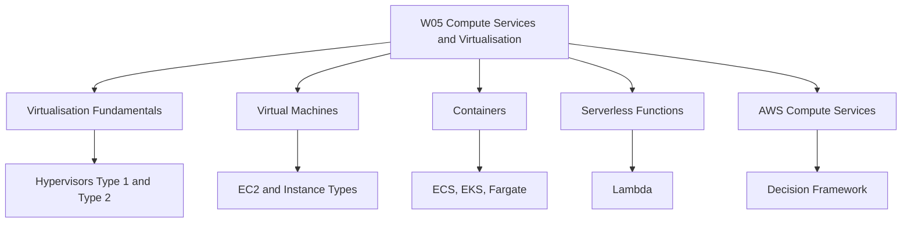
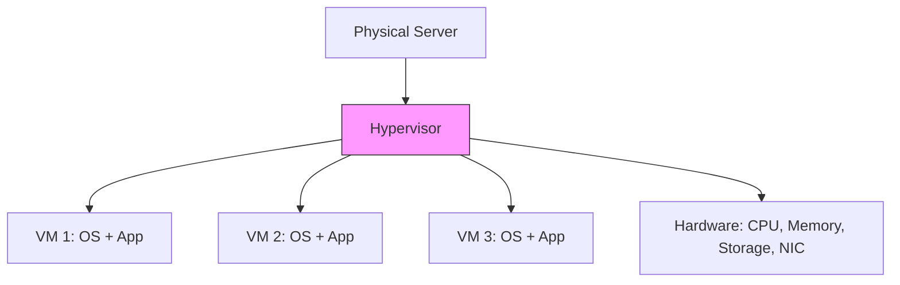
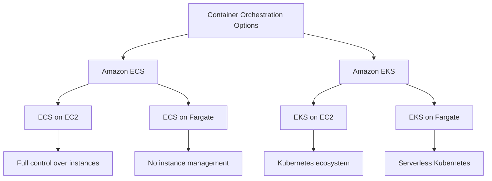
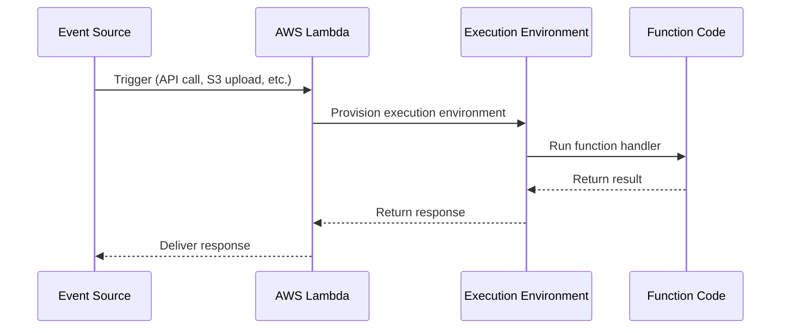
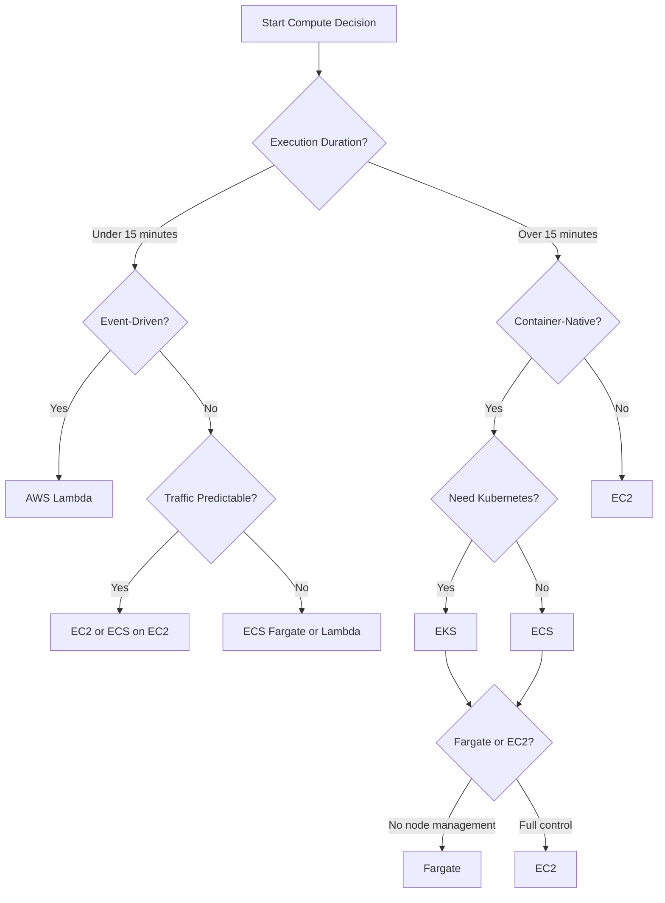
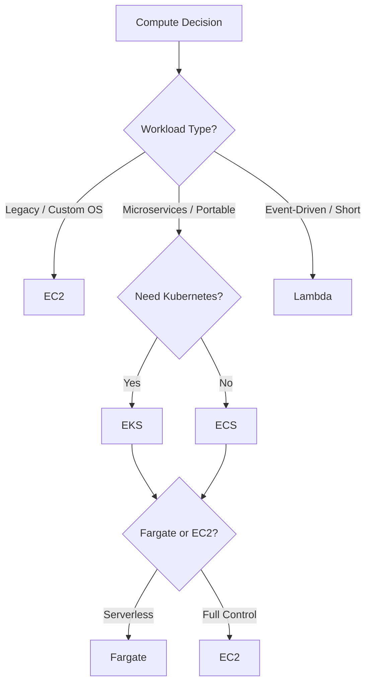

# W05: Compute Services + Virtualisation

This module covers the foundational technologies behind cloud compute: virtualization, virtual machines, containers, and serverless functions. It then maps these concepts to AWS compute services, including EC2, Lambda, ECS, EKS, and Fargate. The goal is to understand how each compute model works, when to use it, and how to choose between them.

## Virtualisation Fundamentals

*Definition*: Virtualisation is the process of creating a software-based (virtual) representation of something, such as compute, storage, or network resources. It allows multiple operating systems and applications to run on a single physical machine.

### What Is a Hypervisor

*Definition*: A hypervisor, also called a virtual machine monitor (VMM), is software that creates and runs virtual machines. It abstracts the underlying physical hardware and allocates resources to each VM.

- The hypervisor sits between the physical hardware and the virtual machines.
- It manages CPU, memory, storage, and network allocation.
- It provides isolation between VMs so one VM cannot interfere with another.
- It enables multiple operating systems to run concurrently on the same physical host.

> [!Important]
> **One physical server can run many virtual machines**: This increases efficiency, reduces cost, and improves resource utilization. The hypervisor is the key technology that makes this possible.

### Type 1 vs Type 2 Hypervisors

There are two main types of hypervisors, distinguished by where they sit in the software stack.

| Feature | Type 1 (Bare-Metal) | Type 2 (Hosted) |
|---|---|---|
| Runs on | Physical hardware directly | Host operating system |
| Performance | High | Medium to low |
| Security | Strong isolation | Moderate isolation |
| Use Case | Enterprise data centers, cloud providers | Personal use, testing, development |
| Examples | VMware ESXi, Microsoft Hyper-V, KVM, Xen | VirtualBox, VMware Workstation, Parallels Desktop |

- **Type 1 hypervisors** run directly on the physical hardware. They are also called bare-metal hypervisors. They provide direct hardware access and support advanced VM management tools.
- **Type 2 hypervisors** run as applications on top of an existing operating system. They rely on the host OS for hardware access.
- Cloud providers rely on Type 1 hypervisors because they are faster, cleaner, and more secure.
- Type 2 hypervisors are easier to install and are good for development, training, and small workloads, but they have lower performance and are less secure than Type 1.

> [!Tip]
> **Cloud providers use Type 1 hypervisors**: AWS, Azure, and GCP all use Type 1 hypervisors (KVM, Xen, or custom) because they run directly on hardware and provide better performance and isolation for multi-tenant cloud environments.

### Virtual Machine Lifecycle

*Definition*: Virtual machine lifecycle management refers to the complete process of creating, operating, maintaining, and retiring virtual machines.

| Stage | Description | Key Activities |
|---|---|---|
| Creation / Provisioning | Set up the VM | Configure CPU, RAM, storage; install OS and software |
| Deployment | Make the VM active | Connect to network and storage; make available to users |
| Monitoring | Track performance | Monitor CPU, memory, disk; detect issues and optimize |
| Maintenance | Keep the VM healthy | Apply updates and patches; scale resources; backup and snapshot |
| Retirement | Decommission the VM | Remove from service; reclaim resources |

- Proper lifecycle management ensures VMs are secure, performant, and cost-effective.
- Snapshots and backups are essential for disaster recovery.
- Monitoring helps identify when to scale up or scale down resources.

> [!Important]
> **VM lifecycle is continuous**: Monitoring and maintenance are not one-time tasks. They require ongoing attention to ensure VMs remain healthy and cost-efficient.

## Virtual Machines (EC2)

*Definition*: Amazon Elastic Compute Cloud (EC2) provides secure, resizable compute capacity in the cloud as virtual servers. You can launch virtual machines, called instances, with a variety of operating systems, instance types, and configurations.

### What EC2 Provides

- Virtual servers with full OS-level control.
- A wide range of instance families and sizes.
- Options for SSD, GPU, and specialized hardware.
- Instance types determine the hardware of the host.
- EC2 instances are the most flexible compute option in AWS.

### EC2 Instance Families

EC2 instances are grouped into families based on their compute, memory, and storage characteristics.

| Family | Optimized For | Use Cases | Example Types |
|---|---|---|---|
| General Purpose | Balanced compute, memory, and networking | Web servers, application servers, small databases | M5, M6i, M7g, T3, T4g |
| Compute Optimized | High-performance processors | Batch processing, gaming, HPC, video encoding | C5, C6i, C7g |
| Memory Optimized | Large memory-to-vCPU ratio | In-memory databases, real-time big data analytics | R5, R6i, R7g, X1 |
| Storage Optimized | High sequential read/write and IOPS | Data warehousing, distributed file systems | D2, H1, I3 |
| Accelerated Computing | GPU or FPGA accelerators | Machine learning, graphics rendering, scientific simulation | P4, G5, Inf2, Trn1 |

- General purpose instances like M7g offer the best price-performance for general workloads.
- Compute optimized instances like C7g offer the best price-performance for compute-intensive workloads.
- Memory optimized instances like R7g are ideal for memory-intensive workloads such as open-source databases and in-memory caches.
- Accelerated computing instances like Inf2 are designed for deep learning inference.

> [!Tip]
> **Choose instance family by workload profile**: Match the instance family to the dominant resource requirement. If the workload is CPU-bound, choose compute optimized. If it is memory-bound, choose memory optimized.

### EC2 Pricing Models

| Model | Description | Best For | Discount |
|---|---|---|---|
| On-Demand | Pay per hour or second, no commitment | Unpredictable workloads, short-term needs | None |
| Reserved Instances | Commit to 1 or 3 years | Steady-state, predictable workloads | Up to 72% |
| Savings Plans | Commit to a consistent amount of compute usage | Flexible workloads across instance families | Up to 72% |
| Spot Instances | Bid on unused EC2 capacity | Fault-tolerant, flexible workloads | Up to 90% |

- Reserved instances offer a significant discount compared to On-Demand pricing.
- Spot instances are recommended for applications with flexible start and end times, or those that are only feasible at very low compute prices.
- Savings Plans offer low prices for EC2 and Fargate usage in exchange for a commitment to a consistent amount of compute usage.

> [!Important]
> **Pricing model affects cost significantly**: A steady-state production workload can save up to 72% with Reserved Instances compared to On-Demand. Choose the pricing model that matches the workload's predictability.

## Containers

*Definition*: Containers virtualize the operating system, allowing multiple instances of an OS user space to share a single OS kernel. They package an application and its dependencies into a single, portable unit.

### Containers vs Virtual Machines

| Dimension | Virtual Machines | Containers |
|---|---|---|
| Virtualization Level | Hardware-level | OS-level |
| Guest OS | Each VM has its own OS | Containers share the host OS kernel |
| Startup Time | Minutes | Seconds |
| Resource Usage | Higher (each VM runs a full OS) | Lower (lightweight) |
| Portability | Limited by OS dependencies | Highly portable across environments |
| Isolation | Strong (hardware-level) | Process-level isolation |

- Containers address the limitations of VMs, such as reduced portability and inadequate resources.
- Containers run a layer above and separate application software from VMs.
- Containers break up software into small components that can be easily mixed and matched, which speeds up development.
- Containers are dynamic and may run for a few minutes or even seconds, which makes monitoring more difficult than VMs.

> [!Tip]
> **Containers are ideal for microservices**: Their lightweight nature, fast startup, and portability make them well-suited for microservices architectures and continuous delivery.

### AWS Container Services

AWS offers multiple container orchestration options, each with different levels of abstraction and control.

| Service | Type | Key Features | Best For |
|---|---|---|---|
| Amazon ECS | Fully managed container orchestration | Simplifies deployment, management, and scaling of containerized apps | Teams wanting simplicity and deep AWS integration |
| Amazon EKS | Managed Kubernetes | Full Kubernetes API compatibility; portable across clouds | Teams needing Kubernetes ecosystem and portability |
| AWS Fargate | Serverless compute engine for containers | Run containers without managing EC2 instances | Teams wanting to avoid infrastructure management |
| Amazon ECR | Container registry | Store, manage, and deploy container images | All container workloads |

- Amazon ECS is a fully managed container orchestration service that simplifies the deployment, management, and scaling of containerized applications.
- Amazon EKS is a managed Kubernetes service that provides the full Kubernetes API and ecosystem.
- AWS Fargate is a serverless compute engine for containers. It removes the need to provision and manage EC2 instances. You can use Fargate with both ECS and EKS.
- ECS may be cheaper than EKS and offers cost savings for applications tightly integrated with AWS. EKS pricing includes charges for the managed Kubernetes control plane in addition to compute and storage resources.

> [!Important]
> **Fargate eliminates node management**: With Fargate, you define the vCPU and memory your container needs, and AWS provisions the underlying infrastructure. You pay only for the resources your containers use.

### ECS vs EKS

| Dimension | Amazon ECS | Amazon EKS |
|---|---|---|
| Orchestration Engine | AWS-proprietary | Kubernetes (open source) |
| Learning Curve | Lower | Higher |
| AWS Integration | Deep native integration | Good integration |
| Portability | AWS-only | Multi-cloud and on-premises |
| Ecosystem | Smaller, AWS-specific | Large Kubernetes ecosystem |
| Cost | Potentially lower | Higher (control plane charge) |
| Best For | Teams wanting simplicity and AWS-native tooling | Teams needing Kubernetes portability and ecosystem |

- ECS is simpler and deeply integrated with AWS services. It reduces complexity by managing much of the infrastructure.
- EKS is more powerful but pays back its complexity only when you actually need the Kubernetes ecosystem.
- EKS offers high flexibility and cloud portability because it is based on open-source Kubernetes.

> [!Tip]
> **Start with ECS unless you need Kubernetes**: If your team does not already use Kubernetes or need multi-cloud portability, ECS is simpler and more cost-effective. Choose EKS when the Kubernetes ecosystem is a genuine requirement.

## Serverless Functions (Lambda)

*Definition*: AWS Lambda is a serverless compute service that runs code in response to events and automatically manages the compute resources for you. You pay only for the compute time you consume.

### How Lambda Works

- Lambda runs code in response to events such as HTTP requests, file uploads, or database changes.
- It automatically scales to handle millions of concurrent requests.
- It is designed for short-lived compute tasks that do not retain state between invocations.

### Lambda Limits and Quotas

| Resource | Default Limit | Can Be Increased |
|---|---|---|
| Function timeout | 15 minutes | No (except Lambda Managed Instances up to 90 minutes) |
| Memory allocation | 128 MB to 10,240 MB | Yes |
| Concurrent executions | 1,000 | Yes, up to tens of thousands |
| Ephemeral storage | 512 MB free | Yes |
| Payload size (async) | 1 MB | No |

- Code can run for up to 15 minutes in a single invocation and a single function can use up to 10,240 MB of memory.
- The default concurrency limit is 1,000, which can be increased.
- AWS raised the maximum payload size for asynchronous invocations from 256 KB to 1 MB in 2026.

> [!Important]
> **Lambda is for short-lived, event-driven workloads**: If your workload runs longer than 15 minutes or requires persistent state, consider containers or EC2 instead.

### Lambda Pricing

| Dimension | Price | Free Tier |
|---|---|---|
| Requests | $0.20 per 1 million requests | 1 million requests per month |
| Duration | $0.0000166667 per GB-second | 400,000 GB-seconds per month |

- The Lambda free tier includes 1 million requests and 400,000 GB-seconds of compute each month.
- Provisioned concurrency has separate pricing and does not benefit from the free tier.
- You pay for the time your code executes, measured in milliseconds, multiplied by the memory allocated.

> [!Tip]
> **Lambda is cost-effective for spiky workloads**: For event-driven or intermittent workloads, Lambda eliminates the cost of idle servers. For constant, high-volume workloads, containers or EC2 may be more cost-effective.

## Compute Model Comparison

### VMs vs Containers vs Serverless

| Dimension | Virtual Machines (EC2) | Containers (ECS/EKS) | Serverless (Lambda) |
|---|---|---|---|
| Abstraction Level | Hardware | Operating system | Function |
| Management Overhead | High (OS patching, scaling) | Medium (cluster management) | None (fully managed) |
| Startup Time | Minutes | Seconds | Milliseconds (warm) to seconds (cold) |
| Resource Efficiency | Lower | Higher | Highest (pay per use) |
| State | Stateful or stateless | Typically stateless | Stateless only |
| Max Runtime | Unlimited | Unlimited | 15 minutes |
| Best For | Legacy apps, custom OS, GPU workloads | Microservices, portable workloads | Event-driven, spiky, short-duration workloads |
| Cost Model | Per hour/second | Per vCPU/memory-second | Per request and GB-second |

- VMs provide the most control and are suitable for legacy applications and workloads that require custom OS configurations.
- Containers offer fast deploys, portability, and lower resource usage than VMs. They are ideal for most stateless services and workers.
- Serverless is ideal for event-driven jobs and spiky traffic. It eliminates infrastructure management but is only appropriate for short-duration jobs.

> [!Important]
> **There is no single best compute model**: Choose based on workload characteristics. Use VMs for control, containers for portability and efficiency, and serverless for event-driven, short-lived tasks.

### AWS Compute Service Decision Framework

- Start with execution duration. If under 15 minutes and event-driven, Lambda is the natural fit.
- For containerized workloads, choose ECS for simplicity or EKS for Kubernetes portability.
- Fargate removes node management for both ECS and EKS.
- EC2 provides the most control for custom or legacy workloads.

> [!Tip]
> **Use the decision tree as a starting point**: The right compute choice depends on team skills, operational maturity, and long-term strategy. The decision tree narrows the field but does not replace judgment.

## Assessment Preparation

### Practice Questions

1. Explain the difference between Type 1 and Type 2 hypervisors and why cloud providers use Type 1.
2. Describe the stages of the virtual machine lifecycle.
3. Compare EC2 instance families and their use cases.
4. Explain the four EC2 pricing models and when each is appropriate.
5. Describe how containers differ from virtual machines.
6. Compare Amazon ECS, Amazon EKS, and AWS Fargate.
7. Explain the limits and pricing model of AWS Lambda.
8. Describe when to use VMs, containers, and serverless functions.
9. Explain how to choose an AWS compute service using a decision framework.

### Scenario Questions

**Scenario 1: Legacy Application Migration**
A company wants to migrate an on-premises legacy application that requires a custom OS configuration and runs continuously. Which compute service should they use?

- Use EC2 with a custom AMI and instance type that matches the workload profile.
- Use Reserved Instances or Savings Plans for cost optimization on steady-state workloads.
- Deploy across multiple Availability Zones for high availability.

**Scenario 2: Microservices Platform**
A team is building a microservices platform and needs portability across cloud providers. Which container service should they use?

- Use Amazon EKS for Kubernetes compatibility and multi-cloud portability.
- Use Fargate to eliminate node management.
- Use ECR for container image storage.
- Consider ECS if portability is not a hard requirement.

**Scenario 3: Event-Driven Image Processing**
An application needs to process images uploaded to S3 and generate thumbnails. Which compute service should they use?

- Use AWS Lambda triggered by S3 upload events.
- Lambda automatically scales to handle spikes in upload volume.
- Pay only for the compute time used, with no cost for idle time.
- Use the free tier for low-volume workloads.

**Scenario 4: High-Performance Computing**
A research team needs to run GPU-accelerated simulations for machine learning training. Which EC2 instance family should they use?

- Use accelerated computing instances such as P4 or Trn1.
- Trn1 instances are designed for high-performance deep learning training and offer up to 50% cost-to-train savings.
- Use Spot Instances for fault-tolerant training jobs to reduce cost.
- Consider Savings Plans for predictable training workloads.

## Key Takeaways

- Virtualisation is the foundation of cloud computing. Hypervisors create and manage virtual machines.
- Type 1 hypervisors run directly on hardware and are used by cloud providers. Type 2 hypervisors run on a host OS and are used for development and testing.
- Amazon EC2 provides virtual servers with a wide range of instance families: general purpose, compute optimized, memory optimized, storage optimized, and accelerated computing.
- EC2 pricing models include On-Demand, Reserved Instances, Savings Plans, and Spot Instances. Reserved and Savings Plans offer up to 72% discount. Spot offers up to 90% discount.
- Containers virtualize the operating system, sharing the host OS kernel. They are lightweight, portable, and fast to start compared to VMs.
- Amazon ECS is a fully managed container orchestration service. Amazon EKS is managed Kubernetes. AWS Fargate is a serverless compute engine for containers that works with both ECS and EKS.
- AWS Lambda is a serverless compute service for event-driven, short-lived tasks. It runs code for up to 15 minutes and scales automatically.
- Choose compute based on workload characteristics: VMs for control, containers for portability and efficiency, serverless for event-driven and spiky workloads.
- There is no single best compute model. The right choice depends on duration, traffic patterns, team skills, and operational maturity.
- The AWS compute decision tree helps narrow the field but does not replace architectural judgment.

> [!Important]
> **Match the compute model to the workload**: Start with execution duration and event-driven characteristics. Then consider control, portability, and operational overhead. The wrong compute choice leads to unnecessary cost, complexity, or performance limitations. Use the decision framework and validate with a pilot before committing at scale.
